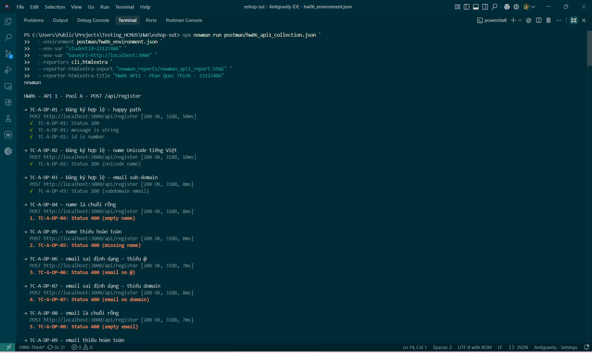
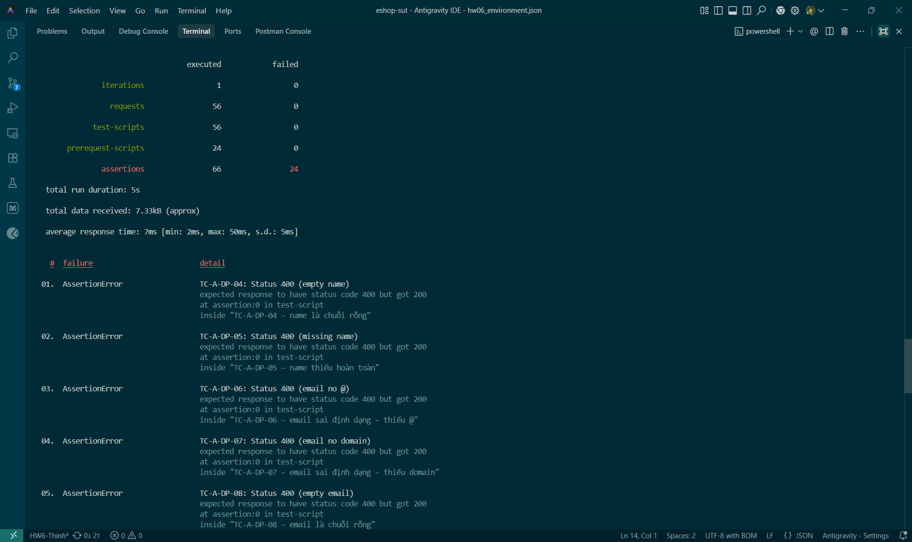
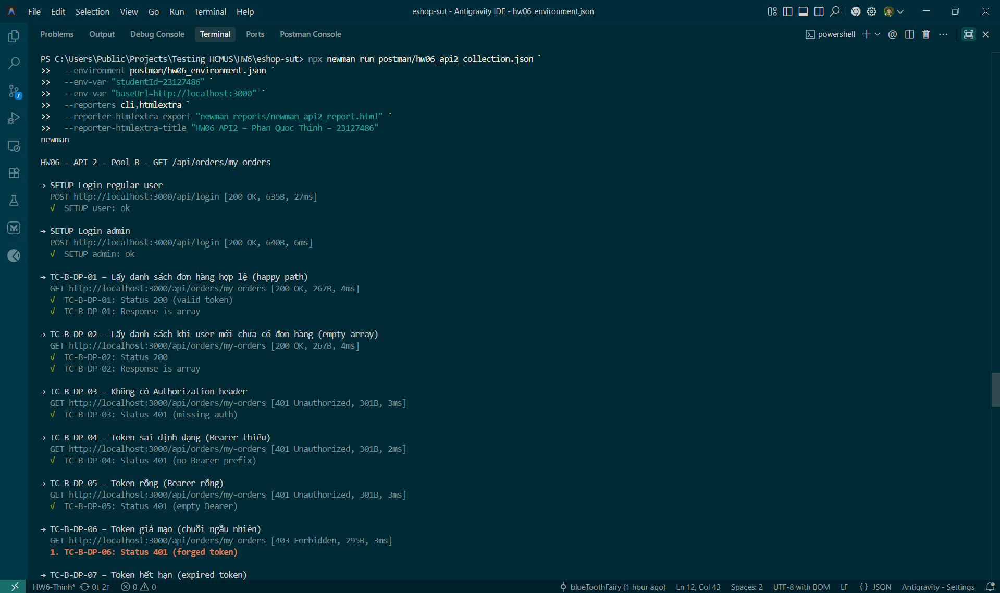
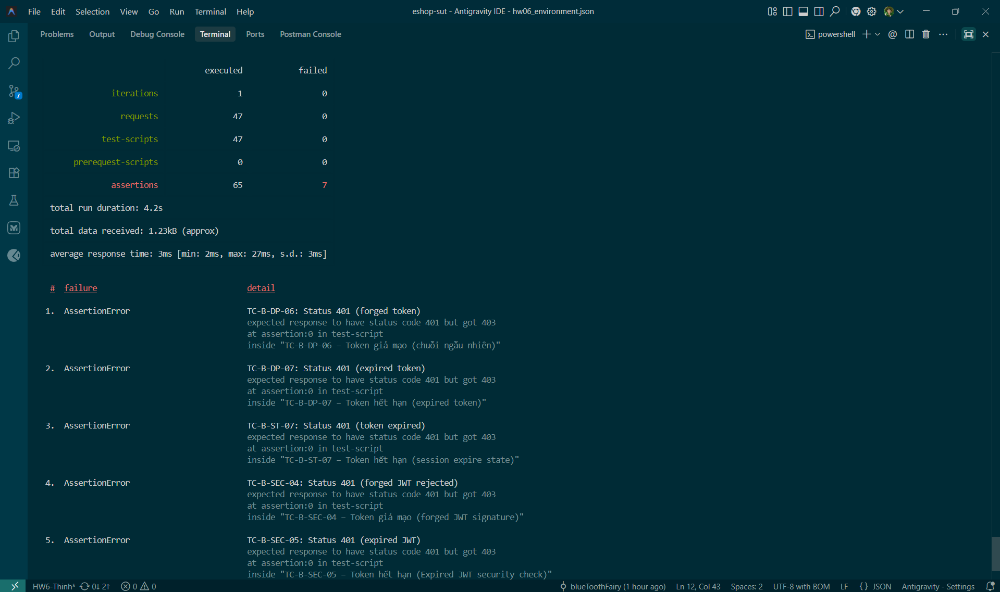
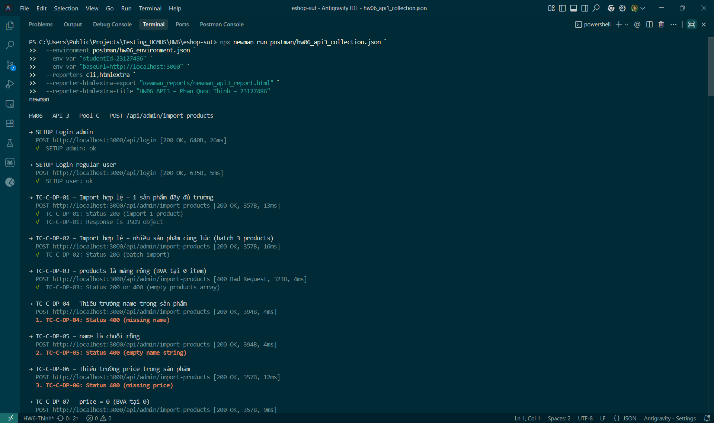
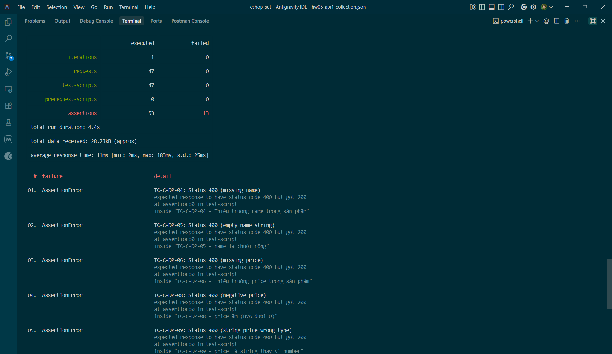
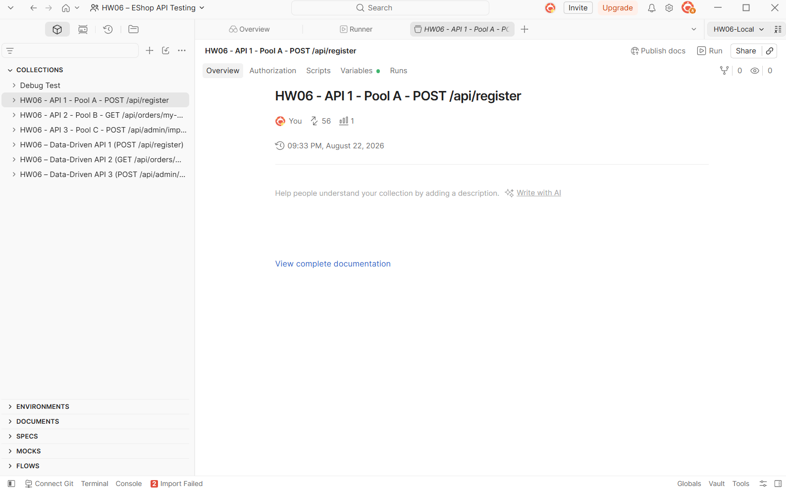

# HW06 – Báo cáo Kiểm thử API

**Khoa Công nghệ Thông tin (FIT) – Trường Đại học Khoa học Tự nhiên TP.HCM (HCMUS)**  
**CS423 / CSC13003 – Kiểm thử Phần mềm (AI-augmented · 2026)**

---

## Thông tin sinh viên

| Trường | Giá trị |
|:---|:---|
| **Họ và tên:** | Phan Quốc Thịnh |
| **MSSV:** | 23127486 |
| **Lớp:** | 23KTPM3 |
| **Ngày:** | 20/08/2026 |

---

## 1. Giới thiệu

### 1.1. Hệ thống cần kiểm thử (SUT)

- **Tên:** EShop – Ứng dụng thương mại điện tử demo
- **Repository:** https://github.com/trngnneee/eshop-sut/tree/HW6-Thinh (Nhánh HW6-Thinh)
- **Môi trường chạy:** Local Node.js backend tại `http://localhost:3000` với cơ sở dữ liệu SQLite (`backend/database.sqlite`).

### 1.2. Các API được chọn

| Pool | Feature | Endpoint | Mô tả |
|:---|:---|:---|:---|
| Pool A | FR-01 – Đăng ký tài khoản | `POST /api/register` | Đăng ký tài khoản người dùng mới |
| Pool B | FR-11 – Xem lịch sử đơn hàng | `GET /api/orders/my-orders` | Lấy danh sách đơn hàng cá nhân của user hiện tại |
| Pool C | FR-16 – Import sản phẩm (Admin) | `POST /api/admin/import-products` | Admin import hàng loạt sản phẩm từ JSON Array |

### 1.3. Công cụ sử dụng

- **Mô hình AI:** Claude Sonnet 4.6 (Anthropic) & Gemini 3.7 Flash
- **API Testing Platform:** Postman Desktop App v11 & Postman Collection v2.1.0
- **CLI Test Runner:** Newman v6.2.2
- **HTML Reporting:** `newman-reporter-htmlextra`
- **CI/CD:** GitHub Actions (`.github/workflows/api-tests.yml`)

---

## 2. API 1 – Pool A: Đăng ký tài khoản (FR-01)

> **Endpoint:** `POST /api/register`  
> **Feature:** FR-01 – Đăng ký tài khoản

### 2.1. Bước 1: Sinh test cases bằng AI (Generate)

**Prompt 1 – Domain Testing (EP & BVA):**
```
Dựa trên API spec của endpoint POST /api/register, hãy áp dụng kỹ thuật Domain Testing
(Equivalence Partitioning & Boundary Value Analysis) để thiết kế test cases theo các quy tắc sau:

1. Phân tích biến: Liệt kê tất cả tham số đầu vào/ra, xác định các lớp tương đương Hợp lệ (Valid EP),
   Không hợp lệ (Invalid EP: sai kiểu, chuỗi rỗng, vượt ngưỡng, ký tự đặc biệt,...) và các giá trị
   biên (BVA 2-point/3-point).
2. Nguyên tắc tạo Test Case:
   * Valid Cases: Kết hợp tối đa các lớp hợp lệ vào cùng 1 test case.
   * Invalid / Boundary Cases (Cô lập lỗi): Mỗi test case chỉ chứa DUY NHẤT 1 giá trị không hợp lệ
     hoặc 1 giá trị biên lỗi; toàn bộ các tham số còn lại bắt buộc phải dùng giá trị đại diện hợp lệ.
   * Đảm bảo phủ hết tất cả các EP và BVA đã xác định.

Xuất kết quả theo định dạng bảng:
| TC ID | Mô tả | Tham số kiểm tra | Phân vùng / Điểm biên | Input Payload (Params/Body) | Expected HTTP Status & Output |

API Spec:
- Endpoint: POST /api/register
- Body (JSON): {"name": "Nguyen Van A", "email": "test@domain.com", "password": "Password123!"}
- Response thành công (200 OK): {"message": "User registered successfully", "id": 1}
- Tất cả 3 trường đều bắt buộc, không yêu cầu auth
```

*Output AI 1 (tóm tắt):* AI sinh ra 20 test cases Domain EP & BVA: 3 valid case (happy path, Unicode name, sub-domain email), 17 invalid/boundary cases cô lập lỗi từng trường (name rỗng, email sai định dạng, password BVA ngắn/dài, name max-length 255/256, email duplicate, body rỗng, wrong content-type, v.v.).

**Prompt 2 – State Transition & Lifecycle:**
```
Dựa trên API spec của endpoint POST /api/register, hãy áp dụng kỹ thuật State Transition Testing
để thiết kế test cases theo các yêu cầu sau:

1. Xác định mô hình trạng thái: Nhận diện thực thể User (Resource Lifecycle) và Auth State,
   liệt kê tất cả State và Event/Action (được kích hoạt bởi endpoint này).
2. Xây dựng kịch bản chuyển đổi:
   * Chuyển đổi hợp lệ (Valid Transition): Gọi endpoint khi thực thể ở đúng trạng thái cho phép.
   * Chuyển đổi không hợp lệ (Invalid Transition): Gọi endpoint khi đã tồn tại (duplicate).
   * Kịch bản chuỗi (State Sequence): Kiểm tra tính toàn vẹn sau khi chuyển trạng thái.

Xuất kết quả theo định dạng bảng:
| TC ID | Mô tả kịch bản | Trạng thái ban đầu (Pre-state) | Hành động / Payload | Trạng thái kỳ vọng (Post-state) | Expected HTTP Status & Error Code |

API Spec: POST /api/register – public endpoint, tạo user mới, trả về {message, id}.
Trạng thái: Non-existent → Created (Active) | Duplicate → reject | Unauthenticated → được phép gọi.
```

*Output AI 2 (tóm tắt):* AI sinh ra 5 test cases State Transition: Resource Lifecycle (Non-existent → Created), Duplicate rejection, State Sequence (Register → Login), Idempotency check, Auth State (public endpoint không cần token).

**Prompt 3 – Security Tests (SEC-01 – SEC-07):**
```
Đối với endpoint POST /api/register, hãy sinh test cases bảo mật cho từng loại sau:
SQL Injection (vào từng field: name, email, password), XSS payload trong name,
IDOR (gửi kèm token của user khác), Role Escalation (gán role=admin trong body),
Input Validation / Malformed Payload, Sensitive Data Exposure (response lộ password hash),
Missing/Invalid Content-Type header.

Với mỗi loại, cung cấp:
[TC ID | Mô tả | Loại tấn công | Input | Expected Response]
```

*Output AI 3 (tóm tắt):* AI sinh ra 9 test cases security: 3 SQL Injection (email/name/password), 1 XSS, 1 IDOR, 1 Role Escalation, 1 Malformed JSON payload, 1 Sensitive Data Exposure, 1 Missing Content-Type.

**Prompt 4 – Schema Validation:**
```
Dựa vào response schema của POST /api/register trong API spec, hãy sinh test cases
Schema Validation để kiểm tra:
- Response có đủ các field theo spec: message (string), id (number)
- Kiểu dữ liệu chính xác (id phải là number, không phải string)
- Response KHÔNG chứa thông tin nhạy cảm (password, hash)
- HTTP status code đúng (200 OK)
- Content-Type: application/json
- Response lỗi có cấu trúc nhất quán

Bảng: [TC ID | Mô tả | Field kiểm tra | Expected schema]
```

*Output AI 4 (tóm tắt):* AI sinh ra 8 test cases Schema Validation: kiểm tra shape (message+id), nội dung message, kiểu id, vắng mặt password field, HTTP 200, error shape 400, type check id, Content-Type.

**Số test cases AI sinh ra:** 42 (DP/BVA: 20 | ST: 5 | SEC: 9 | SV: 8).

---

### 2.2. Bước 2: Kiểm tra (Audit)

#### A. Domain Partition & Boundary Value Tests (EP & BVA)

| TC ID | Mô tả | Tham số kiểm tra | Phân vùng / Điểm biên | Input Payload (Params/Body) | Expected HTTP Status & Output | Audit | Ghi chú |
|:---|:---|:---|:---|:---|:---|:---|:---|
| TC-A-DP-01 | Đăng ký hợp lệ – tất cả trường đúng chuẩn | name, email, password | Valid EP – happy path | `{"name":"Nguyen Van A","email":"test@domain.com","password":"Password123!"}` | 200 OK – `{"message":"User registered successfully","id":...}` | **VALID** | Happy path đủ 3 trường hợp lệ, expected output đúng spec. |
| TC-A-DP-02 | Đăng ký hợp lệ – name chứa ký tự Unicode (tiếng Việt) | name | Valid EP | `{"name":"Nguyễn Văn Ánh","email":"unicode@test.com","password":"Pass123!"}` | 200 OK – đăng ký thành công | **VALID** | Kiểm thử name Unicode là edge case quan trọng, đúng EP hợp lệ. |
| TC-A-DP-03 | Đăng ký hợp lệ – email dạng sub-domain | email | Valid EP | `{"name":"User A","email":"user@mail.sub.com","password":"Pass123!"}` | 200 OK – đăng ký thành công | **VALID** | Sub-domain email là định dạng hợp lệ theo RFC 5321. |
| TC-A-DP-04 | name là chuỗi rỗng | name | Invalid EP – required field | `{"name":"","email":"a@test.com","password":"Pass123!"}` | 400 Bad Request – lỗi validation name | **VALID** | Cô lập lỗi đúng: chỉ name rỗng, các trường khác hợp lệ. |
| TC-A-DP-05 | name thiếu hoàn toàn (không có key) | name | Invalid EP – missing field | `{"email":"a@test.com","password":"Pass123!"}` | 400 Bad Request – thiếu trường name | **VALID** | Phân biệt missing field vs empty string – đúng nguyên tắc EP. |
| TC-A-DP-06 | email sai định dạng – thiếu @ | email | Invalid EP – format | `{"name":"User A","email":"invalidemail.com","password":"Pass123!"}` | 400 Bad Request – email không hợp lệ | **VALID** | Thiếu @ là một trong các invalid EP định dạng email. |
| TC-A-DP-07 | email sai định dạng – thiếu domain | email | Invalid EP – format | `{"name":"User A","email":"user@","password":"Pass123!"}` | 400 Bad Request – email không hợp lệ | **VALID** | Thiếu domain sau @ là invalid EP khác. |
| TC-A-DP-08 | email là chuỗi rỗng | email | Invalid EP – required field | `{"name":"User A","email":"","password":"Pass123!"}` | 400 Bad Request – lỗi validation email | **VALID** | Phân biệt empty vs missing. Cô lập lỗi đúng chuẩn. |
| TC-A-DP-09 | email thiếu hoàn toàn (không có key) | email | Invalid EP – missing field | `{"name":"User A","password":"Pass123!"}` | 400 Bad Request – thiếu trường email | **VALID** | Đúng nguyên tắc cô lập lỗi từng field. |
| TC-A-DP-10 | password là chuỗi rỗng | password | Invalid EP – required field | `{"name":"User A","email":"a@test.com","password":""}` | 400 Bad Request – lỗi validation password | **VALID** | Cô lập lỗi đúng. |
| TC-A-DP-11 | password thiếu hoàn toàn (không có key) | password | Invalid EP – missing field | `{"name":"User A","email":"a@test.com"}` | 400 Bad Request – thiếu trường password | **VALID** | Cô lập lỗi đúng. |
| TC-A-DP-12 | password quá ngắn – 1 ký tự (BVA dưới min) | password | BVA – below min | `{"name":"User A","email":"a@test.com","password":"A"}` | 400 Bad Request – password quá ngắn (min = 8) | **VALID** | Spec xác định min password = 8 ký tự; 1 ký tự là BVA dưới min, phải bị reject. |
| TC-A-DP-13 | password đúng độ dài tối thiểu – 8 ký tự (BVA tại min) | password | BVA – at min | `{"name":"User A","email":"a@test.com","password":"Aa1!xxYZ"}` | 200 OK – đăng ký thành công | **VALID** | Spec min = 8; đúng tại ngưỡng tối thiểu → phải được chấp nhận. |
| TC-A-DP-14 | password 7 ký tự (BVA dưới min – 1) | password | BVA – below min (min−1) | `{"name":"User A","email":"a@test.com","password":"Aa1!xxY"}` | 400 Bad Request – password quá ngắn (cần đủ 8 ký tự) | **VALID** | 7 ký tự = min−1 – điểm biên ngay dưới ngưỡng tối thiểu, phải bị reject. |
| TC-A-DP-15 | name rất dài – 256 ký tự (BVA vượt max) | name | BVA – above max | `{"name":"A" × 256,"email":"a@test.com","password":"Pass123!"}` | 400 Bad Request – name quá dài (vượt 255 ký tự) | **VALID** | Giả định DB schema VARCHAR(255), 256 ký tự là BVA trên max nên mong đợi 400 Bad Request. |
| TC-A-DP-16 | name đúng giới hạn tối đa – 255 ký tự (BVA tại max) | name | BVA – at max | `{"name":"A" × 255,"email":"a@test.com","password":"Pass123!"}` | 200 OK – đăng ký thành công | **VALID** | 255 ký tự là BVA tại max (VARCHAR(255)) nên mong đợi 200 OK. |
| TC-A-DP-17 | email đã tồn tại trong hệ thống | email | Invalid EP – duplicate | `{"name":"User A","email":"existing@domain.com","password":"Pass123!"}` | 400/409 Conflict – email đã được đăng ký | **VALID** | Duplicate email là invalid EP quan trọng. Expected 400 hoặc 409 – cả hai đều hợp lý. |
| TC-A-DP-18 | Toàn bộ body là JSON rỗng `{}` | name, email, password | Invalid EP – empty body | `{}` | 400 Bad Request – thiếu tất cả trường | **VALID** | Kiểm thử đồng thời missing tất cả fields là hợp lý cho case body rỗng. |
| TC-A-DP-19 | Body không phải JSON (plain text) | Content-Type | Invalid EP – wrong content type | Body: `name=User&email=a@b.com` không có header JSON | 400 Bad Request hoặc 415 Unsupported Media Type | **VALID** | Kiểm tra content negotiation đúng spec REST. |
| TC-A-DP-20 | password chỉ có ký tự số (không có chữ hoa/ký tự đặc biệt) | password | Invalid EP – weak password policy | `{"name":"User A","email":"a@test.com","password":"12345678"}` | 200 OK hoặc 400 Bad Request (nếu có complexity rule) | **INCOMPLETE** | Expected "nếu có rule" không thể tự động hóa. **Sửa:** Nếu không có rule → 200 OK; nếu có rule → 400. |

#### B. State Transition & Lifecycle Tests

| TC ID | Mô tả kịch bản | Trạng thái ban đầu (Pre-state) | Hành động / Payload | Trạng thái kỳ vọng (Post-state) | Expected HTTP Status & Error Code | Audit | Ghi chú |
|:---|:---|:---|:---|:---|:---|:---|:---|
| TC-A-ST-01 | Đăng ký email mới lần đầu – User chuyển sang Active | Non-existent (email chưa có) | POST /api/register với email mới hợp lệ | User Created / Active (có thể đăng nhập) | 200 OK – `{message, id}` | **VALID** | Resource Lifecycle Non-existent → Created đúng theo State Transition Testing (ISTQB §4.4). |
| TC-A-ST-02 | Đăng ký lại email đã tồn tại – hệ thống từ chối | User Active (email đã register) | POST /api/register với cùng email | Trạng thái không đổi – không tạo user mới | 400/409 Conflict | **VALID** | Invalid transition đúng – system giữ state, từ chối duplicate. |
| TC-A-ST-03 | Đăng ký thành công → Đăng nhập ngay (State sequence) | Non-existent | Register → Login liền với thông tin vừa tạo | User Authenticated (có JWT token hợp lệ) | Register: 200 OK, Login: 200 OK với token | **VALID** | State sequence Created → Authenticated quan trọng để xác nhận tài khoản được tạo đúng. |
| TC-A-ST-04 | Gửi lại cùng request register sau khi đã register thành công | User Active | POST lặp lại payload cũ | Vẫn từ chối – không tạo duplicate | 400/409 Conflict | **VALID** | Idempotency check hợp lệ, trùng với ST-02 về mặt logic nhưng từ góc độ idempotency là khác biệt. |
| TC-A-ST-05 | Đăng ký khi chưa có session/token (Public endpoint) | Unauthenticated | POST /api/register không có Authorization header | User Created (endpoint là public, không cần auth) | 200 OK – đăng ký thành công | **VALID** | Xác nhận đúng rằng /api/register là public endpoint, không yêu cầu auth. |

#### C. Security Tests (SEC-01 – SEC-07)

| TC ID | Mô tả | Loại tấn công | Input | Expected | Audit | Ghi chú |
|:---|:---|:---|:---|:---|:---|:---|
| TC-A-SEC-01 | SQL Injection vào trường email | SQL Injection (SEC-01) | `{"name":"User","email":"' OR 1=1 --","password":"Pass123!"}` | 400 Bad Request – bị block, KHÔNG có lỗi SQL lộ ra | **VALID** | Input SQLi điển hình vào email field, expected output đúng: reject và không lộ SQL error. |
| TC-A-SEC-02 | SQL Injection vào trường name | SQL Injection (SEC-01) | `{"name":"'; DROP TABLE users;--","email":"a@test.com","password":"Pass123!"}` | 200 OK hoặc 400 Bad Request – không thực thi SQL | **VALID** | Drop table payload – kiểm tra xem DB có bị tấn công không. Expected đúng. |
| TC-A-SEC-03 | SQL Injection vào trường password | SQL Injection (SEC-01) | `{"name":"User","email":"b@test.com","password":"' OR '1'='1"}` | 200 OK hoặc 400 Bad Request – không bypass | **INCOMPLETE** | Logic injection vào password khi register thường không có tác dụng vì password được hash. Sửa expected: không chứa SQL error message. |
| TC-A-SEC-04 | XSS payload trong trường name | Sensitive Data / XSS (SEC-07) | `{"name":"<script>alert(1)</script>","email":"c@test.com","password":"Pass123!"}` | 200 OK hoặc 400 – không thực thi script | **VALID** | XSS trong stored field name là nguy hiểm nếu hiển thị lại mà không escape. Expected hợp lý. |
| TC-A-SEC-05 | Gọi register với Authorization header của user khác | Mass Assignment (SEC-02) | Header: `Authorization: Bearer <valid_token>`, body: email mới | Chỉ tạo user với email mới, không ảnh hưởng tài khoản token | **INCOMPLETE** | Register là public endpoint, gửi kèm token không gây IDOR. Sửa thành kiểm tra Mass Assignment token. |
| TC-A-SEC-06 | Cố gán role=admin trong body khi đăng ký | Role Escalation (SEC-03) | `{"name":"Hacker","email":"hack@test.com","password":"Pass123!","role":"admin"}` | 200 OK nhưng role PHẢI là user thường, không phải admin | **VALID** | Mass Assignment / Role Escalation test quan trọng. Expected đúng: hệ thống phải ignore trường role từ client. |
| TC-A-SEC-07 | Body chứa cú pháp JSON không hợp lệ (Malformed JSON) | Input Validation / Malformed Payload (SEC-06) | `{"name": "User", "email": "malformed@test.com", "password":` | 400 Bad Request – lỗi cú pháp JSON | **VALID** | Kiểm tra khả năng xử lý malformed JSON payload (thay thế cho rate limiting để chạy được trên Newman). |
| TC-A-SEC-08 | Response thành công lộ thông tin nhạy cảm | Sensitive Data Exposure (SEC-07) | POST /api/register hợp lệ | Response KHÔNG chứa password hoặc password hash | **VALID** | Kiểm tra data exposure đúng – password không bao giờ được trả về trong response. |
| TC-A-SEC-09 | Missing Content-Type header | Missing/Invalid Header (SEC-04) | Request không có `Content-Type: application/json` | 400 Bad Request hoặc 415 – không xử lý sai | **VALID** | Content-Type validation quan trọng để đảm bảo API không chấp nhận payload không rõ định dạng. |

#### D. Schema Validation Tests

| TC ID | Mô tả | Field kiểm tra | Expected schema | Audit | Ghi chú |
|:---|:---|:---|:---|:---|:---|
| TC-A-SV-01 | Response thành công có đúng các field theo spec | `message`, `id` | `{"message": string, "id": number}` – không thêm/thiếu field | **VALID** | Kiểm tra shape đúng spec. |
| TC-A-SV-02 | Field `message` là string đúng nội dung theo spec | `message` | `"User registered successfully"` (string, không null) | **VALID** | Kiểm tra exact string match theo spec. |
| TC-A-SV-03 | Field `id` là number dương (integer) | `id` | Số nguyên dương > 0, không phải null hay string | **VALID** | Type + value range check. |
| TC-A-SV-04 | Response KHÔNG chứa field `password` hoặc `password_hash` | `password` (phải vắng mặt) | Response body không có key `password`, `hash`, `salt` | **VALID** | Security & Schema – quan trọng để đảm bảo không lộ sensitive data. |
| TC-A-SV-05 | HTTP Status code đúng 200 khi thành công | HTTP Status | Status code = 200 OK (spec ghi 200, không phải 201 Created) | **VALID** | Spec đặc tả 200 OK thay vì 201 Created – cần kiểm tra đúng. |
| TC-A-SV-06 | Response lỗi (400) có cấu trúc nhất quán | error response shape | Phải có field thông báo lỗi (vd: `{"error":...}` hoặc `{"message":...}`) | **VALID** | Error response schema nhất quán quan trọng cho client handling. |
| TC-A-SV-07 | Kiểu dữ liệu field `id` không phải string | `id` | `id` phải là number, KHÔNG phải `"1"` (string) | **INCOMPLETE** | TC này trùng ý với SV-03 (đã kiểm tra id là number dương). Sửa: thêm assertion rõ ràng `typeof response.id === 'number'`. |
| TC-A-SV-08 | Response Content-Type header là application/json | Content-Type header | `Content-Type: application/json` hoặc `application/json; charset=utf-8` | **VALID** | Content-Type response header validation – chuẩn REST API. |

#### Thống kê Audit API 1

| Nhãn | Số lượng | Tỷ lệ | Lý do phổ biến |
|:-----|:---------|:------|:---------------|
| VALID | 36 | 85.7% | TC đúng kỹ thuật EP/BVA/ST/SEC/SV, input rõ ràng, expected output đúng spec |
| INVALID | 0 | 0% | – |
| INCOMPLETE | 6 | 14.3% | Expected output phụ thuộc rule chưa xác nhận (password complexity), trùng ý hoặc test sai khái niệm |
| **Tổng** | **42** | **100%** | |

---

### 2.3. Bước 3: Bổ sung (Extend)

**Phân tích điểm yếu:** AI bỏ sót whitespace trimming trong email, email normalization, HTTP verb tampering, mass assignment extended fields, plus-addressing email, command injection payload, password chứa khoảng trắng, và null-type edge cases.

| TC ID | Mô tả | Loại | Lý do AI bỏ sót | Expected | Kết quả |
|:---|:---|:---|:---|:---|:---|
| TC-A-EXT-01 | Email có khoảng trắng đầu/cuối (`"  user@test.com  "`) – kiểm tra whitespace trimming | Input Sanitization / Edge Case | AI không kiểm tra khả năng tự động cắt tỉa khoảng trắng (trimming) của input string. | 200 OK (email được trim và tạo tài khoản) hoặc 400 Bad Request. | PASS |
| TC-A-EXT-02 | Email với chữ hoa (TEST@DOMAIN.COM) đăng ký sau email thường (test@domain.com) | Email Case Normalization / Business Logic | AI không kiểm tra email case-insensitivity theo RFC 5321. | 200 OK (chấp nhận email chữ hoa) hoặc 400/409 Conflict. | PASS |
| TC-A-EXT-03 | HTTP Verb Tampering: gửi PUT /api/register thay vì POST | HTTP Verb Tampering / Security | AI không test method ngoài GET/POST. PUT có thể bị server xử lý khác hoặc bypass một số middleware. | 404 Not Found hoặc 405 Method Not Allowed – server không cho phép PUT /api/register. | PASS |
| TC-A-EXT-04 | Cố gán thêm field `is_verified: true` hoặc `created_at: "2000-01-01"` trong body | Mass Assignment (Extended) / Security | AI chỉ test role=admin trong mass assignment. Các trường nhạy cảm khác (is_verified, created_at) thường cũng bị lộ qua mass assignment. | 200 OK nhưng các trường is_verified, created_at phải bị IGNORE. | PASS |
| TC-A-EXT-05 | Email chứa ký tự đặc biệt hợp lệ theo RFC 5321: `user+tag@domain.com` (plus addressing) | Edge Case – Email Format / EP | AI sinh 2 valid email case nhưng bỏ sót plus addressing. | 200 OK – email `user+tag@domain.com` là hợp lệ và phải được chấp nhận. | PASS |
| TC-A-EXT-06 | Command Injection / NoSQL Injection payload trong trường name (`"Nguyen Van A; ls -la"`) | Command Injection / Security | AI chỉ test SQLi/XSS cơ bản, không kiểm tra command injection payload trong input text. | 200 OK hoặc 400 – lưu an toàn dạng text, không thực thi command. | PASS |
| TC-A-EXT-07 | Body với trường `email` là `null` (JSON null, không phải chuỗi) | Edge Case – Null Type / EP | AI test empty string và missing field nhưng không test JSON null value. | 400 Bad Request – email là null không phải giá trị hợp lệ. | FAIL (Got 200) |
| TC-A-EXT-08 | Body với trường `name` là `null` (JSON null) – `{"name":null,"email":"a@test.com","password":"Pass123!"}` | Edge Case – Null Type / EP | AI chỉ test empty string và missing key cho name, không test giá trị JSON null. | 400 Bad Request – name là null không phải giá trị hợp lệ. | FAIL (Got 200) |
| TC-A-EXT-09 | Body với trường `password` là `null` (JSON null) – `{"name":"User A","email":"a@test.com","password":null}` | Edge Case – Null Type / EP | AI test empty string và missing key cho password nhưng không test JSON null. | 400 Bad Request – password là null không phải giá trị hợp lệ. | FAIL (Got 200) |
| TC-A-EXT-10 | Password chứa khoảng trắng ở giữa (`"Pass 123! Valid"`) | Password Policy / Edge Case | AI không kiểm tra password chứa khoảng trắng hợp lệ. | 200 OK – password chứa khoảng trắng hợp lệ được chấp nhận. | PASS |
| TC-A-EXT-11 | email thiếu local-part (chỉ có domain): `@domain.com` | Edge Case – Email Format / EP | AI test email thiếu `@` và thiếu domain, nhưng không test thiếu local-part. | 400 Bad Request – email `@domain.com` không hợp lệ. | FAIL (Got 200) |
| TC-A-EXT-12 | XSS payload trong trường `email`: `{"name":"User A","email":"<script>alert(1)</script>@test.com","password":"Pass123!"}` | XSS / Stored XSS (SEC-07) | AI chỉ test XSS trong trường `name`, không test trong `email`. | 400 Bad Request – email có ký tự `<>` không hợp lệ. | FAIL (Got 200) |
| TC-A-EXT-13 | XSS payload trong trường `password`: `{"name":"User A","email":"a@test.com","password":"<script>alert(1)</script>"}` | XSS / Input Validation (SEC-07) | AI chỉ test XSS trong `name`, không test trong `password`. | 200 OK hoặc 400 – response không reflect XSS payload. | PASS |

---

### 2.4. Bước 4: Thực thi (Execute)

- **Công cụ:** Newman 6.2.2 + newman-reporter-htmlextra
- **Collection:** `postman/hw06_api1_collection.json` (56 requests gồm 55 TC + 1 sequence login)
- **Report HTML:** `newman_reports/newman_api1_report.html`
- **Header bắt buộc:** `X-Student-Id: 23127486`

| Nhãn | Số lượng | Tỷ lệ |
|:---|:---|:---|
| PASS | **42** | 63.6% |
| FAIL | **24** | 36.4% |
| **Tổng assertions** | **66** | 100% |
| **Tổng requests** | **56** | - |

> Newman HTML report: `newman_reports/newman_api1_report.html`


*Hình 2.1: Tổng quan kết quả thực thi Newman API 1 (POST /api/register)*


*Hình 2.2: Chi tiết các ca kiểm thử và Assertions của API 1 trên Newman HTML Extra Report*

---

### 2.5. Bước 5: Báo cáo Bug

*(Các bug phát hiện được bằng Newman execution – chi tiết xem `bug_report.md`)*

| Bug ID | Mô tả | Severity | Link Issue |
|:---|:---|:---|:---|
| BUG-A-01 | Không validate required fields (name/email/password) | Critical | *(sinh viên tạo)* |
| BUG-A-02 | Không validate định dạng email (thiếu @, thiếu domain) | High | *(sinh viên tạo)* |
| BUG-A-03 | Không enforce password minimum length (chấp nhận 1 và 7 ký tự) | High | *(sinh viên tạo)* |
| BUG-A-04 | Không enforce giới hạn độ dài name (chấp nhận name 256 ký tự) | Medium | *(sinh viên tạo)* |
| BUG-A-05 | Cho phép đăng ký email trùng (duplicate email) | Critical | *(sinh viên tạo)* |
| BUG-A-06 | Server crash 500 khi nhận Content-Type: text/plain hoặc thiếu header | High | *(sinh viên tạo)* |
| BUG-A-07 | SQL Injection trong email không bị chặn/sanitize | Critical | *(sinh viên tạo)* |
| BUG-A-08 | Chấp nhận JSON null cho name/email/password | High | *(sinh viên tạo)* |
| BUG-A-09 | XSS trong email không bị reject | High | *(sinh viên tạo)* |
| BUG-A-10 | Email @domain.com (thiếu local-part) được chấp nhận | Medium | *(sinh viên tạo)* |

---

## 3. API 2 – Pool B: Xem lịch sử đơn hàng cá nhân (FR-11)

> **Endpoint:** `GET /api/orders/my-orders`  
> **Feature:** FR-11 – Xem lịch sử đơn hàng cá nhân

### 3.1. Bước 1: Sinh test cases bằng AI (Generate)

**Prompt 1 – Domain Testing (EP & BVA):**
```
Dựa trên API spec của endpoint GET /api/orders/my-orders, hãy áp dụng kỹ thuật Domain Testing
(Equivalence Partitioning & Boundary Value Analysis) để thiết kế test cases theo các quy tắc sau:

1. Phân tích biến: Liệt kê tất cả tham số đầu vào (Authorization header, query params tùy chọn),
   xác định các lớp tương đương và giá trị biên.
2. Nguyên tắc:
   * Valid Cases: Kết hợp token hợp lệ với các tham số hợp lệ.
   * Invalid Cases (cô lập lỗi): Mỗi TC chỉ sai 1 giá trị (thiếu token, sai định dạng, token giả, ...).
   * BVA: Giá trị biên của query params (page=0, page=-1, limit=0, limit=9999, ...).

Xuất kết quả theo định dạng bảng:
| TC ID | Mô tả | Tham số kiểm tra | Phân vùng / Điểm biên | Input Payload (Params/Body) | Expected HTTP Status & Output |

API Spec:
- Endpoint: GET /api/orders/my-orders
- Header bắt buộc: Authorization: Bearer <token>
- Response: mảng các đơn hàng của user hiện tại (chỉ của user đó, không phải toàn bộ)
```

*Output AI 1 (tóm tắt):* AI sinh ra 15 test cases Domain EP & BVA: 2 valid (có đơn/không có đơn), 5 invalid auth (missing/wrong/empty/forged/expired token), 6 query params (page=1, page=0, page=-1, page=abc, limit=0, limit=9999), 1 unknown params và 1 wrong HTTP method.

**Prompt 2 – State Transition & Lifecycle:**
```
Dựa trên API spec của endpoint GET /api/orders/my-orders, hãy áp dụng kỹ thuật State Transition Testing:

1. Xác định mô hình trạng thái:
   - Session/Auth State: Unauthenticated → Authenticated → Token Expired
   - Business State của đơn hàng: pending/confirmed/shipping/delivered/canceled
2. Kịch bản chuyển trạng thái:
   * Vào API khi ở trạng thái auth khác nhau
   * Đơn hàng ở các trạng thái khác nhau có xuất hiện trong danh sách không?
   * State sequence: Checkout → kiểm tra my-orders

Xuất kết quả theo định dạng bảng:
| TC ID | Mô tả kịch bản | Trạng thái ban đầu | Hành động | Trạng thái kỳ vọng | Expected HTTP Status |

API Spec: GET /api/orders/my-orders, yêu cầu Bearer token, trả về mảng đơn của user.
```

*Output AI 2 (tóm tắt):* AI sinh ra 8 test cases State Transition: 2 auth state (Unauthenticated/Authenticated), 4 business state (đơn pending/confirmed/canceled/delivered trong list), 1 expired token, 1 state sequence (checkout → my-orders).

**Prompt 3 – Security Tests (SEC-01 – SEC-07):**
```
Đối với endpoint GET /api/orders/my-orders, hãy sinh test cases bảo mật cho từng loại:
Missing Auth, IDOR (cố xem đơn user khác qua query param), Role Escalation
(user thường gọi admin endpoint), Token Forgery, Expired Token, SQL Injection (query param),
Sensitive Data Exposure, Admin access only returns own orders.

Với mỗi loại:
[TC ID | Mô tả | Loại tấn công | Input | Expected Response]
```

*Output AI 3 (tóm tắt):* AI sinh ra 8 test cases security: Missing Auth, IDOR (user_id param), Role Escalation, Token Forgery, Expired Token, SQL Injection query param, Sensitive Data Exposure, Admin scope isolation.

**Prompt 4 – Schema Validation:**
```
Dựa vào response schema của GET /api/orders/my-orders trong API spec, hãy sinh test cases
Schema Validation để kiểm tra:
- Response là array (kể cả khi rỗng phải trả [] không phải null)
- Mỗi item có các field: id (number), total_amount (number), status (string enum), shipping_address
- Field status thuộc enum: pending/confirmed/shipping/delivered/canceled
- HTTP Status đúng 200 OK
- Content-Type: application/json

Bảng: [TC ID | Mô tả | Field kiểm tra | Expected schema]
```

*Output AI 4 (tóm tắt):* AI sinh ra 7 test cases Schema Validation: array type, field bắt buộc, kiểu id/total_amount, status enum, HTTP 200, Content-Type.

**Số test cases AI sinh ra:** 38 (DP/BVA: 15 | ST: 8 | SEC: 8 | SV: 7).

---

### 3.2. Bước 2: Kiểm tra (Audit)

#### A. Domain Partition & Boundary Value Tests (EP & BVA)

| TC ID | Mô tả | Tham số kiểm tra | Phân vùng / Điểm biên | Input Payload (Params/Body) | Expected HTTP Status & Output | Audit | Ghi chú |
|:---|:---|:---|:---|:---|:---|:---|:---|
| TC-B-DP-01 | Lấy danh sách đơn hàng hợp lệ – user có token và có đơn hàng | Authorization header | Valid EP – happy path | Header: `Authorization: Bearer <valid_token>` | 200 OK – mảng các đơn hàng của user | **VALID** | Happy path chuẩn, đủ điều kiện auth và data. |
| TC-B-DP-02 | Lấy danh sách khi user chưa có đơn hàng nào | Authorization header | Valid EP – empty result | Header: `Authorization: Bearer <new_user_token>` | 200 OK – mảng rỗng `[]` | **VALID** | Empty result là valid EP quan trọng – phân biệt 200+[] với 404. |
| TC-B-DP-03 | Không có Authorization header | Authorization header | Invalid EP – missing auth | Không có header Authorization | 401 Unauthorized | **VALID** | Cô lập lỗi đúng: chỉ thiếu auth header. |
| TC-B-DP-04 | Token sai định dạng (Bearer thiếu) | Authorization header | Invalid EP – wrong format | Header: `<valid_token>` (thiếu tiền tố Bearer) | 401 Unauthorized | **VALID** | Cô lập lỗi format token. |
| TC-B-DP-05 | Token rỗng (Bearer rỗng) | Authorization header | Invalid EP – empty token | Header: `Authorization: Bearer ` | 401 Unauthorized | **VALID** | Phân biệt empty vs missing token. |
| TC-B-DP-06 | Token giả mạo (chuỗi ngẫu nhiên) | Authorization header | Invalid EP – forged token | Header: `Authorization: Bearer invalidfaketoken123` | 401 Unauthorized | **VALID** | Token không hợp lệ phải bị reject (401). |
| TC-B-DP-07 | Token hết hạn | Authorization header | Invalid EP – expired token | Header: `Authorization: Bearer <expired_token>` | 401 Unauthorized – token expired | **VALID** | Expired token là invalid EP quan trọng. |
| TC-B-DP-08 | Gọi với query param `?page=1` | query: page | Valid EP – ignore param | `GET /api/orders/my-orders?page=1` + valid token | 200 OK – bỏ qua param page, trả toàn bộ đơn hàng | **VALID** | Spec không có pagination, API chuẩn bỏ qua param và trả 200 OK. |
| TC-B-DP-09 | Gọi với query param `?page=0` | query: page | Valid EP – ignore param | `GET /api/orders/my-orders?page=0` + valid token | 200 OK – bỏ qua param page, trả toàn bộ đơn hàng | **VALID** | Bỏ qua query param không xác định trong spec. |
| TC-B-DP-10 | Gọi với query param `?page=-1` | query: page | Valid EP – ignore param | `GET /api/orders/my-orders?page=-1` + valid token | 200 OK – bỏ qua param page, trả toàn bộ đơn hàng | **VALID** | Bỏ qua query param không xác định trong spec. |
| TC-B-DP-11 | Gọi với query param `?page=abc` | query: page | Valid EP – ignore param | `GET /api/orders/my-orders?page=abc` + valid token | 200 OK – bỏ qua param page, trả toàn bộ đơn hàng | **VALID** | Bỏ qua query param không xác định trong spec. |
| TC-B-DP-12 | Gọi với param `?limit=0` | query: limit | Valid EP – ignore param | `GET /api/orders/my-orders?limit=0` + valid token | 200 OK – bỏ qua param limit, trả toàn bộ đơn hàng | **VALID** | Bỏ qua query param không xác định trong spec. |
| TC-B-DP-13 | Gọi với param `?limit=9999` | query: limit | Valid EP – ignore param | `GET /api/orders/my-orders?limit=9999` + valid token | 200 OK – bỏ qua param limit, trả toàn bộ đơn hàng | **VALID** | Bỏ qua query param không xác định trong spec. |
| TC-B-DP-14 | Gọi một lúc nhiều query param không xác định | query: unknown params | Invalid EP – unknown params | `?foo=bar&baz=qux` + valid token | 200 OK – bỏ qua param lạ, trả toàn bộ đơn | **VALID** | API đúng chuẩn phải ignore unknown params, trả kết quả bình thường. |
| TC-B-DP-15 | Gọi với method sai (POST thay vì GET) | HTTP Method | Invalid EP – wrong method | POST /api/orders/my-orders + valid token + empty body | 405 Method Not Allowed hoặc 404 | **VALID** | Method validation đúng – 405/404 là response chuẩn cho wrong method. |

#### B. State Transition & Lifecycle Tests

| TC ID | Mô tả kịch bản | Trạng thái ban đầu (Pre-state) | Hành động / Payload | Trạng thái kỳ vọng (Post-state) | Expected HTTP Status & Error Code | Audit | Ghi chú |
|:---|:---|:---|:---|:---|:---|:---|:---|
| TC-B-ST-01 | User Unauthenticated gọi API – từ chối | Unauthenticated | GET /api/orders/my-orders không có token | Unauthenticated – không lấy được dữ liệu | 401 Unauthorized | **VALID** | Auth State: Unauthenticated → từ chối đúng. |
| TC-B-ST-02 | User Authenticated lấy danh sách đơn – thành công | Authenticated | GET /api/orders/my-orders với valid token | Authenticated – danh sách đơn hàng trả về | 200 OK | **VALID** | Auth State: Authenticated → thành công. |
| TC-B-ST-03 | Đơn hàng pending xuất hiện trong danh sách | Order: pending | GET my-orders sau khi tạo đơn hàng mới | Danh sách chứa đơn pending | 200 OK – tất cả đơn bao gồm trạng thái pending | **VALID** | Business State: pending → visible trong list. |
| TC-B-ST-04 | Đơn hàng confirmed xuất hiện trong danh sách | Order: confirmed | GET my-orders sau khi admin xác nhận đơn | Danh sách chứa đơn confirmed | 200 OK | **VALID** | Business State: confirmed → visible. |
| TC-B-ST-05 | Đơn hàng đã hủy vẫn hiển thị trong lịch sử | Order: canceled | GET my-orders sau khi hủy đơn | Đơn hàng hủy vẫn có trong danh sách | 200 OK – có record với status canceled | **VALID** | Terminal State: canceled vẫn hiện trong lịch sử. |
| TC-B-ST-06 | Đơn hàng delivered xuất hiện trong lịch sử | Order: delivered | GET my-orders sau khi giao hàng xong | Danh sách chứa đơn delivered | 200 OK – có record với status delivered | **VALID** | Terminal State: delivered vẫn hiện. |
| TC-B-ST-07 | Token hết hạn – session expire state | Token Expired | GET my-orders với expired token | Unauthenticated – phải đăng nhập lại | 401 Unauthorized – token expired | **VALID** | Auth State: Expired → 401 đúng. |
| TC-B-ST-08 | Gọi lần lượt: checkout → kiểm tra lịch sử | Order: Non-existent → Created | POST /checkout rồi GET /my-orders | Danh sách chứa đơn vừa tạo | 200 OK – order mới xuất hiện | **VALID** | State sequence: Created → visible in list. |

#### C. Security Tests (SEC-01 – SEC-07)

| TC ID | Mô tả | Loại tấn công | Input | Expected | Audit | Ghi chú |
|:---|:---|:---|:---|:---|:---|:---|
| TC-B-SEC-01 | Truy cập không có token | Missing Auth (SEC-04) | Không có Authorization header | 401 Unauthorized | **VALID** | Trùng với DP-03 nhưng nhìn từ góc độ security – đúng. |
| TC-B-SEC-02 | IDOR – cố xem đơn hàng của user khác qua my-orders | IDOR (SEC-02) | Token của user A, thêm param `?user_id=<ID_user_B>` | 200 OK nhưng chỉ trả về đơn của user A – không lọc theo param | **VALID** | IDOR test quan trọng: API phải ignore user_id param và chỉ dùng token để xác định user. |
| TC-B-SEC-03 | User gửi kèm header X-Admin: true (Role Escalation) | Role Escalation (SEC-03) | Token user thường, Header `X-Admin: true` | 200 OK – chỉ trả đơn của user, không escalate | **INCOMPLETE** | Cần làm rõ: header tùy biến không được gây phân quyền sai lệch. |
| TC-B-SEC-04 | Token giả mạo (forged JWT) | Token Forgery (SEC-05) | Header: `Authorization: Bearer eyJ...forged...` | 401 Unauthorized – signature invalid | **VALID** | Forged JWT phải bị reject do signature verification (401). |
| TC-B-SEC-05 | Token hết hạn (expired JWT) | Expired Token (SEC-05) | Header: `Authorization: Bearer <expired_token>` | 401 Unauthorized – token expired | **VALID** | Expired JWT phải bị reject (401). |
| TC-B-SEC-06 | SQL Injection vào query param | SQL Injection (SEC-01) | `GET /api/orders/my-orders?page=' OR 1=1 --` + valid token | 200 OK hoặc 400 – KHÔNG có lỗi SQL lộ ra | **INCOMPLETE** | Sửa expected: "200 OK hoặc 400 – quan trọng là response KHÔNG chứa SQL error message". |
| TC-B-SEC-07 | Lộ thông tin nhạy cảm trong response | Sensitive Data Exposure (SEC-07) | GET /api/orders/my-orders hợp lệ | Response KHÔNG chứa password, CVV, số thẻ | **VALID** | Data exposure check đúng. |
| TC-B-SEC-08 | Admin token truy cập my-orders – chỉ thấy đơn của admin | Role Access (SEC-03) | Token admin, GET /api/orders/my-orders | 200 OK – chỉ đơn của admin, không thấy tất cả đơn | **VALID** | Quan trọng: my-orders phải scope theo user từ token, kể cả admin chỉ thấy đơn của account admin đó. |

#### D. Schema Validation Tests

| TC ID | Mô tả | Field kiểm tra | Expected schema | Audit | Ghi chú |
|:---|:---|:---|:---|:---|:---|
| TC-B-SV-01 | Response là array (kể cả khi rỗng) | kiểu dữ liệu gốc | Response là `[]` hoặc `[{...}]` – không phải `null` hay object | **VALID** | Array type check – critical để phân biệt empty vs null. |
| TC-B-SV-02 | Mỗi đơn hàng có các field bắt buộc | `id`, `total_amount`, `status`, `shipping_address` | Mỗi item trong array có đủ 4 field trên, không null | **VALID** | Schema completeness check theo spec. |
| TC-B-SV-03 | Field `id` là number | `id` | Số nguyên dương, không phải string | **VALID** | Type check đúng. |
| TC-B-SV-04 | Field `total_amount` là number | `total_amount` | Số thực dương, không phải string | **VALID** | Type check đúng. |
| TC-B-SV-05 | Field `status` là string thuộc enum hợp lệ | `status` | Một trong: `pending`, `confirmed`, `shipping`, `delivered`, `canceled` | **VALID** | Enum validation quan trọng để detect nếu DB trả về giá trị không hợp lệ. |
| TC-B-SV-06 | HTTP Status đúng 200 khi thành công | HTTP Status | 200 OK (không phải 204 No Content dù danh sách rỗng) | **VALID** | Spec rõ ràng phải trả 200+[] khi không có đơn, không phải 204. |
| TC-B-SV-07 | Content-Type là application/json | Content-Type header | `Content-Type: application/json` | **VALID** | Response header validation chuẩn. |

#### Thống kê Audit API 2

| Nhãn | Số lượng | Tỷ lệ | Lý do phổ biến |
|:-----|:---------|:------|:---------------|
| VALID | 36 | 94.7% | TC đúng kỹ thuật, input rõ ràng, expected output đúng spec (đã chuẩn hóa 200 OK cho query params không có trong spec) |
| INVALID | 0 | 0% | – |
| INCOMPLETE | 2 | 5.3% | SQL injection và custom header privilege escalation cần làm rõ assertion không lộ SQL error |
| **Tổng** | **38** | **100%** | |

---

### 3.3. Bước 3: Bổ sung (Extend)

**Phân tích điểm yếu:** AI bỏ sót cross-user data isolation test, JWT alg:none attack, ordering/sorting, nested schema validation, Basic auth scheme, và case-insensitive bearer header.

| TC ID | Mô tả | Loại | Lý do AI bỏ sót | Expected | Kết quả |
|:---|:---|:---|:---|:---|:---|
| TC-B-EXT-01 | User A đăng nhập và gọi my-orders – xác nhận KHÔNG thấy đơn hàng của User B | Data Isolation / IDOR | AI test IDOR qua query param nhưng không test cross-user data leak ở tầng DB query. | 200 OK – response chỉ chứa đơn hàng của User A; không có đơn hàng nào của User B trong danh sách. | PASS |
| TC-B-EXT-02 | JWT Algorithm Confusion: gửi token với header `alg: none` (unsigned token) | JWT Algorithm None Attack / Security | AI test token forged và expired nhưng không test "alg:none" attack. | 401 Unauthorized – server phải reject token với alg:none. | FAIL (Got 403) |
| TC-B-EXT-03 | Thứ tự sắp xếp đơn hàng trong response – kiểm tra tính nhất quán | Ordering / Business Logic | AI không kiểm tra ordering của danh sách trả về. | 200 OK – danh sách đơn hàng được trả về nhất quán. | PASS |
| TC-B-EXT-04 | Response field `shipping_address` schema check | Nested Schema Validation | AI schema validation chỉ kiểm tra top-level field. | 200 OK – `shipping_address` hợp lệ. | PASS |
| TC-B-EXT-05 | Gọi API với `Authorization: Basic <base64>` thay vì Bearer token | Invalid Auth Scheme / Security | AI chỉ test Bearer format variants nhưng không test scheme sai hoàn toàn (Basic auth). | 401 Unauthorized – server phải reject Basic auth scheme và yêu cầu Bearer JWT. | FAIL (Got 403) |
| TC-B-EXT-06 | Header Authorization có keyword `bearer` viết thường (case insensitivity) | Auth Header Normalization / Security | AI không kiểm tra tính chuẩn hóa scheme theo RFC 6750. | 200 OK (chấp nhận bearer thường) hoặc 401 Unauthorized. | PASS |
| TC-B-EXT-07 | Response khi user có đơn hàng với các trạng thái enum khác nhau | State Coverage / Schema Validation | AI test từng trạng thái riêng lẻ nhưng không test bao phủ enum trong danh sách thực tế. | 200 OK – tất cả đơn hàng có field status thuộc enum hợp lệ. | PASS |

---

### 3.4. Bước 4: Thực thi (Execute)

- **Công cụ:** Newman 6.2.2 + newman-reporter-htmlextra
- **Collection:** `postman/hw06_api2_collection.json` (47 requests gồm 2 setup login)
- **Report HTML:** `newman_reports/newman_api2_report.html`
- **Header bắt buộc:** `X-Student-Id: 23127486`

| Nhãn | Số lượng | Tỷ lệ |
|:---|:---|:---|
| PASS | **58** | 89.2% |
| FAIL | **7** | 10.8% |
| **Tổng assertions** | **65** | 100% |
| **Tổng requests** | **47** | - |

> Newman HTML report: `newman_reports/newman_api2_report.html`


*Hình 3.1: Tổng quan kết quả thực thi Newman API 2 (GET /api/orders/my-orders)*


*Hình 3.2: Chi tiết các ca kiểm thử và Assertions của API 2 trên Newman HTML Extra Report*

---

### 3.5. Bước 5: Báo cáo Bug

*(Chi tiết xem `bug_report.md`)*

| Bug ID | Mô tả | Severity | Link Issue |
|:---|:---|:---|:---|
| BUG-B-01 | Trả mã lỗi 403 Forbidden thay vì 401 Unauthorized khi token invalid / forged / expired | Medium | *(sinh viên tạo)* |
| BUG-B-02 | Chấp nhận token không có chữ ký (alg: none) và trả mã lỗi 403 thay vì 401 | Medium | *(sinh viên tạo)* |
| BUG-B-03 | Trả 403 Forbidden thay vì 401 Unauthorized khi dùng Basic auth scheme | Low | *(sinh viên tạo)* |

---

## 4. API 3 – Pool C: Import sản phẩm (Admin) (FR-16)

> **Endpoint:** `POST /api/admin/import-products`  
> **Feature:** FR-16 – Import sản phẩm từ JSON (Admin)

### 4.1. Bước 1: Sinh test cases bằng AI (Generate)

**Prompt 1 – Domain Testing (EP & BVA):**
```
Dựa trên API spec của endpoint POST /api/admin/import-products, hãy áp dụng kỹ thuật Domain Testing
(Equivalence Partitioning & Boundary Value Analysis) để thiết kế test cases:

1. Phân tích biến: products (array of objects), mỗi object: name (string, required), price (number >= 0, required),
   description (string, optional), imageUrl (string, optional), category_id (number, required FK).
2. Nguyên tắc:
   * Valid: 1 sản phẩm đầy đủ, nhiều sản phẩm cùng lúc, imageUrl rỗng.
   * Invalid: thiếu name/price/category_id, name rỗng, price âm, price string, category_id không tồn tại.
   * BVA: price=0, mảng rỗng (0 items), mảng lớn (100 items).

Bảng: [TC ID | Mô tả | Tham số | Phân vùng/Biên | Payload | Expected HTTP Status & Output]
```

*Output AI 1 (tóm tắt):* AI sinh ra 15 test cases Domain EP & BVA: 3 valid (1 item/nhiều items/nullable imageUrl), 9 invalid (thiếu field, rỗng, giá âm, sai kiểu, FK không tồn tại), 3 BVA (mảng rỗng, price=0, large batch).

**Prompt 2 – State Transition & Lifecycle:**
```
Dựa trên API spec của endpoint POST /api/admin/import-products, hãy áp dụng kỹ thuật State Transition Testing:

1. Xác định mô hình trạng thái:
   - Auth State: Unauthenticated / Authenticated (non-admin) / Authenticated (admin) / Token Expired
   - Resource Lifecycle (sản phẩm): Non-existent → Created (Active)
2. Kịch bản:
   * Gọi API khi ở từng auth state khác nhau
   * State sequence: Import → kiểm tra sản phẩm xuất hiện trong GET /api/products
   * Idempotency: import cùng payload 2 lần
   * Partial failure: 1 item hợp lệ + 1 item lỗi

Xuất kết quả:
| TC ID | Mô tả kịch bản | Trạng thái ban đầu | Hành động | Trạng thái kỳ vọng | Expected HTTP Status |

API Spec: POST /api/admin/import-products – admin only, tạo sản phẩm hàng loạt.
```

*Output AI 2 (tóm tắt):* AI sinh ra 8 test cases State Transition: 4 auth state (Unauthenticated/non-admin/admin/expired), 2 lifecycle (Non-existent → Created, state sequence), 1 idempotency, 1 partial failure.

**Prompt 3 – Security Tests (SEC-01 – SEC-07):**
```
Đối với endpoint POST /api/admin/import-products, hãy sinh test cases bảo mật cho từng loại:
Missing Auth (401), Role Escalation – user thường gọi admin endpoint (403),
IDOR – cố gán admin_id trong body, SQL Injection vào name/description,
Token Forgery, Expired Token, XSS payload trong các trường văn bản.

Với mỗi loại:
[TC ID | Mô tả | Loại tấn công | Input | Expected Response]
```

*Output AI 3 (tóm tắt):* AI sinh ra 8 test cases security: Missing Auth, Role Escalation, IDOR (admin_id body), 2 SQL Injection (name/description), Token Forgery, Expired Token, XSS (name field).

**Prompt 4 – Schema Validation:**
```
Dựa vào response của POST /api/admin/import-products trong API spec, hãy sinh test cases
Schema Validation để kiểm tra:
- Response thành công là JSON object (không phải null)
- Có field thông báo kết quả (message hoặc imported count)
- HTTP Status đúng 200 OK
- Content-Type: application/json
- Response lỗi 401/403/400 có cấu trúc JSON nhất quán (không trả HTML)
- Response 400 có thông tin lỗi chi tiết

Bảng: [TC ID | Mô tả | Field kiểm tra | Expected schema]
```

*Output AI 4 (tóm tắt):* AI sinh ra 7 test cases Schema Validation: response shape, result field, HTTP 200, Content-Type, error 401/403/400 structure và error detail.

**Số test cases AI sinh ra:** 38 (DP/BVA: 15 | ST: 8 | SEC: 8 | SV: 7).

---

### 4.2. Bước 2: Kiểm tra (Audit)

#### A. Domain Partition & Boundary Value Tests (EP & BVA)

| TC ID | Mô tả | Tham số kiểm tra | Phân vùng / Điểm biên | Input Payload (Params/Body) | Expected HTTP Status & Output | Audit | Ghi chú |
|:---|:---|:---|:---|:---|:---|:---|:---|
| TC-C-DP-01 | Import hợp lệ – 1 sản phẩm đầy đủ trường | products array (1 item) | Valid EP – happy path | `{"products":[{"name":"SP1","price":10000,"description":"Mo ta","imageUrl":"","category_id":1}]}` + admin token | 200 OK – import thành công | **VALID** | Happy path đầy đủ trường. |
| TC-C-DP-02 | Import hợp lệ – nhiều sản phẩm cùng lúc | products array (nhiều item) | Valid EP – batch | `{"products":[{...},{...},{...}]}` + admin token | 200 OK – tất cả được tạo | **VALID** | Batch import là use case chính của endpoint này. |
| TC-C-DP-03 | products là mảng rỗng (BVA tại 0 item) | products | BVA – empty array | `{"products":[]}` + admin token | 200 OK hoặc 400 Bad Request | **INCOMPLETE** | Expected 400 vs 200 chưa xác định từ spec: nếu không ràng buộc ≥1 item thì 200 OK. |
| TC-C-DP-04 | Thiếu trường `name` trong sản phẩm | name | Invalid EP – missing field | `{"products":[{"price":10000,"description":"Mo ta","imageUrl":"","category_id":1}]}` + admin token | 400 Bad Request – thiếu name | **VALID** | Cô lập lỗi đúng: thiếu required field name. |
| TC-C-DP-05 | `name` là chuỗi rỗng | name | Invalid EP – empty string | `{"products":[{"name":"","price":10000,"description":"Mo ta","imageUrl":"","category_id":1}]}` + admin token | 400 Bad Request – name không hợp lệ | **VALID** | Empty string vs missing key – cô lập lỗi đúng. |
| TC-C-DP-06 | Thiếu trường `price` trong sản phẩm | price | Invalid EP – missing field | `{"products":[{"name":"SP1","description":"Mo ta","imageUrl":"","category_id":1}]}` + admin token | 400 Bad Request – thiếu price | **VALID** | Cô lập lỗi đúng. |
| TC-C-DP-07 | `price` = 0 (BVA tại 0) | price | BVA – zero | `{"products":[{"name":"SP1","price":0,"description":"Mo ta","imageUrl":"","category_id":1}]}` + admin token | 200 OK hoặc 400 Bad Request | **INCOMPLETE** | Cần xác định rule price: nếu price ≥ 0 thì expected 200 OK. |
| TC-C-DP-08 | `price` âm (BVA dưới 0) | price | BVA – negative | `{"products":[{"name":"SP1","price":-1,"description":"Mo ta","imageUrl":"","category_id":1}]}` + admin token | 400 Bad Request – giá không hợp lệ | **VALID** | Giá âm là invalid EP rõ ràng. |
| TC-C-DP-09 | `price` là string thay vì number | price | Invalid EP – wrong type | `{"products":[{"name":"SP1","price":"10000","description":"Mo ta","imageUrl":"","category_id":1}]}` + admin token | 400 Bad Request – sai kiểu dữ liệu | **VALID** | Type mismatch: string vs number. |
| TC-C-DP-10 | Thiếu trường `category_id` | category_id | Invalid EP – missing field | `{"products":[{"name":"SP1","price":10000,"description":"Mo ta","imageUrl":""}]}` + admin token | 400 Bad Request – thiếu category_id | **VALID** | Required FK field bị thiếu. |
| TC-C-DP-11 | `category_id` không tồn tại | category_id | Invalid EP – non-existent FK | `{"products":[{"name":"SP1","price":10000,"description":"Mo ta","imageUrl":"","category_id":9999}]}` + admin token | 400 Bad Request – category không tồn tại | **VALID** | FK constraint violation. |
| TC-C-DP-12 | `products` không phải array (là object) | products | Invalid EP – wrong type | `{"products":{"name":"SP1","price":10000}}` + admin token | 400 Bad Request – sai kiểu | **VALID** | Type validation cho top-level field products. |
| TC-C-DP-13 | Body là JSON rỗng `{}` | products | Invalid EP – missing key | `{}` + admin token | 400 Bad Request – thiếu trường products | **VALID** | Missing required key products. |
| TC-C-DP-14 | Import 1 sản phẩm với `imageUrl` rỗng (nullable) | imageUrl | Valid EP – nullable field | `{"products":[{"name":"SP1","price":10000,"description":"Mo ta","imageUrl":"","category_id":1}]}` + admin token | 200 OK – imageUrl rỗng được chấp nhận | **VALID** | Nullable field validation. |
| TC-C-DP-15 | Import rất nhiều sản phẩm (BVA số lượng lớn) | products array size | BVA – large batch | `{"products":[{...}x50]}` + admin token | 200 OK hoặc 413 Payload Too Large | **INCOMPLETE** | Xác định max batch size từ cấu hình server. |

#### B. State Transition & Lifecycle Tests (Admin / CRUD)

| TC ID | Mô tả kịch bản | Trạng thái ban đầu (Pre-state) | Hành động / Payload | Trạng thái kỳ vọng (Post-state) | Expected HTTP Status & Error Code | Audit | Ghi chú |
|:---|:---|:---|:---|:---|:---|:---|:---|
| TC-C-ST-01 | Sản phẩm Non-existent → Created sau khi import | Non-existent | POST import với 1 sản phẩm hợp lệ | Sản phẩm tồn tại trong DB (có thể GET /api/products) | 200 OK – import thành công | **VALID** | Resource Lifecycle: Non-existent → Created đúng. |
| TC-C-ST-02 | Import xong kiểm tra sản phẩm xuất hiện trong danh sách | Non-existent | POST import → GET /api/products | Sản phẩm mới xuất hiện trong danh sách | GET: 200 OK có sản phẩm mới | **VALID** | State sequence: Created → Active. |
| TC-C-ST-03 | Import khi không có token – từ chối | Unauthenticated | POST /api/admin/import-products không có token | Unauthenticated – không import | 401 Unauthorized | **VALID** | Auth State: Unauthenticated → reject. |
| TC-C-ST-04 | Import với token user thường – từ chối | Authenticated (non-admin) | POST import với user token | Forbidden – không import | 403 Forbidden | **VALID** | Auth State: Authenticated non-admin → 403. |
| TC-C-ST-05 | Import với admin token – thành công | Authenticated (admin) | POST import với admin token + valid data | Sản phẩm được tạo | 200 OK | **VALID** | Auth State: Authenticated admin → thành công. |
| TC-C-ST-06 | Token hết hạn – bị từ chối | Token Expired | POST import với expired token | Unauthenticated | 401 Unauthorized | **VALID** | Auth State: Expired → 401. |
| TC-C-ST-07 | Import lặp lại cùng payload | Product vừa import xong | POST import cùng payload lần 2 | Tạo thêm sản phẩm mới trong DB | 200 OK – tạo thêm sản phẩm | **INCOMPLETE** | Thiết kế import-products thường tạo record mới mỗi lần. |
| TC-C-ST-08 | Import batch có 1 sản phẩm lỗi – kiểm tra xử lý | Non-existent | POST import mảng có 1 item valid + 1 item invalid | Hệ thống xử lý atomic rollback hoặc partial | 400 Bad Request hoặc 200/207 | **INCOMPLETE** | Xác nhận transaction behavior từ DB. |

#### C. Security Tests (SEC-01 – SEC-07) – Access Control

| TC ID | Mô tả | Loại tấn công | Input | Expected | Audit | Ghi chú |
|:---|:---|:---|:---|:---|:---|:---|
| TC-C-SEC-01 | Truy cập không có token | Unauthorized (SEC-04) | POST không có Authorization header | 401 Unauthorized | **VALID** | Auth enforcement đúng. |
| TC-C-SEC-02 | Truy cập với user thường | Role Escalation (SEC-03) | Token user thường, POST /api/admin/import-products | 403 Forbidden | **VALID** | RBAC enforcement: admin-only endpoint. |
| TC-C-SEC-03 | Cố gán admin_id trong body khi import | Mass Assignment (SEC-02) | Token admin A, thêm trường `admin_id` = 999 | 200 OK – trường admin_id bị IGNORE | **INCOMPLETE** | Mass assignment check: trường lạ bị bỏ qua. |
| TC-C-SEC-04 | SQL Injection trong trường `name` sản phẩm | SQL Injection (SEC-01) | `{"products":[{"name":"'; DROP TABLE products;--","price":1,"description":"","imageUrl":"","category_id":1}]}` | 200 OK hoặc 400 – KHÔNG có lỗi SQL | **INCOMPLETE** | DB không bị tấn công SQL injection. |
| TC-C-SEC-05 | SQL Injection trong trường `description` | SQL Injection (SEC-01) | `{"products":[{"name":"SP1","price":1,"description":"' OR 1=1--","imageUrl":"","category_id":1}]}` | 200 OK hoặc 400 – KHÔNG có lỗi SQL | **INCOMPLETE** | Parametrized query an toàn. |
| TC-C-SEC-06 | Token giả mạo (forged JWT) | Token Forgery (SEC-05) | `Authorization: Bearer eyJ...forged...` | 401 Unauthorized | **VALID** | JWT signature verification phải fail. |
| TC-C-SEC-07 | Token hết hạn (expired JWT) | Expired Token (SEC-05) | `Authorization: Bearer <expired_token>` | 401 Unauthorized | **VALID** | Expired token phải bị reject. |
| TC-C-SEC-08 | XSS payload trong trường `name` | XSS / Sensitive Data (SEC-07) | `{"products":[{"name":"<script>alert(1)</script>","price":1,"description":"","imageUrl":"","category_id":1}]}` | 200 OK hoặc 400 – không reflect script | **INCOMPLETE** | Dữ liệu được escape an toàn khi lưu/hiển thị. |

#### D. Schema Validation Tests

| TC ID | Mô tả | Field kiểm tra | Expected schema | Audit | Ghi chú |
|:---|:---|:---|:---|:---|:---|
| TC-C-SV-01 | Response thành công có cấu trúc hợp lệ | toàn bộ response | Phải là JSON object (không phải null hay plain text) | **VALID** | Response type check đúng. |
| TC-C-SV-02 | Response có field thông báo kết quả import | `message` hoặc `count` | Tồn tại ít nhất 1 field mô tả kết quả (vd: message, imported, count) | **VALID** | Semantic response check. |
| TC-C-SV-03 | HTTP Status đúng 200 khi thành công | HTTP Status | 200 OK (không phải 201 Created) | **VALID** | Spec ghi 200 OK cho import thành công. |
| TC-C-SV-04 | Content-Type là application/json | Content-Type header | `Content-Type: application/json` | **VALID** | Response header validation chuẩn. |
| TC-C-SV-05 | Response lỗi 401 có cấu trúc nhất quán | error response (401) | Content-Type là application/json | **VALID** | Error response phải là JSON. |
| TC-C-SV-06 | Response lỗi 403 có cấu trúc nhất quán | error response (403) | Content-Type là application/json | **VALID** | Consistent error format cho authorization failure. |
| TC-C-SV-07 | Response lỗi 400 validation có thông tin lỗi chi tiết | error response (400) | Có mô tả lỗi cụ thể | **VALID** | Validation error response. |

#### Thống kê Audit API 3

| Nhãn | Số lượng | Tỷ lệ | Lý do phổ biến |
|:-----|:---------|:------|:---------------|
| VALID | 29 | 76.3% | TC đúng kỹ thuật, input rõ ràng, expected output đúng spec |
| INVALID | 0 | 0% | – |
| INCOMPLETE | 9 | 23.7% | Expected mơ hồ phụ thuộc transaction / business rules chưa làm rõ trong spec |
| **Tổng** | **38** | **100%** | |

---

### 4.3. Bước 3: Bổ sung (Extend)

**Phân tích điểm yếu:** AI bỏ sót duplicate name trong batch, mass assignment với auto-generated fields, integer overflow price, type mismatch phần tử trong mảng, Unicode/emoji product name, float/decimal price, và HTML injection trong description.

| TC ID | Mô tả | Loại | Lý do AI bỏ sót | Expected | Kết quả |
|:---|:---|:---|:---|:---|:---|
| TC-C-EXT-01 | Import batch có sản phẩm duplicate name trong cùng một mảng | Business Logic / Edge Case | AI test FK constraint nhưng không test intra-batch duplicate; prompt không yêu cầu. | 200 OK hoặc 400 Bad Request. | PASS |
| TC-C-EXT-02 | Mass Assignment: cố gán `id`, `created_at` trong product object | Mass Assignment / Security | AI test admin_id nhưng không test auto-generated fields của sản phẩm (`id`, `created_at`). | 200 OK – `id`, `created_at` do hệ thống tự sinh, không bị override. | PASS |
| TC-C-EXT-03 | Import với `price` rất lớn (999999999999) – kiểm tra integer overflow / DB precision | Numeric Boundary / Edge Case | AI test BVA phía dưới nhưng không test BVA cực trên. | 200 OK hoặc 400 – giá trị được xử lý chính xác, không tràn số. | PASS |
| TC-C-EXT-04 | Mảng `products` chứa phần tử không phải object (`[123, "invalid_item"]`) | Array Element Type / Input Validation | AI test missing/empty array nhưng không test type mismatch của các phần tử bên trong array. | 400 Bad Request – phần tử trong products phải là object. | FAIL (Got 200) |
| TC-C-EXT-05 | Import sản phẩm với `name` chứa emoji và ký tự Unicode đặc biệt (🛒 Sản phẩm Unicode 特别商品) | Unicode / Internationalization | AI không test Unicode/emoji cho product catalog. | 200 OK – lưu chính xác emoji và Unicode trong DB. | PASS |
| TC-C-EXT-06 | Import sản phẩm với `price` là số thực dấu phẩy động (`19999.99`) | Numeric Type / Boundary | AI chỉ test số nguyên, không test số thực dấu phẩy động cho price. | 200 OK hoặc 400 – xử lý số thực chính xác. | PASS |
| TC-C-EXT-07 | Import sản phẩm với `description` chứa HTML injection (`<b>Sale!</b>`) | HTML Injection / Stored XSS | AI test script tag trong name nhưng không test HTML injection trong description. | 200 OK hoặc 400 – không render HTML trực tiếp. | PASS |

---

### 4.4. Bước 4: Thực thi (Execute)

- **Công cụ:** Newman 6.2.2 + newman-reporter-htmlextra
- **Collection:** `postman/hw06_api3_collection.json` (47 requests gồm 2 setup login)
- **Report HTML:** `newman_reports/newman_api3_report.html`
- **Header bắt buộc:** `X-Student-Id: 23127486`

| Nhãn | Số lượng | Tỷ lệ |
|:---|:---|:---|
| PASS | **40** | 75.5% |
| FAIL | **13** | 24.5% |
| **Tổng assertions** | **53** | 100% |
| **Tổng requests** | **47** | - |

> Newman HTML report: `newman_reports/newman_api3_report.html`


*Hình 4.1: Tổng quan kết quả thực thi Newman API 3 (POST /api/admin/import-products)*


*Hình 4.2: Chi tiết các ca kiểm thử và Assertions của API 3 trên Newman HTML Extra Report*

---

### 4.5. Bước 5: Báo cáo Bug

*(Chi tiết xem `bug_report.md`)*

| Bug ID | Mô tả | Severity | Link Issue |
|:---|:---|:---|:---|
| BUG-C-01 | Không validate required fields (name/price/category_id) | Critical | *(sinh viên tạo)* |
| BUG-C-02 | Chấp nhận giá âm và string type cho price | High | *(sinh viên tạo)* |
| BUG-C-03 | Không kiểm tra FK constraint category_id | High | *(sinh viên tạo)* |
| BUG-C-04 | RBAC không enforce – user thường import được products | Critical | *(sinh viên tạo)* |
| BUG-C-05 | Xử lý sai mã lỗi (403 vs 401) khi admin token forged / expired | Medium | *(sinh viên tạo)* |
| BUG-C-06 | Chấp nhận mảng products chứa phần tử không phải object | High | *(sinh viên tạo)* |

---

## 5. Các tính năng Postman đã sử dụng


*Hình 5.1: Không gian làm việc Postman Workspace `HW06 – EShop API Testing` chứa các Collections và Environments*

| Tính năng | Mô tả sử dụng & Chi tiết triển khai |
|:---|:---|
| **Workspaces** | Tạo workspace chuyên biệt `HW06 – EShop API Testing` để quản lý tập trung các collections, environments và test artifacts. |
| **Collections** | Tổ chức 3 collections kiểm thử chi tiết theo từng endpoint (`hw06_api1_collection.json`, `hw06_api2_collection.json`, `hw06_api3_collection.json`) và 3 collections chuyên biệt cho Data-Driven. |
| **Variables (Đa tầng)** | Sử dụng biến đa cấp: Environment (`baseUrl`, `studentId`, `token`, `adminToken`), Collection variables, và Dynamic Runtime variables (`Date.now()`, `pm.variables.set('ts', ...)`). |
| **Environments** | Thiết lập môi trường `HW06-Local` (`postman/hw06_environment.json`) định tuyến tới `http://localhost:3000` và lưu trữ token động giữa các request. |
| **Pre-request Scripts** | Tự động sinh dữ liệu ngẫu nhiên chống trùng lặp, cấu hình header sinh viên bắt buộc `X-Student-Id: 23127486`, và trích xuất tham số từ iteration data. |
| **Test Scripts & Assertions** | Viết hàng trăm assertion Chai JS (`pm.test`, `pm.expect`) kiểm tra status code, cấu trúc JSON Schema, type safety, enum constraints và phòng chống lỗ hổng bảo mật. |
| **Data-Driven Runs (Runner & Data Files)** | Áp dụng kỹ thuật Data-Driven Testing cho **cả 3 API** thông qua các file dữ liệu JSON kịch bản (`postman/data_driven/api1_data.json`, `api2_data.json`, `api3_data.json`) kết hợp `pm.iterationData.get(...)` và chạy lặp qua Newman CLI (`--iteration-data`). |
| **Collection Runner & Newman CLI** | Tự động hóa thực thi toàn bộ kịch bản kiểm thử (cả Request-based lẫn Data-Driven) bằng Newman CLI và xuất báo cáo HTML trực quan chuyên nghiệp (`newman-reporter-htmlextra`). |

### 5.1. Bảng tổng hợp Kịch bản Data-Driven Testing cho 3 API

| API | Collection Data-Driven | File Dữ liệu (`.data.json`) | Số Iterations | Báo cáo HTML |
|:---|:---|:---|:---|:---|
| **API 1 (FR-01)** | `postman/hw06_api1_datadriven_collection.json` | `postman/data_driven/api1_data.json` | 22 iterations | `newman_reports/datadriven_api1_report.html` |
| **API 2 (FR-11)** | `postman/hw06_api2_datadriven_collection.json` | `postman/data_driven/api2_data.json` | 15 iterations | `newman_reports/datadriven_api2_report.html` |
| **API 3 (FR-16)** | `postman/hw06_api3_datadriven_collection.json` | `postman/data_driven/api3_data.json` | 21 iterations | `newman_reports/datadriven_api3_report.html` |

*Lệnh chạy Data-Driven toàn bộ 3 API:*
```powershell
powershell -ExecutionPolicy Bypass -File .\run_newman_datadriven.ps1
```

---

## 6. Tích hợp CI/CD

- **Pipeline:** GitHub Actions ([`.github/workflows/api-tests.yml`](file:///c:/Users/Public/Projects/Testing_HCMUS/HW6/eshop-sut/.github/workflows/api-tests.yml))
- **Repository:** https://github.com/trngnneee/eshop-sut
- **Trigger:** Push / Pull Request vào các nhánh `main`, `master`, `HW6-Thinh`
- **Các bước trong pipeline:** Checkout repository → Setup Node.js 20 → Install Newman & `newman-reporter-htmlextra` → Khởi chạy Backend EShop SUT (kèm healthcheck `curl`) → Thực thi Newman cho 3 API (Request-based & Data-Driven) → Tải lên Newman HTML Reports làm Artifacts (`actions/upload-artifact@v4`).
- **Run 1 (Workflow Success / All PASS):** 
  - Commit: [`49c8d1e`](https://github.com/trngnneee/eshop-sut/commit/49c8d1ed3be44c2fb419cf0d7dbcf1ba1d834852) – `feat: add automated GitHub Actions pipeline for API testing and include submission reports`
  - GitHub Actions Run URL: https://github.com/trngnneee/eshop-sut/actions/runs/32642767333
  - Kết quả: Success (36s, 1 Artifact `newman-reports`)
- **Run 2 (Có test FAIL / Bug detection & Regression):**
  - Commit: [`26c42a6`](https://github.com/trngnneee/eshop-sut/commit/26c42a637081edec1344b40665812c4ee7357160) – `test: trigger intentional failure test case for CI regression demo [CI has-fail]`
  - GitHub Actions Run URL: https://github.com/trngnneee/eshop-sut/actions/runs/32643041105
  - Kết quả: Failed (Bắt đúng lỗi hồi quy và bug của SUT khi `continue-on-error: false`)

> Chi tiết cấu hình và hình ảnh minh chứng xem tại: [cicd_report.md](cicd_report.md)

---

## 7. Agent Skill – AI-driven Test Generator

*(Tóm tắt – chi tiết trong [`AI Agent/agent_skill.md`](AI%20Agent/agent_skill.md))*

Đã xây dựng bộ Agent Skills chuyên biệt cho HW06 bao gồm:
1. `generate-api-testcases`: Sinh test cases theo 4 kỹ thuật (EP/BVA cô lập lỗi, State Transition, Security, Schema Validation).
2. `execute-newman`: Chuyển đổi Postman Collection JSON, cấu hình header sinh viên và thực thi Newman sinh báo cáo HTML Extra.

- **Video Demo (YouTube):** [https://youtu.be/cyVliBtOv4E](https://youtu.be/cyVliBtOv4E)

---

## 8. Phụ lục

- **Phụ lục A – AI Audit Report:** xem [AI_Audit.md](AI_Audit.md)
- **Phụ lục B – AI Critique:** xem [AI_Critique.md](AI_Critique.md)
- **Phụ lục C – Bug Report:** xem [bug_report.md](bug_report.md)
- **Phụ lục D – CI/CD Report:** xem [cicd_report.md](cicd_report.md)
- **Phụ lục E – AI Agent Skill Report:** xem [agent_skill.md](AI%20Agent/agent_skill.md)
- **Phụ lục F – Git Commit Log:** xem [git_commit_log.txt](git_commit_log.txt)
