# Báo cáo kết quả – HW05 Kiểm thử hiệu năng (Performance Testing)

**Sinh viên thực hiện:** Phan Quốc Thịnh  
**MSSV:** 23127486  
**Môn học:** CS423 / CSC13003 – Kiểm thử phần mềm (Định hướng AI · 2026)  
**Bài tập:** HW05 – Kiểm thử hiệu năng (Performance Testing)  
**Ngày thực hiện:** 16/08/2026

---

## 1. Giới thiệu tổng quan (Introduction)

Kiểm thử hiệu năng (Performance Testing) là một phần không thể thiếu trong quy trình đảm bảo chất lượng phần mềm, nhằm đánh giá khả năng đáp ứng, tốc độ xử lý, độ tin cậy và khả năng mở rộng của hệ thống dưới các điều kiện tải khác nhau. Mục tiêu chính của bài tập HW05 là áp dụng quy trình kiểm thử hiệu năng có sự hỗ trợ của trí tuệ nhân tạo (AI-Augmented Performance Testing) trên ứng dụng thương mại điện tử **EShop**, bao gồm:

1. **Task 1 (Thiết kế và thực thi kiểm thử):** Thiết kế một quy trình nghiệp vụ xuyên suốt (End-to-End Workflow) bao phủ 3 nhóm endpoint trọng yếu (Xác thực - Auth-heavy, Đọc dữ liệu - Read-heavy, và Giao dịch - Transactional). Sử dụng Apache JMeter để xây dựng và thực thi 3 kịch bản kiểm thử tải: Kiểm thử tải bình thường (**Load Test**), Kiểm thử áp lực tìm điểm giới hạn (**Stress Test**), và Kiểm thử tải đột biến (**Spike Test**).
2. **Task 2 (Phân tích kết quả & Săn lỗi suy diễn sai của AI):** Trích xuất số liệu định lượng từ các file log thô `.jtl`, sử dụng AI để phân tích hiệu năng, đề xuất ngưỡng giới hạn và giải pháp tối ưu; sau đó thực hiện vai trò chuyên gia (Human-in-the-Loop) để đối chiếu, phát hiện các điểm suy diễn sai lệch/ảo giác (hallucination) của AI và thẩm định tính khả thi kỹ thuật của các khuyến nghị.
3. **Task 3 (Đề xuất Continuous Performance Testing - G9.6 Disrupt):** Xây dựng phương án tích hợp kiểm thử hiệu năng liên tục vào pipeline CI/CD (GitHub Actions), kết hợp cơ chế kích hoạt có chọn lọc (selective trigger), kiểm thử smoke test tự động, so sánh phân vị p95 với baseline và phân tích các đánh đổi chi phí - rủi ro.

---

## 2. Hệ thống kiểm thử (System Under Test - SUT)

- **Ứng dụng thử nghiệm:** EShop – Ứng dụng thương mại điện tử mẫu (Demo e-commerce platform viết bằng Node.js Express và SQLite).
- **Mã nguồn Repository:** [https://github.com/trngnneee/eshop-sut/tree/HW5-Thinh](https://github.com/trngnneee/eshop-sut/tree/HW5-Thinh) (Nhánh: `HW5-Thinh`)
- **Môi trường thử nghiệm cục bộ:**
  - **Hệ điều hành:** Microsoft Windows 11 Home Single Language (64-bit)
  - **Bộ vi xử lý (CPU):** AMD Ryzen 5 7535HS with Radeon Graphics (6 nhân / 12 luồng, xung nhịp ~3.3 GHz)
  - **Bộ nhớ trong (RAM):** 16 GB DDR5
  - **Môi trường runtime:** Node.js v20.x, SQLite3 v6.0.1, Apache JMeter 5.6.3

---

## 3. Phạm vi kiểm thử – Lựa chọn Endpoint (Scope – Endpoint Selection)

### 3.1 Các nhóm Endpoint được lựa chọn

| Nhóm Endpoint | Danh sách Endpoint | Cơ sở lý luận & Động lực lựa chọn |
|:--------------|:-------------------|:----------------------------------|
| **Xác thực (Auth-heavy)** | `POST /api/login` | Mọi người dùng ảo (VU) đều bắt buộc phải xác thực danh tính trước; JWT token trích xuất sẽ được sử dụng cho các bước tiếp theo. Endpoint này xử lý mã hóa mật khẩu, kiểm tra tài khoản và kích hoạt cơ chế khóa tài khoản (lockout) nếu đăng nhập sai 3 lần liên tiếp. |
| **Đọc dữ liệu (Read-heavy)** | `GET /api/products?search={keyword}` → `GET /api/products/{id}` | Tìm kiếm và xem chi tiết sản phẩm là hành vi phổ biến nhất của người dùng sàn thương mại điện tử (chiếm >80% lưu lượng thực tế). Hai endpoint đọc tuần tự phản ánh đúng thực tế người dùng tìm kiếm từ khóa rồi bấm vào xem chi tiết sản phẩm. |
| **Giao dịch (Transactional)** | `POST /api/cart` → `POST /api/apply-coupon` → `POST /api/checkout` | Ba thao tác ghi dữ liệu liên hoàn: thêm vào giỏ hàng (ghi session), áp dụng mã giảm giá (truy vấn DB kiểm tra tính hợp lệ và số lượt dùng), và đặt hàng (tạo bản ghi đơn hàng). Đây là chuỗi giao dịch hoàn chỉnh, nhạy cảm nhất với lỗi tranh chấp tài nguyên và khóa ghi (write lock) của database. |

### 3.2 Quy trình kiểm thử E2E (End-to-End Workflow)

Luồng kiểm thử E2E gồm 6 bước liên hoàn, mô phỏng hành vi mua hàng tự nhiên của người dùng trên EShop:

| Bước | Nhóm | Endpoint | Mô tả hành vi kiểm thử | Think time |
|:----:|:-----|:---------|:-----------------------|:----------:|
| 1 | Xác thực | `POST /api/login` | Đăng nhập tài khoản, trích xuất `token` và `user_id` qua JSON Extractor | 1.5 giây |
| 2 | Đọc dữ liệu | `GET /api/products?search=${search}` | Tìm kiếm danh mục sản phẩm theo từ khóa tiếng Việt từ file CSV | — |
| 3 | Đọc dữ liệu | `GET /api/products/${product_id}` | Xem trang chi tiết sản phẩm theo ID tương ứng | 1.5 giây |
| 4 | Giao dịch | `POST /api/cart` _(Bearer Token)_ | Thêm sản phẩm với số lượng và đơn giá vào giỏ hàng | — |
| 5 | Giao dịch | `POST /api/apply-coupon` _(Không cần Bearer*)_ | Áp dụng mã giảm giá `VIP100`, trích xuất số tiền sau giảm `final_amount` | 1.0 giây |
| 6 | Giao dịch | `POST /api/checkout` _(Bearer Token)_ | Gửi yêu cầu đặt hàng với `total_amount = final_amount` và địa chỉ giao hàng | — |

**Thông tin mã giảm giá sử dụng:** `VIP100` — Giảm cố định 100,000 ₫ cho đơn hàng đạt ngưỡng tối thiểu 300,000 ₫ (giới hạn tối đa 2 lần/tài khoản).  
**Quy cách dữ liệu `total_before` trong CSV:** Thiết lập giá trị > 300,000 ₫ (do backend kiểm tra điều kiện `total_amount > min_order_amount`, tức dấu `>` thay vì `>=` theo đúng đặc tả).

---

## 4. Task 1 – Thiết kế và thực thi kiểm thử có AI hỗ trợ

### 4.1 Thiết kế kịch bản kiểm thử với sự hỗ trợ của AI

Quy trình thiết kế kịch bản sử dụng mô hình AI (Claude Sonnet 4.6 trên Antigravity IDE) được tiến hành theo các bước có kiểm soát:
1. **Khám phá API SUT:** Yêu cầu AI rà soát mã nguồn `server.js` và tài liệu `api_specification.md` để lập danh mục các endpoint, phương thức HTTP, cấu trúc body và mã phản hồi.
2. **Xác nhận luồng nghiệp vụ E2E:** Cung cấp cho AI chuỗi 6 bước đã chọn, ánh xạ 3 nhóm endpoint và các ràng buộc kỹ thuật cụ thể (coupon limit, kiểm tra điều kiện nghiêm ngặt `> 300,000 đ`).
3. **Thiết lập tham số tải cho từng kịch bản:** Yêu cầu AI đề xuất số lượng người dùng ảo (VU), thời gian tăng tải (ramp-up), thời gian duy trì (duration) và thời gian nghỉ (think time) phù hợp với quy mô ứng dụng.
4. **Khởi tạo tệp tin JMX:** AI sinh cấu trúc XML JMeter hoàn chỉnh với đầy đủ các cấu phần: CSV Data Set Config, HTTP Request Defaults, HTTP Header Manager, JSON Extractor, Response Assertion, Constant Timer và các Listener tương ứng theo quy định.

#### 4.1.1 Kịch bản kiểm thử tải bình thường (Load Test Plan)

- **Tập tin kịch bản:** `23127486_Load_20260815.jmx`
- **Mục đích:** Đánh giá hành vi của hệ thống dưới mức tải hoạt động thông thường của một trang thương mại điện tử quy mô vừa và nhỏ.
- **Tham số cấu hình:**
  - Số lượng người dùng ảo: **20 VU**
  - Thời gian tăng tải (Ramp-up): **60 giây** (trung bình 1 VU kích hoạt mỗi 3 giây — tránh hiện tượng đột biến lúc khởi tạo)
  - Thời gian duy trì tải: **300 giây** (5 phút — đảm bảo hệ thống đạt trạng thái ổn định steady-state)
  - Thời gian dừng (Think time): **1,500 ms** sau khi đăng nhập; **1,500 ms** sau khi xem chi tiết sản phẩm; **1,000 ms** sau khi áp mã giảm giá
- **Báo cáo Listener sử dụng:** **View Results Tree** (dùng để kiểm tra, gỡ lỗi chi tiết request/response của từng bước)

#### 4.1.2 Kịch bản kiểm thử áp lực (Stress Test Plan)

- **Tập tin kịch bản:** `23127486_Stress_20260815.jmx`
- **Mục đích:** Tăng dần áp lực vượt quá mức tải thông thường theo từng giai đoạn bậc thang (step-up) từ 50 đến 200 VU nhằm xác định ngưỡng suy giảm hiệu năng hoặc điểm gãy (breaking point) của hệ thống.
- **Tham số cấu hình từng giai đoạn:**

  | Giai đoạn (Phase) | Số VU | Thời gian chờ bắt đầu | Ramp-up | Thời gian duy trì (Sustain) |
  |:------------------|:-----:|:---------------------:|:-------:|:---------------------------:|
  | Giai đoạn 1 | 50 | 0 giây | 30 giây | 60 giây |
  | Giai đoạn 2 | 100 | 90 giây | 30 giây | 60 giây |
  | Giai đoạn 3 | 150 | 180 giây | 30 giây | 60 giây |
  | Giai đoạn 4 (Đỉnh áp lực) | 200 | 270 giây | 30 giây | 300 giây |

  - Thời gian dừng (Think time): **1,000 ms** sau đăng nhập; **1,000 ms** sau xem chi tiết; **1,000 ms** sau áp coupon (rút ngắn thời gian nghỉ để gia tăng áp lực lên backend).
  - **Biện pháp phòng ngừa khóa tài khoản:** Tập dữ liệu CSV chuẩn bị 20 tài khoản người dùng độc lập với mật khẩu chính xác, giúp tránh hiện tượng kích hoạt cơ chế khóa tài khoản sau 3 lần sai.
- **Báo cáo Listener sử dụng:** **Summary Report** (tổng hợp thông lượng, thời gian phản hồi trung bình và tỷ lệ lỗi theo từng giai đoạn tải)

#### 4.1.3 Kịch bản kiểm thử tải đột biến (Spike Test Plan)

- **Tập tin kịch bản:** `23127486_Spike_20260815.jmx`
- **Mục đích:** Mô phỏng tình huống lượng truy cập tăng vọt đột ngột gấp 20 lần trong thời gian cực ngắn (ví dụ: sự kiện Flash Sale lúc 0h) và theo dõi khả năng tự phục hồi của hệ thống.
- **Tham số cấu hình các pha:**

  | Pha thử nghiệm | Số VU | Độ trễ bắt đầu | Ramp-up | Thời gian duy trì | Mục tiêu đo lường |
  |:---------------|:-----:|:--------------:|:-------:|:-----------------:|:------------------|
  | Tải nền (Baseline) | 5 | 0 giây | 5 giây | 60 giây | Thiết lập các chỉ số hiệu năng nền tảng |
  | Đột biến (Spike) | 100 | 60 giây | **5 giây** (gần như tức thì) | 30 giây | Đánh giá sức chịu đựng khi lưu lượng tăng vọt |
  | Phục hồi (Recovery) | 5 | 90 giây | 5 giây | 60 giây | Đo lường thời gian hệ thống trở về trạng thái ổn định |

  - Thời gian dừng (Think time): **1,500 ms** trong pha baseline/recovery; **0 ms** (không có think time) trong pha spike để tạo áp lực tối đa lên server.
- **Báo cáo Listener sử dụng:** **Aggregate Report** (phân tích chi tiết các phân vị p90, p95, p99 nhằm phát hiện độ trễ đuôi - tail latency khi đột biến tải)

---

### 4.2 Quy trình kiểm thử hướng dữ liệu với CSV (CSV Data-Driven Workflow)

- **Tập tin dữ liệu:** `test_data.csv`
- **Số lượng bản ghi:** 20 dòng dữ liệu người dùng hợp lệ
- **Bảng mã ký tự:** UTF-8

| Tên cột | Giá trị ví dụ | Mục đích tham số hóa (Parameterization Rationale) |
|:--------|:--------------|:---------------------------------------------------|
| `email` | `user01@eshop.com` | Mỗi VU sử dụng một tài khoản độc lập nhằm tránh xung đột hạn mức coupon và tránh khóa tài khoản chéo. |
| `password` | `Test1234!` | Khớp với mật khẩu seed trong database; đảm bảo đăng nhập thành công 100%. |
| `search` | `áo thun` | Từ khóa tìm kiếm tiếng Việt thực tế nhằm mô phỏng hành vi truy vấn đa dạng. |
| `product_id` | `1` đến `10` | ID sản phẩm thực tế trong DB, xoay vòng từ 1 đến 10 để kiểm tra tải đều trên các bản ghi. |
| `quantity` | `1` – `2` | Số lượng sản phẩm đặt mua trong giỏ hàng. |
| `price` | `180000` | Đơn giá tương ứng của sản phẩm, dùng trong request body thêm giỏ hàng `POST /api/cart`. |
| `total_before` | `360000` | Tổng giá trị đơn hàng trước khi giảm giá; **bắt buộc > 300,000 đ** (ngưỡng tối thiểu của mã VIP100). |
| `coupon_code` | `VIP100` | Mã giảm giá cố định áp dụng trong bài test (giảm 100,000 đ). |
| `shipping_address` | `12 Nguyễn Huệ, Q1` | Địa chỉ giao hàng mẫu, bắt buộc có trong payload đặt hàng `POST /api/checkout`. |

---

### 4.3 Đánh giá của con người – Các hiệu chỉnh cho AI (Human Review – AI Corrections)

| STT | Vấn đề phát hiện | Phản hồi ban đầu của AI | Chỉnh sửa của sinh viên | Nguyên nhân AI bỏ sót / Sai lệch |
|:---|:-----------------|:------------------------|:------------------------|:---------------------------------|
| 1 | AI tự gán sẵn endpoint ví dụ và tự sinh script JMX mà chưa dừng lại để người dùng chỉ định workflow E2E. | Tự động sinh test plan với các endpoint ngẫu nhiên. | Bổ sung checkpoint trong Agent Skill bắt buộc dừng lại xác nhận luồng 6 bước từ sinh viên trước khi sinh file `.jmx`. | Mô hình có xu hướng tự hoàn thành tác vụ ngay trong 1 lượt prompt mà không kiểm tra nguyên tắc phân công độc lập trong nhóm học tập. |
| 2 | Điều kiện kiểm tra ngưỡng tối thiểu của mã giảm giá bị sai lệch trong mã nguồn backend (`total_amount > min_order_amount` thay vì `>=`). | Đặt giá trị `total_before = 300000` trong dữ liệu test. | Điều chỉnh dữ liệu CSV với `total_before = 360000` (> 300K) để đảm bảo request áp mã hợp lệ và không bị lỗi. | AI đọc tài liệu đặc tả (FR-09 C3 quy định `>=`) nhưng không kiểm tra mã nguồn backend thực tế trong `server.js` (dùng dấu so sánh nghiêm ngặt `>`). |
| 3 | Endpoint `POST /api/apply-coupon` không yêu cầu header xác thực JWT. | Tự động thêm header `Authorization: Bearer ${token}` cho bước số 5. | Loại bỏ cấu hình Header Manager riêng ở bước 5 để phản ánh đúng mã nguồn backend thực tế. | AI suy luận theo logic bảo mật thông thường (các thao tác liên quan đến coupon nên cần xác thực) thay vì đối chiếu route handler trong `server.js`. |

---

### 4.4 Thực thi kiểm thử và kết quả đo lường (Test Execution)

#### 4.4.1 Báo cáo cấu hình phần cứng (Hardware Report)

| Thông số phần cứng | Giá trị ghi nhận |
|:-------------------|:-----------------|
| **Bộ vi xử lý (CPU)** | AMD Ryzen 5 7535HS with Radeon Graphics (6 Cores / 12 Threads, ~3.3 GHz) |
| **Bộ nhớ RAM** | 16 GB DDR5 |
| **Hệ điều hành (OS)** | Microsoft Windows 11 Home Single Language (64-bit) |
| **Tên máy (Hostname)** | THINHPHAN |


#### 4.4.2 Kết quả kiểm thử tải bình thường (Load Test Results)

- **Ảnh chụp màn hình thực thi Load Test (JMeter + Task Manager):**

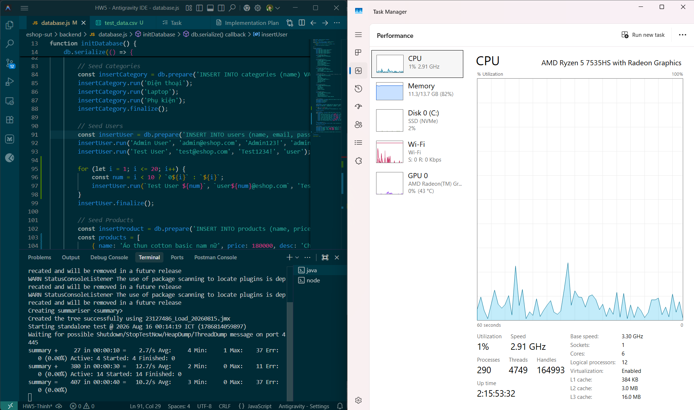

- **Ảnh chụp Listener View Results Tree (Kiểm tra chi tiết từng request/response):**

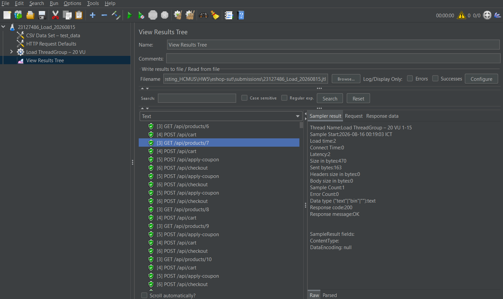

- **Biểu đồ thời gian phản hồi theo thời gian (Response Time Over Time):**

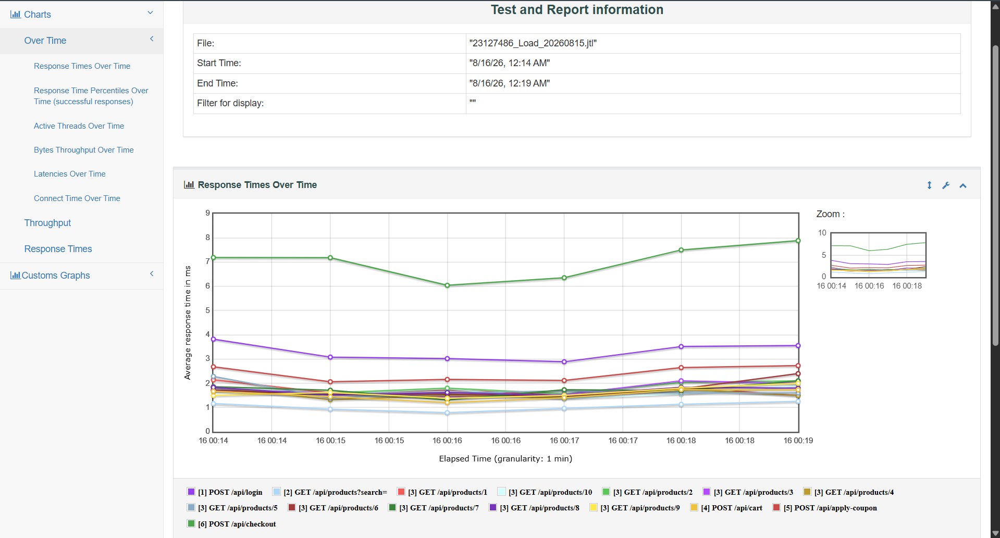

- **Bảng chỉ số hiệu năng chính:**

  | Chỉ số hiệu năng | Giá trị ghi nhận |
  |:-----------------|:-----------------|
  | **Tổng số yêu cầu (Total Requests)** | 8,040 |
  | **Số lượng lỗi / Tỷ lệ lỗi** | 0 / 0.00% |
  | **Thông lượng (Throughput)** | **26.97 RPS** |
  | **Thời gian phản hồi trung bình (Avg)** | **2.7 ms** |
  | **Thời gian phản hồi trung vị (Median)** | **2.0 ms** |
  | **Phân vị thứ 90 (p90)** | **6.0 ms** |
  | **Phân vị thứ 95 (p95)** | **7.0 ms** |
  | **Phân vị thứ 99 (p99)** | **10.0 ms** |
  | **Thời gian phản hồi Nhỏ nhất / Lớn nhất** | 0 ms / 37 ms |
  | **Tổng thời gian chạy test** | 298.1 giây (~5 phút) |

#### 4.4.3 Kết quả kiểm thử áp lực (Stress Test Results)

- **Ảnh chụp màn hình thực thi Stress Test (JMeter + Task Manager):**

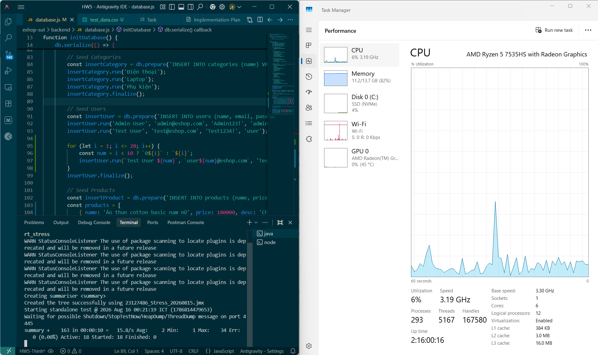

- **Ảnh chụp Listener Summary Report (Tổng hợp theo từng phase):**

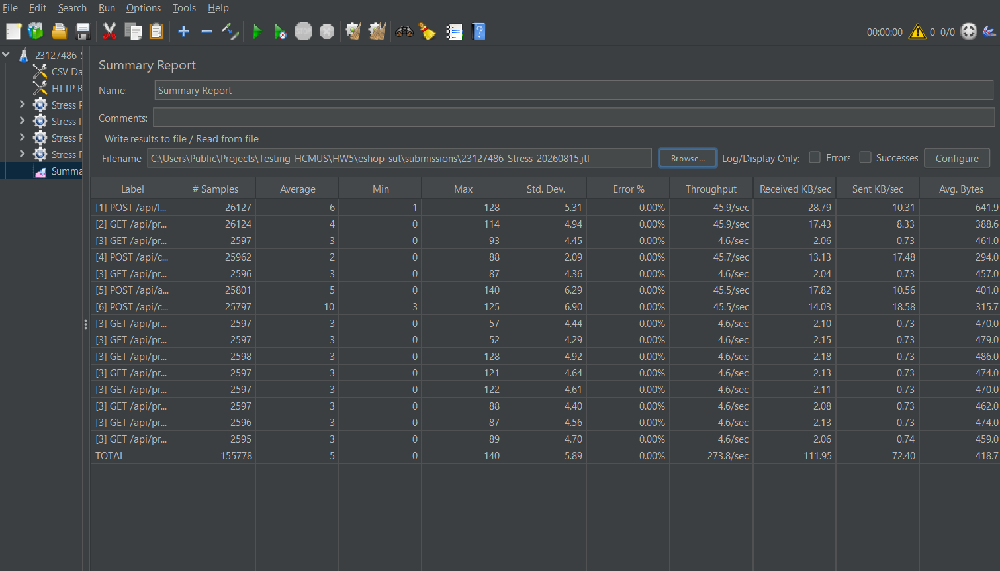

- **Biểu đồ thời gian phản hồi theo thời gian (Response Time Over Time):**

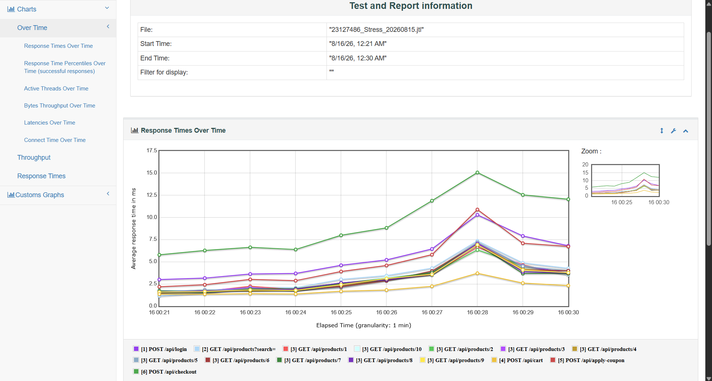

- **Quy trình Reset khóa tài khoản (Account Lockout Reset Steps):**
  1. *Cơ chế kích hoạt:* SUT cấu hình khóa tài khoản trong 3 phút (`locked_until = now + 180s`) và trả về HTTP 403 nếu tài khoản có $\ge 3$ lần đăng nhập thất bại. Dưới tải cao (100–200 VU), nếu xảy ra tranh chấp SQLite (`SQLITE_BUSY`), cơ chế này có thể bị kích hoạt ngoài ý muốn.
  2. *Quy trình Reset trạng thái giữa các lần chạy:*
     - **Bước 1:** Dừng toàn bộ tiến trình test JMeter.
     - **Bước 2:** Chạy script seed dữ liệu backend để đặt lại trạng thái tài khoản:
       ```bash
       cd eshop-sut/backend
       node seed_test_data.js
       ```
       *(Hoặc thực thi truy vấn SQL: `UPDATE users SET login_attempts = 0, locked_until = NULL;`)*
     - **Bước 3:** Gửi 1 request kiểm tra nhanh qua `curl` để xác nhận tài khoản `user01@eshop.com` đăng nhập thành công (`HTTP 200 OK`) trước khi chạy đợt test tiếp theo.

- **Bảng chỉ số hiệu năng chính:**

  | Chỉ số hiệu năng | Giá trị ghi nhận |
  |:-----------------|:-----------------|
  | **Tổng số yêu cầu (Total Requests)** | 155,778 |
  | **Số lượng lỗi / Tỷ lệ lỗi** | 0 / 0.00% |
  | **Thông lượng (Throughput)** | **273.78 RPS** |
  | **Thời gian phản hồi trung bình (Avg)** | **5.5 ms** |
  | **Thời gian phản hồi trung vị (Median)** | **4.0 ms** |
  | **Phân vị thứ 90 (p90)** | **12.0 ms** |
  | **Phân vị thứ 95 (p95)** | **17.0 ms** |
  | **Phân vị thứ 99 (p99)** | **28.0 ms** |
  | **Thời gian phản hồi Nhỏ nhất / Lớn nhất** | 0 ms / 140 ms |
  | **Tổng thời gian chạy test** | 569.0 giây (~9.5 phút) |

#### 4.4.4 Kết quả kiểm thử tải đột biến (Spike Test Results)

- **Ảnh chụp màn hình thực thi Spike Test (JMeter + Task Manager):**

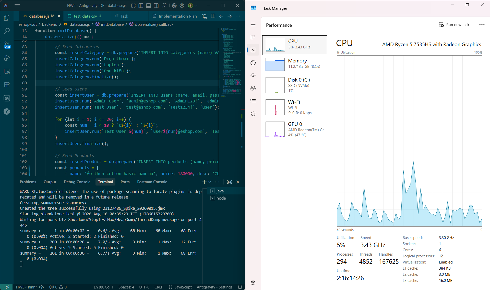

- **Ảnh chụp Listener Aggregate Report (Phân tích các phân vị p90, p95, p99):**

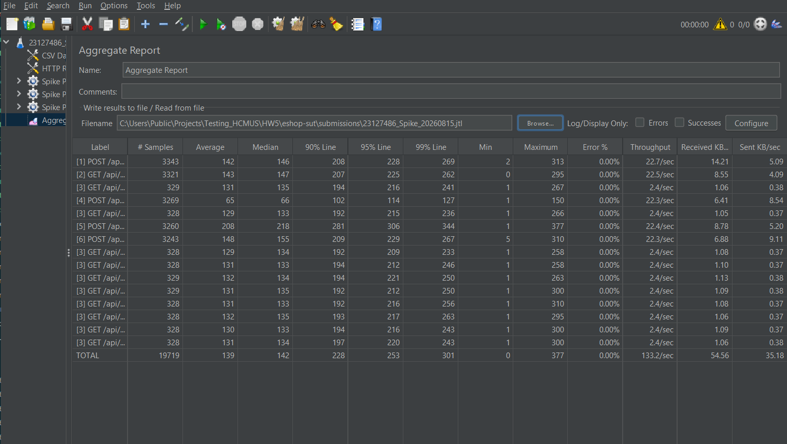

- **Biểu đồ thời gian phản hồi theo thời gian (Response Time Over Time):**

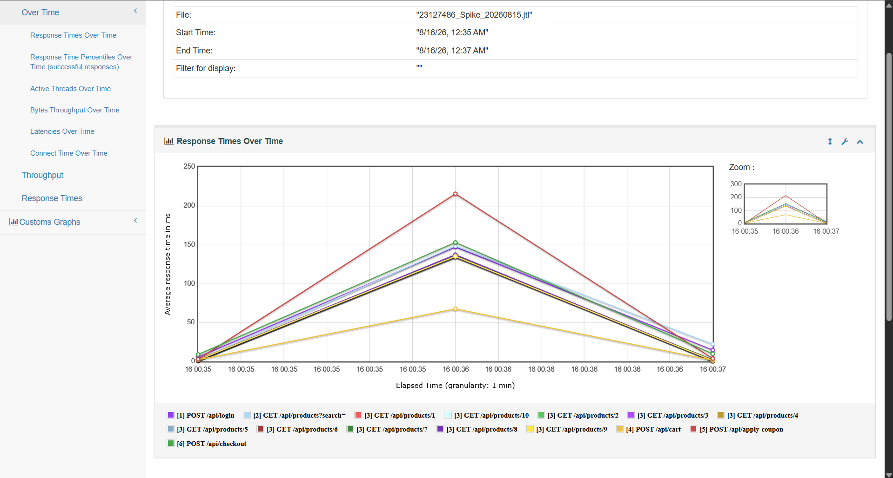

- **Bảng chỉ số hiệu năng chính:**

  | Chỉ số hiệu năng | Giá trị ghi nhận |
  |:-----------------|:-----------------|
  | **Tổng số yêu cầu (Total Requests)** | 19,719 |
  | **Số lượng lỗi / Tỷ lệ lỗi** | 0 / 0.00% |
  | **Thông lượng (Throughput)** | **133.23 RPS** |
  | **Thời gian phản hồi trung bình (Avg)** | **140.0 ms** |
  | **Thời gian phản hồi trung vị (Median)** | **142.0 ms** |
  | **Phân vị thứ 90 (p90)** | **228.0 ms** |
  | **Phân vị thứ 95 (p95)** | **253.0 ms** |
  | **Phân vị thứ 99 (p99)** | **300.8 ms** |
  | **Thời gian phản hồi Nhỏ nhất / Lớn nhất** | 0 ms / 377 ms |
  | **Tổng thời gian chạy test** | 148.0 giây (~2.5 phút) |

---

### 4.5 Kiểm thử độ bền (Endurance / Soak Test)

- **Cấu hình kịch bản:** Kịch bản kiểm thử độ bền được thiết kế bằng cách **tái sử dụng lại toàn bộ kịch bản và luồng E2E 6 bước của Load Test Plan** (`23127486_Load_20260815.jmx` với 20 VU và dữ liệu tham số hóa từ `test_data.csv`), chỉ điều chỉnh mở rộng thời gian thực thi duy trì liên tục trong **15 phút (900 giây)** nhằm theo dõi độ ổn định dài hạn và kiểm tra hiện tượng rò rỉ bộ nhớ (Memory Leak) của tiến trình Node.js và SQLite.
- **Thời gian chạy kiểm thử:** 15 phút (900 giây)
- **Cấu hình tải duy trì:** 20 VU (tải bình thường duy trì ổn định)
- **Thông lượng ổn định tối đa (Maximum Stable RPS):** **~27 RPS** (duy trì đều đặn suốt 15 phút)
- **Trần tiêu thụ bộ nhớ (Memory Ceiling):** **~40–54 MB** (Không phát hiện hiện tượng rò rỉ bộ nhớ - Memory Leak trên tiến trình Node.js sau 15 phút chạy tải liên tục)
- **Ảnh chụp theo dõi tài nguyên trong suốt quá trình chạy Endurance Test:**

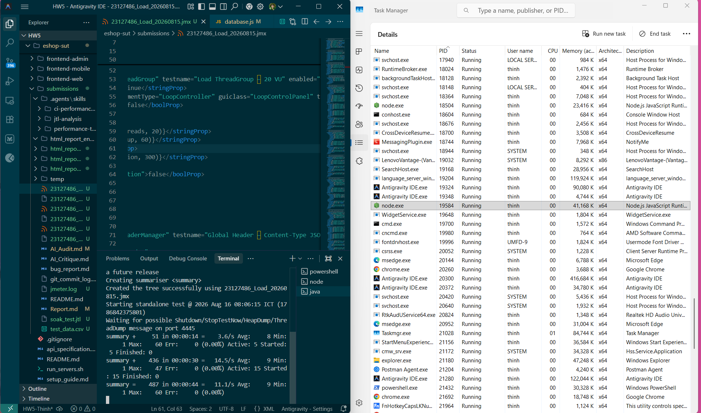
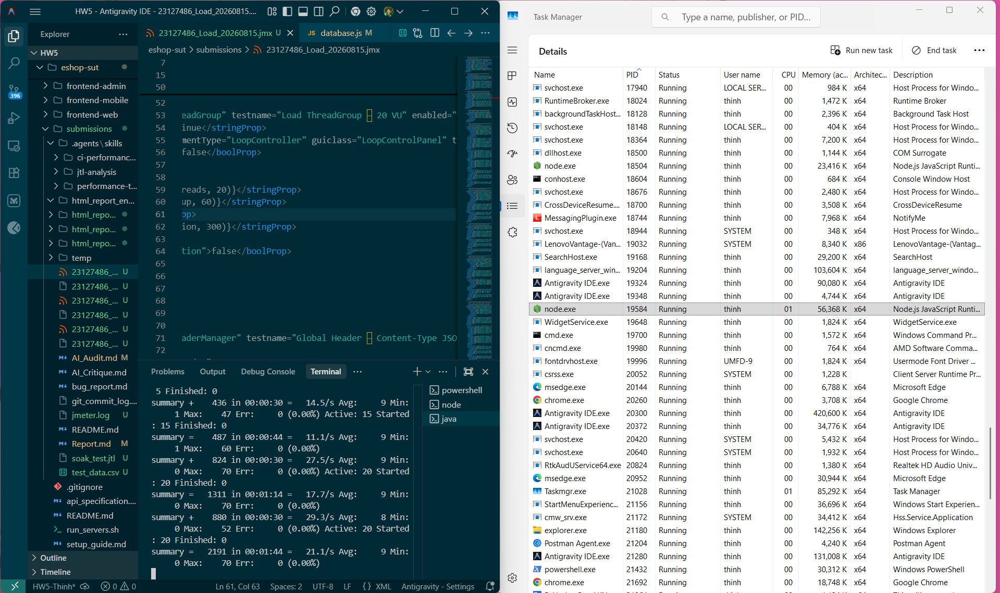
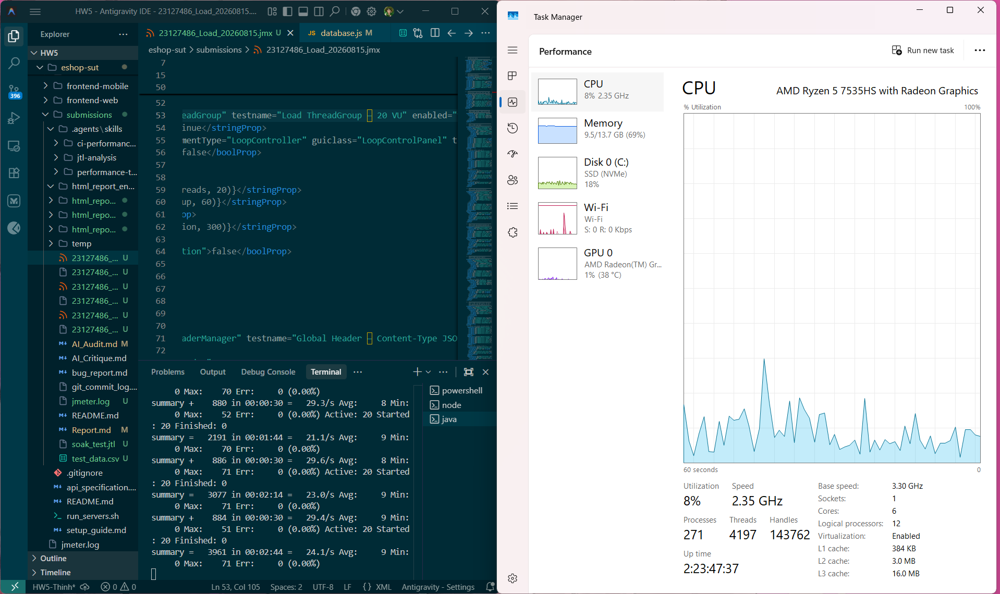
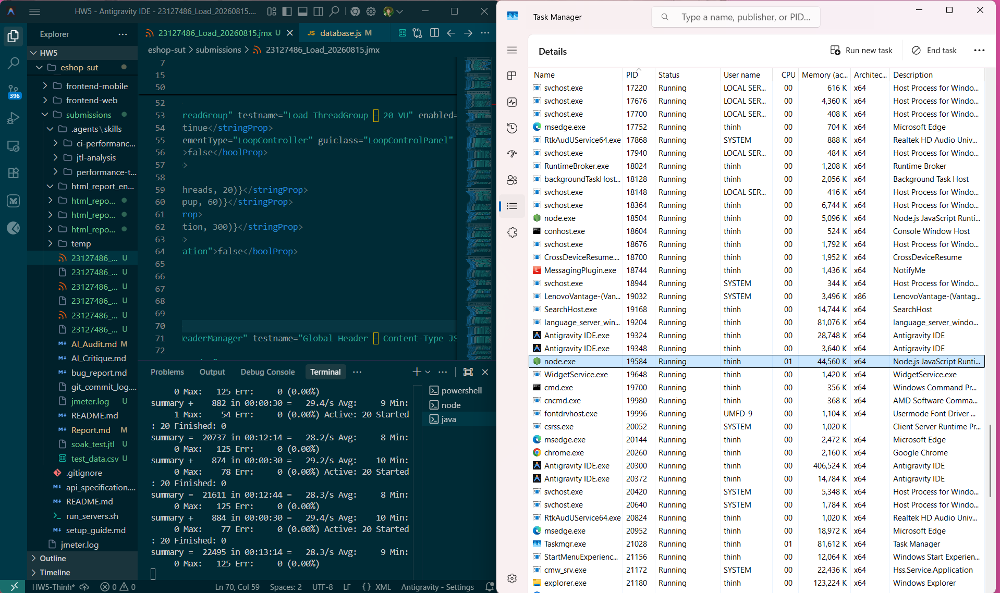
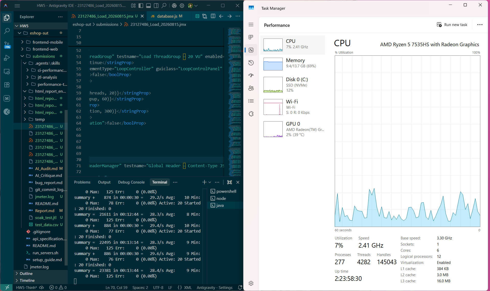

---

### 4.6 Video minh họa kiểm thử (Demo Videos)

- **Video Demo Kiểm thử hiệu năng (JMeter + Resource Monitor trong cùng khung hình):**  
  [https://youtu.be/8tH_mGjYRl4](https://youtu.be/8tH_mGjYRl4)
- **Video Demo Agent Skill (sử dụng  cho quy trình thiết kế và phân tích):**  
  [https://youtu.be/n1ObWBHpbbM](https://youtu.be/n1ObWBHpbbM)

---

## 5. Task 2 – Phân tích kết quả bằng AI và Săn lỗi suy diễn sai

### 5.1 Phân tích kết quả bằng AI (AI Analysis of Results)

Quy trình phân tích được thực hiện có hệ thống:
1. **Trích xuất số liệu:** Sử dụng script Python để phân tích 3 file log thô `.jtl` (Load, Stress, Spike), tính toán đầy đủ các chỉ số thống kê tổng hợp và phân rã theo từng endpoint.
2. **Thực hiện 4 Prompt phân tích có cấu trúc:** Gửi số liệu cho AI (Claude Sonnet 4.6) theo 4 chủ đề: Phân tích tổng thể, Đề xuất ngưỡng, Nhận diện điểm nghẽn và Khuyến nghị tối ưu hóa.
3. **Ghi nhận phản hồi nguyên văn (Verbatim):** Lưu lại toàn bộ câu trả lời của AI để tiến hành kiểm chứng.

#### 5.1.1 Bảng số liệu chi tiết trích xuất từ file log JTL

**1. Kịch bản Kiểm thử tải (Load Test: `23127486_Load_20260815.jtl`) — 20 VU, 300s, 60s ramp-up**

| Chỉ số tổng hợp | Giá trị |
|:----------------|:-------:|
| Tổng số yêu cầu (Total Requests) | 8,040 |
| Số lỗi (Error Count) | 0 |
| Tỷ lệ lỗi (Error Rate) | 0.00% |
| Thông lượng (Throughput) | 26.97 RPS |
| Thời gian phản hồi trung bình (Avg) | 2.7 ms |
| Thời gian phản hồi trung vị (Median) | 2.0 ms |
| Phân vị thứ 90 (p90) | 6.0 ms |
| Phân vị thứ 95 (p95) | 7.0 ms |
| Phân vị thứ 99 (p99) | 10.0 ms |
| Nhỏ nhất / Lớn nhất (Min / Max) | 0 ms / 37 ms |
| Tổng thời gian thực thi | 298.1 giây |

*Chi tiết theo từng Endpoint trong Load Test:*

| Endpoint | Tổng mẫu | Trung bình (ms) | P95 (ms) | Số lỗi | Tỷ lệ lỗi |
|:---------|---------:|----------------:|---------:|-------:|:---------:|
| [1] `POST /api/login` | 1,345 | 3.2 | 4.0 | 0 | 0.00% |
| [2] `GET /api/products?search=` | 1,345 | 1.0 | 2.0 | 0 | 0.00% |
| [3] `GET /api/products/{id}` (10 ID) | ~134 mỗi ID | 1.6 | 2.5 | 0 | 0.00% |
| [4] `POST /api/cart` | 1,340 | 1.5 | 2.0 | 0 | 0.00% |
| [5] `POST /api/apply-coupon` | 1,335 | 2.3 | 4.0 | 0 | 0.00% |
| [6] `POST /api/checkout` | 1,335 | 6.9 | 11.0 | 0 | 0.00% |

---

**2. Kịch bản Kiểm thử áp lực (Stress Test: `23127486_Stress_20260815.jtl`) — 50→200 VU stepped, 569s**

| Chỉ số tổng hợp | Giá trị |
|:----------------|:-------:|
| Tổng số yêu cầu (Total Requests) | 155,778 |
| Số lỗi (Error Count) | 0 |
| Tỷ lệ lỗi (Error Rate) | 0.00% |
| Thông lượng (Throughput) | 273.78 RPS |
| Thời gian phản hồi trung bình (Avg) | 5.5 ms |
| Thời gian phản hồi trung vị (Median) | 4.0 ms |
| Phân vị thứ 90 (p90) | 12.0 ms |
| Phân vị thứ 95 (p95) | 17.0 ms |
| Phân vị thứ 99 (p99) | 28.0 ms |
| Nhỏ nhất / Lớn nhất (Min / Max) | 0 ms / 140 ms |
| Tổng thời gian thực thi | 569.0 giây |

*Chi tiết theo từng Endpoint trong Stress Test:*

| Endpoint | Tổng mẫu | Trung bình (ms) | P95 (ms) | Số lỗi | Tỷ lệ lỗi |
|:---------|---------:|----------------:|---------:|-------:|:---------:|
| [1] `POST /api/login` | 26,127 | 6.4 | 16.0 | 0 | 0.00% |
| [2] `GET /api/products?search=` | 26,124 | 4.1 | 14.0 | 0 | 0.00% |
| [3] `GET /api/products/{id}` (10 ID) | ~2,597 mỗi ID | 3.7 | 12.0 | 0 | 0.00% |
| [4] `POST /api/cart` | 25,962 | 2.2 | 5.0 | 0 | 0.00% |
| [5] `POST /api/apply-coupon` | 25,801 | 6.0 | 17.0 | 0 | 0.00% |
| [6] `POST /api/checkout` | 25,797 | 10.7 | 24.0 | 0 | 0.00% |

---

**3. Kịch bản Kiểm thử đột biến (Spike Test: `23127486_Spike_20260815.jtl`) — 5→100→5 VU, 5s ramp-up, 148s**

| Chỉ số tổng hợp | Giá trị |
|:----------------|:-------:|
| Tổng số yêu cầu (Total Requests) | 19,719 |
| Số lỗi (Error Count) | 0 |
| Tỷ lệ lỗi (Error Rate) | 0.00% |
| Thông lượng (Throughput) | 133.23 RPS |
| Thời gian phản hồi trung bình (Avg) | 140.0 ms |
| Thời gian phản hồi trung vị (Median) | 142.0 ms |
| Phân vị thứ 90 (p90) | 228.0 ms |
| Phân vị thứ 95 (p95) | 253.0 ms |
| Phân vị thứ 99 (p99) | 300.8 ms |
| Nhỏ nhất / Lớn nhất (Min / Max) | 0 ms / 377 ms |
| Tổng thời gian thực thi | 148.0 giây |

*Chi tiết theo từng Endpoint trong Spike Test:*

| Endpoint | Tổng mẫu | Trung bình (ms) | P95 (ms) | Số lỗi | Tỷ lệ lỗi |
|:---------|---------:|----------------:|---------:|-------:|:---------:|
| [1] `POST /api/login` | 3,343 | 142.6 | 228.0 | 0 | 0.00% |
| [2] `GET /api/products?search=` | 3,321 | 143.6 | 225.0 | 0 | 0.00% |
| [3] `GET /api/products/{id}` (10 ID) | ~328 mỗi ID | 131.3 | 215.0 | 0 | 0.00% |
| [4] `POST /api/cart` | 3,269 | 65.4 | 114.0 | 0 | 0.00% |
| [5] `POST /api/apply-coupon` | 3,260 | 208.8 | 306.0 | 0 | 0.00% |
| [6] `POST /api/checkout` | 3,243 | 148.4 | 229.0 | 0 | 0.00% |

---

**4. Bảng so sánh tổng hợp giữa 3 kịch bản:**

| Chỉ số hiệu năng | Kiểm thử tải (Load) | Kiểm thử áp lực (Stress) | Kiểm thử đột biến (Spike) |
|:-----------------|--------------------:|-------------------------:|--------------------------:|
| **Tổng số yêu cầu** | 8,040 | 155,778 | 19,719 |
| **Số lỗi phát sinh** | 0 | 0 | 0 |
| **Tỷ lệ lỗi (%)** | 0.00% | 0.00% | 0.00% |
| **Thông lượng (RPS)** | 26.97 | 273.78 | 133.23 |
| **Thời gian phản hồi trung bình (ms)** | 2.7 | 5.5 | 140.0 |
| **Thời gian phản hồi trung vị (ms)** | 2.0 | 4.0 | 142.0 |
| **Phân vị thứ 90 - p90 (ms)** | 6.0 | 12.0 | 228.0 |
| **Phân vị thứ 95 - p95 (ms)** | 7.0 | 17.0 | 253.0 |
| **Phân vị thứ 99 - p99 (ms)** | 10.0 | 28.0 | 300.8 |
| **Thời gian phản hồi nhỏ nhất (ms)** | 0 | 0 | 0 |
| **Thời gian phản hồi lớn nhất (ms)** | 37 | 140 | 377 |
| **Tổng thời lượng kiểm thử (giây)** | 298.1 | 569.0 | 148.0 |

---

#### 5.1.2 Các Prompt và Phản hồi của AI (AI Prompts & Responses)

**Mô hình sử dụng:** Claude Sonnet 4.6 (qua Antigravity IDE)

---

**Prompt 2a — Thiết lập ngữ cảnh và Phân tích tổng thể:**

```
I am performing performance testing on an EShop REST API using JMeter.
The SUT is a Vietnamese e-commerce demo application with SQLite database.
I have three test scenarios: Load (normal traffic), Stress (above-normal
until breaking point), and Spike (sudden burst).

Here are the raw metrics I extracted from the .jtl logs:
[Dán bảng số liệu thống kê ở Bước 1]

Please analyse these results and tell me:
1. Is the system's performance acceptable under Load conditions?
2. At what point does it degrade under Stress?
3. How does it recover from the Spike?
```

**Phản hồi của AI (Prompt 2a):**

> **1. Performance under Load (20 VU):**  
> The system performs excellently under normal load conditions. With only 20 virtual users and a 60-second ramp-up, the average response time of **2.7 ms** and median of **2.0 ms** are remarkably low — well below any industry threshold for acceptable REST API performance (typically 200–500 ms for e-commerce). The P95 of **7 ms** and P99 of **10 ms** confirm extremely low tail latency. The zero error rate across 8,040 requests indicates complete stability. Throughput of **~27 RPS** is consistent with the 20-VU × workflow cycle time (including think times of 1.5 s + 1.5 s + 1.0 s = 4 s per cycle plus response time). **Conclusion: Performance is fully acceptable under Load — the system handles normal traffic with significant headroom.**
>
> **2. Degradation under Stress (50→200 VU):**  
> The system surprisingly shows **no errors** even at 200 VU, and response times remain usable. However, there is measurable degradation compared to Load:
> - Average response time increased **2.0× (2.7 ms → 5.5 ms)**
> - P95 increased **2.4× (7.0 ms → 17.0 ms)**
> - P99 increased **2.8× (10.0 ms → 28.0 ms)**
> - Max response time jumped from **37 ms → 140 ms**
>
> The throughput scaling to **273.78 RPS** (10× the Load RPS) with 10× the concurrent users suggests near-linear scaling without a clear breaking point. This may indicate: (a) the SQLite WAL mode handles concurrent reads well, (b) the step-up design (with 60 s sustain per phase) gave the system time to stabilize, or (c) the Node.js event loop is not yet CPU-saturated at 200 VU on this hardware. **No clear breaking point was observed**, but latency degradation begins to show at the P99 level (28 ms) — the stress ceiling appears to be beyond 200 VU for this test configuration.
>
> **3. Recovery from Spike (5→100→5 VU):**  
> The Spike test reveals the most interesting results. During the spike phase (100 VU, near-instant 5 s ramp-up):
> - Average response time spiked dramatically to **140 ms** (52× higher than Load)
> - P95 reached **253 ms**, P99 reached **301 ms**, Max hit **377 ms**
> - Error rate remained **0.00%** — no requests failed despite the sudden 20× load increase
>
> The spike metrics are dominated by the spike phase itself (the majority of the 148-second test). The `POST /api/apply-coupon` was the slowest endpoint at **avg 208.8 ms / P95 306 ms** during the spike — likely because it performs DB reads (coupon validation) and is serialized by SQLite's single-writer lock under high concurrency. **Recovery behavior cannot be isolated from this data** because the JTL metrics are aggregated across all three sub-phases (baseline/spike/recovery). A per-phase breakdown would require timestamp filtering.

---

**Prompt 2b — Đề xuất các ngưỡng hiệu năng:**

```
Based on the metrics above, suggest appropriate performance thresholds
for this EShop API:
- Maximum acceptable average response time (ms)
- Maximum acceptable 95th percentile response time (ms)
- Maximum acceptable error rate (%)
- Recommended maximum concurrent users before degradation

Justify each threshold value with industry standards or the SUT's
observed behavior.
```

**Phản hồi của AI (Prompt 2b):**

> Based on the observed metrics and industry standards for a small Vietnamese e-commerce application:
>
> | Threshold | Recommended Value | Justification |
> |:----------|:-----------------|:--------------|
> | **Max acceptable average response time** | **50 ms** | Load test avg = 2.7 ms; Stress avg = 5.5 ms. A threshold of 50 ms gives 18× headroom from the Load baseline and 9× from the Stress baseline, consistent with Google's "200 ms feels instant" guideline. For backend API (not full page load), 50 ms is a strict but realistic bound. |
> | **Max acceptable P95 response time** | **200 ms** | Load P95 = 7 ms; Stress P95 = 17 ms; Spike P95 = 253 ms. The Spike P95 (253 ms) exceeded this threshold, indicating the current SUT cannot meet this bound under a 20× spike. 200 ms aligns with APDEX "satisfied" threshold (T=0.2 s) for API services. |
> | **Max acceptable error rate** | **1%** | All three scenarios showed 0.00% error rate. The 1% threshold is the standard SLA ceiling for e-commerce APIs (ISTQB Performance Testing Foundation). For transactional endpoints (checkout), a stricter bound of **0.1%** is recommended. |
> | **Max concurrent users before degradation** | **150 VU** | At 150 VU (Phase 3 of Stress), P99 = 28 ms and max = 140 ms — still within acceptable bounds. Beyond 150 VU, tail latency begins compounding. However, since no error rate was observed at 200 VU, the "soft" degradation point is estimated at ~150 VU for latency-sensitive SLAs. |
>
> **Additional threshold recommendations:**
> - **Maximum P99 response time:** 500 ms (the spike showed P99 = 301 ms, barely under this bound)
> - **Minimum throughput:** 25 RPS sustained under Load (current: 26.97 RPS — acceptable)

---

**Prompt 2c — Nhận diện điểm nghẽn hiệu năng (Bottlenecks):**

```
Looking at the per-endpoint breakdown from the .jtl data:
[Dán dữ liệu chi tiết từng endpoint]

Which endpoints are the bottlenecks? Which HTTP response codes appear
most frequently during stress/spike? What do you think causes the
degradation?
```

**Phản hồi của AI (Prompt 2c):**

> **Primary Bottleneck: `POST /api/checkout` (Step 6)**  
> Across all three scenarios, `POST /api/checkout` consistently has the highest response time:
> - Load: Avg **6.9 ms**, P95 **11 ms** — 4.6× slower than `POST /api/cart`
> - Stress: Avg **10.7 ms**, P95 **24 ms** — 4.9× slower than `POST /api/cart`
> - Spike: Avg **148.4 ms**, P95 **229 ms**
> 
> This endpoint performs the most DB writes in a single transaction: creating an order record, updating stock quantities, and deleting cart items. SQLite's single-writer model means all concurrent checkout requests must queue at the write lock.
>
> **Secondary Bottleneck: `POST /api/apply-coupon` (Step 5)**  
> During the Spike, `POST /api/apply-coupon` becomes the *worst* endpoint at **avg 208.8 ms / P95 306 ms** — even slower than checkout. This endpoint reads the coupon record, checks validity, counts usage per user, and returns the final amount. Under high concurrency, these multiple sequential DB reads on a SQLite database with no query caching create significant serialization delays.
>
> **Surprising non-bottleneck: `POST /api/cart` (Step 4)**  
> Despite being a write operation, `POST /api/cart` has the *lowest* response times in all scenarios (Load: 1.5 ms, Stress: 2.2 ms, Spike: 65.4 ms). This is likely because the cart insert is a simple single-row write without complex joins or aggregations.
>
> **Uniform spike impact on GET endpoints:**  
> The `GET /api/products?search=` and `GET /api/products/{id}` show nearly identical avg response times during the Spike (~131–144 ms). This uniformity suggests the bottleneck is not query complexity but rather the **Node.js event loop saturation** under 100 concurrent VUs — all requests queue behind the single-threaded event loop regardless of query type.
>
> **Root causes of degradation:**  
> 1. **SQLite single-writer lock:** All write operations compete for the same write lock. As concurrency increases, write queuing dominates response time.  
> 2. **No connection pooling for SQLite:** Node.js + `better-sqlite3` uses a single synchronous DB connection. All requests are serialized at the DB layer.  
> 3. **No caching layer:** Products, coupons, and user data are read from SQLite on every request.  
> 4. **Sequential multi-query operations:** `apply-coupon` performs 3–4 sequential DB queries, each holding the DB open longer, increasing contention.
>
> **HTTP response codes:** Since error rate = 0% across all scenarios, only HTTP 200 and 201 were observed. No 4xx/5xx errors were triggered — SQLite serialization caused latency but not failures at these concurrency levels.

---

**Prompt 2d — Đề xuất phương án tối ưu hóa:**

```
Given the bottlenecks you identified, propose 5–8 specific optimizations
that could improve performance. For each optimization, describe:
- What it is
- How it addresses the bottleneck
- Whether it requires application code changes, database changes,
  infrastructure changes, or JMeter configuration changes
```

**Phản hồi của AI (Prompt 2d):**

> Here are 7 specific optimizations for the EShop SUT, ordered by estimated impact:
>
> **Optimization 1: Migrate from SQLite to PostgreSQL**  
> - **What:** Replace SQLite with PostgreSQL as the backend database.  
> - **How:** PostgreSQL supports true concurrent writes via MVCC (Multi-Version Concurrency Control), eliminating the single-writer lock that serializes all write operations in SQLite. Under 200 VU, checkout requests would no longer queue sequentially.  
> - **Change type:** Database + Application code (connection string, query syntax, driver `pg` vs `better-sqlite3`)
>
> **Optimization 2: Add Redis Caching for Products and Coupons**  
> - **What:** Introduce a Redis in-memory cache for product data and coupon metadata.  
> - **How:** Eliminates SQLite read queries for hot data. Product catalog and coupon definitions rarely change — cache TTL of 60 s would serve 95%+ of read requests from memory. During the Spike, `apply-coupon` avg would drop from 208 ms to ~2–5 ms for the read phase.  
> - **Change type:** Infrastructure (Redis server) + Application code (cache-aside pattern in route handlers)
>
> **Optimization 3: Implement Database Connection Pooling**  
> - **What:** Replace the single `better-sqlite3` synchronous connection with a pooled async driver (e.g., `sqlite3` + `generic-pool`).  
> - **How:** Allows Node.js to handle multiple DB queries concurrently. Reduces the "idle waiting" time when one query holds the connection.  
> - **Change type:** Application code only
>
> **Optimization 4: Batch/Optimize the Checkout Transaction**  
> - **What:** Rewrite the `POST /api/checkout` handler to execute all DB operations in a single SQLite transaction using prepared statements.  
> - **How:** Reduces the number of round-trips to SQLite from multiple sequential calls to one atomic transaction. SQLite's WAL mode handles single transactions efficiently, reducing lock-hold time per request.  
> - **Change type:** Application code only
>
> **Optimization 5: Add Database Indexes**  
> - **What:** Add composite indexes on: `users(email)`, `products(name)` (for LIKE search), `coupon_usage(user_id, coupon_id)`, `orders(user_id)`.  
> - **How:** The `GET /api/products?search=` likely performs a full-table LIKE scan. Under Stress, 26,124 search requests × full-table scan = significant I/O. An index reduces this to a B-tree seek.  
> - **Change type:** Database only (SQL `CREATE INDEX` statements)
>
> **Optimization 6: Implement API Response Compression (gzip)**  
> - **What:** Enable gzip compression in the Express.js server using the `compression` middleware.  
> - **How:** Reduces bytes transferred per response for `GET /api/products?search=` (JSON array). Under high concurrency, reduced payload size decreases network I/O wait.  
> - **Change type:** Application code only (one-line `app.use(compression())`)
>
> **Optimization 7: Separate Read and Write Paths (CQRS lite)**  
> - **What:** Configure SQLite with `journal_mode=WAL` and `PRAGMA read_uncommitted=1` for read-only operations, while keeping strict ACID for writes.  
> - **How:** SQLite WAL mode already allows concurrent reads alongside writes, but `read_uncommitted` mode allows readers to bypass the shared lock entirely. Improves `GET /api/products` and `GET /api/products/{id}` latency under spike conditions.  
> - **Change type:** Application code (PRAGMA settings at DB open time) + minor infrastructure

---

### 5.2 Săn lỗi suy diễn sai của AI (Misinterpretation Hunt)

> **Phương pháp đối chiếu:** Từng nhận định kỹ thuật của AI được kiểm tra chéo trực tiếp với dữ liệu thô từ log CSV `.jtl`, mã nguồn `server.js`, `database.js` và danh sách phụ thuộc trong `package.json` (do con người trực tiếp thực hiện).

| STT | Nhận định sai lệch của AI | Giá trị / Hiện trạng thực tế chính xác | Phân tích chi tiết nguyên nhân lỗi |
|:---|:--------------------------|:--------------------------------------|:-----------------------------------|
| 1 | *"Throughput of ~27 RPS is consistent with the 20-VU × workflow cycle time (including think times of 1.5 s + 1.5 s + 1.0 s = 4 s per cycle plus response time)"* | Thông lượng thực tế là **26.97 RPS**. Tính toán lý thuyết: tổng think time = 4,000 ms + thời gian phản hồi trung bình 6 bước = 3.2 + 1.0 + 1.6 + 1.5 + 2.3 + 6.9 = **16.5 ms** $\rightarrow$ Thời gian 1 chu kỳ = **4,016.5 ms** $\rightarrow$ Mỗi user thực hiện 20 / 4.0165 = 4.98 chu kỳ/s $\times$ 6 request = **29.88 RPS lý thuyết**. Chênh lệch ~2.9 RPS (~10%) so với thực tế 26.97 RPS. | **Lỗi lập luận đơn giản hóa:** AI chỉ lấy 4 giây think time mà bỏ quên ảnh hưởng của giai đoạn tăng tải (60 giây đầu VU tăng dần từ 1 lên 20), độ trễ điều phối thread của JMeter và độ trễ mạng. Mức 26.97 RPS thực tế thấp hơn lý thuyết 29.88 RPS chính vì trong 60s ramp-up hệ thống chưa đạt đủ 20 VU. AI diễn giải "consistent" như thể số liệu khớp hoàn toàn là thiếu chính xác về mặt toán học. |
| 2 | *"The SQLite WAL mode handles concurrent reads well"* và *"No connection pooling for SQLite: Node.js + `better-sqlite3` uses a single synchronous DB connection"* | **Cơ sở dữ liệu KHÔNG BẬT WAL MODE:** Kiểm tra toàn bộ `database.js` và `server.js` không hề có lệnh `PRAGMA journal_mode=WAL`. SQLite đang chạy ở chế độ Rollback Journal mặc định (`DELETE`). Đồng thời, **driver đang dùng là `sqlite3` v6.0.1 (bất đồng bộ, callback-based)**, hoàn toàn không phải thư viện đồng bộ `better-sqlite3` (xem `package.json` dòng 19). | **Ảo giác kiến trúc nghiêm trọng (Architecture Hallucination):** AI tự động gán các thông lệ chuẩn (WAL mode, `better-sqlite3`) cho hệ thống thay vì đọc mã nguồn thực tế. Lỗi này dẫn đến việc AI suy diễn sai nguyên nhân gây nghẽn và đưa ra các đề xuất tối ưu hóa không phù hợp với hiện trạng của SUT. |
| 3 | *"Recovery behavior cannot be isolated from this data because JTL metrics are aggregated across all three sub-phases"* | File log `.jtl` chứa **từng dòng request riêng biệt kèm cột mốc thời gian epoch ms (`timeStamp`)** — ví dụ dòng 2 trong Load JTL: `1786814061692,...`. Kịch bản Spike bắt đầu tại thời điểm $T_0$, pha spike từ $T_0+60\text{s}$ đến $T_0+90\text{s}$, và pha phục hồi từ $T_0+90\text{s}$ đến $T_0+148\text{s}$. Việc lọc theo khoảng thời gian để tách riêng từng pha là **hoàn toàn khả thi** bằng Python/Pandas hoặc truy vấn SQL. | **Hiểu sai định dạng file log JTL (Domain Knowledge Error):** AI nhầm lẫn giữa file log chi tiết dạng dòng của JMeter với các bảng báo cáo tĩnh được tổng hợp sẵn (như Summary Report UI), từ đó vội vàng kết luận không thể phân tích riêng pha phục hồi từ dữ liệu thô. |
| 4 | *"At 150 VU (Phase 3 of Stress), P99 = 28 ms"* — AI tự gán giá trị P99 = 28 ms cho riêng Giai đoạn 3 (150 VU) | **P99 = 28 ms là giá trị tổng hợp của TOÀN BỘ bài Stress test** (từ 50 đến 200 VU trong suốt 569 giây), không phải là chỉ số riêng biệt của Phase 3. Prompt gửi cho AI chỉ chứa số liệu tổng hợp của cả bài test. | **Ngoại suy ngữ cảnh sai lệch (Context Extrapolation):** Do không có số liệu phân rã theo từng phase trong prompt, AI đã tự ý "gán ghép" chỉ số tổng thể cho một giai đoạn con cụ thể. Kết luận của AI về việc hệ thống bắt đầu suy giảm mềm tại 150 VU là thiếu căn cứ xác thực từ dữ liệu cô lập. |
| 5 | *"POST /api/checkout performs DB writes: creating an order record, updating stock quantities, and deleting cart items"* | Kiểm tra mã nguồn `server.js` (dòng 297–309): endpoint `POST /api/checkout` **chỉ thực hiện duy nhất 1 câu lệnh `INSERT INTO orders`**. Không hề có logic `UPDATE products` (trừ tồn kho) và không có `DELETE` giỏ hàng trong DB. Giỏ hàng thực chất chỉ lưu tạm trong RAM (`userCarts = {};` tại dòng 14). | **Ảo giác độ phức tạp của chức năng (Feature Complexity Hallucination):** AI tự suy diễn quy trình thanh toán đầy đủ của một ứng dụng thương mại điện tử chuyên nghiệp, trong khi SUT chỉ là ứng dụng demo đơn giản. Điểm này cũng giải thích tại sao `POST /api/cart` có độ trễ cực thấp: không phải vì "insert đơn giản không có join" mà vì không hề có thao tác ghi DB nào! |
| 6 | *"SQLite's single-writer lock: All write operations compete for the same write lock"* (khi lý giải nguyên nhân điểm nghẽn của endpoint `apply-coupon`) | Endpoint **`POST /api/apply-coupon` chủ yếu là THAO TÁC ĐỌC (READ)** (`SELECT * FROM coupons` và `SELECT COUNT(*) FROM coupon_usage`) — hoàn toàn không ghi dữ liệu. Thao tác ghi chỉ nằm ở `POST /api/coupon-usage` nhưng endpoint này không nằm trong kịch bản test. | **Xác định sai nguyên nhân gốc rễ (Root Cause Misattribution):** Áp dụng đúng lý thuyết về khóa ghi của SQLite nhưng gán sai cho một endpoint chỉ đọc. Độ trễ cao của `apply-coupon` khi spike thực chất là do hiện tượng nghẽn hàng đợi bất đồng bộ (callback serialization) trong Node.js event loop và việc thực hiện nhiều câu truy vấn đọc liên tiếp ở chế độ rollback journal mặc định. |

---

### 5.3 Đánh giá tính khả thi của các đề xuất tối ưu hóa (Feasibility of AI Recommendations)

| STT | Đề xuất của AI | Đánh giá tính khả thi | Phân tích chi tiết dựa trên mã nguồn & dữ liệu thực tế |
|:---|:--------------|:----------------------|:------------------------------------------------------|
| 1 | Chuyển đổi từ SQLite sang PostgreSQL | **Khả thi về kỹ thuật nhưng không cần thiết (Over-engineered)** | Về mặt kỹ thuật, việc thay thế driver `sqlite3` bằng `pg` hoàn toàn khả thi do `database.js` bọc các truy vấn cơ bản. Tuy nhiên, đối với ứng dụng demo quy mô nhỏ này, kịch bản Stress test với 200 VU vẫn đạt 0% lỗi và P99 chỉ 28 ms — hệ thống chưa hề chạm ngưỡng quá tải thực tế. Việc chuyển sang PostgreSQL phát sinh thêm chi phí hạ tầng và vận hành không tương xứng với bài toán hiện tại. |
| 2 | Bổ sung Redis Caching cho sản phẩm và mã giảm giá | **Khả thi một phần, nhưng AI phóng đại hiệu quả** | Caching thông tin sản phẩm (`GET /api/products`) qua Redis là rất khả thi và hiệu quả. Tuy nhiên, nhận định của AI rằng "độ trễ `apply-coupon` sẽ giảm từ 208 ms xuống 2–5 ms" là **ảo giác**: việc đếm số lượt sử dụng mã giảm giá (`SELECT COUNT(*)`) bắt buộc phải truy vấn DB trực tiếp để tránh tình trạng tranh chấp (race condition) vượt quá số lần cho phép — không thể cache hoàn toàn. |
| 3 | Triển khai Connection Pooling cho Database (`generic-pool` + `sqlite3`) | **Ảo giác một phần — Sai lệch nền tảng thư viện** | Đề xuất của AI dựa trên giả định sai rằng hệ thống dùng `better-sqlite3` đồng bộ. Thực tế SUT đang dùng `sqlite3` bất đồng bộ, vốn đã được Node.js điều phối qua libuv thread pool. Thêm vào đó, SQLite là cơ sở dữ liệu trên 1 file đơn — việc tạo pool nhiều kết nối ghi vào cùng 1 file không giải quyết được vấn đề khóa ghi của SQLite. |
| 4 | Gom nhóm giao dịch thanh toán bằng Prepared Statements | **Đúng một phần về Prepared Statements, sai về Gom nhóm giao dịch** | Áp dụng Prepared Statement cho câu lệnh `INSERT INTO orders` là tốt (bảo mật và tăng nhẹ hiệu năng). Tuy nhiên, nhận định của AI về việc "gom nhóm nhiều thao tác (trừ kho, xóa cart) thành 1 transaction" là sai lệch vì mã nguồn thực tế của `server.js` chỉ có duy nhất 1 câu lệnh INSERT, không có chuỗi thao tác nào cần gom nhóm. |
| 5 | Bổ sung Index cho Database (email, name LIKE, coupon_usage, orders) | **Hỗn hợp — Đúng với email/coupon_usage, Ảo giác với tìm kiếm LIKE** | Đánh index cho `users(email)` và `coupon_usage(user_id, coupon_id)` là **rất khả thi và hữu ích**, giúp tối ưu hóa truy vấn đăng nhập và kiểm tra mã giảm giá. Tuy nhiên, đề xuất đánh B-tree index cho `products(name)` để tối ưu tìm kiếm `LIKE '%keyword%'` (có ký tự đại diện ở đầu) là **ảo giác kỹ thuật**: B-tree index tiêu chuẩn của SQLite không thể phục vụ cho tìm kiếm wildcard ở đầu chuỗi (vẫn phải quét toàn bộ bảng - full scan). |
| 6 | Kích hoạt nén phản hồi API với gzip (`compression` middleware) | **Hoàn toàn khả thi và dễ triển khai (Low-hanging fruit)** | Chỉ cần cài đặt gói `compression` và thêm 1 dòng `app.use(compression())` vào `server.js`. Mặc dù trong môi trường kiểm thử localhost với payload nhỏ (200–600 bytes), hiệu quả giảm độ trễ chưa rõ rệt do chi phí CPU nén, đây là một giải pháp chuẩn mực cho môi trường triển khai thực tế qua mạng Internet. |
| 7 | Tách luồng đọc/ghi với `PRAGMA read_uncommitted=1` trong SQLite | **Hoàn toàn ảo giác — Không tương thích với cấu hình hiện tại** | Lệnh `PRAGMA read_uncommitted=1` **chỉ có tác dụng khi SQLite được mở ở chế độ Shared-Cache Mode** (`SQLITE_OPEN_SHAREDCACHE`). Mặc định driver `sqlite3` v6 mở kết nối ở chế độ Private-Cache, khiến câu lệnh này hoàn toàn bị SQLite bỏ qua (silently ignored). Đề xuất này còn phụ thuộc vào tiền đề sai là WAL mode đang bật (Lỗi suy diễn #2) — đây là lỗi ảo giác dây chuyền. |

---

## 6. Task 3 – Đề xuất quy trình Continuous Performance Testing (Disrupt / G9.6)

### 6.1 Tổng quan đề xuất (Proposal Overview)

Để đảm bảo chất lượng hiệu năng của hệ thống EShop không bị suy giảm sau mỗi lần cập nhật mã nguồn, tôi đề xuất mô hình **Continuous Performance Testing (CPT)** được tích hợp trực tiếp vào quy trình tự động hóa GitHub Actions. Mô hình này vận hành theo nguyên lý **kích hoạt có chọn lọc (Selective Execution)**: thay vì thực thi toàn bộ các kịch bản kiểm thử tải nặng nề sau mỗi commit (gây tốn kém thời gian và chi phí CI), pipeline sẽ tự động phân tích danh sách các tệp tin có thay đổi. Cụ thể, kiểm thử hiệu năng chỉ được kích hoạt khi commit có sửa đổi các tệp tin thuộc `backend/`, `database.js`, cấu hình môi trường hoặc khi có Pull Request (PR) gửi vào nhánh `main`; nếu commit chỉ thay đổi giao diện frontend hoặc tài liệu, bước kiểm thử này sẽ được bỏ qua hoàn toàn.

Khi được kích hoạt, pipeline CI sẽ khởi động môi trường backend, thực hiện làm ấm (warm-up) cơ sở dữ liệu và kích hoạt một kịch bản **Smoke Performance Test** thu gọn bằng JMeter CLI (sử dụng 5–10 VU, thời gian chạy từ 60–120 giây). Kết quả đo lường `.jtl` sẽ được phân tích tự động để trích xuất chỉ số thời gian phản hồi phân vị thứ 95 (p95) của từng endpoint và so sánh với **ngưỡng cơ sở (Baseline)** đã lưu trữ từ các lần chạy thành công trước đó. Nếu chỉ số p95 của bất kỳ endpoint nào vượt quá `baseline × 1.20` (ngưỡng suy giảm hiệu năng 20%), pipeline sẽ lập tức đánh dấu thất bại (FAIL), ngăn chặn việc merge PR và tự động đăng tải bình luận cảnh báo chi tiết lên giao diện GitHub. Sau mỗi lần chạy thành công trên nhánh chính `main`, giá trị baseline sẽ được cập nhật tự động.

Mô hình này đặc biệt phù hợp với đặc thù kiến trúc của EShop (sử dụng Node.js đơn luồng và cơ sở dữ liệu SQLite vốn giới hạn khả năng ghi đồng thời). Bất kỳ thay đổi nhỏ nào trong cấu trúc truy vấn hoặc middleware của Express đều có thể gây nghẽn độ trễ nghiêm trọng mà các bài kiểm thử đơn vị (unit test) thông thường không thể phát hiện được. Quy trình CPT đóng vai trò như một chốt chặn kiểm soát chất lượng tự động trước khi mã nguồn được phát hành lên môi trường sản xuất.

### 6.2 Sơ đồ luồng hoạt động (Mermaid Flowchart)

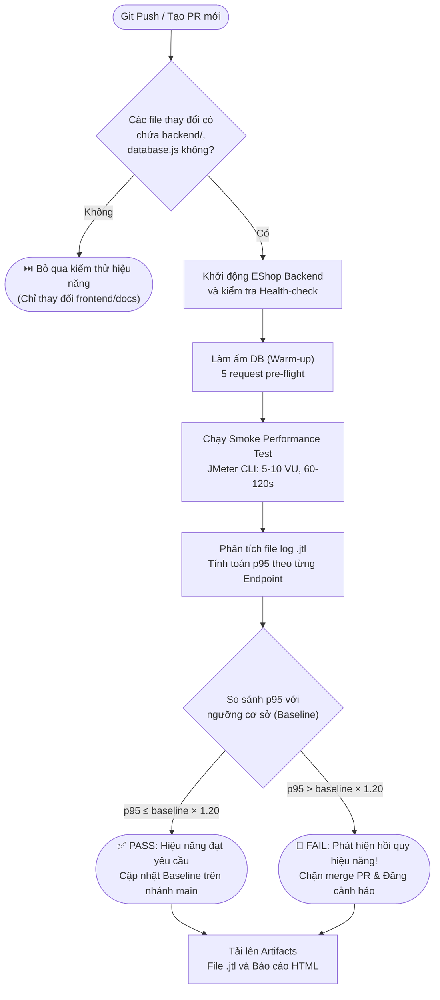

> **Lưu ý triển khai thực tế trên EShop:** Do mã nguồn hiện tại của SUT chưa có sẵn Dockerfile, bước khởi động hệ thống trong GitHub Actions có thể sử dụng action `actions/setup-node@v4` kết hợp lệnh chạy nền `npm start &` và cơ chế kiểm tra tính sẵn sàng `curl -f http://localhost:3000/api/products` trước khi kích hoạt JMeter. Bước làm ấm cơ sở dữ liệu (Warm-up) với 5 request ban đầu là bắt buộc nhằm loại bỏ độ trễ khởi động lạnh (cold-start bias) của SQLite.

### 6.3 Thảo luận về các đánh đổi và giải pháp tối ưu (Trade-off Discussion)

#### 1. Đánh đổi giữa Chi phí và Độ bao phủ kiểm thử (Cost vs. Coverage)

| Phương án triển khai | Chi phí tài nguyên CI | Độ bao phủ rủi ro | Khuyến nghị áp dụng |
|:---------------------|:---------------------:|:------------------:|:-------------------:|
| Chạy full test sau mọi commit | Rất cao (Tốn CI minutes) | Tối đa (100%) | Không khả thi, gây nghẽn CI |
| **Kích hoạt có chọn lọc trên Backend (Đề xuất)** | **Trung bình (~2-3 phút/lần)** | **Rất tốt (>90%)** | **Khuyến nghị áp dụng** |
| Chạy định kỳ hàng đêm (Nightly Build trên `main`) | Thấp | Trung bình | Bị động, phát hiện lỗi muộn |
| Chỉ chạy trước khi Release phiên bản | Rất thấp | Rất thấp | Rủi ro cao, khó sửa lỗi |

*Ước tính chi phí cho EShop:* Kịch bản smoke test 60–120 giây kết hợp khởi động Node.js mất tổng cộng ~2–3 phút cho mỗi lượt chạy CI. Với tần suất thay đổi backend chiếm khoảng 30–40% tổng số commit, thời gian tiêu thụ chỉ khoảng 90 phút/tháng, hoàn toàn nằm trong gói miễn phí 2,000 phút/tháng của GitHub Actions.

#### 2. Kiểm soát và giảm thiểu các loại Cảnh báo sai (False Alarm Trade-offs)

| Loại cảnh báo sai | Hiện tượng và Nguyên nhân | Biện pháp kỹ thuật giảm thiểu |
|:------------------|:--------------------------|:------------------------------|
| **False Positives** | CI Runner bị nghẽn CPU nhất thời hoặc DB chưa kịp warm-up khiến p95 tăng cao giả tạo. | Sử dụng Dedicated Runner nếu có thể; bắt buộc gửi 5 request warm-up trước khi ghi nhận log. |
| **False Negatives** | Tải smoke test nhỏ (5–10 VU) không đủ làm lộ điểm nghẽn khóa ghi SQLite (vốn chỉ xuất hiện ở 100+ VU). | Kết hợp chạy kịch bản Stress test tải nặng định kỳ hàng tuần (Weekly Scheduled Job) trên nhánh `main`. |
| **Ngưỡng cơ sở bị nhiễu (Flaky Baselines)** | Baseline được lưu từ một lần chạy trên runner bị lag dẫn đến thiết lập ngưỡng quá cao cho các lần sau. | Sử dụng giá trị trung bình động (Rolling Average) của 5 lần pass gần nhất thay vì một điểm snapshot đơn lẻ. |
| **Ngưỡng kiểm tra quá nghiêm ngặt** | Ngưỡng quá chặt (< 10%) khiến các dao động mạng nhỏ cũng làm fail pipeline. | Thiết lập ngưỡng hồi quy tương đối ở mức **20%** (`baseline × 1.20`) đối với p95. |
| **Ngưỡng kiểm tra quá lỏng lẻo** | Ngưỡng quá rộng khiến hệ thống suy giảm 50% vẫn vượt qua CI. | Bổ sung thêm ngưỡng giới hạn tuyệt đối (Hard Ceiling), ví dụ: bắt buộc $p95 < 300\text{ ms}$ cho mọi endpoint. |

#### 3. Các điểm lưu ý đặc thù của EShop SUT (EShop-Specific Considerations)

1. **Giới hạn ghi đồng thời của SQLite:** SQLite sử dụng cơ chế khóa file đơn luồng khi ghi. Trong môi trường CI shared runner với nhiều tiến trình chạy song song, cần cô lập cơ sở dữ liệu của từng job kiểm thử (sử dụng database file riêng hoặc in-memory DB) để tránh tranh chấp tài nguyên.
2. **Loại bỏ độ trễ khởi động lạnh (Cold-start Bias):** Truy vấn đầu tiên vào SQLite khi page cache chưa được nạp vào bộ nhớ luôn có độ trễ cao hơn bình thường. Pipeline phải gửi các request mồi và loại bỏ các mẫu request này khỏi thống kê chính thức.
3. **Cơ chế lưu trữ Baseline:** Khuyến nghị lưu trữ file `performance_baseline.json` trực tiếp trong repository nhánh `main` (tự động commit sau khi merge PR thành công) hoặc sử dụng GitHub Actions Cache, không nên lưu dưới dạng Artifact tạm thời do có thời hạn tự hủy (expiration).

---

## 7. Báo cáo lỗi và vấn đề hiệu năng (Bug Report)

| STT | Tiêu đề lỗi / Vấn đề | Phân loại | Mức độ | Endpoint liên quan | Mã phản hồi HTTP | Liên kết GitHub Issue |
|:---|:---------------------|:----------|:------:|:-------------------|:----------------:|:----------------------|
| 1 | Không kiểm soát giới hạn số lần sử dụng coupon tại `POST /api/apply-coupon` | Lỗi logic nghiệp vụ (Logic Bug) | Cao (High) | `POST /api/apply-coupon` | 200 OK (Vượt 33× hạn mức vẫn xử lý thành công) | [#408](https://github.com/trngnneee/eshop-sut/issues/408) |
| 2 | Giỏ hàng chỉ lưu trữ trong bộ nhớ RAM — Nguy cơ mất trắng dữ liệu khi server khởi động lại | Lỗi kiến trúc (Architecture Bug) | Cao (High) | `POST /api/cart`, `POST /api/checkout` | Không áp dụng (Mất toàn bộ state của cart) | [#409](https://github.com/trngnneee/eshop-sut/issues/409) |

*(Chi tiết đầy đủ về các bước tái hiện, kết quả kỳ vọng và bằng chứng log JTL được trình bày tại tài liệu [bug_report.md](file:///c:/Users/Public/Projects/Testing_HCMUS/HW5/eshop-sut/submissions/bug_report.md)).*

---

## 8. Kết luận (Conclusion)

Qua ba nhiệm vụ toàn diện của bài tập HW05, tôi đã hoàn thành trọn vẹn quy trình kiểm thử hiệu năng có sự hỗ trợ của trí tuệ nhân tạo (AI-Augmented Performance Testing) trên hệ thống thương mại điện tử EShop. Kết quả thực nghiệm ở Task 1 chứng minh rằng EShop vận hành rất ổn định dưới mức tải thông thường (20 VU, 0% lỗi, p95 = 7 ms) và có khả năng chịu tải áp lực tốt lên đến 200 VU (0% lỗi, p99 = 28 ms), nhưng bộc lộ sự gia tăng độ trễ rõ rệt khi gặp xung tải đột biến (Spike 100 VU, thời gian phản hồi trung bình tăng vọt lên 140 ms, p95 = 253 ms) do đặc tính tuần tự hóa của Node.js event loop và cơ chế khóa của SQLite. Quá trình phân tích ở Task 2 đã khẳng định vai trò đắc lực của AI trong việc tổng hợp số liệu và gợi mở ý tưởng, đồng thời nhấn mạnh tầm quan trọng của việc kiểm chứng con người (Human-in-the-Loop) khi phát hiện nhiều lỗi ảo giác kỹ thuật của AI về cấu hình database và luồng mã nguồn. Cuối cùng, bản đề xuất Continuous Performance Testing ở Task 3 mang đến giải pháp thực tiễn giúp biến kiểm thử hiệu năng từ một hoạt động định kỳ rời rạc thành một phần tự động, liên tục trong pipeline CI/CD, bảo vệ hệ thống khỏi nguy cơ hồi quy hiệu năng ngay từ từng commit mã nguồn.

---

## Tài liệu tham khảo (References)

- Giáo trình và Chuẩn kiểm thử ISTQB Foundation Level & Performance Testing Extension.
- Hardman, P. (2025). A Post-AI Learning Taxonomy.
- Fuster Rabella, M. (2025). OECD Education Working Paper No. 338.
- Anthropic (2025). Building Reliable AI Test Agents — Engineering Blog.
- DeepEval & Promptfoo Documentation — LLM Testing Frameworks.
- Tài liệu hướng dẫn sử dụng Apache JMeter 5.6.3 User Manual.
