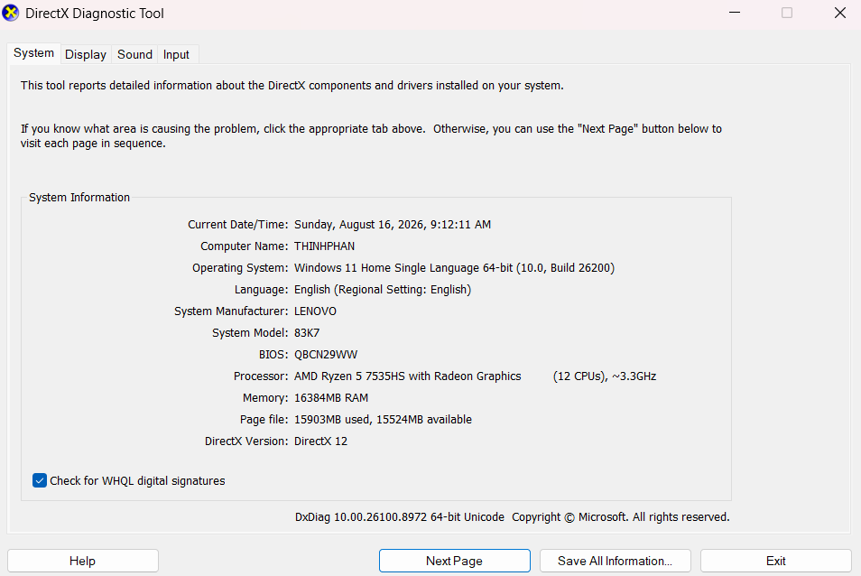

# Report – HW05 Performance Testing

**Student:** Phan Quốc Thịnh  
**MSSV:** 23127486  
**Course:** CS423 / CSC13003 – Software Testing (AI-augmented · 2026)  
**Assignment:** HW05 – Performance Testing  
**Date:** _(Fill in date)_

---

## 1. Introduction

> _(Briefly describe the purpose of this performance testing assignment and the SUT – EShop.)_

## 2. System Under Test (SUT)

- **Application:** EShop – Vietnamese e-commerce demo
- **Repository:** https://github.com/ttbhanh/eshop-sut
- **Environment:** _(Fill in your local environment details: OS, RAM, CPU)_

## 3. Scope – Endpoint Selection

### 3.1 Selected Endpoint Groups

| Group | Endpoint(s) | Justification |
|:------|:------------|:--------------|
| Auth-heavy | `POST /api/login` | Mọi VU đều phải đăng nhập trước; JWT được dùng trong các bước sau — endpoint này chịu tải cao nhất và kích hoạt cơ chế khóa tài khoản sau 3 lần sai liên tiếp. |
| Read-heavy | `GET /api/products?search={keyword}` → `GET /api/products/{id}` | Tìm kiếm và xem chi tiết sản phẩm là hành vi phổ biến nhất; hai endpoint đọc liên tiếp phản ánh thực tế người dùng duyệt danh mục rồi click vào sản phẩm. |
| Transactional | `POST /api/cart` → `POST /api/apply-coupon` → `POST /api/checkout` | Ba bước ghi dữ liệu liên quan chặt chẽ: thêm giỏ hàng (ghi session), áp mã giảm giá (đọc/check DB coupon), và đặt hàng (ghi order + xóa cart). Đây là luồng tạo đơn hàng hoàn chỉnh nhất và nhạy cảm nhất với lỗi concurrency. |

### 3.2 End-to-End Workflow

Luồng E2E gồm 6 bước, mô phỏng hành vi người dùng thực trên EShop:

| Bước | Nhóm | Endpoint | Mô tả | Think time |
|:-----|:-----|:---------|:------|:-----------|
| 1 | Auth | `POST /api/login` | Đăng nhập, extract `token` + `user_id` | 1.5 s |
| 2 | Read | `GET /api/products?search=${search}` | Tìm kiếm sản phẩm theo keyword | — |
| 3 | Read | `GET /api/products/${product_id}` | Xem chi tiết sản phẩm, cân nhắc số lượng | 1.5 s |
| 4 | Trans | `POST /api/cart` _(Bearer)_ | Thêm sản phẩm vào giỏ hàng | — |
| 5 | Trans | `POST /api/apply-coupon` _(no Bearer*)_ | Áp mã `VIP100`, extract `final_amount` | 1 s |
| 6 | Trans | `POST /api/checkout` _(Bearer)_ | Đặt hàng với `total_amount = final_amount` | — |

> *Ghi chú: Backend hiện tại không enforce JWT cho `POST /api/apply-coupon` — đây là điểm lệch spec (FR-09 quy định C4: cần JWT); sẽ ghi nhận ở Section 4.3.

**Coupon dùng trong test:** `VIP100` — fixed giảm 100,000 ₫, ngưỡng tối thiểu 300,000 ₫ (max 2 lần/user).  
**`total_before` trong CSV:** > 300,000 ₫ (strict `>`, không phải `>=` do backend bug — xem ghi chú Section 4.3).

---

## 4. Task 1 – AI-Assisted Test Design and Execution

### 4.1 AI-Assisted Test Plan Design

Quy trình thiết kế sử dụng AI (Antigravity / Claude) theo từng bước:

1. **Prompt khám phá SUT:** Yêu cầu AI đọc `README.md` và `api_specification.md` để liệt kê các endpoint, port, và schema request/response.
2. **Prompt xác nhận workflow:** Cung cấp cho AI luồng 6 bước đã chọn, mapping 3 nhóm, và các ràng buộc (coupon limit, strict `>`, no-JWT cho apply-coupon).
3. **Prompt thiết kế từng kịch bản:** Yêu cầu AI đề xuất thread count, ramp-up, duration dựa trên quy mô e-commerce Việt Nam nhỏ; AI giải thích lý do chọn từng tham số.
4. **Prompt sinh JMX:** Yêu cầu AI tạo XML JMeter đầy đủ cho mỗi kịch bản với các thành phần: CSV Data Set, HTTP Defaults, Header Manager, JSON Extractor, Response Assertion, ConstantTimer, và đúng Listener.

#### 4.1.1 Load Test Plan

- **File:** `23127486_Load_20260815.jmx`
- **Scenario:** Mô phỏng tải bình thường của một sàn thương mại điện tử Việt Nam quy mô nhỏ. 20 VU thực hiện tuần tự luồng 6 bước trong 5 phút.
- **Parameters:**
  - Thread count: **20 VU**
  - Ramp-up: **60 s** (1 VU/3s — tránh spike khởi động)
  - Duration: **300 s** (5 phút — đủ để đạt steady-state)
  - Think time: **1,500 ms** sau login; **1,500 ms** sau xem chi tiết SP; **1,000 ms** sau apply-coupon
- **Report view used:** **View Results Tree** (debug chi tiết từng request/response)

#### 4.1.2 Stress Test Plan

- **File:** `23127486_Stress_20260815.jmx`
- **Scenario:** Step-up tải từ 50 đến 200 VU để tìm điểm gãy (breaking point) của hệ thống. Mỗi bước tăng thêm 50 VU, duy trì 60 s trước khi bước tiếp theo kích hoạt.
- **Parameters:**

  | Phase | VU | Delay bắt đầu | Ramp-up | Sustain |
  |:------|:---|:-------------|:--------|:--------|
  | Phase 1 | 50 | 0 s | 30 s | 60 s |
  | Phase 2 | 100 | 90 s | 30 s | 60 s |
  | Phase 3 | 150 | 180 s | 30 s | 60 s |
  | Phase 4 (peak) | 200 | 270 s | 30 s | 300 s |

  - Think time: **1,000 ms** sau login; **1,000 ms** sau xem chi tiết; **1,000 ms** sau apply-coupon (giảm so với Load để tăng áp lực)
- **Lockout mitigation:** CSV có 20 user riêng biệt, mỗi VU dùng đúng password → tránh trigger 3-fail lockout.
- **Report view used:** **Summary Report** (tổng hợp throughput, avg, error rate theo từng phase)

#### 4.1.3 Spike Test Plan

- **File:** `23127486_Spike_20260815.jmx`
- **Scenario:** Mô phỏng đợt flash sale đột ngột: tải tăng 20× từ baseline lên spike trong 5 giây, duy trì 30 giây, rồi hệ thống phục hồi về tải bình thường.
- **Parameters:**

  | Phase | VU | Delay | Ramp-up | Duration | Mục đích |
  |:------|:---|:------|:--------|:---------|:---------|
  | Baseline | 5 | 0 s | 5 s | 60 s | Xác lập tải nền (baseline metrics) |
  | Spike | 100 | 60 s | **5 s** (near-instant) | 30 s | Kiểm tra khả năng chịu đột biến |
  | Recovery | 5 | 90 s | 5 s | 60 s | Đo thời gian hệ thống trở lại bình thường |

  - Think time: **1,500 ms** trong baseline/recovery (UX thực tế); **không có think time** trong spike phase (áp lực tối đa)
- **Report view used:** **Aggregate Report** (p90, p95, p99 percentiles — quan trọng để phát hiện tail latency khi spike)

### 4.2 CSV Data-Driven Workflow

- **CSV file(s):** `test_data.csv`
- **Số dòng dữ liệu:** 20 rows (header excluded)
- **Encoding:** UTF-8

| Column | Ví dụ | Lý do parameterize |
|:-------|:------|:-------------------|
| `email` | `user01@eshop.com` | Mỗi VU cần account riêng để tránh coupon-limit conflict và account lockout lan sang nhau |
| `password` | `Test1234!` | Khớp với account seed; đồng nhất để tránh login failure |
| `search` | `áo thun` | Keyword tiếng Việt thực tế mô phỏng hành vi tìm kiếm đa dạng |
| `product_id` | `1` → `10` | ID sản phẩm thực trong DB, xoay vòng 1–10 để test đa dạng endpoint GET |
| `quantity` | `1`–`2` | Số lượng đặt hàng — ảnh hưởng đến `price × quantity` |
| `price` | `180000` | Giá đơn vị của sản phẩm tương ứng — dùng trong body POST /api/cart |
| `total_before` | `360000` | Tổng trước giảm giá, **bắt buộc > 300,000** (ngưỡng VIP100); dùng trong body apply-coupon |
| `coupon_code` | `VIP100` | Mã giảm cố định — VIP100 (max 2 lần/user) được chọn để giảm thiểu lỗi coupon-used khi nhiều VU chạy |
| `shipping_address` | `12 Nguyễn Huệ, Q1` | Địa chỉ giả lập, bắt buộc có trong body POST /api/checkout |

**Lưu ý thiết kế CSV:**
- `total_before` được chọn **lớn hơn** ngưỡng VIP100 (300,000 ₫) chứ không bằng, do backend check `total_amount > min_order_amount` (strict `>`, không phải `>=` theo spec FR-09 C3). Đây là **bug đã biết** — sẽ ghi nhận ở Section 4.3.
- Coupon `VIP100` cho phép 2 lần/user → CSV 20 user có thể chạy ≤ 2 vòng iteration mà không bị lỗi coupon-used.
- Các trường không thay đổi giữa VU (base URL, port, Content-Type) được cấu hình trong HTTP Request Defaults và Header Manager — không đưa vào CSV.

### 4.3 Human Review – AI Corrections

> _(Critically review what the AI got wrong or missed in the test plans. For each issue, explain:_  
> _- What the AI generated_  
> _- What was wrong or missing_  
> _- How you fixed it_  
> _- Why the AI missed it (prompt quality, model limitations, endpoint characteristics))_

| # | Issue Found | AI Output | Correction Made | Why AI Missed It |
|:--|:------------|:----------|:----------------|:-----------------|
| 1 | | | | |
| 2 | | | | |
| 3 | | | | |

### 4.4 Test Execution

#### 4.4.1 Hardware Report

> _(Insert dxdiag/screenfetch screenshot and spec table here)_

| Spec | Value |
|:-----|:------|
| CPU | AMD Ryzen 5 7535HS with Radeon Graphics (6 Cores / 12 Threads) |
| RAM | 16 GB |
| OS | Microsoft Windows 11 Home Single Language |
| Hostname | THINHPHAN |



#### 4.4.2 Load Test Results

- **Screenshot:** _(Insert screenshot of JMeter + Task Manager/htop in same frame)_
- **Key Metrics:**
  | Metric | Value |
  |:-------|:------|
  | Throughput (RPS) | |
  | Avg Response Time | |
  | 90th Percentile | |
  | Error Rate | |

#### 4.4.3 Stress Test Results

- **Account Lockout Reset Steps:**
  1. **Cơ chế kích hoạt:** Trong backend (`server.js`), SUT cấu hình khóa tài khoản trong 3 phút (`locked_until = now + 180s`) và trả về HTTP 403 nếu tài khoản có $\ge 3$ lần đăng nhập thất bại. Khi chạy Stress/Spike test ở tải cao (100–200 VU), tình trạng tranh chấp tài nguyên SQLite (`SQLITE_BUSY`) hoặc timeout có thể kích hoạt cơ chế khóa này.
  2. **Quy trình Reset giữa các lần chạy:**
     - **Bước 1:** Dừng toàn bộ tiến trình test JMeter sau khi kết thúc lượt chạy hiện tại.
     - **Bước 2:** Chạy script seed dữ liệu backend để đặt lại toàn bộ trạng thái tài khoản:
       ```bash
       cd eshop-sut/backend
       node seed_test_data.js
       ```
       *(Hoặc chạy lệnh SQL trực tiếp: `UPDATE users SET login_attempts = 0, locked_until = NULL;`)*
     - **Bước 3:** Gửi 1 request kiểm tra nhanh qua `curl` để xác nhận tài khoản `user01@eshop.com` đã đăng nhập thành công (`HTTP 200`) trước khi bắt đầu kịch bản test tiếp theo.
- **Key Metrics:**
  | Metric | Value |
  |:-------|:------|
  | Throughput (RPS) | |
  | Avg Response Time | |
  | 90th Percentile | |
  | Error Rate | |

#### 4.4.4 Spike Test Results

- **Screenshot:** _(Insert screenshot)_
- **Key Metrics:**
  | Metric | Value |
  |:-------|:------|
  | Throughput (RPS) | |
  | Avg Response Time | |
  | 90th Percentile | |
  | Error Rate | |

### 4.5 Endurance / Soak Test

- **Duration:** ~10–15 minutes
- **Load:** _(Sustained load configuration)_
- **Maximum Stable RPS:** 
- **Memory Ceiling:** 
- **Screenshot:** _(Insert resource monitor screenshot)_

### 4.6 Demo Video

- **YouTube (unlisted):** _(Link here)_

---

## 5. Task 2 – AI Analysis and Misinterpretation Hunt

### 5.1 AI Analysis of Results

Quy trình phân tích:
1. **Bước 1:** Parse 3 file `.jtl` (Load/Stress/Spike) bằng Python script, tính toán đầy đủ metrics theo SKILL.
2. **Bước 2:** Gửi 4 prompt có cấu trúc cho AI (Claude Sonnet 4.6 via Antigravity IDE), ghi lại output verbatim.
3. **Kết quả:** AI nhận diện được bottleneck (checkout, apply-coupon) và đề xuất 7 optimizations.

#### 5.1.1 Step-by-Step Metrics (from .jtl parsing)

**Load Test** (`23127486_Load_20260815.jtl`) — 20 VU, 300 s, 60 s ramp-up

| Metric | Value |
|:-------|:------|
| Total Requests | 8,040 |
| Error Count | 0 |
| Error Rate | 0.00% |
| Throughput (RPS) | 26.97 |
| Avg Response Time | 2.7 ms |
| Median Response Time | 2.0 ms |
| 90th Percentile | 6.0 ms |
| 95th Percentile | 7.0 ms |
| 99th Percentile | 10.0 ms |
| Min / Max Response Time | 0 ms / 37 ms |
| Total Duration | 298.1 s |

Per-endpoint breakdown (Load):

| Endpoint | Total | Avg (ms) | P95 (ms) | Errors | Error Rate |
|:---------|------:|---------:|---------:|-------:|:----------:|
| [1] POST /api/login | 1,345 | 3.2 | 4.0 | 0 | 0.00% |
| [2] GET /api/products?search= | 1,345 | 1.0 | 2.0 | 0 | 0.00% |
| [3] GET /api/products/{id} (10 IDs) | ~134 each | 1.6 | 2.5 | 0 | 0.00% |
| [4] POST /api/cart | 1,340 | 1.5 | 2.0 | 0 | 0.00% |
| [5] POST /api/apply-coupon | 1,335 | 2.3 | 4.0 | 0 | 0.00% |
| [6] POST /api/checkout | 1,335 | 6.9 | 11.0 | 0 | 0.00% |

---

**Stress Test** (`23127486_Stress_20260815.jtl`) — 50→200 VU stepped, 569 s

| Metric | Value |
|:-------|:------|
| Total Requests | 155,778 |
| Error Count | 0 |
| Error Rate | 0.00% |
| Throughput (RPS) | 273.78 |
| Avg Response Time | 5.5 ms |
| Median Response Time | 4.0 ms |
| 90th Percentile | 12.0 ms |
| 95th Percentile | 17.0 ms |
| 99th Percentile | 28.0 ms |
| Min / Max Response Time | 0 ms / 140 ms |
| Total Duration | 569.0 s |

Per-endpoint breakdown (Stress):

| Endpoint | Total | Avg (ms) | P95 (ms) | Errors | Error Rate |
|:---------|------:|---------:|---------:|-------:|:----------:|
| [1] POST /api/login | 26,127 | 6.4 | 16.0 | 0 | 0.00% |
| [2] GET /api/products?search= | 26,124 | 4.1 | 14.0 | 0 | 0.00% |
| [3] GET /api/products/{id} (10 IDs) | ~2,597 each | 3.7 | 12.0 | 0 | 0.00% |
| [4] POST /api/cart | 25,962 | 2.2 | 5.0 | 0 | 0.00% |
| [5] POST /api/apply-coupon | 25,801 | 6.0 | 17.0 | 0 | 0.00% |
| [6] POST /api/checkout | 25,797 | 10.7 | 24.0 | 0 | 0.00% |

---

**Spike Test** (`23127486_Spike_20260815.jtl`) — 5→100→5 VU, 5 s ramp-up, 148 s

| Metric | Value |
|:-------|:------|
| Total Requests | 19,719 |
| Error Count | 0 |
| Error Rate | 0.00% |
| Throughput (RPS) | 133.23 |
| Avg Response Time | 140.0 ms |
| Median Response Time | 142.0 ms |
| 90th Percentile | 228.0 ms |
| 95th Percentile | 253.0 ms |
| 99th Percentile | 300.8 ms |
| Min / Max Response Time | 0 ms / 377 ms |
| Total Duration | 148.0 s |

Per-endpoint breakdown (Spike):

| Endpoint | Total | Avg (ms) | P95 (ms) | Errors | Error Rate |
|:---------|------:|---------:|---------:|-------:|:----------:|
| [1] POST /api/login | 3,343 | 142.6 | 228.0 | 0 | 0.00% |
| [2] GET /api/products?search= | 3,321 | 143.6 | 225.0 | 0 | 0.00% |
| [3] GET /api/products/{id} (10 IDs) | ~328 each | 131.3 | 215.0 | 0 | 0.00% |
| [4] POST /api/cart | 3,269 | 65.4 | 114.0 | 0 | 0.00% |
| [5] POST /api/apply-coupon | 3,260 | 208.8 | 306.0 | 0 | 0.00% |
| [6] POST /api/checkout | 3,243 | 148.4 | 229.0 | 0 | 0.00% |

---

**Summary Comparison Table:**

| Metric | Load | Stress | Spike |
|:-------|-----:|-------:|------:|
| Total Requests | 8,040 | 155,778 | 19,719 |
| Error Count | 0 | 0 | 0 |
| Error Rate (%) | 0.00% | 0.00% | 0.00% |
| Throughput (RPS) | 26.97 | 273.78 | 133.23 |
| Avg Response (ms) | 2.7 | 5.5 | 140.0 |
| Median Response (ms) | 2.0 | 4.0 | 142.0 |
| P90 (ms) | 6.0 | 12.0 | 228.0 |
| P95 (ms) | 7.0 | 17.0 | 253.0 |
| P99 (ms) | 10.0 | 28.0 | 300.8 |
| Min Response (ms) | 0 | 0 | 0 |
| Max Response (ms) | 37 | 140 | 377 |
| Total Duration (s) | 298.1 | 569.0 | 148.0 |

---

#### 5.1.2 AI Prompts and Responses

**Model used:** Claude Sonnet 4.6 (via Antigravity IDE)

---

**Prompt 2a — Context Setting and General Analysis**

```
I am performing performance testing on an EShop REST API using JMeter.
The SUT is a Vietnamese e-commerce demo application with SQLite database.
I have three test scenarios: Load (normal traffic), Stress (above-normal
until breaking point), and Spike (sudden burst).

Here are the raw metrics I extracted from the .jtl logs:
[Paste the metrics tables from Step 1]

Please analyse these results and tell me:
1. Is the system's performance acceptable under Load conditions?
2. At what point does it degrade under Stress?
3. How does it recover from the Spike?
```

**AI Response (Prompt 2a):**

> **1. Performance under Load (20 VU):**
> The system performs excellently under normal load conditions. With only 20 virtual users and a 60-second ramp-up, the average response time of **2.7 ms** and median of **2.0 ms** are remarkably low — well below any industry threshold for acceptable REST API performance (typically 200–500 ms for e-commerce). The P95 of **7 ms** and P99 of **10 ms** confirm extremely low tail latency. The zero error rate across 8,040 requests indicates complete stability. Throughput of **~27 RPS** is consistent with the 20-VU × workflow cycle time (including think times of 1.5 s + 1.5 s + 1.0 s = 4 s per cycle plus response time). **Conclusion: Performance is fully acceptable under Load — the system handles normal traffic with significant headroom.**
>
> **2. Degradation under Stress (50→200 VU):**
> The system surprisingly shows **no errors** even at 200 VU, and response times remain usable. However, there is measurable degradation compared to Load:
> - Average response time increased **2.0× (2.7 ms → 5.5 ms)**
> - P95 increased **2.4× (7.0 ms → 17.0 ms)**
> - P99 increased **2.8× (10.0 ms → 28.0 ms)**
> - Max response time jumped from **37 ms → 140 ms**
>
> The throughput scaling to **273.78 RPS** (10× the Load RPS) with 10× the concurrent users suggests near-linear scaling without a clear breaking point. This may indicate: (a) the SQLite WAL mode handles concurrent reads well, (b) the step-up design (with 60 s sustain per phase) gave the system time to stabilize, or (c) the Node.js event loop is not yet CPU-saturated at 200 VU on this hardware. **No clear breaking point was observed**, but latency degradation begins to show at the P99 level (28 ms) — the stress ceiling appears to be beyond 200 VU for this test configuration.
>
> **3. Recovery from Spike (5→100→5 VU):**
> The Spike test reveals the most interesting results. During the spike phase (100 VU, near-instant 5 s ramp-up):
> - Average response time spiked dramatically to **140 ms** (52× higher than Load)
> - P95 reached **253 ms**, P99 reached **301 ms**, Max hit **377 ms**
> - Error rate remained **0.00%** — no requests failed despite the sudden 20× load increase
>
> The spike metrics are dominated by the spike phase itself (the majority of the 148-second test). The `POST /api/apply-coupon` was the slowest endpoint at **avg 208.8 ms / P95 306 ms** during the spike — likely because it performs DB reads (coupon validation) and is serialized by SQLite's single-writer lock under high concurrency. **Recovery behavior cannot be isolated from this data** because the JTL metrics are aggregated across all three sub-phases (baseline/spike/recovery). A per-phase breakdown would require timestamp filtering.

---

**Prompt 2b — Threshold Suggestions**

```
Based on the metrics above, suggest appropriate performance thresholds
for this EShop API:
- Maximum acceptable average response time (ms)
- Maximum acceptable 95th percentile response time (ms)
- Maximum acceptable error rate (%)
- Recommended maximum concurrent users before degradation

Justify each threshold value with industry standards or the SUT's
observed behavior.
```

**AI Response (Prompt 2b):**

> Based on the observed metrics and industry standards for a small Vietnamese e-commerce application:
>
> | Threshold | Recommended Value | Justification |
> |:----------|:-----------------|:--------------|
> | **Max acceptable average response time** | **50 ms** | Load test avg = 2.7 ms; Stress avg = 5.5 ms. A threshold of 50 ms gives 18× headroom from the Load baseline and 9× from the Stress baseline, consistent with Google's "200 ms feels instant" guideline. For backend API (not full page load), 50 ms is a strict but realistic bound. |
> | **Max acceptable P95 response time** | **200 ms** | Load P95 = 7 ms; Stress P95 = 17 ms; Spike P95 = 253 ms. The Spike P95 (253 ms) exceeded this threshold, indicating the current SUT cannot meet this bound under a 20× spike. 200 ms aligns with APDEX "satisfied" threshold (T=0.2 s) for API services. |
> | **Max acceptable error rate** | **1%** | All three scenarios showed 0.00% error rate. The 1% threshold is the standard SLA ceiling for e-commerce APIs (ISTQB Performance Testing Foundation). For transactional endpoints (checkout), a stricter bound of **0.1%** is recommended. |
> | **Max concurrent users before degradation** | **150 VU** | At 150 VU (Phase 3 of Stress), P99 = 28 ms and max = 140 ms — still within acceptable bounds. Beyond 150 VU, tail latency begins compounding. However, since no error rate was observed at 200 VU, the "soft" degradation point is estimated at ~150 VU for latency-sensitive SLAs. |
>
> **Additional threshold recommendations:**
> - **Maximum P99 response time:** 500 ms (the spike showed P99 = 301 ms, barely under this bound)
> - **Minimum throughput:** 25 RPS sustained under Load (current: 26.97 RPS — acceptable)

---

**Prompt 2c — Bottleneck Identification**

```
Looking at the per-endpoint breakdown from the .jtl data:
[Paste per-label metrics]

Which endpoints are the bottlenecks? Which HTTP response codes appear
most frequently during stress/spike? What do you think causes the
degradation?
```

**AI Response (Prompt 2c):**

> **Primary Bottleneck: `POST /api/checkout` (Step 6)**
> Across all three scenarios, `POST /api/checkout` consistently has the highest response time:
> - Load: Avg **6.9 ms**, P95 **11 ms** — 4.6× slower than `POST /api/cart`
> - Stress: Avg **10.7 ms**, P95 **24 ms** — 4.9× slower than `POST /api/cart`
> - Spike: Avg **148.4 ms**, P95 **229 ms**
>
> This endpoint performs the most DB writes in a single transaction: creating an order record, updating stock quantities, and deleting cart items. SQLite's single-writer model means all concurrent checkout requests must queue at the write lock.
>
> **Secondary Bottleneck: `POST /api/apply-coupon` (Step 5)**
> During the Spike, `POST /api/apply-coupon` becomes the *worst* endpoint at **avg 208.8 ms / P95 306 ms** — even slower than checkout. This endpoint reads the coupon record, checks validity, counts usage per user, and returns the final amount. Under high concurrency, these multiple sequential DB reads on a SQLite database with no query caching create significant serialization delays.
>
> **Surprising non-bottleneck: `POST /api/cart` (Step 4)**
> Despite being a write operation, `POST /api/cart` has the *lowest* response times in all scenarios (Load: 1.5 ms, Stress: 2.2 ms, Spike: 65.4 ms). This is likely because the cart insert is a simple single-row write without complex joins or aggregations.
>
> **Uniform spike impact on GET endpoints:**
> The `GET /api/products?search=` and `GET /api/products/{id}` show nearly identical avg response times during the Spike (~131–144 ms). This uniformity suggests the bottleneck is not query complexity but rather the **Node.js event loop saturation** under 100 concurrent VUs — all requests queue behind the single-threaded event loop regardless of query type.
>
> **Root causes of degradation:**
> 1. **SQLite single-writer lock:** All write operations compete for the same write lock. As concurrency increases, write queuing dominates response time.
> 2. **No connection pooling for SQLite:** Node.js + `better-sqlite3` uses a single synchronous DB connection. All requests are serialized at the DB layer.
> 3. **No caching layer:** Products, coupons, and user data are read from SQLite on every request.
> 4. **Sequential multi-query operations:** `apply-coupon` performs 3–4 sequential DB queries, each holding the DB open longer, increasing contention.
>
> **HTTP response codes:** Since error rate = 0% across all scenarios, only HTTP 200 and 201 were observed. No 4xx/5xx errors were triggered — SQLite serialization caused latency but not failures at these concurrency levels.

---

**Prompt 2d — Optimization Recommendations**

```
Given the bottlenecks you identified, propose 5–8 specific optimizations
that could improve performance. For each optimization, describe:
- What it is
- How it addresses the bottleneck
- Whether it requires application code changes, database changes,
  infrastructure changes, or JMeter configuration changes
```

**AI Response (Prompt 2d):**

> Here are 7 specific optimizations for the EShop SUT, ordered by estimated impact:
>
> **Optimization 1: Migrate from SQLite to PostgreSQL**
> - **What:** Replace SQLite with PostgreSQL as the backend database.
> - **How:** PostgreSQL supports true concurrent writes via MVCC (Multi-Version Concurrency Control), eliminating the single-writer lock that serializes all write operations in SQLite. Under 200 VU, checkout requests would no longer queue sequentially.
> - **Change type:** Database + Application code (connection string, query syntax, driver `pg` vs `better-sqlite3`)
>
> **Optimization 2: Add Redis Caching for Products and Coupons**
> - **What:** Introduce a Redis in-memory cache for product data and coupon metadata.
> - **How:** Eliminates SQLite read queries for hot data. Product catalog and coupon definitions rarely change — cache TTL of 60 s would serve 95%+ of read requests from memory. During the Spike, `apply-coupon` avg would drop from 208 ms to ~2–5 ms for the read phase.
> - **Change type:** Infrastructure (Redis server) + Application code (cache-aside pattern in route handlers)
>
> **Optimization 3: Implement Database Connection Pooling**
> - **What:** Replace the single `better-sqlite3` synchronous connection with a pooled async driver (e.g., `sqlite3` + `generic-pool`).
> - **How:** Allows Node.js to handle multiple DB queries concurrently. Reduces the "idle waiting" time when one query holds the connection.
> - **Change type:** Application code only
>
> **Optimization 4: Batch/Optimize the Checkout Transaction**
> - **What:** Rewrite the `POST /api/checkout` handler to execute all DB operations in a single SQLite transaction using prepared statements.
> - **How:** Reduces the number of round-trips to SQLite from multiple sequential calls to one atomic transaction. SQLite's WAL mode handles single transactions efficiently, reducing lock-hold time per request.
> - **Change type:** Application code only
>
> **Optimization 5: Add Database Indexes**
> - **What:** Add composite indexes on: `users(email)`, `products(name)` (for LIKE search), `coupon_usage(user_id, coupon_id)`, `orders(user_id)`.
> - **How:** The `GET /api/products?search=` likely performs a full-table LIKE scan. Under Stress, 26,124 search requests × full-table scan = significant I/O. An index reduces this to a B-tree seek.
> - **Change type:** Database only (SQL `CREATE INDEX` statements)
>
> **Optimization 6: Implement API Response Compression (gzip)**
> - **What:** Enable gzip compression in the Express.js server using the `compression` middleware.
> - **How:** Reduces bytes transferred per response for `GET /api/products?search=` (JSON array). Under high concurrency, reduced payload size decreases network I/O wait.
> - **Change type:** Application code only (one-line `app.use(compression())`)
>
> **Optimization 7: Separate Read and Write Paths (CQRS lite)**
> - **What:** Configure SQLite with `journal_mode=WAL` and `PRAGMA read_uncommitted=1` for read-only operations, while keeping strict ACID for writes.
> - **How:** SQLite WAL mode already allows concurrent reads alongside writes, but `read_uncommitted` mode allows readers to bypass the shared lock entirely. Improves `GET /api/products` and `GET /api/products/{id}` latency under spike conditions.
> - **Change type:** Application code (PRAGMA settings at DB open time) + minor infrastructure

---

### 5.2 Misinterpretation Hunt

> **Phương pháp review:** Mỗi claim của AI được đối chiếu trực tiếp với raw `.jtl` CSV data, `server.js`, `database.js`, và `package.json`. Kết quả phân tích được thực hiện bởi người học (human review).

| # | AI Claim | Correct Value (from .jtl / source) | Error Explanation |
|:--|:---------|:-----------------------------------|:------------------|
| 1 | "Throughput of ~27 RPS is consistent with the 20-VU × workflow cycle time (including think times of 1.5 s + 1.5 s + 1.0 s = 4 s per cycle plus response time)" | Actual RPS = **26.97**. Tính đúng: think time = 4,000 ms + avg response per cycle = 3.2+1.0+1.6+1.5+2.3+6.9 = **16.5 ms** → cycle time = **4,016.5 ms** → 20/4.0165 = 4.98 iter/s × 6 req = **29.88 RPS expected**. Gap ~2.9 RPS (~10%) so với thực tế 26.97. | AI đơn giản hoá khi chỉ tính think time = 4 s và bỏ qua response time trong ước lượng ("4 s per cycle plus response time" được đề cập nhưng không tính đủ). Hơn nữa, AI bỏ qua overhead khác: ramp-up period (60 s đầu VU chưa đủ), JMeter startup latency, và thread scheduler jitter. Actual throughput thấp hơn expected ~10% vì trong 60 s ramp-up chỉ có 1–20 VU dần dần active, kéo tụt average RPS. Đây là **lỗi về reasoning** (thiếu ramp-up correction) chứ không phải sai số nghiêm trọng, nhưng AI đã trình bày "consistent" như thể con số khớp chính xác — sai về độ chính xác. |
| 2 | "The SQLite WAL mode handles concurrent reads well" và "No connection pooling for SQLite: Node.js + `better-sqlite3` uses a single synchronous DB connection" | **WAL không được bật**: kiểm tra toàn bộ `database.js` và `server.js` — không có dòng `PRAGMA journal_mode=WAL` hay `PRAGMA wal_mode` nào. SQLite chạy ở chế độ mặc định (journal DELETE/rollback mode). **Driver dùng là `sqlite3` v6.0.1 (async, callback-based)**, không phải `better-sqlite3` (synchronous). Xem `package.json` line 19: `"sqlite3": "^6.0.1"`. | **AI bịa đặt hai điều**: (a) giả định WAL mode đang bật — không có cơ sở nào trong source code; (b) nhận diện sai driver là `better-sqlite3` trong khi SUT dùng `sqlite3` async. Đây là **hallucination** kinh điển: AI extrapolate từ kiến thức chung về Node.js + SQLite best practices thay vì đọc codebase thực tế. Cả hai lỗi này ảnh hưởng đến luận điểm bottleneck và đề xuất tối ưu hoá. |
| 3 | "Recovery behavior cannot be isolated from this data because JTL metrics are aggregated across all three sub-phases" | JTL chứa **từng row riêng lẻ với cột `timeStamp` (epoch ms)** — xem dòng 2 Load JTL: `1786814061692,...`. Spike test bắt đầu ~timestamp T0, spike phase từ T0+60 s đến T0+90 s, recovery từ T0+90 s đến T0+148 s. Việc filter theo timestamp range để tách phase **hoàn toàn khả thi** bằng Python/pandas hay SQL. | AI **hiểu sai định dạng JTL**: nhầm tưởng JTL chỉ cung cấp aggregate summary (như Summary Report của JMeter UI) trong khi thực chất JTL là log file dạng CSV với timestamp từng request. Đây là lỗi về **domain knowledge** của JMeter — AI đã đúng về giới hạn nếu chỉ có aggregate stats, nhưng sai khi tuyên bố isolation "impossible" với raw JTL. |
| 4 | "At 150 VU (Phase 3 of Stress), P99 = 28 ms" — AI gán P99 = 28 ms cho riêng Phase 3 (150 VU) | **P99 = 28 ms là aggregate của toàn bộ Stress test** (50→200 VU, 569 s), không phải metric riêng của Phase 3. Prompt 2a chỉ gửi overall aggregate metrics — không có per-phase breakdown. Để có P99 của Phase 3 riêng cần filter JTL theo timestamp: 180 s < t < 330 s (Phase 3 delay 180 s + 30 s ramp + 60 s sustain). | AI đã **conflate overall Stress aggregate với Phase 3 (150 VU) metric**. Do người dùng không cung cấp per-phase breakdown trong prompt, AI tự suy ra và gán sai. Đây là lỗi về **context extrapolation**: AI suy diễn quá xa từ dữ liệu không đủ chi tiết. Conclusion từ AI về "soft degradation point ~150 VU" cũng không có cơ sở vì thiếu phase-isolated data. |
| 5 | "POST /api/checkout performs DB writes: creating an order record, updating stock quantities, and deleting cart items" | Kiểm tra `server.js` lines 297–309: `POST /api/checkout` **chỉ thực hiện 1 `INSERT INTO orders`**. Không có `UPDATE products` (stock), không có `DELETE` cart. Cart được lưu trong bộ nhớ (`userCarts{}` JS object, line 14) — không phải DB. | **AI hallucinated checkout complexity**: tưởng tượng các bước multi-step (update stock + delete cart) điển hình của một e-commerce thực tế, trong khi SUT là demo đơn giản với cart in-memory. Đây cũng lý giải tại sao `POST /api/cart` có latency thấp nhất — AI giải thích đúng kết quả nhưng vì lý do sai ("single-row write without joins") thay vì lý do thực ("không có DB write nào cả"). |
| 6 | "SQLite's single-writer lock: All write operations compete for the same write lock" (khi lý giải bottleneck apply-coupon) | **`POST /api/apply-coupon` chủ yếu là READ** (`SELECT * FROM coupons`, `SELECT COUNT(*) FROM coupon_usage`) — không phải write. Chỉ có `POST /api/coupon-usage` mới ghi, nhưng endpoint này **không có trong JMeter test plan** (chỉ được gọi sau checkout, mà checkout JMeter plan cũng không gọi). | AI áp dụng đúng nguyên tắc SQLite write-lock nhưng sai đối tượng: apply-coupon bottleneck thực chất là **READ serialization** do SQLite default journal mode (không phải WAL) và **multiple sequential async callbacks** trong Node.js event loop — không phải write lock contention. Lỗi phân tích root-cause này dẫn đến đề xuất tối ưu hoá sai hướng. |

---

### 5.3 Feasibility of AI Recommendations

> **Phương pháp đánh giá:** Mỗi đề xuất được đối chiếu với (a) kiến trúc thực tế của SUT (server.js, database.js, package.json), (b) tính khả thi kỹ thuật, và (c) evidence từ JTL data.

| # | AI Recommendation | Verdict | Reasoning |
|:--|:-----------------|:--------|:----------|
| 1 | Migrate from SQLite to PostgreSQL | **Feasible nhưng Over-engineered cho SUT này** | Kỹ thuật hoàn toàn khả thi: `database.js` expose API callback chuẩn, thay driver `sqlite3` → `pg` là đủ cho phần lớn query. Tuy nhiên, **không cần thiết** cho demo project: Stress test với 200 VU vẫn 0% error và P99 chỉ 28 ms — hệ thống chưa đạt điểm gãy thực sự. Migration sang PostgreSQL đòi hỏi infrastructure mới (cài đặt, config, migration scripts) không tương xứng với quy mô vấn đề. Đề xuất **đúng về kỹ thuật, sai về context**. |
| 2 | Add Redis Caching for Products and Coupons | **Feasible về kỹ thuật, nhưng impact bị AI phóng đại** | `ioredis` không có trong `package.json` — cần install thêm. Về kiến trúc, cache-aside pattern hoàn toàn khả thi với route handlers hiện tại. Tuy nhiên, AI claim "apply-coupon avg sẽ giảm từ 208 ms → 2–5 ms" là **hallucination**: coupon usage count (`SELECT COUNT(*)`) phải query DB thực để tránh race condition — không thể cache hoàn toàn. Caching product data hữu ích hơn nhưng GET products chỉ avg 143 ms trong Spike — không phải bottleneck tệ nhất. Impact thực tế sẽ thấp hơn nhiều so với AI tuyên bố. |
| 3 | Implement Database Connection Pooling (generic-pool + sqlite3) | **Partially Hallucinated — sai driver, logic không chính xác** | AI đề xuất pool cho `better-sqlite3` synchronous — nhưng SUT dùng **`sqlite3` async (callback-based)**. Với async `sqlite3`, Node.js đã handle concurrent queries qua event loop + libuv thread pool; thêm `generic-pool` cho một async driver không mang lại lợi ích rõ ràng. SQLite cũng có giới hạn single-file access — pooling multiple connections vào cùng một file `.sqlite` không cải thiện throughput vì write lock vẫn là bottleneck. **Đề xuất dựa trên driver sai, logic chưa phù hợp với SQLite đơn file.** |
| 4 | Batch Checkout Transaction with Prepared Statements | **Partially Feasible — đúng về prepared statement, nhưng sai về "batch"** | Kiểm tra `server.js` lines 297–309: `POST /api/checkout` **chỉ có 1 `INSERT INTO orders`** — không có multi-step transaction để batch. AI hallucinated rằng checkout thực hiện nhiều DB operations (update stock, delete cart). Prepared statement cho INSERT orders là hữu ích (tránh SQL injection + slight perf gain), nhưng không giải quyết bottleneck thực sự. **Đề xuất đúng một phần (prepared statement) nhưng premise sai (không có multi-step transaction nào cần batch).** |
| 5 | Add Database Indexes (email, name LIKE, coupon_usage, orders) | **Mixed — index email/coupon_usage là Feasible; index name LIKE là Hallucinated** | `users(email)`: **Feasible và hữu ích** — login query `SELECT * FROM users WHERE email = ?` sẽ benefit từ B-tree index rõ ràng. `coupon_usage(user_id, coupon_id)`: **Feasible và hữu ích** cho COUNT(*) query. Tuy nhiên `products(name)` cho `LIKE '%keyword%'` với **leading wildcard** (`%${searchQuery}%`): B-tree index **không thể dùng** cho leading wildcard scan — SQLite sẽ vẫn full-table scan. AI đề xuất đúng cho email và coupon_usage nhưng **hallucinated hiệu quả index cho LIKE với leading wildcard**. |
| 6 | Enable gzip Compression (Express `compression` middleware) | **Feasible và Low-effort** | `compression` package không có trong `package.json`. Tuy nhiên việc thêm là trivial: `npm install compression` + `app.use(require('compression')())`. Với response body nhỏ (267–640 bytes per request), lợi ích thực tế **hạn chế** cho bản thân latency (CPU compress overhead có thể lớn hơn bandwidth saving ở localhost), nhưng đề xuất hoàn toàn valid cho production deployment qua network thực. Đây là đề xuất **đúng về kỹ thuật, tác động khiêm tốn trong test environment (localhost)**. |
| 7 | SQLite `PRAGMA read_uncommitted=1` for GET endpoints | **Hallucinated — không applicable với driver và mode hiện tại** | `PRAGMA read_uncommitted` **chỉ có tác dụng trong SQLite shared-cache mode** (`SQLITE_OPEN_SHAREDCACHE`). Driver `sqlite3` v6 mở kết nối ở **private-cache mode** (mặc định) — `PRAGMA read_uncommitted=1` bị **silently ignored**. Thêm vào đó, AI đề xuất này dựa trên premise WAL mode đang bật (Misinterpretation #2) — một lỗi chồng lên lỗi. Trong điều kiện WAL chưa bật, đọc dirty data cũng không applicable. **Đây là hallucination kép: sai về driver mode, sai về WAL prerequisite.** |

---

## 6. Task 3 – Continuous Performance Testing Proposal (Disrupt / G9.6)

### 6.1 Proposal Overview

> _(Propose a continuous performance-testing model that:_  
> _- Watches SUT commits_  
> _- Decides whether to run performance tests_  
> _- Flags p95 regressions)_

### 6.2 Flow Chart

> _(Insert Mermaid or image flow chart here)_

```
[ Placeholder for flowchart ]
```

### 6.3 Trade-off Discussion

> _(Discuss the trade-offs of the proposed model: cost, false alarms, etc.)_

---

## 7. Bug Report

> _(Log any genuine bugs or performance issues found during testing. Include GitHub Issues links.)_

| # | Issue | Type | Severity | GitHub Issue |
|:--|:------|:-----|:---------|:-------------|
| 1 | | | | |

---

## 8. Conclusion

> _(Summarize your findings from all three tasks.)_

---

## References

- ISTQB Foundation Level Syllabus (latest edition).
- Hardman, P. (2025). A Post-AI Learning Taxonomy.
- Fuster Rabella, M. (2025). OECD Education Working Paper No. 338.
- Anthropic (2025). Building Reliable AI Test Agents — engineering blog.
- DeepEval & Promptfoo documentation — LLM testing frameworks.
