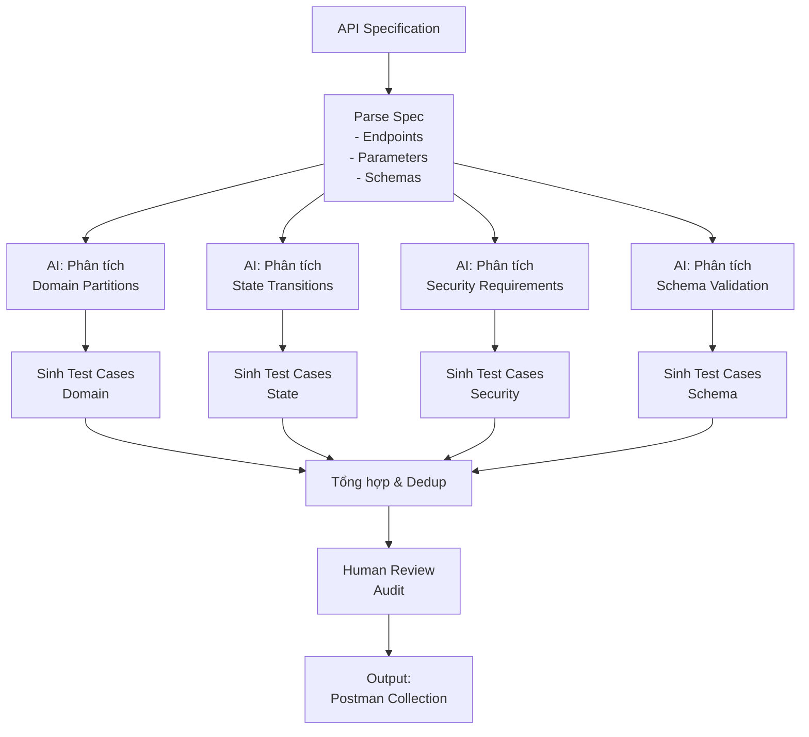

# Agent Skill – AI-driven API Test Generator

**Sinh viên:** Phan Quốc Thịnh – 23127486 – 23KTPM3  
**Bloom-AI Level:** G9.5 (Create)

---

## 1. Mô tả

*(Mô tả ngắn về ý tưởng: Agent Skill này nhận vào API specification và tự động sinh test cases, bao gồm domain partition, state transition, security, schema validation.)*

---

## 2. Sơ đồ thiết kế (Self-drawn Diagram)

> ⚠️ Lưu ý: Sơ đồ phải do sinh viên tự vẽ — không được AI sinh ra.

*(Đính kèm file ảnh sơ đồ tại đây — PNG / Mermaid)*



*(Thay bằng sơ đồ tự vẽ — ảnh PNG đính kèm)*

---

## 3. Pseudocode

```pseudocode
FUNCTION generate_api_tests(api_spec):
    # Bước 1: Parse spec
    endpoints = parse_endpoints(api_spec)
    
    FOR each endpoint IN endpoints:
        params = extract_parameters(endpoint)
        schema = extract_response_schema(endpoint)
        states = extract_state_machine(endpoint)
        
        # Bước 2: Sinh test cases theo từng kỹ thuật
        tc_domain  = ai_generate_domain_partition_tests(params)
        tc_state   = ai_generate_state_transition_tests(states)
        tc_security= ai_generate_security_tests(endpoint)
        tc_schema  = ai_generate_schema_validation_tests(schema)
        
        # Bước 3: Gộp và khử trùng
        all_tcs = merge_and_deduplicate(tc_domain, tc_state, tc_security, tc_schema)
        
        # Bước 4: Human review
        reviewed_tcs = human_audit(all_tcs)
        
        # Bước 5: Xuất ra Postman collection
        export_to_postman(reviewed_tcs)
    
    RETURN postman_collection
```

---

## 4. Cách triển khai (Implementation)

*(Mô tả cách triển khai Agent Skill — file cấu hình, script, tool sử dụng)*

| Thành phần | Công nghệ | Mô tả |
|:---|:---|:---|
| Parser | *(Python / JS / ...)* | Đọc và phân tích API spec |
| AI Engine | *(Claude / ChatGPT / ...)* | Sinh test cases |
| Output | Postman Collection JSON | Kết quả xuất ra |

---

## 5. Demo

- **Video demo:** *(YouTube link)*
- **Mô tả:** Agent tự động sinh test cases cho một API cụ thể từ spec

---

## 6. Nhận xét và hạn chế

*(Phân tích điểm mạnh và giới hạn của thiết kế này)*
