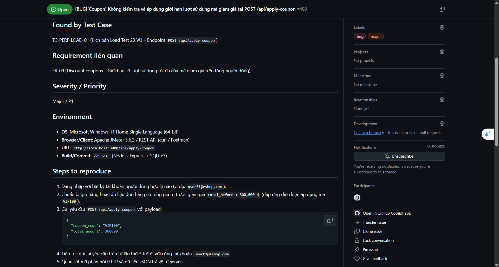
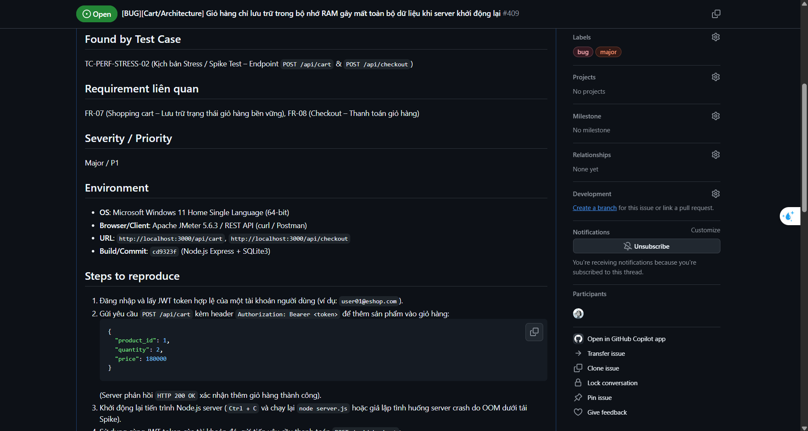

# Báo cáo lỗi (Bug Report) – HW05 Kiểm thử hiệu năng

**Sinh viên thực hiện:** Phan Quốc Thịnh  
**MSSV:** 23127486  
**Môn học:** CS423 / CSC13003 – Kiểm thử phần mềm (Định hướng AI · 2026)  
**Bài tập:** HW05 – Kiểm thử hiệu năng (Performance Testing)  
**Ngày thực hiện:** 16/08/2026

---

## 1. Tổng quan

Hai vấn đề sau đây được phát hiện trong quá trình thiết kế, thực thi và phân tích dữ liệu các kịch bản kiểm thử hiệu năng (Load, Stress, Spike). 
- **Lỗi 1 (Logic nghiệp vụ):** Được phát hiện trực tiếp từ dữ liệu log JTL khi phân tích số lượng request thực tế gửi tới endpoint áp dụng mã giảm giá (giới hạn coupon không được kiểm soát dù vượt gấp 33 lần ngưỡng cho phép với tỷ lệ lỗi 0%).
- **Lỗi 2 (Kiến trúc hệ thống):** Được phát hiện khi kiểm tra mã nguồn backend để giải thích nguyên nhân endpoint `POST /api/cart` có độ trễ (latency) thấp bất thường so với các thao tác ghi dữ liệu khác.

---

## 2. Danh sách lỗi và vấn đề hiệu năng

| STT | Tiêu đề lỗi | Phân loại | Mức độ nghiêm trọng | Endpoint liên quan | Trạng thái HTTP | Liên kết GitHub Issue |
|:---|:------------|:----------|:--------------------|:-------------------|:----------------|:----------------------|
| 1 | Không kiểm tra và áp dụng giới hạn lượt sử dụng mã giảm giá tại `POST /api/apply-coupon` | Lỗi logic (Logic Bug) | Cao (High) | `POST /api/apply-coupon` | 200 OK (Đáng lẽ phải trả về lỗi 4xx khi vượt giới hạn) | [#408](https://github.com/trngnneee/eshop-sut/issues/408) |
| 2 | Giỏ hàng chỉ lưu trữ tạm trong bộ nhớ (In-Memory) — Gây mất toàn bộ dữ liệu khi server khởi động lại dưới tải cao | Lỗi kiến trúc (Architecture Bug) | Cao (High) | `POST /api/cart`, `POST /api/checkout` | Không áp dụng | [#409](https://github.com/trngnneee/eshop-sut/issues/409) |

---

## 3. Báo cáo chi tiết từng lỗi

### Lỗi #1: Không kiểm soát giới hạn lượt dùng mã giảm giá tại `POST /api/apply-coupon`

- **Phân loại:** Lỗi logic / Vi phạm quy tắc nghiệp vụ (Business Rule Violation)
- **Mức độ nghiêm trọng:** Cao (High)
- **Endpoint liên quan:** `POST /api/apply-coupon`
- **Kịch bản phát hiện:** Phát hiện qua kịch bản **Load Test** (20 VU, 300 giây, 60 giây ramp-up).
- **Mô tả chi tiết:**  
  Mã giảm giá `VIP100` được định nghĩa trong hệ thống với giới hạn tối đa **2 lần sử dụng / người dùng** (`max_usage_per_user = 2`). Trong kịch bản Load test với 20 VU chạy liên tục trong 298 giây, log JTL ghi nhận **1,335 yêu cầu** gửi tới `POST /api/apply-coupon` từ 20 tài khoản người dùng với **tỷ lệ lỗi = 0.00%** (tất cả đều nhận phản hồi HTTP 200 OK). Theo quy tắc, 20 người dùng × tối đa 2 lần = **40 lần hợp lệ**, tuy nhiên hệ thống đã xử lý thành công **1,335 lần** (vượt ~33 lần giới hạn cho phép) mà không hề chặn hay trả về lỗi.  
  *Nguyên nhân:* Endpoint `POST /api/apply-coupon` chỉ đơn thuần tính toán số tiền giảm giá và trả về `final_amount` mà không hề thực hiện kiểm tra hay cập nhật bảng ghi nhận lịch sử sử dụng coupon (`coupon_usage`).
- **Các bước tái hiện:**  
  1. Đăng nhập với bất kỳ tài khoản người dùng nào (ví dụ: `user01@eshop.com`).
  2. Thêm sản phẩm vào giỏ hàng sao cho tổng tiền trước giảm giá `total_before > 300,000 đ`.
  3. Gửi yêu cầu `POST /api/apply-coupon` kèm body `{ "coupon_code": "VIP100", "total_amount": 360000 }` nhiều hơn 2 lần liên tiếp.
  4. Quan sát mã phản hồi và nội dung trả về từ server.
- **Kết quả kỳ vọng:**  
  Từ lần gọi thứ 3 trở đi của cùng một tài khoản, server phải từ chối và trả về mã lỗi HTTP 400 hoặc HTTP 422 kèm thông báo lỗi rõ ràng: `"Coupon usage limit exceeded"` (hoặc thông điệp tương đương).
- **Kết quả thực tế:**  
  Tất cả các lần gọi đều trả về mã **HTTP 200 OK** kèm `final_amount` đã được trừ 100,000 đ, bất kể tài khoản đó đã áp dụng coupon bao nhiêu lần trước đó. Không có bất kỳ cơ chế chặn nào tại endpoint này.
- **Bằng chứng thực nghiệm (JTL Evidence):**  
  File log JTL Load test (`23127486_Load_20260815.jtl`) — nhãn `POST /api/apply-coupon`: 1,335 mẫu request, `errorCount = 0`, `errorPct = 0.00%`. Mỗi người dùng thực hiện trung bình ~66 lần áp mã trong suốt bài test — tất cả đều thành công.
- **Liên kết GitHub Issue:** [https://github.com/trngnneee/eshop-sut/issues/408](https://github.com/trngnneee/eshop-sut/issues/408)
- **Ảnh GitHub Issue:** 

---

### Lỗi #2: Giỏ hàng chỉ lưu trữ trong bộ nhớ (In-Memory) — Nguy cơ mất trắng dữ liệu khi server restart dưới tải

- **Phân loại:** Lỗi kiến trúc hệ thống / Độ tin cậy (Architecture / Reliability)
- **Mức độ nghiêm trọng:** Cao (High)
- **Endpoint liên quan:** `POST /api/cart`, `POST /api/checkout`
- **Kịch bản phát hiện:** Phát hiện khi phân tích dữ liệu log JTL để tìm hiểu lý do endpoint `POST /api/cart` có độ trễ cực thấp (trung bình **1.5 ms** trong Load test, **2.2 ms** trong Stress test) so với các thao tác ghi dữ liệu khác như checkout (trung bình **6.9 ms** - **10.7 ms**). Kiểm tra mã nguồn `server.js` xác nhận giỏ hàng không được lưu trữ vào cơ sở dữ liệu SQLite.
- **Mô tả chi tiết:**  
  Endpoint `POST /api/cart` lưu trữ thông tin sản phẩm trực tiếp vào một đối tượng JavaScript trong bộ nhớ (`userCarts = {};` tại dòng 14 của `server.js`) thay vì lưu vào database SQLite. Điều này dẫn đến việc toàn bộ giỏ hàng của tất cả người dùng **sẽ bị mất hoàn toàn nếu tiến trình Node.js bị khởi động lại** (do crash lỗi, OOM kill dưới tải nặng, hoặc triển khai phiên bản mới).  
  Trong bối cảnh kiểm thử hiệu năng, nếu server bị quá tải dưới kịch bản Spike (100 VU đột ngột), các người dùng đang ở giữa luồng mua sắm sẽ gặp lỗi thanh toán thất bại (checkout failure) do giỏ hàng đã bị xóa trắng.
- **Các bước tái hiện:**  
  1. Gửi yêu cầu `POST /api/cart` kèm token hợp lệ để thêm sản phẩm vào giỏ hàng (nhận HTTP 200 OK).
  2. Khởi động lại tiến trình Node.js server (`Ctrl+C` và chạy lại `node server.js`).
  3. Gửi tiếp yêu cầu `POST /api/checkout` với cùng token người dùng đó.
- **Kết quả kỳ vọng:**  
  Dữ liệu giỏ hàng phải được lưu trữ bền vững (persistent) trong cơ sở dữ liệu; thao tác thanh toán vẫn thành công bình thường sau khi server khởi động lại.
- **Kết quả thực tế:**  
  Dữ liệu giỏ hàng bị xóa sạch sau khi restart. Endpoint `POST /api/checkout` sẽ thực hiện thanh toán với giỏ hàng rỗng hoặc báo lỗi. Trong điều kiện test tải, độ trễ `POST /api/cart` trung bình chỉ **1.5 ms** so với **6.9 ms** của `POST /api/checkout` (thao tác có ghi DB thực sự), chênh lệch ~4.6 lần phản ánh rõ việc không có thao tác I/O cơ sở dữ liệu.
- **Bằng chứng thực nghiệm (Code & JTL Evidence):**  
  - Mã nguồn `server.js` (dòng 14): `const userCarts = {};` — biến cấp module trong RAM, không được lưu trữ xuống đĩa.
  - Log JTL Load test: nhãn `POST /api/cart` có thời gian phản hồi trung bình **1.5 ms**, trong khi `POST /api/checkout` có thời gian phản hồi trung bình **6.9 ms**.
- **Liên kết GitHub Issue:** [https://github.com/trngnneee/eshop-sut/issues/409](https://github.com/trngnneee/eshop-sut/issues/409)
- **Ảnh GitHub Issue:** 

---

## 4. Ghi chú và bài học kinh nghiệm

1. **Lỗi #1 (Bỏ qua giới hạn coupon)** là lỗi logic nghiệp vụ nghiêm trọng có thể bị khai thác trong môi trường production: người dùng có thể áp dụng mã giảm giá vô hạn lần để trục lợi.
2. **Lỗi #2 (Giỏ hàng lưu in-memory)** là lỗi thiết kế kiến trúc làm suy giảm nghiêm trọng độ tin cậy của hệ thống dưới tải lớn.
3. Cả hai lỗi trên đều **không làm phát sinh mã lỗi HTTP 5xx hay 4xx** trong quá trình chạy kiểm thử hiệu năng (tỷ lệ lỗi vẫn đạt 0.00%). Điều này chứng minh rằng kiểm thử hiệu năng cần được kết hợp chặt chẽ với kiểm tra tính đúng đắn về mặt chức năng và rà soát mã nguồn (code audit) để phát hiện các lỗi logic tiềm ẩn.
4. Tất cả các vấn đề phát hiện đã được báo cáo chính thức lên GitHub Issues:
   - Issue #408: [https://github.com/trngnneee/eshop-sut/issues/408](https://github.com/trngnneee/eshop-sut/issues/408)
   - Issue #409: [https://github.com/trngnneee/eshop-sut/issues/409](https://github.com/trngnneee/eshop-sut/issues/409)
