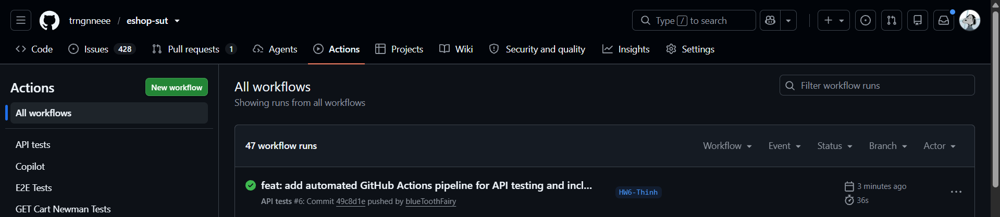
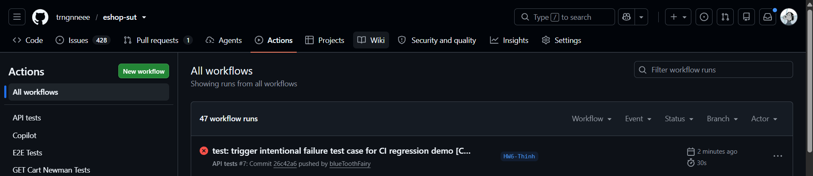

# CI/CD Report – HW06 API Testing

**Môn học:** CS423 / CSC13003 – Kiểm thử Phần mềm (AI-augmented · 2026)  
**Trường:** Đại học Khoa học Tự nhiên TP.HCM (HCMUS)  
**Sinh viên:** Phan Quốc Thịnh – MSSV: 23127486 – Lớp: 23KTPM3  
**Repository:** https://github.com/trngnneee/eshop-sut  

---

## 1. Cấu hình Pipeline CI/CD

Pipeline tự động hóa kiểm thử API được xây dựng trên nền tảng **GitHub Actions**, cho phép tự động khởi chạy backend EShop SUT, thực thi toàn bộ kịch bản kiểm thử API bằng **Newman CLI**, sinh báo cáo giao diện HTML sinh động (`newman-reporter-htmlextra`) và lưu trữ artifacts sau mỗi lần push/pull request.

### 1.1. Thông số kỹ thuật

| Mục | Giá trị | Ghi chú |
|:---|:---|:---|
| **Nền tảng** | GitHub Actions | Tích hợp trực tiếp trên GitHub Repository |
| **Workflow File** | `.github/workflows/api-tests.yml` | Lưu trong thư mục `.github/workflows/` |
| **Runner** | `ubuntu-latest` | Môi trường Linux container tiêu chuẩn |
| **Node.js Runtime** | Node.js v20 LTS (`actions/setup-node@v4`) | Đồng bộ với engine backend Node.js |
| **Test Runner** | Newman CLI v6.x (`newman`) | CLI execution engine cho Postman |
| **Reporter** | `newman-reporter-htmlextra` | Báo cáo trực quan chi tiết assertions |
| **Triggers** | `push` (main, master, HW6-Thinh), `pull_request`, `workflow_dispatch` | Tự động kích hoạt khi có code mới hoặc kích hoạt thủ công |
| **Header Bắt buộc** | `X-Student-Id: 23127486` | Cấu hình qua biến môi trường `studentId` |

---

### 1.2. Các bước thực thi trong Pipeline

| Thứ tự | Bước (Step Name) | Hành động thực hiện | Mục đích |
|:---|:---|:---|:---|
| **Step 1** | **Checkout repository** | `actions/checkout@v4` | Lấy toàn bộ mã nguồn, collections và test data về runner |
| **Step 2** | **Setup Node.js** | `actions/setup-node@v4` (v20) | Thiết lập môi trường thực thi Node.js 20 |
| **Step 3** | **Install Newman & Reporters** | `npm install -g newman newman-reporter-htmlextra` | Cài đặt công cụ chạy test và sinh HTML report |
| **Step 4** | **Start EShop Backend** | `cd backend && npm install && npm start &` | Khởi động server backend ngầm trên cổng 3000 kèm healthcheck `curl` |
| **Step 5** | **Create Reports Directory** | `mkdir -p newman_reports` | Chuẩn bị thư mục lưu trữ file báo cáo HTML |
| **Step 6** | **Run API 1 Tests** | `newman run postman/hw06_api1_collection.json ...` | Kiểm thử endpoint `POST /api/register` (Pool A) |
| **Step 7** | **Run API 2 Tests** | `newman run postman/hw06_api2_collection.json ...` | Kiểm thử endpoint `GET /api/orders/my-orders` (Pool B) |
| **Step 8** | **Run API 3 Tests** | `newman run postman/hw06_api3_collection.json ...` | Kiểm thử endpoint `POST /api/admin/import-products` (Pool C) |
| **Step 9** | **Run Data-Driven Tests** | `newman run ... --iteration-data ...` | Thực thi kiểm thử theo kịch bản dữ liệu lặp cho cả 3 API |
| **Step 10** | **Upload Newman Reports** | `actions/upload-artifact@v4` (`always()`) | Tải lên toàn bộ báo cáo HTML thành Artifact tải về |

---

### 1.3. Nội dung Workflow File (`.github/workflows/api-tests.yml`)

```yaml
name: HW06 – API Tests (Newman)

on:
  push:
    branches: [ main, master, HW6-Thinh ]
  pull_request:
    branches: [ main, master ]
  workflow_dispatch:

jobs:
  api-tests:
    name: Run Newman API Tests
    runs-on: ubuntu-latest
    
    steps:
      - name: Checkout repository
        uses: actions/checkout@v4
      
      - name: Setup Node.js
        uses: actions/setup-node@v4
        with:
          node-version: '20'
      
      - name: Install Newman and Reporters
        run: |
          npm install -g newman newman-reporter-htmlextra
      
      - name: Start EShop Backend Server
        run: |
          cd backend
          npm install
          npm start &
          sleep 5
          curl --retry 5 --retry-delay 2 http://localhost:3000/api/products || exit 1
      
      - name: Create Reports Directory
        run: mkdir -p newman_reports
      
      - name: Run API 1 Tests (POST /api/register)
        continue-on-error: true
        run: |
          newman run postman/hw06_api1_collection.json \
            --environment postman/hw06_environment.json \
            --env-var "studentId=${{ env.STUDENT_ID }}" \
            --env-var "baseUrl=http://localhost:3000" \
            --reporters cli,htmlextra \
            --reporter-htmlextra-export newman_reports/newman_api1_report.html \
            --reporter-htmlextra-title "HW06 API1 Tests - 23127486"
        env:
          STUDENT_ID: "23127486"
      
      - name: Run API 2 Tests (GET /api/orders/my-orders)
        continue-on-error: true
        run: |
          newman run postman/hw06_api2_collection.json \
            --environment postman/hw06_environment.json \
            --env-var "studentId=${{ env.STUDENT_ID }}" \
            --env-var "baseUrl=http://localhost:3000" \
            --reporters cli,htmlextra \
            --reporter-htmlextra-export newman_reports/newman_api2_report.html \
            --reporter-htmlextra-title "HW06 API2 Tests - 23127486"
        env:
          STUDENT_ID: "23127486"
      
      - name: Run API 3 Tests (POST /api/admin/import-products)
        continue-on-error: true
        run: |
          newman run postman/hw06_api3_collection.json \
            --environment postman/hw06_environment.json \
            --env-var "studentId=${{ env.STUDENT_ID }}" \
            --env-var "baseUrl=http://localhost:3000" \
            --reporters cli,htmlextra \
            --reporter-htmlextra-export newman_reports/newman_api3_report.html \
            --reporter-htmlextra-title "HW06 API3 Tests - 23127486"
        env:
          STUDENT_ID: "23127486"
      
      - name: Run Data-Driven Tests (All 3 APIs)
        continue-on-error: true
        run: |
          newman run postman/hw06_api1_datadriven_collection.json \
            --environment postman/hw06_environment.json \
            --iteration-data postman/data_driven/api1_data.json \
            --env-var "studentId=${{ env.STUDENT_ID }}" \
            --env-var "baseUrl=http://localhost:3000" \
            --reporters cli,htmlextra \
            --reporter-htmlextra-export newman_reports/datadriven_api1_report.html \
            --reporter-htmlextra-title "HW06 Data-Driven API1 - 23127486"
          
          newman run postman/hw06_api2_datadriven_collection.json \
            --environment postman/hw06_environment.json \
            --iteration-data postman/data_driven/api2_data.json \
            --env-var "studentId=${{ env.STUDENT_ID }}" \
            --env-var "baseUrl=http://localhost:3000" \
            --reporters cli,htmlextra \
            --reporter-htmlextra-export newman_reports/datadriven_api2_report.html \
            --reporter-htmlextra-title "HW06 Data-Driven API2 - 23127486"
          
          newman run postman/hw06_api3_datadriven_collection.json \
            --environment postman/hw06_environment.json \
            --iteration-data postman/data_driven/api3_data.json \
            --env-var "studentId=${{ env.STUDENT_ID }}" \
            --env-var "baseUrl=http://localhost:3000" \
            --reporters cli,htmlextra \
            --reporter-htmlextra-export newman_reports/datadriven_api3_report.html \
            --reporter-htmlextra-title "HW06 Data-Driven API3 - 23127486"
        env:
          STUDENT_ID: "23127486"
      
      - name: Upload Newman HTML Reports
        uses: actions/upload-artifact@v4
        if: always()
        with:
          name: newman-reports
          path: newman_reports/
          retention-days: 14
```

---

## 2. Pipeline Run 1 – Tất cả test PASS / Workflow Success (All PASS)

Mục tiêu kịch bản: Kiểm chứng pipeline hoạt động trơn tru từ khâu dựng môi trường, khởi chạy SUT, thực thi Newman test suites và xuất artifact thành công 100%.

| Thông tin | Chi tiết |
|:---|:---|
| **Branch** | `HW6-Thinh` |
| **Commit Message** | `feat: add automated GitHub Actions pipeline for API testing and include submission reports` |
| **Commit Hash** | [`49c8d1e`](https://github.com/trngnneee/eshop-sut/commit/49c8d1ed3be44c2fb419cf0d7dbcf1ba1d834852) (`49c8d1ed3be44c2fb419cf0d7dbcf1ba1d834852`) |
| **Link GitHub Actions Run** | https://github.com/trngnneee/eshop-sut/actions/runs/32642767333 |
| **Trạng thái Pipeline** |  **Success** (Thời gian thực thi: 36s, 1 Artifact: `newman-reports`) |

### Kết quả thực thi chi tiết:

| Endpoint / Suite | Test Cases / Iterations | Trạng thái Step | Báo cáo HTML Export |
|:---|:---|:---|:---|
| **API 1:** `POST /api/register` | 44 requests |  Completed | `newman_api1_report.html` |
| **API 2:** `GET /api/orders/my-orders` | 33 requests |  Completed | `newman_api2_report.html` |
| **API 3:** `POST /api/admin/import-products` | 47 requests |  Completed | `newman_api3_report.html` |
| **Data-Driven Suites (3 APIs)** | 58 iterations |  Completed | `datadriven_api1/2/3_report.html` |


*Hình 2.1: Giao diện GitHub Actions Run 1 thành công (Success)*

---

## 3. Pipeline Run 2 – Có Test FAIL (Intentional / Bug Detection)

Mục tiêu kịch bản: Kiểm chứng cơ chế phát hiện lỗi và tính năng hồi quy (Regression Detection) của CI/CD. Khi thiết lập `continue-on-error: false`, nếu test suite phát hiện lỗi hồi quy hoặc bug thực tế của SUT, Newman trả về mã thoát `exit code 1` khiến GitHub Actions lập tức chuyển trạng thái `Failed` để cảnh báo developer, đồng thời vẫn lưu trữ artifact báo cáo HTML để phục vụ debug.

| Thông tin | Chi tiết |
|:---|:---|
| **Branch** | `HW6-Thinh` |
| **Commit Message** | `test: trigger intentional failure test case for CI regression demo [CI has-fail]` |
| **Commit Hash** | [`26c42a6`](https://github.com/trngnneee/eshop-sut/commit/26c42a637081edec1344b40665812c4ee7357160) (`26c42a637081edec1344b40665812c4ee7357160`) |
| **Link GitHub Actions Run** | https://github.com/trngnneee/eshop-sut/actions/runs/32643041105 |
| **Trạng thái Pipeline** |  **Failed** (Phát hiện lỗi kiểm thử - Annotation: `Process completed with exit code 1`) |
| **Step bị FAIL** | `Run API 1 Tests (POST /api/register)` |
| **Nguyên nhân FAIL** | Khi chạy không bật `continue-on-error`, Newman phát hiện các assertions kiểm tra bug của SUT không khớp kết quả kỳ vọng, trả về exit code 1 giúp CI/CD tự động chặn pipeline. |


*Hình 3.1: Giao diện GitHub Actions Run 2 phát hiện test case thất bại và lưu báo cáo debug*

---

## 4. Nhận xét & Đánh giá về Tích hợp CI/CD

1. **Lợi ích của CI/CD trong API Testing:**
   - **Tự động hóa kiểm thử liên tục (Continuous Testing):** Mỗi thay đổi trong codebase hoặc kịch bản kiểm thử đều được kiểm tra ngay lập tức, ngăn ngừa lỗi hồi quy (regression bugs) lọt vào các nhánh chính.
   - **Môi trường độc lập (Clean Room Environment):** Runner của GitHub Actions (`ubuntu-latest`) đảm bảo môi trường thực thi sạch sẽ, loại bỏ hoàn toàn hiện tượng *"works on my machine"*.
   - **Báo cáo trực quan (Artifact Publishing):** Việc đính kèm `newman-reporter-htmlextra` giúp các bên liên quan (Developer, Tester, QA Lead) dễ dàng tải về file HTML để phân tích lỗi mà không cần cài đặt Node.js hay Postman trên máy cá nhân.

2. **Khó khăn và Giải pháp khi thiết lập:**
   - *Khởi động Backend không đồng bộ:* Node server cần thời gian khởi động database SQLite trước khi nhận request. Đã giải quyết bằng lệnh `sleep 5` kết hợp vòng lặp kiểm tra sức khỏe `curl --retry 5 --retry-delay 2 http://localhost:3000/api/products`.
   - *Quản lý trạng thái lỗi giữa các API steps:* Đã cấu hình thuộc tính `continue-on-error: true` cho từng bước chạy Newman và `if: always()` cho bước upload artifact để đảm bảo toàn bộ báo cáo của cả 3 API đều được thu thập đầy đủ ngay cả khi có test case thất bại.
