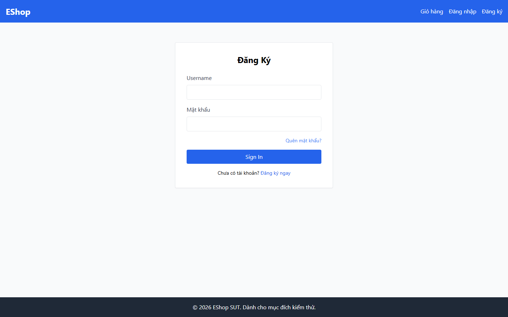
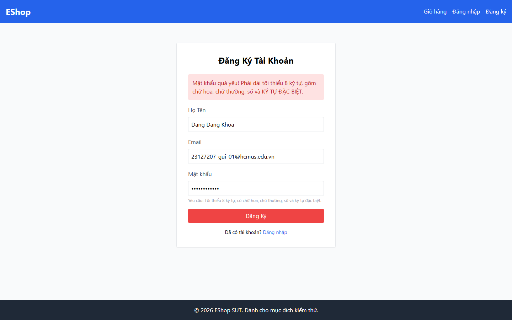
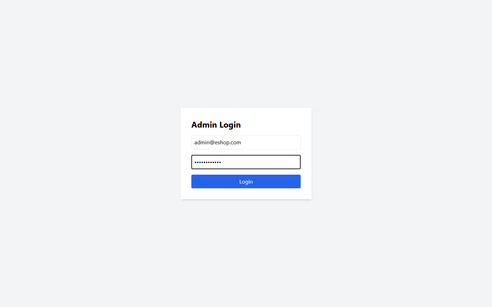
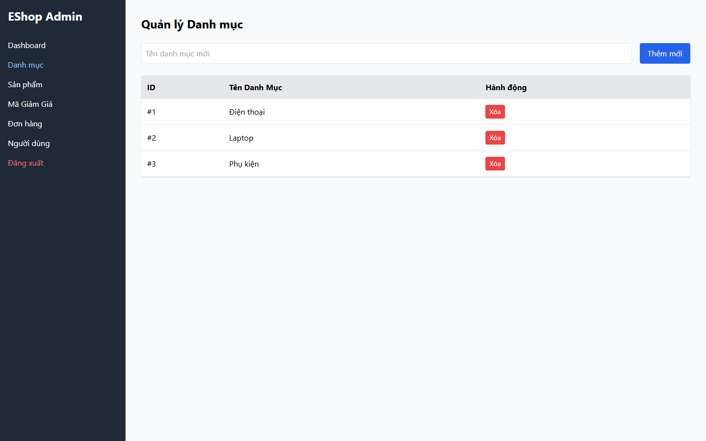
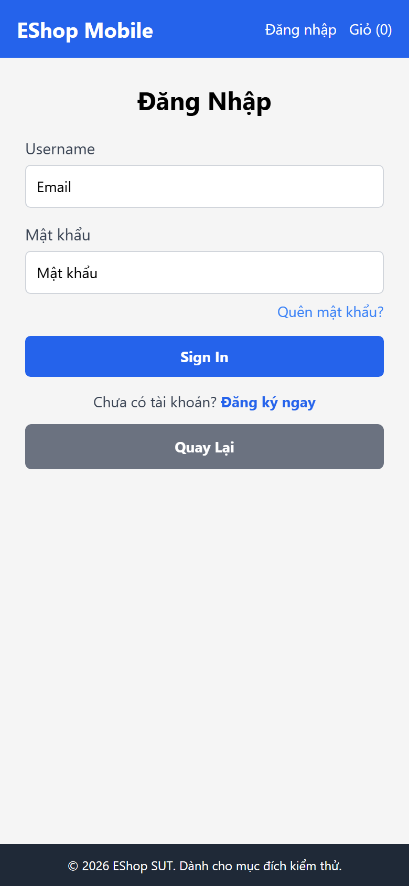

# GUI Bug Report — HW03 EShop System

**Tester:** Đặng Đăng Khoa (MSSV: 23127207)  
**Environment:** Windows 11 64-bit, Chrome 122 / Playwright Chromium, Viewports 1440x900 & 390x844  
**Backend API:** http://localhost:3000 | **Frontend Web:** http://localhost:5173 | **Admin:** http://localhost:5174 | **Mobile:** http://localhost:8081  

---  

## BUG-GUI-01 — Web Login Page UI & Accessibility Defect Pack

- **Related Requirement:** FR-02 (Login & Account Lockout)  
- **Platform:** Web Frontend  
- **Screen / Route:** /login  
- **Severity:** High | **Priority:** High  
- **GitHub Traceability Status:** PENDING_EXTERNAL_ACTION  
- **GitHub Issue File:** `github-issues/BUG-GUI-01.md`  
- **Related Checklist Items:** GUI-WEB-LOGIN-001, GUI-WEB-LOGIN-002, GUI-WEB-LOGIN-003, GUI-WEB-LOGIN-007, GUI-WEB-LOGIN-009, GUI-WEB-LOGIN-010, GUI-WEB-LOGIN-011  

### Preconditions & Test Data
- SUT Backend và Frontend đang khởi chạy thành công.
- Tài khoản test sinh viên: `23127207_gui_01@hcmus.edu.vn` / `Password123!`.

### Steps to Reproduce
1. Mở trình duyệt truy cập http://localhost:5173/login
2. Quan sát tiêu đề trang H2, nhãn label của ô nhập email, và gõ mật khẩu vào ô Password.
3. Nhấn phím Tab để kiểm tra thứ tự di chuyển con trỏ focus.
4. Bấm vào link 'Quên mật khẩu?'.

### Expected Result
- Tiêu đề H2 ghi 'Đăng Nhập'
- Nhãn ghi 'Email', type='email'
- Ô mật khẩu type='password' (che ký tự)
- Link Quên mật khẩu dùng React Router Link không reload trang
- Nút có nhãn tiếng Việt 'Đăng nhập'

### Actual Result
- Tiêu đề H2 ghi 'Đăng Ký'
- Nhãn ghi 'Username', type='text'
- Ô mật khẩu type='text' (hiển thị rõ mật khẩu bằng văn bản trần)
- Link Quên mật khẩu dùng <a> làm reload toàn trang
- Nút có nhãn 'Sign In' và hardcoded tabIndex={1}

### Evidence Screenshot

---

## BUG-GUI-02 — Web Registration Form Validation Regex & Styling Mismatch

- **Related Requirement:** FR-01 (Account Registration)  
- **Platform:** Web Frontend  
- **Screen / Route:** /register  
- **Severity:** High | **Priority:** High  
- **GitHub Traceability Status:** PENDING_EXTERNAL_ACTION  
- **GitHub Issue File:** `github-issues/BUG-GUI-02.md`  
- **Related Checklist Items:** GUI-WEB-REGISTER-002, GUI-WEB-REGISTER-004, GUI-WEB-REGISTER-008  

### Preconditions & Test Data
- SUT Backend và Frontend đang khởi chạy thành công.
- Tài khoản test sinh viên: `23127207_gui_01@hcmus.edu.vn` / `Password123!`.

### Steps to Reproduce
1. Truy cập http://localhost:5173/register
2. Nhập Họ Tên, Email '23127207_gui_01@hcmus.edu.vn'
3. Nhập mật khẩu hợp lệ chứa ký tự đặc biệt 'Password123!' theo đúng gợi ý bên dưới form.
4. Bấm nút 'Đăng Ký'.

### Expected Result
Form chấp nhận mật khẩu hợp lệ 'Password123!', tiến hành gọi API đăng ký tài khoản thành công.

### Actual Result
Form báo lỗi 'Mật khẩu quá yếu!' do regex frontend (flawedStrongPasswordRegex) bắt buộc chứa dấu khoảng trắng (\s) thay vì ký tự đặc biệt. Đồng thời trường email có type='text' và nút Đăng Ký có màu đỏ bg-red-500 bất đồng nhất.

### Evidence Screenshot

---

## BUG-GUI-03 — Admin Login Accessibility Defect & Browser Native Alert Popup Use

- **Related Requirement:** FR-12 (Access Control)  
- **Platform:** Web Admin  
- **Screen / Route:** / (Unauthenticated State)  
- **Severity:** Medium | **Priority:** Medium  
- **GitHub Traceability Status:** PENDING_EXTERNAL_ACTION  
- **GitHub Issue File:** `github-issues/BUG-GUI-03.md`  
- **Related Checklist Items:** GUI-ADMIN-LOGIN-002, GUI-ADMIN-LOGIN-003, GUI-ADMIN-LOGIN-004  

### Preconditions & Test Data
- SUT Backend và Frontend đang khởi chạy thành công.
- Tài khoản test sinh viên: `23127207_gui_01@hcmus.edu.vn` / `Password123!`.

### Steps to Reproduce
1. Truy cập http://localhost:5174/
2. Kiểm tra mã HTML của các ô input email và password.
3. Nhập email/mật khẩu sai và bấm 'Login'.

### Expected Result
- Các ô input có thẻ <label> đi kèm cho accessibility.
- Báo lỗi đăng nhập hiển thị dạng banner màu đỏ inline bên trong form.

### Actual Result
- Thiếu hoàn toàn thẻ <label> (chỉ dùng placeholder).
- Khi đăng nhập sai hoặc không có quyền Admin, SUT bật cửa sổ popup alert() native của trình duyệt gây ngắt đoạn trải nghiệm.

### Evidence Screenshot

---

## BUG-GUI-04 — Admin Category CRUD Missing Features & Missing Delete Confirmation

- **Related Requirement:** FR-14 (Category Management CRUD)  
- **Platform:** Web Admin  
- **Screen / Route:** / (Tab categories)  
- **Severity:** High | **Priority:** High  
- **GitHub Traceability Status:** PENDING_EXTERNAL_ACTION  
- **GitHub Issue File:** `github-issues/BUG-GUI-04.md`  
- **Related Checklist Items:** GUI-ADMIN-CATEGORY-004, GUI-ADMIN-CATEGORY-005, GUI-ADMIN-CATEGORY-006, GUI-ADMIN-CATEGORY-008, GUI-ADMIN-CATEGORY-009, GUI-ADMIN-CATEGORY-010, GUI-ADMIN-CATEGORY-013  

### Preconditions & Test Data
- SUT Backend và Frontend đang khởi chạy thành công.
- Tài khoản test sinh viên: `23127207_gui_01@hcmus.edu.vn` / `Password123!`.

### Steps to Reproduce
1. Đăng nhập Admin và chuyển sang tab 'Danh mục'.
2. Tìm nút 'Sửa' (Edit) trên từng dòng danh mục.
3. Nhấn nút 'Xóa' trên một danh mục.
4. Để trống ô tên danh mục mới và nhấn 'Thêm mới'.

### Expected Result
- Có nút 'Sửa' để chỉnh sửa tên danh mục.
- Nhấn 'Xóa' hiển thị modal xác nhận 'Bạn có chắc chắn muốn xóa?'.
- Tên danh mục rỗng bị chặn ngay tại client-side.

### Actual Result
- Hoàn toàn KHÔNG CÓ nút Sửa hay modal chỉnh sửa danh mục nào trên UI.
- Nhấn nút 'Xóa' lập tức kích hoạt API delete mà KHÔNG hỏi xác nhận.
- Tên danh mục rỗng gửi API gây bật popup alert() từ backend.

### Evidence Screenshot

---

## BUG-GUI-05 — Mobile Login Label & Submit Button Language Inconsistency

- **Related Requirement:** FR-02 (Mobile Authentication)  
- **Platform:** Mobile App  
- **Screen / Route:** Screen Login  
- **Severity:** Low | **Priority:** Low  
- **GitHub Traceability Status:** PENDING_EXTERNAL_ACTION  
- **GitHub Issue File:** `github-issues/BUG-GUI-05.md`  
- **Related Checklist Items:** GUI-MOBILE-LOGIN-002, GUI-MOBILE-LOGIN-004  

### Preconditions & Test Data
- SUT Backend và Frontend đang khởi chạy thành công.
- Tài khoản test sinh viên: `23127207_gui_01@hcmus.edu.vn` / `Password123!`.

### Steps to Reproduce
1. Khởi chạy App Mobile trên Expo/Emulator/Trình duyệt.
2. Chuyển tới màn hình Đăng Nhập.
3. Quan sát nhãn phía trên ô Email và tên ghi trên nút submit Đăng nhập.

### Expected Result
- Nhãn phía trên ô email ghi 'Email'
- Nút đăng nhập ghi tiếng Việt 'Đăng nhập'

### Actual Result
- Nhãn phía trên ô ghi 'Username' (trong khi placeholder bên trong ghi 'Email')
- Nút đăng nhập ghi tiếng Anh 'Sign In' lẫn lộn tiếng Việt

### Evidence Screenshot

---

