# TEST SUMMARY REPORT — HỆ THỐNG ESHOP

**Báo cáo tổng kết kiểm thử cấp nhóm — 5 thành viên × 4 bài tập (HW02 → HW05)**

---

## THÔNG TIN TÀI LIỆU (Document Control)

| Mục | Nội dung |
|---|---|
| **Tên dự án** | EShop — Phiên bản dành cho Kiểm thử Phần mềm |
| **Hệ thống được kiểm thử (SUT)** | EShop (Backend API + Frontend Web + Web Admin + Mobile App) |
| **Repository** | https://github.com/trngnneee/eshop-sut |
| **Học phần** | Kiểm thử Phần mềm (Software Testing) — CS423 / CSC13003, FIT@HCMUS |
| **Phạm vi** | 4 bài tập lớn × 5 thành viên = **20 gói kiểm thử độc lập** |
| **Giai đoạn kiểm thử** | 25/06/2026 – 17/08/2026 |
| **Ngày phát hành** | 17/08/2026 |
| **Phiên bản** | 1.0 |
| **Loại tài liệu** | Báo cáo gộp cấp nhóm — hợp nhất 4 báo cáo cá nhân thành một cổng chất lượng duy nhất |
| **Quyết định phát hành** | ⛔ **NO-GO** — thống nhất bởi cả 5 thành viên một cách độc lập |

### Thành viên và phạm vi branch

| # | Thành viên | MSSV | HW02 | HW03 | HW04 | HW05 |
|---|---|---|---|---|---|---|
| 1 | **Đặng Đăng Khoa** | `23127207` | `HW2-Khoa` | `HW3-Khoa` | `HW4-Khoa` | `HW5` |
| 2 | **Đặng Trường Nguyên** | `23127438` | `HW2-Nguyen` | `HW3-Nguyen` | `HW04-Nguyen` | `feat/HW05-Nguyen` |
| 3 | **Nguyễn Thanh Gia Bảo** | `23127158` | `HW2-Bao` | `HW3-Bao` | `HW4-Bao` | `HW5-Bao` |
| 4 | **Võ Ngọc Bích Trâm** | `23127271` | `HW2-Tram` | `HW3-Tram` | `HW4-Tram` | `HW5-Tram` |
| 5 | **Phan Quốc Thịnh** | `23127486` | `HW2-Thinh` | `HW3-Thinh` | `HW4-Thinh` | `HW5-Thinh` |

Ngoài 4 bài tập chính, nhóm còn có các gói bổ trợ: **MiniHW6 API Testing** và **FR-12 Decision Table / Pairwise** (Trâm), **Database Testing mini-lab** (Khoa).

### Tài liệu nguồn

Báo cáo này hợp nhất 4 báo cáo cá nhân trong cùng thư mục. Các báo cáo đó **vẫn là bộ chứng cứ gốc** và không bị thay thế:

| Tài liệu nguồn | Bao phủ |
|---|---|
| `EShop_Test_Summary_Report_HW02-HW05.md` | Khoa (23127207) + Nguyên (23127438) |
| `23127158-test-summary-report.md` | Bảo (23127158) |
| `23127271_Test_Summary_Report.md` | Trâm (23127271) |
| `23127486-test-summary-report.md` | Thịnh (23127486) |

> **Nguyên tắc biên soạn.** Mọi con số được trích trực tiếp từ 4 báo cáo nguồn. Tài liệu này **không tính lại,
> không ước lượng, không hòa giải** các số liệu mâu thuẫn giữa các nguồn. Nơi 5 thành viên dùng đơn vị đo hoặc
> thang mức độ khác nhau, sự khác biệt được **nêu rõ** thay vì bị làm phẳng để ra một con số đẹp — xem mục 4.7.

---

## 1. MỤC ĐÍCH TÀI LIỆU (Purpose of the Document)

Tài liệu này là **cổng chất lượng (quality gate) cấp nhóm** cho hệ thống EShop, hợp nhất kết quả của 20 gói
kiểm thử độc lập do 5 thành viên thực hiện trong 8 tuần. Mục tiêu:

1. **Trả lời một câu hỏi mà không báo cáo cá nhân nào trả lời được**: sau khi 5 người kiểm thử cùng một hệ
   thống theo 5 phạm vi khác nhau, EShop có đủ điều kiện phát hành hay không?
2. **Hợp nhất độ phủ**: mỗi thành viên chỉ phủ 3–6 yêu cầu chức năng; gộp lại nhóm phủ khoảng **20 FR** trên
   cả 4 thành phần hệ thống. Bức tranh độ phủ này chỉ nhìn thấy được ở cấp nhóm.
3. **Phát hiện lỗi được xác nhận chéo**: một lỗi được 3–4 thành viên phát hiện độc lập, trên máy khác nhau,
   bằng kỹ thuật khác nhau, có sức nặng bằng chứng cao hơn hẳn một lỗi chỉ một người thấy. Mục 4.5 liệt kê 12
   nhóm lỗi như vậy.
4. **Chuẩn hóa để so sánh được**: 5 báo cáo dùng 5 đơn vị đếm và ít nhất 4 thang mức độ nghiêm trọng khác
   nhau. Tài liệu này quy về đơn vị chung ở nơi quy được, và chỉ ra rõ nơi **không** quy được.

**Đối tượng đọc:** giảng viên chấm bài, trợ giảng, các thành viên trong nhóm, và bất kỳ ai tiếp nhận lại
công việc kiểm thử trên EShop.

**Tài liệu này _không_ thay thế** các báo cáo cá nhân và các gói chứng cứ (checklist, file `.jtl`, Playwright
HTML report, bản ghi phiên usability, ảnh chụp màn hình). Đó vẫn là nơi lưu bằng chứng gốc.

---

## 2. TỔNG QUAN ỨNG DỤNG (Application Overview)

EShop là nền tảng thương mại điện tử được xây dựng **có chủ đích cài lỗi** phục vụ mục đích học kiểm thử.
Sinh viên dùng tài liệu đặc tả (`README.md` ở gốc repo) làm cơ sở thiết kế test case, rồi kiểm thử hệ thống
thực để tìm các điểm triển khai không tuân thủ đặc tả.

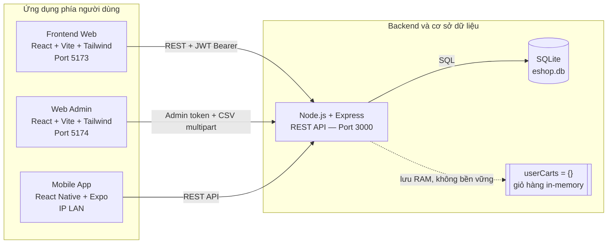

### 2.1 Bốn thành phần

| Thành phần | Công nghệ | URL mặc định | Vai trò |
|---|---|---|---|
| **Backend API** | Node.js + Express + SQLite | `http://localhost:3000` | Toàn bộ nghiệp vụ: xác thực, sản phẩm, giỏ hàng, coupon, đơn hàng, quản trị |
| **Frontend Web** | React + Vite + Tailwind CSS | `http://localhost:5173` | Đăng ký/đăng nhập, duyệt & tìm sản phẩm, giỏ hàng, thanh toán, hồ sơ |
| **Web Admin** | React + Vite + Tailwind CSS | `http://localhost:5174` | Dashboard, danh mục, sản phẩm, đơn hàng, người dùng, import CSV |
| **Mobile App** | React Native + Expo | IP LAN của máy chủ | Danh sách sản phẩm, giỏ hàng, thanh toán, hồ sơ, lịch sử đơn |

### 2.2 Tài khoản mặc định

- Admin: `admin@eshop.com` / `Admin123!`
- User test: `test@eshop.com` / `Test1234!`

---

## 3. PHẠM VI KIỂM THỬ (Testing Scope)

### 3.1 Trong phạm vi — độ phủ hợp nhất của nhóm

Năm thành viên chia phạm vi để **không trùng yêu cầu chức năng và không trùng workflow hiệu năng**. Gộp lại,
nhóm phủ khoảng **20 yêu cầu chức năng** trên cả 4 thành phần:

| Yêu cầu chức năng | Khoa | Nguyên | Bảo | Trâm | Thịnh |
|---|:---:|:---:|:---:|:---:|:---:|
| FR-01 Đăng ký tài khoản | | | | | ✅ HW02, HW04 |
| FR-02 Đăng nhập & khóa tài khoản | ✅ HW02, HW04 | ✅ HW04 | | | ✅ HW02 |
| FR-03 Quên mật khẩu (Web + Mobile) | | | ✅ HW02 | ✅ HW02, HW03, HW04 | |
| FR-04 Quản lý hồ sơ | | ✅ HW02 | | | |
| FR-05 Danh sách & tìm kiếm sản phẩm | | | ✅ HW02, HW04 | | |
| FR-07 Giỏ hàng | ✅ HW02, HW04 | | | | |
| FR-08 Thanh toán | | | | ✅ HW02, HW04 | |
| FR-09 Mã giảm giá | | ✅ HW02, HW04 | | | ✅ HW02, HW04 |
| FR-10 Vòng đời đơn hàng | | ✅ HW02 | ✅ HW02 | ✅ HW03 | |
| FR-11 Lịch sử đơn hàng | | | ✅ HW04 | | |
| FR-12 Kiểm soát truy cập | | | | ✅ DTT/Pairwise | |
| FR-13 Dashboard quản trị | ✅ HW02, HW04 | | | | |
| FR-14 Quản lý danh mục | | ✅ HW04 | | | |
| FR-15 Quản lý sản phẩm admin | | | | ✅ HW02, HW04 | |
| FR-16 Import sản phẩm từ CSV | | | | | ✅ HW02, HW03, HW04 |
| FR-18 Quản lý đơn hàng admin | | ✅ HW02 | | | |
| FR-19 Quản lý người dùng admin | | | ✅ HW04 | | |
| FR-20 Danh sách sản phẩm mobile | | ✅ HW02 | | | |
| FR-21 Giỏ hàng & thanh toán mobile | ✅ HW02 | | | | |
| FR-26 Hồ sơ cá nhân mobile | | | | | ✅ HW02 |

### 3.2 Năm workflow hiệu năng — không trùng nhau

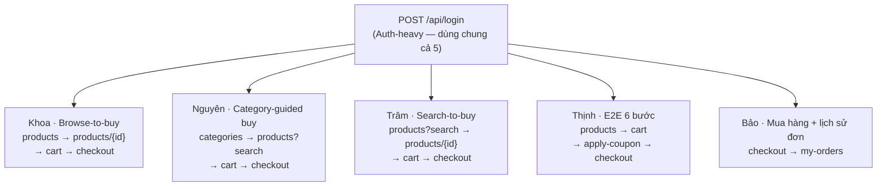

Việc 5 workflow không trùng nhau là kết quả của phân công có chủ đích: mỗi endpoint chịu tải trong ít nhất
một kịch bản, và mỗi thành viên đo được một mặt khác nhau của cùng một backend.

### 3.3 Ngoài phạm vi (Out of Scope)

- **Kiểm thử xâm nhập (penetration testing)** có phương pháp. Các lỗ hổng bảo mật ghi nhận được là **hệ quả**
  của kiểm thử chức năng/hiệu năng, không phải kết quả của một đợt pentest chuyên dụng.
- **Triển khai và kiểm thử trên production**. Toàn bộ công việc chạy trên máy cá nhân (`localhost`); riêng
  Trâm dùng thêm một bản triển khai Render cho HW03 Task 3.
- **Cổng thanh toán và dịch vụ bên thứ ba** (VNPay/Stripe 3D-Secure, SMS OTP) — dùng stub/mock.
- **HW01** (nghiên cứu thị trường QA, kiểm thử sản phẩm vật lý) — không thuộc EShop.
- **Kiểm thử tải hạ tầng ngoài SUT** (CDN, load balancer, reverse proxy) — hệ thống chỉ có 1 process Node.
- **Kiểm thử migration cơ sở dữ liệu** — `database.js` xóa và seed lại toàn bộ DB mỗi lần khởi động nên không
  có kịch bản migration để kiểm thử.

### 3.4 Các hạng mục chưa kiểm thử được (Items Not Tested)

| Hạng mục | Thuộc về | Quy mô | Lý do |
|---|---|---|---|
| 89 test case HW02 chưa thực thi | Khoa | FR-02: 50 · FR-21: 39 | Hết thời lượng bài tập; FR-21 cần thiết bị mobile ổn định |
| 35 test case UI FR-15 | Trâm | 35 TC | Form đăng nhập Admin chặn thực thi UI (Issue #184); đã kiểm tra bù bằng review code/API |
| 4 test case GUI thủ công | Trâm | TC-GUI-003, 005, 006, 007 | Đã thiết kế nhưng chưa chạy |
| Bàn phím mềm native Android | Khoa | 1 checklist item | Chỉ chạy được qua Expo Web trên trình duyệt desktop |
| Safari thật (macOS/iOS) | Khoa, Nguyên, Trâm, Thịnh | 1/3 platform | Playwright cung cấp bản build **WebKit** — cùng engine `AppleWebKit/605.1.15` nhưng **không phải** `Safari.app` |
| Thiết bị Android vật lý | Cả nhóm | — | Chỉ có Pixel emulation / Expo Go / Expo Web |
| Pilot session + probe responses | Khoa | 1 pilot + 7 bộ probe | Không thu thập được từ người tham gia |
| Kiểm thử usability | Nguyên | — | HW03 của Nguyên chỉ gồm GUI checklist và cross-platform |
| Khóa tài khoản dưới tải | Trâm | — | Kịch bản HW05 chỉ dùng mật khẩu **hợp lệ** nên Stress đo checkout, không đo FR-02 |
| Điểm gãy thật của SUT | Nguyên, Thịnh | > 200 VU | Nút cổ chai là think-time và khả năng sinh thread của JMeter trên 1 máy, không phải SUT |
| Truy vấn SQL-injection do AI đề xuất (`AI-07`) | Trâm | 1 iteration MiniHW6 | Human audit loại khỏi bộ 5 iteration Newman |
| Trạng thái sửa lỗi sau khi issue được mở | Cả nhóm | Toàn bộ | **Không có chu kỳ fix → retest nào** trong học phần; các bài sau *phát hiện lại* lỗi cũ thay vì xác nhận đã đóng |

> Mục 3.4 tồn tại để người đọc **không** mặc định rằng mọi FR trong đặc tả đều đã được kiểm thử đầy đủ. Độ phủ
> là **theo phạm vi từng bài tập**, tích lũy dần qua học kỳ.

---

## 4. SỐ LIỆU KIỂM THỬ (Metrics)

> **Cảnh báo về phép cộng.** Các bài tập **chồng lấn** trên cùng một tính năng (FR-09 được thiết kế ở HW02,
> kiểm ở HW03 và tự động hóa ở HW04). Vì vậy số liệu được báo cáo **theo từng bài tập**, rồi mới tổng hợp.
> Không được cộng cột Pass/Fail xuyên các bài tập để tuyên bố một tổng test case duy nhất.

### 4.1 HW02 — Kiểm thử thủ công (Domain, BVA, Decision Table, State Transition, Use Case)

| Thành viên | Thiết kế | Đã thực thi | Passed | Failed | Blocked / chưa chạy | Tỉ lệ pass |
|---|---:|---:|---:|---:|---:|---:|
| Khoa (23127207) | 259 | 170 | 84 | 86 | 89 | 49.4% |
| Nguyên (23127438) | 150 | 150 | 118 | 32 | 0 | 78.7% |
| Bảo (23127158) | 118 | 118 | 73 | 45 | 0 | 61.9% |
| Trâm (23127271) | 184 | 145 | 24 | 121 | 39 | 16.6% |
| Thịnh (23127486) | 125 | 125 | 10 | 115 | 0 | 8.0% |
| **Tổng nhóm** | **836** | **708** | **309** | **399** | **128** | **43.6%** |

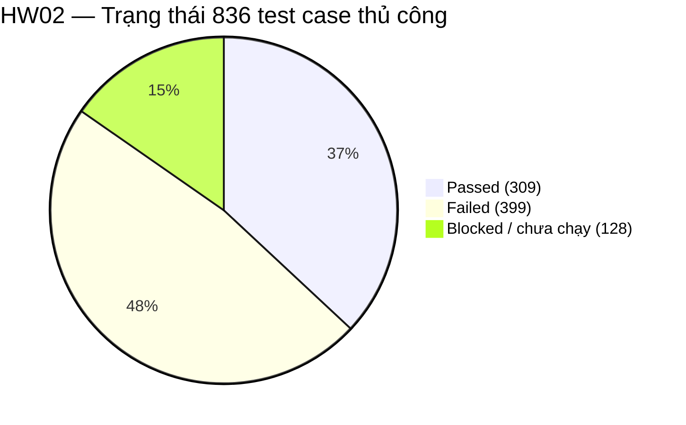

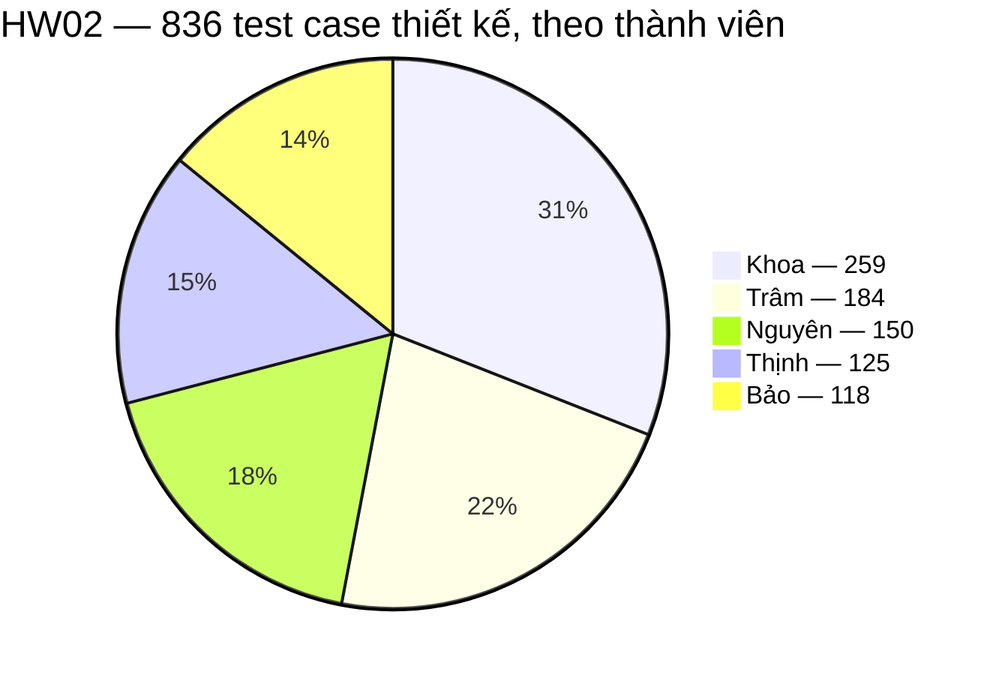

**Chênh lệch tỉ lệ pass 8.0% – 78.7% không phản ánh chất lượng bộ test.** Nó phản ánh mức độ nghiêm ngặt của
oracle và mức độ hỏng của tính năng được phân công: Thịnh phủ FR-01/FR-16/FR-26 (đăng ký, import CSV, hồ sơ
mobile — ba vùng gần như không có validation phía server) nên gần như mọi test case đều fail đúng kỳ vọng;
Nguyên phủ FR-10/FR-18 (máy trạng thái đơn hàng — vùng được triển khai tương đối đúng đặc tả).

### 4.2 HW03 — GUI checklist, Usability, Cross-platform

#### 4.2.1 GUI checklist

| Thành viên | Số item | Passed | Failed | Blocked | Tỉ lệ pass (trên tổng item) |
|---|---:|---:|---:|---:|---:|
| Khoa | 58 | 37 | 20 | 1 | 63.8% |
| Nguyên | 66 | 9 | 57 | 0 | 13.6% |
| Bảo | 52 | 31 | 21 | 0 | 59.6% |
| Trâm | 54 | 36 | 17 | 1 | 66.7% |
| Thịnh | 41 | 32 | 9 | 0 | 78.0% |
| **Tổng nhóm** | **271** | **145** | **124** | **2** | **53.5%** |

> **Về cách tính tỉ lệ pass.** Cột trên tính đồng nhất `Passed / tổng item` cho cả 5 thành viên. Báo cáo gốc
> của Trâm ghi **67.9%** vì tính `36/53` — loại item bị Blocked khỏi mẫu số. Cả hai cách đều hợp lệ; ở đây
> chọn một công thức duy nhất để 5 con số so sánh được với nhau.

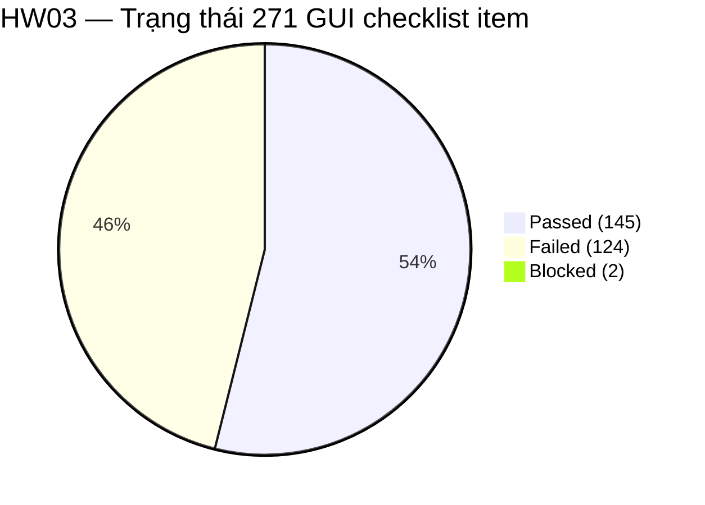

Trâm còn có 10 test case GUI thủ công bổ trợ (6 đã chạy, 0 pass / 6 fail, 4 chưa chạy).

#### 4.2.2 Usability — 4 nghiên cứu độc lập trên 4 luồng khác nhau

| Thành viên | Số người tham gia | Luồng được đánh giá | SUS | Chỉ số khác |
|---|---:|---|---:|---|
| Khoa | 7 | Đăng ký → đăng nhập → cập nhật hồ sơ → xác minh → đăng xuất | **76.79** | 0/7 hoàn thành đủ SC1–SC5; trung vị 80 s |
| Trâm | 7 + 1 pilot | UF-01 Quản lý đơn hàng admin | **69.3** | 6/7 hoàn thành; SEQ 5.29/7; trung vị ~68 s |
| Thịnh | 7 (5 IT + 2 non-IT) | Admin import CSV | **67.8** | 7 điểm nghẽn; cao nhất 85.0, thấp nhất 50.0 |
| Bảo | 7 | Luồng mua hàng | **50.4** | Grade F / Poor |
| Nguyên | — | — | — | Không thực hiện usability |
| **Tổng** | **28 người (+1 pilot)** | 4 luồng khác nhau | ⚠️ **không trung bình được** | |

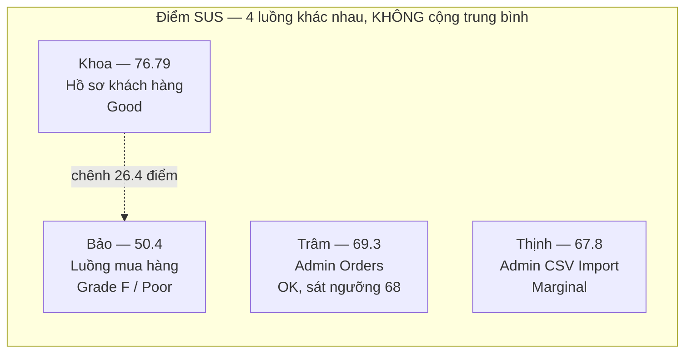

> ⚠️ **Không tính SUS trung bình của nhóm.** Bốn điểm số đo **bốn luồng khác nhau** với bốn nhóm người tham gia
> khác nhau. Một con số "SUS nhóm = 66.07" sẽ vô nghĩa về mặt phương pháp. Điều đọc được từ 4 con số này là:
> chất lượng trải nghiệm **rất không đồng đều giữa các màn hình** — hồ sơ khách hàng ở mức Good (76.79) trong
> khi luồng mua hàng ở mức Poor (50.4), chênh 26.4 điểm trên cùng một sản phẩm.

#### 4.2.3 Cross-platform / Cross-browser

| Thành viên | Quy mô | Kết quả |
|---|---|---|
| Khoa | 58 item × 4 môi trường = **232 lượt** | 37 Pass / 20 Fail / 1 Not-Observable mỗi môi trường |
| Nguyên | 66 item × 3 platform = **198 lượt** | P1 Chromium 7/59 · P2 Firefox 6/60 · P3 WebKit 6/60 |
| Trâm | 8 màn × 3 engine = **24 lượt** | 21 desktop Pass · 3 fail ở viewport 390×844 trên **cả 3 engine** |
| Bảo | Không công bố số lượt | Kiểm tra một số màn hình/luồng trên trình duyệt và mobile |
| Thịnh | Không công bố số lượt | Chrome 127, Firefox 127, Expo Go |
| **Tổng đã lượng hóa** | **454 lượt** | 3/5 thành viên công bố con số cụ thể |

Phát hiện có giá trị nhất ở đây là **XP-01** của Nguyên: cùng một build, cùng một DOM, thông báo `required`
cho ra ba kết quả khác nhau trên ba engine (Chromium "Vui lòng điền vào trường này." → Pass; Firefox
"Please fill out this field." → Fail; WebKit "Fill out this field" → Fail). Đây là lỗi **phụ thuộc trình
duyệt**, không phải lỗi ứng dụng — và chỉ lộ ra khi chạy đủ 3 engine.

### 4.3 HW04 — Tự động hóa (Playwright, 3 browser)

| Thành viên | TC duy nhất | Lượt chạy | Passed (lượt) | Failed (lượt) | Tỉ lệ pass | Bug |
|---|---:|---:|---:|---:|---:|---:|
| Khoa | 400 | 1,200 | 666 | 534 | 55.5% | 50 *(31 tái hiện + 19 mới)* |
| Nguyên | 40 | 120 | 81 | 39 | 67.5% | 9 |
| Bảo | 45 | 135 | 96 | 39 | 71.1% | 3 |
| Trâm | 42 | 126 | 72 | 54 | 57.1% | 18 |
| Thịnh | 36 | 108 | 93 | 15 | 86.1% | 7 |
| **Tổng nhóm** | **563** | **1,689** | **1,008** | **681** | **59.7%** | **87*** |

\* Trong 87 bug này, **31 bug của Khoa là tái hiện lại lỗi đã biết từ HW02**, không phải phát hiện mới. Số bug
**mới** phát hiện ở HW04 là **56**. Bảng 4.5 dùng con số 56 khi cộng tổng defect để tránh đếm đôi.

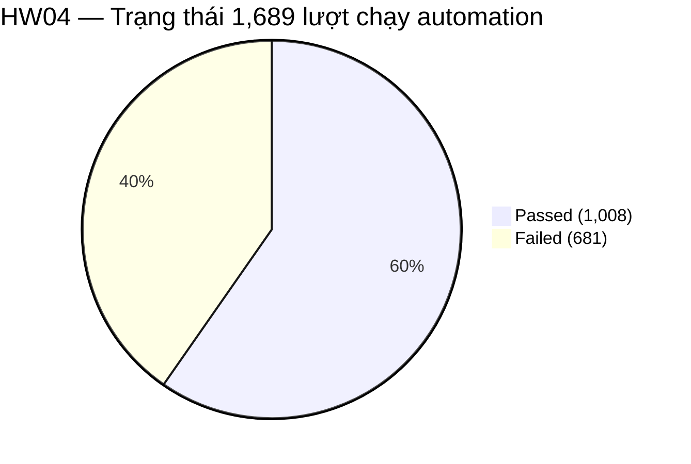

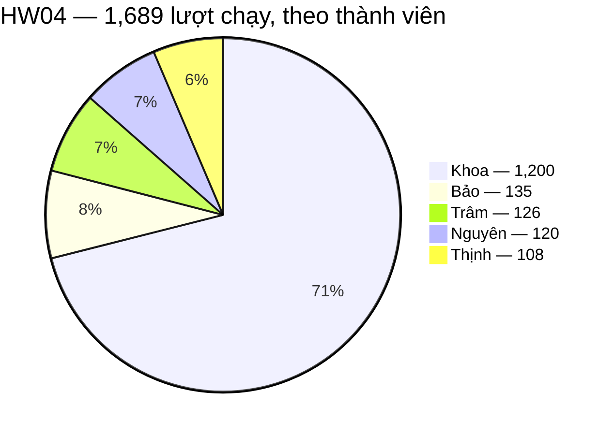

> **Cách quy đổi đơn vị.** Khoa và Bảo báo cáo Pass/Fail theo **test case duy nhất** (kết quả giống hệt nhau
> trên cả 3 browser); Nguyên, Trâm và Thịnh báo cáo theo **lượt chạy**. Bảng trên quy tất cả về **lượt chạy**:
> Khoa 222×3 = 666 pass / 178×3 = 534 fail; Bảo 32×3 = 96 / 13×3 = 39. Nếu quy về test case duy nhất, nhóm có
> **336 pass / 227 fail** trên 563 TC. Hai cách quy đổi cho cùng một sự thật, chỉ khác mẫu số — **không được
> trộn hai đơn vị trong cùng một phép cộng**.

**Một kết quả nhất quán đáng chú ý:** cả 5 thành viên đều báo cáo pass/fail **giống hệt nhau trên Chromium,
Firefox và WebKit** cho mọi test case. Đây là bằng chứng mạnh rằng các lỗi thuộc phía server/ứng dụng chứ
không phải test flaky hay khác biệt engine.

### 4.4 HW05 — Kiểm thử hiệu năng

#### 4.4.1 Tổng quan khối lượng

| Thành viên | Công cụ | Kịch bản | Tổng mẫu | Error % | Phát hiện chính |
|---|---|---:|---:|---:|---|
| Khoa | JMeter 5.6.3 + k6 | 4 | 61,261 | 0.00% | Rò rỉ 6.45 MB/phút; knee point 100→200 VU |
| Nguyên | JMeter 5.6.3 | 4 | 104,030 | 0.00% | Chưa chạm điểm gãy ở 200 VU / 151 req/s |
| Bảo | JMeter 5.6.3 | 4 | 401,892 | 0.00% | Soak p95 40 ms — vượt guardrail dù 0 lỗi |
| Trâm | JMeter 5.6.3 + k6 | 4 (+4 k6) | 139,138 (+135,015 k6) | 0.00% | Checkout p95 22 ms → 534 ms dưới Stress |
| Thịnh | JMeter 5.6.3 | 4 | không công bố | 0.00% | Coupon không chặn giới hạn lượt dùng |
| **Tổng nhóm** | | **20 kịch bản** | **706,321 mẫu JMeter** | **0.00%** | |

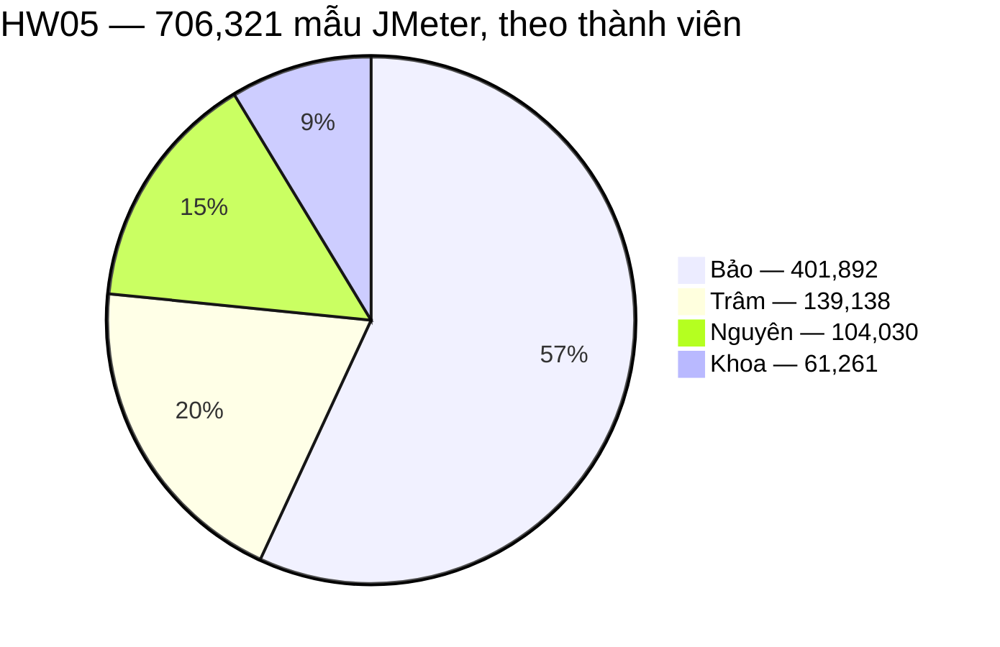

Trâm còn chạy thêm 135,015 mẫu k6, được phân tích **riêng** — báo cáo gốc ghi rõ p95 của JMeter và k6
**không được lấy trung bình chung**.

#### 4.4.2 Chi tiết theo kịch bản

| Thành viên | Load | Stress | Spike | Soak / Endurance |
|---|---|---|---|---|
| **Khoa** | 50 VU / 5 ph · 9,173 mẫu · p95 **25 ms** | 25→200 VU / 8 ph · 26,939 mẫu · p95 **586 ms** | 10→300 VU / 6 ph · 11,794 mẫu · p95 **1,016 ms** | 30 VU / 12 ph · 13,355 mẫu · p95 **382 ms** |
| **Nguyên** | 20 VU / 5 ph · 3,833 mẫu · p95 **7 ms** | →200 VU / ~7 ph · 63,398 mẫu · p95 **7 ms** | 10+150 VU / 5 ph · 22,080 mẫu · p95 **6 ms** | 30 VU / 12 ph · 14,719 mẫu · p95 **6 ms** |
| **Bảo** | 16,714 mẫu · p95 **6 ms** · 35.1 rps | 107,203 mẫu · p95 **8 ms** · 179.7 rps | 88,157 mẫu · p95 **10 ms** · 184.9 rps | 189,818 mẫu · p95 **40 ms** · 218.8 rps |
| **Trâm** | 20 VU · 4,972 mẫu · checkout p95 **22 ms** | 100 VU · 104,397 mẫu · checkout p95 **534 ms** | 5→80→5 VU · 24,330 mẫu · hold **464 ms** / phục hồi **23.65 ms** | 15 VU / 12.5 ph · 5,439 mẫu · p95 **23 ms** |
| **Thịnh** | 20 VU / 5 ph · p95 **1.8 ms** · 26.9 rps | 50→100→150→200 VU / 8 ph · p95 **13.0 ms** · 85.4 rps | 0→100 VU / 90 s · p95 **2.1 ms** · 41.2 rps | 15 VU / 10 ph · p95 **1.9 ms** · 21.0 rps |

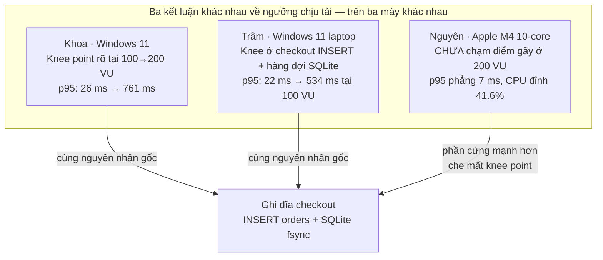

> ⚠️ **Không so sánh trực tiếp p95 giữa 5 thành viên.** Năm bộ số chạy trên **năm cấu hình phần cứng khác nhau**
> (Windows 11 ×3, Apple M4, AMD Ryzen 5), **năm workflow khác nhau**, và **năm bộ dữ liệu khác nhau** (505 sản
> phẩm vs 5 sản phẩm). Chênh lệch p95 kịch bản Load từ **1.8 ms đến 25 ms** phản ánh khác biệt môi trường và
> dữ liệu, **không** phản ánh chất lượng phép đo. Điểm chung duy nhất so sánh được: **cả 20 kịch bản đều đạt
> error rate 0.00%**.

#### 4.4.3 Ba kết luận khác nhau về rò rỉ bộ nhớ

| Thành viên | Kết luận | Điều kiện đo |
|---|---|---|
| **Khoa** | ✅ Có leak — **6.45 MB/phút** (60.30 → 137.39 MB, đỉnh 172.49 MB) | 30 VU / 12 phút · 505 sản phẩm · payload giỏ hàng lớn |
| **Nguyên** | ❌ Không thấy leak — RSS dao động 30–42 MB, hạ về ~31 MB | 30 VU / 12 phút · 5 sản phẩm · payload nhỏ |
| **Thịnh** | ❌ Không ghi nhận memory leak | 15 VU / 10 phút |
| **Bảo, Trâm** | Không có cliff trong soak (Trâm: checkout p95 20 → 24 ms qua 12.5 phút) | 15 VU |

**Cả ba đều đúng, và cùng chỉ về một nguyên nhân gốc**: giỏ hàng lưu in-memory trong biến toàn cục
`userCarts` (`backend/server.js:14,293`), được `push()` liên tục mà không bao giờ giải phóng sau thanh toán.
Leak chỉ trở nên đo được khi payload giỏ hàng đủ lớn để GC của V8 không thu hồi kịp. Kết luận an toàn cho
nhóm: **rò rỉ là có thật, mức độ phụ thuộc kích thước giỏ hàng và số người dùng đồng thời.**

Dự báo Time-to-OOM (theo tốc độ 6.45 MB/phút của Khoa):

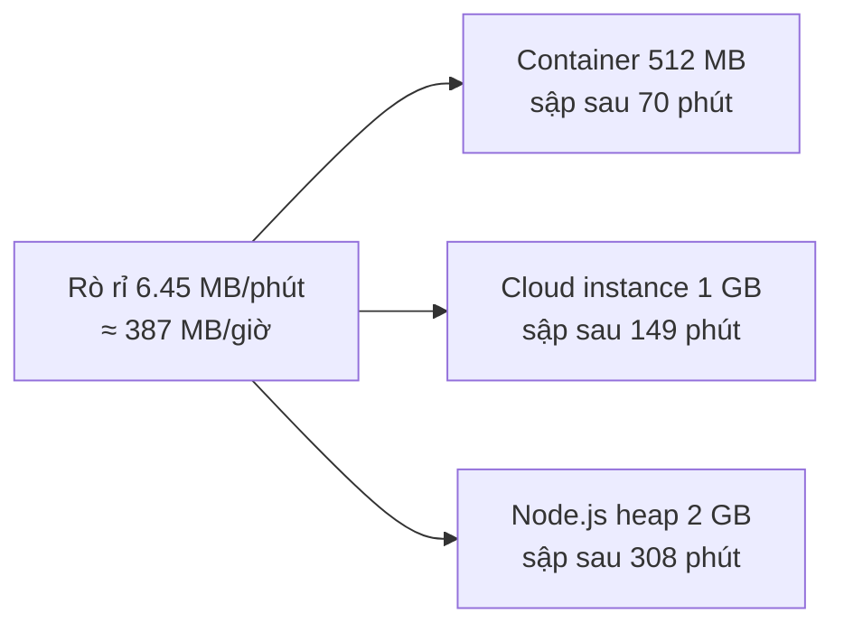

### 4.5 Defect — tổng hợp theo sổ đăng ký của từng thành viên

| Thành viên | HW02 | HW03 | HW04 | HW05 | Khác | **Tổng sổ** | Thang mức độ dùng |
|---|---:|---:|---:|---:|---:|---:|---|
| Khoa | 48 | 25* | 19 mới | 3 | — | **95** | High / Medium / Low (HW02) |
| Nguyên | 20 | 55** | 9 | 6 | — | **90** | Blocker / Major / Minor (HW03) |
| Bảo | 19 | 22 | 3 | 3 | — | **47** | Critical / Major / Minor |
| Trâm | 23 | 22*** | 18 | 0 | 5 (FR-12) | **68** | Critical / High / Medium / Minor |
| Thịnh | 66 | 16 | 7 | 2 | — | **91** | Critical / Major / Medium / Minor |
| **Tổng bản ghi** | **176** | **140** | **56** | **14** | **5** | **391** | ⚠️ 4 thang khác nhau |

\* Khoa HW03 giữ 3 đơn vị đếm riêng biệt và **không** cộng gộp: 18 GitHub issue (từ 20 failed assertion),
3 software bug, 4 usability issue. Ngoài ra HW04 tái hiện 31 bug đã biết từ HW02 — đã trừ khỏi tổng để tránh
đếm đôi.
\*\* Nguyên HW03: 48 bug GUI (#194–#241) + 7 phát hiện cross-platform (XP-01…XP-07).
\*\*\* Trâm HW03: 18 GUI issue hợp lệ (#265–#282, #317; **#281 là false positive, đã đóng**) + 4 usability
issue (#285–#288).

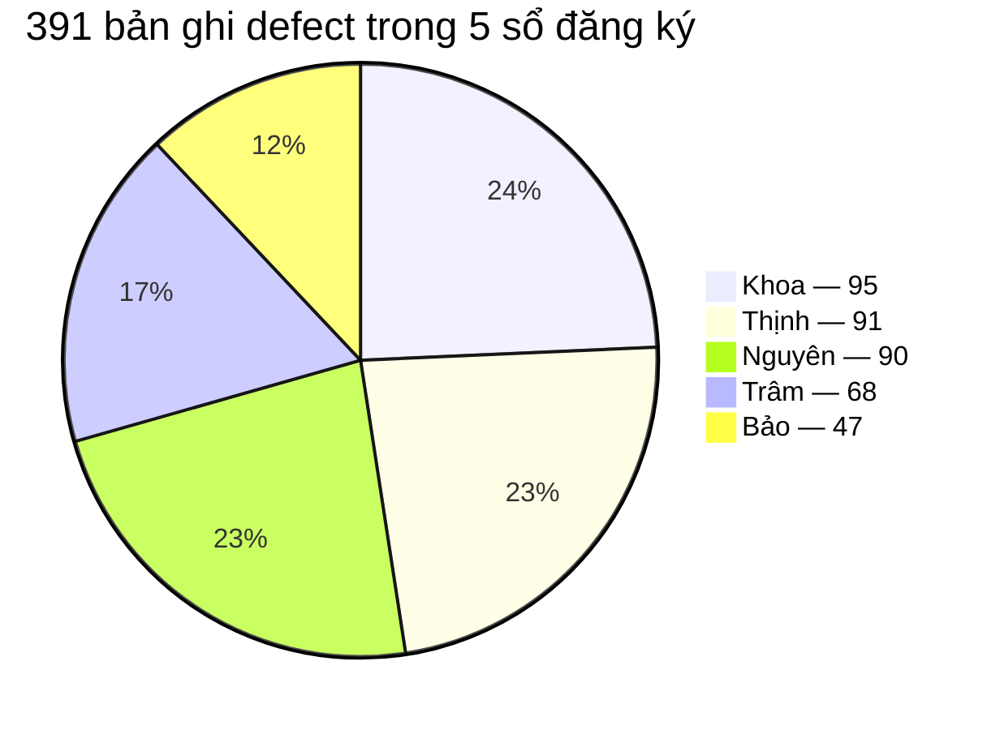

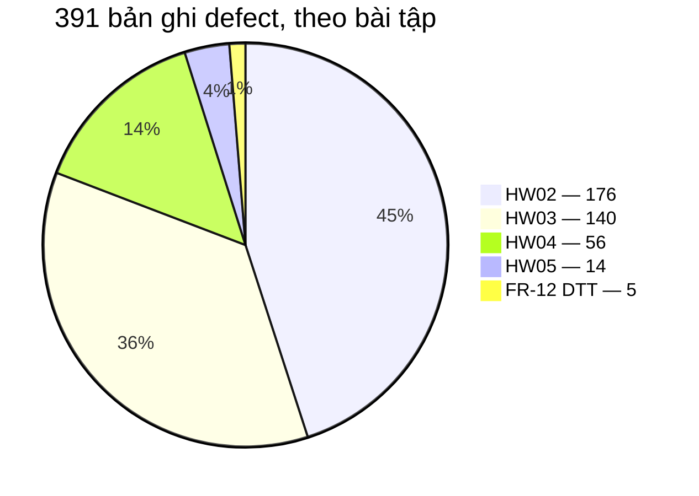

#### 4.5.1 Mức độ nghiêm trọng — chỉ hai thành viên dùng thang so sánh được

Bảo và Thịnh cùng dùng thang Critical / Major / Medium / Minor nên gộp được:

| Mức độ | Bảo | Thịnh | Tổng |
|---|---:|---:|---:|
| Critical | 8 | 19 | **27** |
| Major | 22 | 37 | **59** |
| Medium | — | 18 | **18** |
| Minor | 17 | 17 | **34** |
| **Tổng** | **47** | **91** | **138** |

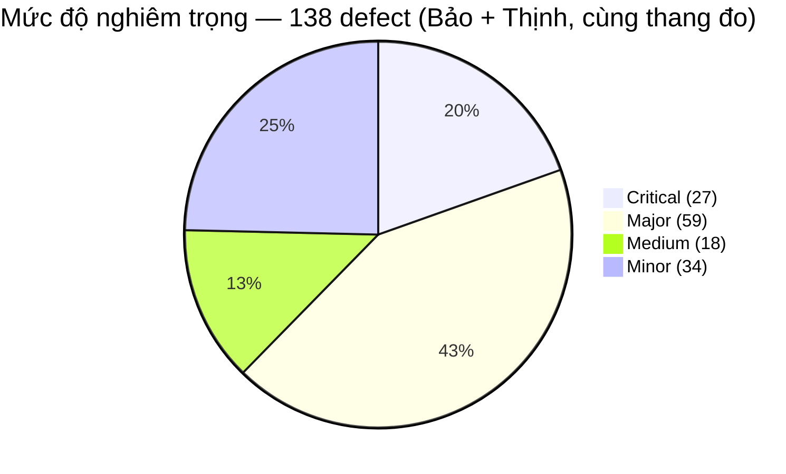

Ba thành viên còn lại dùng thang khác, **giữ riêng, không cộng vào bảng trên**:

| Thành viên | Phân bổ | Ghi chú |
|---|---|---|
| Khoa (HW02) | High 29 · Medium 13 · Low 6 = 48 | `main-report.md` còn dùng thang thứ hai Critical/Major/Minor/Cosmetic — xem 4.7 |
| Khoa (HW04) | 1 Critical · 5 High bảo mật · còn lại Major/Medium/Minor | 19 bug mới |
| Nguyên (HW03) | Blocker 2 · Major 20 · Minor 26 = 48 | Gộp từ 57 checklist item Failed theo nguyên nhân gốc |
| Trâm | Critical / High / Medium / Minor + Usability Sev-4 | Trâm mô tả theo **chủ đề duy nhất**, không đếm số |

#### 4.5.2 GitHub Issue — dải số theo thành viên

Các dải số gần như **không chồng lấn**, cho phép truy vết ngược từ số issue về thành viên:

| Thành viên | Dải GitHub Issue |
|---|---|
| Bảo | `#25–30`, `#53`, `#60`, `#64`, `#65`, `#147–155` (HW02) · `#249–264`, `#283`, `#284`, `#289`, `#290`, `#299`, `#300` (HW03) · `#330–332` (HW04) · `#410–412` (HW05) |
| Khoa | `#31–166` rải rác (HW02) · 18 issue HW03 (gồm `#37`, `#55`, `#118`) · `#318–329`, `#333–339` (HW04) · 3 issue HW05 |
| Trâm | `#170–192` (HW02) · `#265–282`, `#317` (HW03 GUI) · `#285–288` (usability) · `#372–389` (HW04) |
| Nguyên | `#194–241` (HW03) · `#242` (XP-01) · `#402–407` (HW05) |
| Thịnh | `#301–316` (HW03) · `#347–353` (HW04) · `#408`, `#409` (HW05) |

### 4.6 Lỗi được nhiều thành viên phát hiện độc lập

Đây là giá trị lớn nhất mà báo cáo gộp mang lại và không báo cáo cá nhân nào có được. Mỗi dòng dưới đây là
một lỗi được **từ 2 thành viên trở lên** phát hiện độc lập, trên máy khác nhau, bằng kỹ thuật khác nhau.

| # | Lỗi | Phát hiện bởi | Số người | Mức độ đồng thuận |
|---|---|---|:---:|---|
| 1 | **Leo thang đặc quyền — client tự đặt `role = "admin"`** | Khoa (HW04 `PUT /api/users/me`) · Thịnh (HW02 `BUG-PROFILE-001`) · Trâm (FR-12 DTT) · Bảo (`#147`, `#152`) | **4** | Rất cao — 4 người, 4 kỹ thuật khác nhau |
| 2 | **Trường Email dùng `type="text"` thay vì `type="email"`** | Khoa (HW03) · Nguyên (`#203`, HW04 `BUG-02`) · Thịnh (HW04 `BUG-002` `#348`) · Trâm (Medium themes) | **4** | Rất cao |
| 3 | **Không có dialog xác nhận cho hành động phá hủy** | Khoa (HW02 FR-07) · Nguyên (HW03 `BUG-18`) · Bảo (`#252`, `#255`) · Thịnh (`#316`) | **4** | Rất cao |
| 4 | **Giỏ hàng lưu in-memory (`userCarts`) — mất khi restart, rò rỉ RAM** | Khoa (HW05 leak) · Nguyên (`#406`) · Thịnh (`#409` `BUG-PERF-02`) | **3** | Rất cao — cả 3 cùng chỉ đúng biến `userCarts` |
| 5 | **Heading trang `/login` hiển thị sai thành "Đăng Ký"** | Khoa (`#34`) · Nguyên (`#199`, HW04 `BUG-01`) · Thịnh (`#352` `BUG-006`) | **3** | Rất cao |
| 6 | **Công thức tính coupon phần trăm sai (ra số âm / tăng tiền)** | Khoa (mini-lab `BUG-API-003`) · Nguyên (HW04 `BUG-06`) · Thịnh (`#351` `BUG-005`) | **3** | Rất cao |
| 7 | **Khóa tài khoản sai đặc tả: đếm `+2` thay vì `+1`, khóa 180 s thay vì 30 s** | Khoa (`#31`, `#32`) · Nguyên (`#402`) · Trâm (Lessons Learned) | **3** | Rất cao — cả 3 đọc trực tiếp `server.js` |
| 8 | **Chuyển trạng thái bất hợp lệ `canceled → delivered` trả HTTP 200** | Khoa (mini-lab `BUG-API-004`) · Nguyên (HW02 State Transition) · Trâm (`#282`) | **3** | Rất cao |
| 9 | **XSS / SQL Injection ở tìm kiếm và các trường nhập liệu** | Bảo (`#53` XSS, `#60` SQLi) · Nguyên (HW03 `BUG-01` XSS, HW05 `#403` SQLi) · Thịnh (HW02 Stored XSS + SQLi ở FR-01/16/26) | **3** | Rất cao |
| 10 | **Checkout tin tổng tiền do client gửi lên** | Nguyên (HW03 `BUG-02` Blocker) · Trâm (Critical theme) | **2** | Cao |
| 11 | **Thiếu Transaction Rollback khi import CSV có dòng lỗi** | Thịnh (HW02, `#310`, `#353`) · Bảo (`#257`, `#258`) | **2** | Cao |
| 12 | **Ô mật khẩu trang `/login` dùng `type="text"` (không che ký tự)** | Khoa (`#37`) · Nguyên (`#196`) | **2** | Cao |

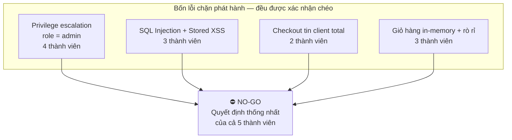

> **Vì sao không có một tổng defect duy nhất cho cả nhóm.** 391 là **số bản ghi trong 5 sổ đăng ký**, không
> phải số lỗi duy nhất. Bảng 4.6 cho thấy ít nhất 12 nhóm lỗi bị đếm 2–4 lần, và bốn bài tập dùng bốn đơn vị
> đếm khác nhau (test case fail / checklist assertion / bug gộp theo nguyên nhân gốc / GitHub issue). Con số
> lỗi duy nhất **chỉ tính được sau khi hợp nhất 5 sổ thành một register có ID toàn cục** — đây là khuyến nghị
> số 10 ở mục 8.

### 4.7 Mâu thuẫn số liệu giữa các nguồn (khai báo bắt buộc)

Bốn điểm dưới đây tồn tại trong tài liệu gốc. Báo cáo này **nêu nguyên trạng, không tự hòa giải**.

1. **Khoa — HW02 dùng hai thang mức độ khác nhau.** `main-report.md` phân loại theo
   Critical / Major / Minor / Cosmetic, `bug_report.md` phân loại theo High / Medium / Low. Hai thang **không
   quy đổi được** và **không được cộng gộp**. Báo cáo này lấy `bug_report.md` (48 bug) làm sổ chuẩn.

2. **Nguyên — HW03 có hai cách trình bày phân bổ IA.** Đầu `checklist-final.md` ghi IA-01 16 · IA-02 14 ·
   IA-03 15 · IA-04 17 · GAP 4; bảng tổng kết cuối file ghi IA-01 17 · IA-02 15 · IA-03 15 · IA-04 19. Đây
   không phải sai số — cách thứ nhất tách riêng 4 item GAP, cách thứ hai đã phân bổ chúng vào đúng IA. Cả hai
   cho tổng **66**.

3. **Nguyên — Task 1 và Task 3 lệch kết quả.** Task 1 (chấm tay) ghi 9 Pass / 57 Fail; Task 3 (harness tự
   động, cùng 66 item, trên Chromium) đo được 7 Pass / 59 Fail. Chênh lệch đến từ **4 item bị lật kết quả** —
   được ghi nhận là **phát hiện về giới hạn của việc tự chấm tay**, không phải lỗi số liệu cần sửa.

4. **Trâm — JMeter HTML dashboard ≠ raw `.jtl`.** Stress HTML Total p95 ghi 455 ms trong khi tính lại tuyến
   tính từ toàn bộ trường `elapsed` cho **476 ms**. Báo cáo gốc chọn chấm từ raw `.jtl` và ghi rõ nguyên tắc
   **không bao giờ dán con số Total của dashboard vào báo cáo**. Ngoài ra p95 whole-run của Spike (381 ms) là
   một **giá trị pha trộn** giữa giai đoạn tăng và giai đoạn phục hồi — không dùng làm số đại diện cho spike.

---

## 5. CÁC LOẠI KIỂM THỬ ĐÃ THỰC HIỆN (Types of Testing Performed)

| # | Loại kiểm thử | Thực hiện bởi | Kết quả cốt lõi |
|---|---|---|---|
| 1 | **Domain / Equivalence Partitioning** | Cả 5 | Nền tảng của 836 test case HW02 |
| 2 | **Boundary Value Analysis** | Cả 5 | Khoa: phát hiện lockout đặt cứng 180 s. Nguyên: 31 TC BVA. Thịnh: biên độ dài tên, giá âm |
| 3 | **Decision Table / Pairwise** | Nguyên (FR-09), Trâm (FR-12), Bảo | Trâm: 16 TC cho FR-12 → **3 Pass / 13 Fail**, FR-12 **không thỏa mãn** |
| 4 | **State Transition Testing** | Nguyên, Bảo | 20 TC cho máy trạng thái FR-10; phát hiện chuyển được từ trạng thái kết thúc |
| 5 | **Use Case Testing** | Nguyên, Bảo | 20 TC theo luồng chính / thay thế / ngoại lệ; 15 Pass / 5 Fail |
| 6 | **Kiểm thử bảo mật hộp đen** | Thịnh, Bảo, Nguyên | Stored XSS, SQL Injection payload, Privilege Escalation — nguồn của phần lớn lỗi Critical |
| 7 | **GUI Checklist Testing** | Cả 5 | 271 item; 145 Pass / 124 Fail / 2 Blocked |
| 8 | **Usability Testing (SUS / SEQ)** | Khoa, Bảo, Trâm, Thịnh | 28 người tham gia trên 4 luồng; SUS 50.4 – 76.79 |
| 9 | **Cross-browser / Cross-platform** | Cả 5 | 454 lượt đã lượng hóa; phát hiện lỗi phụ thuộc engine (XP-01) |
| 10 | **Automation UI (Playwright)** | Cả 5 | 563 TC duy nhất / 1,689 lượt chạy; kết quả nhất quán tuyệt đối trên 3 engine |
| 11 | **Automation API** | Khoa, Nguyên, Trâm, Bảo | Con đường phát hiện privilege escalation, rò rỉ mật khẩu, IDOR |
| 12 | **Database Integrity & Integration** | Khoa (mini-lab) | 11 TC Jest + Supertest; 7 Pass / 4 Fail; phát hiện thiếu foreign key constraint |
| 13 | **API Testing (Postman / Newman)** | Trâm (MiniHW6) | 5 iteration / 29 assertion / 0 fail cho `GET /api/categories` |
| 14 | **Performance — Load** | Cả 5 | 5 baseline độc lập, tất cả 0.00% lỗi |
| 15 | **Performance — Stress** | Cả 5 | Khoa và Trâm tìm được knee point; Nguyên và Thịnh chưa chạm điểm gãy ở 200 VU |
| 16 | **Performance — Spike** | Cả 5 | Cả 5 xác nhận hệ thống đàn hồi tốt và phục hồi ngay sau khi tải rút |
| 17 | **Performance — Soak / Endurance** | Cả 5 | 3 kết luận khác nhau về memory leak — xem 4.4.3 |
| 18 | **Continuous Performance Testing (đề xuất)** | Khoa, Nguyên, Trâm, Thịnh | Khoa đã hiện thực hóa `perf-regression.yml`; 3 người còn lại đề xuất kèm phân tích trade-off |
| 19 | **AI Critique / Misinterpretation Hunt** | Cả 5 | Khoa và Nguyên mỗi người bắt **5 lỗi diễn giải** của AI; cả nhóm có AI Audit Report |

**Không có kiểm thử hồi quy theo nghĩa công nghiệp.** Không bài tập nào chạy lại toàn bộ suite sau khi lỗi
được sửa — vì **chưa có lỗi nào được sửa**. Các bài sau *phát hiện lại* cùng những lỗi cũ thay vì xác nhận
chúng đã đóng. Đây là giới hạn cấu trúc của học phần, được ghi nhận rõ ở mục 3.4 và mục 10.

---

## 6. MÔI TRƯỜNG VÀ CÔNG CỤ KIỂM THỬ (Test Environment & Tools)

### 6.1 Năm môi trường độc lập

| Hạng mục | Khoa | Nguyên | Bảo | Trâm | Thịnh |
|---|---|---|---|---|---|
| Hệ điều hành | Windows 11 Home 10.0.26200 | macOS 15.5 (24F74) | Local (không nêu chi tiết) | Windows 11 (`DESKTOP-TCVI3HT`) | Windows 11 Home 64-bit |
| Phần cứng | Máy cá nhân Windows | Apple M4, 10 cores (4P+6E), 16 GB | — | ~16 GB RAM | AMD Ryzen 5 7535HS (6C/12T ~3.3 GHz), 16 GB DDR5 |
| Node.js | v24.10.0 | v26.4.0 | — | — | v20.x |
| Backend | `localhost:3000` | `localhost:3000` | `localhost:3000` | `localhost:3000` | `localhost:3000` |
| Frontend Web / Admin | `:5173` / `:5174` | `:5173` | local | `:5173` (+ Render) / `:5174` | `:5173` / `:5174` |
| Mobile | Expo Web (desktop) | — | Expo Go | Expo Go (03/08/2026) | Expo Go |

**Việc chạy trên 5 máy khác nhau là điểm mạnh về mặt phương pháp** cho kiểm thử chức năng — một lỗi tái hiện
trên cả 5 môi trường gần như chắc chắn là lỗi sản phẩm. Nhưng nó **triệt tiêu khả năng so sánh** các con số
hiệu năng: p95 chỉ có ý nghĩa trong phạm vi một máy.

### 6.2 Công cụ

| Mục đích | Công cụ |
|---|---|
| Automation UI/API | Playwright 1.61.1 (Khoa) · 1.62.1 (Nguyên, Thịnh) · Playwright Test (Bảo, Trâm) — Chromium / Firefox / WebKit |
| Unit / Integration DB | Jest 29.7 + Supertest 7.0 + `@faker-js/faker` 8.4.1 (Khoa) |
| API Testing | Postman + Newman CLI + GitHub Actions (Trâm) |
| Hiệu năng | Apache JMeter 5.6.3 non-GUI (cả 5) · k6 (Khoa, Trâm v2.1.0) · `jp@gc` Ultimate Thread Group (Trâm) |
| Giám sát tài nguyên | Windows Task Manager (Khoa, Trâm, Thịnh) · `htop` (Nguyên) · screenshot resource (Bảo) |
| CI / CPT | GitHub Actions — `perf-regression.yml` (Khoa, đã hiện thực) · `newman-api-test.yml` (Trâm, chuẩn bị) |
| Agent Skill đóng gói | `performance_testing` (Khoa) · `perf-jmeter` (Nguyên) · GUI / Usability / Playwright / Performance skills (Trâm) |
| Quản lý defect | GitHub Issues trên `trngnneee/eshop-sut` |
| AI hỗ trợ | Claude (Khoa, Nguyên, Trâm, Thịnh) · Gemini 2.5 Pro (Khoa) · Cursor Agent (Trâm) · Antigravity IDE (Thịnh) |

### 6.3 Dữ liệu kiểm thử

Mỗi thành viên tạo pool tài khoản riêng thay vì dùng chung `test@eshop.com` — **quyết định bắt buộc**, vì cơ
chế khóa tài khoản của SUT khóa 180 giây sau 2 lần đăng nhập sai, nên dùng chung tài khoản giữa các kịch bản
hoặc các browser sẽ tạo ra fail giả.

| Thành viên | Pool tài khoản | Dữ liệu bổ trợ |
|---|---|---|
| Khoa | 400 user `khoa001…khoa400@eshop.com` | +500 sản phẩm (tổng 505); `faker.seed(23127207)` |
| Nguyên | 60 user `nguyen01…nguyen60@eshop.com` | Keyword search khớp seed thật; token `{{UNIQUE}}`, `{{LONG255}}` |
| Trâm | 100 user `tramNN@eshop.com` | CSV parameterized; giữ Node chạy để `initDatabase()` không DROP user |
| Thịnh | — | 8 file CSV mẫu cho FR-16; JSON data-driven cho FR-01/FR-09 |
| Bảo | — | Test data theo từng FR |

---

## 7. BÀI HỌC KINH NGHIỆM (Lessons Learned)

| ID | Bài học | Bằng chứng cụ thể | Nguyên nhân gốc | Áp dụng cho lần sau | Thuộc về |
|---|---|---|---|---|---|
| **LL-01** | AI sinh khối lượng tốt nhưng **sai một cách tự tin** ở phần suy luận | 10 lỗi diễn giải kết quả hiệu năng (Khoa 5, Nguyên 5); 3/7 đề xuất tối ưu của AI là hallucination (index cho `LIKE '%q%'`, connection pool cho SQLite nhúng, tăng timeout) | AI suy luận theo mẫu quen thuộc (RDBMS, index, CPU bão hòa) mà không đọc dữ liệu thô hay mã nguồn | Đối chiếu **mọi** kết luận suy luận của AI với log thô hoặc mã nguồn; tính lại ground-truth bằng script riêng | Khoa, Nguyên |
| **LL-02** | AI **tô hồng** một SUT có lỗi | Mô hình muốn sửa expected result cho khớp với HTTP 200 thực tế thay vì báo lỗi | AI tối ưu cho "test pass", không cho "oracle đúng" | Human gate bắt buộc: giữ nguyên oracle theo đặc tả; Fail = lỗi sản phẩm | Trâm |
| **LL-03** | AI có **Happy-Path Bias** và sinh selector mỏng manh | AI sinh `input.first()`, `getByLabel('Họ Tên')` mà không kiểm tra SUT có `htmlFor/id` hay không; bỏ qua kiểm tra tính nguyên tố của transaction | AI mặc định hệ thống hoạt động đúng happy-path | Kiểm tra DOM thật trước khi chốt selector; luôn thêm test cho ràng buộc ngầm định (ACID, biên nghiêm ngặt) | Thịnh |
| **LL-04** | AI dừng ở "một test case cho mỗi rule" | Gói FR-03 đầu tiên chỉ có EP (~20 TC), thiếu toàn bộ BVA 021–044 | AI coi mỗi rule là một test case, không phân biệt EP với BVA | Skill BVA riêng + gap analysis trước khi thực thi | Trâm |
| **LL-05** | AI bỏ sót đúng những phân vùng chỉ lộ ra khi thao tác tay | Bỏ sót phân vùng chữ hoa/thường của email, tab navigation, race condition do truy vấn CSDL bất đồng bộ | AI không có trải nghiệm giao diện trực quan, không quan sát được độ trễ ghi CSDL thật | Luôn bổ sung một lượt kiểm thử tay có chủ đích (đa tab, tab order, thao tác đồng thời) | Khoa |
| **LL-06** | Cô lập trạng thái test quan trọng ngang với chính test đó | `TC-LOGIN-001` fail không tái lập vì `test@eshop.com` còn bị khóa trong cửa sổ 180 s từ lần chạy trước | Dùng chung tài khoản seed giữa các lần chạy trên cùng backend SQLite | Pool tài khoản riêng cho từng người; `beforeAll` mở khóa; snapshot + dọn dữ liệu trong `afterEach`; `workers: 1` | Khoa, Nguyên, Trâm |
| **LL-07** | `initDatabase()` DROP mọi lần khởi động Node | Restart Node để "mở khóa" tài khoản sẽ xóa sạch 100 user CSV vừa đăng ký | Thiết kế SUT reseed toàn bộ DB mỗi lần start | Giữ process Node chạy; đăng ký một lần; mở khóa bằng SQL trong khi process còn sống | Trâm |
| **LL-08** | Điều tra một test flaky có thể lộ ra khoảng trống tài liệu thật | Truy vết `TC-LOGIN-001` phát hiện `BUG-FR02-A-13` đã được `TC-JWT-001` tái hiện suốt nhưng **chưa từng** được ghi vào bảng bug | Không có bước đối soát ngược từ kết quả fail sang sổ đăng ký bug | Khi số test fail không khớp số bug đã ghi, audit từng case thay vì bỏ qua chênh lệch | Khoa |
| **LL-09** | Tự chấm bằng mắt trên chính checklist mình viết là **không đáng tin** | Harness tự động chạy lại đúng 66 item và **lật ngược 4 kết luận** của Task 1 chấm tay | Xu hướng nhìn thấy điều mình mong đợi; nhánh lỗi không bị chạm nếu chỉ dùng dữ liệu seed hợp lệ | Đọc trạng thái thật của app bằng script (DOM, computed style, `validationMessage`); cấm hard-code kết quả lượt chấm trước | Nguyên |
| **LL-10** | Review mã tĩnh **không thay được** thiết bị thật | False positive `#281` (Mobile Register redirect); đồng thời bỏ sót `#317` (OTP không hiển thị) | Đọc `App.js` không cho biết ứng dụng thực sự hành xử ra sao trên Expo Go | Retest trên thiết bị/Expo Go; không bao giờ lập bug mobile chỉ từ đọc mã nguồn | Trâm |
| **LL-11** | Đọc mã nguồn backend là con đường tìm ra các lỗi nghiêm trọng nhất | Privilege escalation (`PUT /api/users/me`), SQL Injection (`?search`), công thức coupon âm (`server.js:399`), biên `>` thay vì `>=` (`server.js:379`) | Mở rộng test case theo đặc tả chỉ phủ được những gì đặc tả mô tả; lỗ hổng nằm ở hành vi đặc tả không nhắc tới | Dành một lượt kiểm thử đi từ mã nguồn (code-driven) song song với lượt đi từ đặc tả (spec-driven) | Khoa, Nguyên, Thịnh, Trâm |
| **LL-12** | Nhãn platform phải được khai báo trung thực | Playwright cung cấp bản build **WebKit**, không phải `Safari.app`; ảnh chứng cứ hiện menu bar "Playwright" | Ánh xạ vai trò "Chrome/Firefox/Safari" theo đề bài sang bundle thực tế không phải quan hệ 1-1 | Khai báo rõ engine, version, host và giới hạn của từng platform; overlay thông tin đó lên ảnh chứng cứ | Khoa, Nguyên, Trâm |
| **LL-13** | `error rate = 0.00%` **không** đủ để kết luận hệ thống ổn | Cả 20 kịch bản đều 0.00% lỗi, nhưng Trâm đo checkout p95 tăng 22 → 534 ms, Khoa đo p95 26 → 761 ms, Bảo ghi nhận soak p95 40 ms vượt guardrail | Error rate chỉ bắt lỗi 5xx, không bắt suy giảm độ trễ | Luôn theo dõi p95/p99 và cửa sổ đỉnh song song với error rate | Cả nhóm |
| **LL-14** | Cùng một lỗi gốc cho kết luận đo khác nhau tùy workload và phần cứng | Khoa đo leak 6.45 MB/phút ở 30 VU; Nguyên và Thịnh **không** thấy leak. Khoa/Trâm thấy knee point rõ; Nguyên chưa chạm điểm gãy ở 200 VU | Khác kích thước payload (505 vs 5 sản phẩm) và khác phần cứng (Apple M4 vs laptop Windows) | Khi hai phép đo mâu thuẫn, so **điều kiện đo** trước khi so kết luận; ghi rõ workload và phần cứng kèm mọi kết luận hiệu năng | Cả nhóm |
| **LL-15** | Con số dashboard ≠ con số thô | JMeter HTML Total p95 = 455 ms trong khi tính lại từ raw `elapsed` = 476 ms; p95 whole-run của Spike (381 ms) là giá trị pha trộn | Dashboard tổng hợp theo cách riêng và trộn các pha tải | Chấm từ raw `.jtl`; tách `.jtl` theo `grpThreads`/pha thời gian trước khi báo cáo spike | Trâm |
| **LL-16** | Ngưỡng tải phải **đo**, không lấy từ kinh nghiệm dân gian | AI đề xuất Stress = 2.5× Load (50 VU); lần chạy đầu cho 0% lỗi → phải nâng lên và chốt lại 100 VU | Hệ số nhân "kinh nghiệm" không gắn với hệ thống cụ thể | Chạy thử để tìm mức tải có ý nghĩa, rồi mới chốt cấu hình chính thức | Trâm |
| **LL-17** | Kiểm soát truy cập là rủi ro **hệ thống**, không phải lỗi từng endpoint | DTT FR-12 kỳ vọng 401/403 nhưng nhiều route trả 200; 4 thành viên độc lập chạm cùng lỗ hổng `role` | Middleware xác thực/phân quyền được gắn rời rạc theo từng route | Kiểm thử phân quyền bằng ma trận (vai trò × endpoint × trạng thái token), không bằng test case rời | Trâm, Khoa, Thịnh, Bảo |

---

## 8. KHUYẾN NGHỊ (Recommendations)

### 8.1 Với đội phát triển SUT — ưu tiên theo mức độ

| Ưu tiên | Khuyến nghị | Căn cứ | Xác nhận bởi |
|---|---|---|---|
| **P0** | Chặn mass-assignment: không cho client gửi trường `role` ở `PUT /api/users/me` và các API cập nhật hồ sơ | Privilege escalation | Khoa, Thịnh, Trâm, Bảo |
| **P0** | Tham số hóa truy vấn và escape đầu ra trên **mọi** trường nhập liệu (tìm kiếm, họ tên, địa chỉ, mô tả sản phẩm, CSV) | SQL Injection + Stored XSS | Bảo, Nguyên, Thịnh |
| **P0** | Tính tổng tiền thanh toán **chỉ ở server**; bỏ qua `total_amount` do client gửi; từ chối giỏ rỗng; bắt buộc JWT hợp lệ trên `/checkout` | Money integrity | Nguyên, Trâm |
| **P0** | Thêm middleware xác thực **và** kiểm tra `role === 'admin'` cho mọi route thay đổi dữ liệu và `/api/admin/*`. Thiếu/sai token → **401**, sai vai trò → **403** | FR-12 không thỏa mãn (3 Pass / 13 Fail) | Trâm, Bảo |
| **P1** | Chuyển giỏ hàng từ in-memory (`userCarts`) sang lưu bền vững trong CSDL; giải phóng sau thanh toán (`backend/server.js:14,293`) | Rò rỉ 6.45 MB/phút; container 512 MB sập sau 70 phút; mất dữ liệu khi restart; không scale ngang được | Khoa, Nguyên, Thịnh |
| **P1** | Sửa công thức coupon phần trăm (`server.js:399` hiện tính ra số âm) và biên tối thiểu (`server.js:379` dùng `>` thay vì `>=`) | Sai lệch tài chính | Khoa, Nguyên, Thịnh |
| **P1** | Áp dụng `BEGIN TRANSACTION … ROLLBACK` cho import CSV | Vi phạm ACID — ghi dở dang khi có dòng lỗi | Thịnh, Bảo |
| **P1** | Thêm ràng buộc `UNIQUE(email)` cho bảng `users`; thêm claim `exp` cho JWT; thêm rate limiting cho `/api/login`; không log/trả về mật khẩu plaintext | Tài khoản trùng lặp, token vô hạn, brute-force | Thịnh, Khoa |
| **P1** | Sửa cơ chế khóa tài khoản: đếm **+1** (hiện +2), khóa **30 s** (hiện 180 s) | Sai đặc tả FR-02 | Khoa, Nguyên, Trâm |
| **P2** | Chặn chuyển trạng thái bất hợp lệ (`canceled → delivered`) ở cả UI lẫn API | FR-10 | Khoa, Nguyên, Trâm |
| **P2** | Validate phía server cho sản phẩm: từ chối tên rỗng, giá ≤ 0, `category_id` không tồn tại | FR-15, FR-16 | Trâm, Thịnh |
| **P2** | `database.js` không DROP + reseed toàn bộ DB mỗi lần khởi động | Không thể giữ dữ liệu test giữa các lần restart | Nguyên, Trâm |
| **P2** | Đưa Forgot Password về đúng FR-03: OTP 6 chữ số, trường xác nhận mật khẩu, step indicator, nút quay lại đăng nhập | Trâm phủ FR-03 ở 3 bài tập, lỗi vẫn còn nguyên | Trâm, Bảo |
| **P2** | Thêm dialog xác nhận cho mọi hành động phá hủy (xóa giỏ, xóa sản phẩm, hủy đơn) | UX + an toàn dữ liệu | Khoa, Nguyên, Bảo, Thịnh |
| **P3** | Thiết kế lại màn Admin Orders cho mobile, hoặc vô hiệu hóa admin ở viewport hẹp | Sev-4 usability; fail trên **cả 3 engine** ở 390×844 | Trâm |
| **P3** | Cụm lỗi GUI/accessibility: `type="email"`, `type="password"`, dấu `*` cho trường bắt buộc, `lang="vi"`, `htmlFor` cho label, `<h1>` đúng cấu trúc, regex SĐT cho phép số đầu 0 | Xuất hiện ở checklist của **cả 5** thành viên | Cả nhóm |

### 8.2 Với hoạt động kiểm thử — các đợt sau

1. **Hợp nhất 5 sổ đăng ký defect thành một register duy nhất với ID toàn cục.** Đây là điều kiện tiên quyết
   để có được con số lỗi duy nhất, và để các đợt sau **retest** thay vì mở issue trùng.
2. **Thiết lập chu kỳ fix → retest.** Học phần này chưa có chu kỳ nào: mọi issue vẫn đang mở, và các bài sau
   phát hiện lại lỗi cũ. Cần ít nhất một vòng xác nhận đóng.
3. **Chạy nốt các test case còn tồn**: 89 TC của Khoa (FR-02, FR-21), 35 TC UI FR-15 của Trâm (sau khi
   FR-02 được sửa), 4 TC GUI thủ công của Trâm.
4. **Bổ sung thiết bị thật**: một máy macOS/iOS cho Safari và một thiết bị Android vật lý sẽ nâng số platform
   đủ điều kiện từ 2/3 lên 3/3 cho cả nhóm.
5. **Đưa cổng CPT vào CI cho mọi pull request** chạm `backend/**`: lọc theo path diff, smoke Load trên PR,
   full Load/Stress/Spike/Soak hằng đêm, dùng median của 3 lần lặp chống nhiễu, cảnh báo khi checkout p95
   **> 1.20× median 7 ngày gần nhất VÀ > 50 ms**, **không bao giờ** gate trên p95 whole-run của Spike.
6. **Chuẩn hóa thang mức độ nghiêm trọng cho cả nhóm** trước đợt kiểm thử tiếp theo — hiện có 4 thang khác
   nhau khiến số liệu defect không cộng được.
7. **Chuẩn hóa một môi trường hiệu năng chung** (một máy hoặc một runner class) nếu muốn dùng p95 làm cổng CI;
   5 máy khác nhau khiến các con số hiện tại không so sánh được với nhau.
8. **Chạy lại kịch bản endurance với payload giỏ hàng lớn trên cả 5 môi trường** để định lượng chính xác
   ngưỡng mà rò rỉ `userCarts` trở nên nguy hiểm.
9. **Bỏ think-time và/hoặc chạy JMeter phân tán** để tìm điểm gãy thật — hiện giới hạn đo là công cụ, không
   phải hệ thống.
10. **Cấp quyền admin trên hệ thống quản lý lỗi cho người kiểm thử** để việc lập issue không bị chặn bởi
    quyền GitHub của người khác.

---

## 9. THỰC HÀNH TỐT ĐÃ ÁP DỤNG (Best Practices)

| # | Thực hành | Lợi ích đã đo được | Thuộc về |
|---|---|---|---|
| 1 | **Data-driven test + Page Object Model** — test case nằm trong `data/*.json`, spec chỉ là vòng lặp dispatch | Khoa thêm 63 TC boundary/robustness với **zero** code spec mới; Nguyên, Trâm, Thịnh mở rộng bộ test không sửa spec | Cả nhóm |
| 2 | **Ma trận 3 browser cho mọi feature** | Kết quả giống hệt nhau trên 3 engine ở **cả 5** thành viên → bằng chứng lỗi thuộc phía server, không phải flaky | Cả nhóm |
| 3 | **Pool tài khoản riêng cho từng người** (`khoa001…400`, `nguyen01…60`, `tramNN` ×100) | Loại bỏ hoàn toàn fail giả do tranh chấp cửa sổ khóa 180 s | Khoa, Nguyên, Trâm |
| 4 | **Seed dữ liệu xác định** (`faker.seed(23127207)` gọi ở đầu mỗi `setupTestDB`) | Mọi lượt chạy — toàn bộ hay đơn lẻ — đều có dữ liệu giống hệt nhau | Khoa |
| 5 | **Percentile nearest-rank ISO 80000-2, chấm từ raw `.jtl`** | Con số p95 khớp chính xác JMeter; phát hiện chênh 455 vs 476 ms giữa dashboard và log thô | Khoa, Trâm |
| 6 | **Tách `.jtl` theo pha tải trước khi báo cáo Spike** | Tránh dùng con số pha trộn (381 ms) làm đại diện cho spike | Trâm |
| 7 | **Median của 3 lần lặp trong CPT** | Chống nhiễu phần cứng, giảm false alarm khi so baseline | Khoa, Trâm |
| 8 | **Assertion kiểm nội dung, không chỉ status code** | login → `$.token`, categories → array, cart → "Added to cart", checkout → `$.orderId`. Nhiều lỗi trả HTTP 200 kèm body sai sẽ lọt nếu chỉ kiểm status | Nguyên, Trâm |
| 9 | **Giữ nguyên oracle theo đặc tả — không làm mềm khi fail** | 54 fail của Trâm và 178 fail của Khoa được giữ đỏ, nên GitHub Issues phản ánh đúng sự thật | Trâm, Khoa |
| 10 | **Đóng băng chứng cứ** (`EVIDENCE-LOCK.json`) | Lần chạy Feature B/C không ghi đè HTML report của Feature A | Trâm |
| 11 | **Prompt có cổng, một mối quan tâm mỗi lượt** (P00–P14) | Thay cho một prompt "chạy load test và cho biết có ổn không" — giảm hallucination | Trâm |
| 12 | **Chụp JMeter + monitor tài nguyên trong cùng khung hình** | Bằng chứng CPU/RAM gắn được với đúng thời điểm chạy, không ghép từ hai lần chạy | Khoa, Nguyên, Trâm, Thịnh |
| 13 | **Overlay MSSV + timestamp + version lên mọi ảnh chứng cứ; HTML report hiển thị `Run by: {MSSV}`** | Mỗi ảnh tự chứng minh nguồn gốc và quyền tác giả | Cả nhóm |
| 14 | **Phân biệt rõ `NOT_RECORDED` / `NOT_OBSERVABLE` / `NOT_REACHED`** | Dữ liệu thiếu không bao giờ bị quy về 0 | Khoa |
| 15 | **Tách "failed assertion" khỏi "bug"** | Nhiều assertion fail có thể chung một nguyên nhân gốc — Nguyên gộp 57 item Failed thành 48 bug | Nguyên, Khoa |
| 16 | **Đặt tiêu chí thành công của usability TRƯỚC khi chạy phiên** | "Đủ tốt" không thể trượt sau khi đã nhìn thấy điểm số | Trâm |
| 17 | **Truy vết xuyên suốt**: GUI checklist ID → manual TC → tên Playwright test → bug ID; rule DTT R1–R5 → TC → pairwise | Mỗi lỗi truy ngược được về tiêu chí sinh ra nó | Trâm |
| 18 | **AI-first, human-reviews-everything** — mỗi bài tập có AI Audit Report, prompt log và bản tự phê bình | Bắt được 10 lỗi diễn giải và 3 hallucination của AI trước khi chúng vào báo cáo | Cả nhóm |
| 19 | **Đóng gói Agent Skill tái sử dụng** | 4/5 thành viên đóng gói skill sinh test plan/checklist từ config — dùng lại được trên SUT khác | Khoa, Nguyên, Trâm, Thịnh |

---

## 10. TIÊU CHÍ KẾT THÚC (Exit Criteria)

| # | Tiêu chí | Trạng thái | Ghi chú |
|---|---|:---:|---|
| 1 | Toàn bộ test case đã thiết kế được thực thi | **Partial** | 708/836 TC HW02 (84.7%). Tồn: 89 TC (Khoa), 39 TC (Trâm) |
| 2 | Toàn bộ GUI checklist item được thực thi | **Yes** | 271/271 item; 2 blocked có lý do chính đáng |
| 3 | Automation chạy trên ≥ 3 browser engine | **Yes** | 1,689 lượt chạy; kết quả nhất quán trên Chromium / Firefox / WebKit ở cả 5 thành viên |
| 4 | Đủ 4 kịch bản hiệu năng cho mỗi thành viên | **Yes** | 20 kịch bản, 706,321 mẫu JMeter, error rate 0.00% toàn bộ |
| 5 | Mọi defect phát hiện đều có chứng cứ | **Yes** | Ảnh chứng cứ, HTML report, `.jtl`, bản ghi phiên usability |
| 6 | Defect được lập GitHub Issue | **Partial** | Phần lớn đã lập. **Chưa lập**: 20 bug HW02 của Nguyên, 66 bug HW02 của Thịnh, 13 bug FR-02 đã biết của Khoa |
| 7 | Kiểm thử trên ≥ 3 platform đủ điều kiện | **No** | 2/3 — WebKit không phải Safari; Expo Go / Pixel emulation không phải Android thật |
| 8 | Nghiên cứu usability đầy đủ | **Partial** | 4/5 thành viên có; thiếu pilot + probe (Khoa), thiếu smoke log (Trâm); Nguyên không thực hiện |
| 9 | Xác định được điểm gãy của SUT | **Partial** | Khoa và Trâm xác định được knee point; Nguyên và Thịnh chưa chạm điểm gãy ở 200 VU (giới hạn công cụ) |
| 10 | Có đề xuất Continuous Performance Testing | **Yes** | Khoa đã hiện thực hóa workflow; Nguyên, Trâm, Thịnh có đề xuất kèm trade-off |
| 11 | Có Agent Skill đóng gói tái sử dụng | **Yes** | 4/5 thành viên, đều đã validate end-to-end |
| 12 | Có báo cáo AI Audit / Critique / Disclosure | **Yes** | Cả 5 thành viên nộp đủ bộ khai báo AI theo mẫu FIT@HCMUS |
| 13 | **Không còn defect Critical/Blocker đang mở** | **No** | ≥ 27 Critical + 59 Major (chỉ tính 2 sổ dùng thang so sánh được); 4 lỗi P0 chưa vá |
| 14 | **Đã hoàn tất chu kỳ fix → retest** | **No** | **Không có defect nào được sửa.** Toàn bộ issue vẫn mở; các bài sau phát hiện lại lỗi cũ |
| 15 | Sổ đăng ký defect thống nhất cho cả nhóm | **No** | 5 sổ riêng, 4 thang mức độ, không có ID toàn cục |

**Kết luận tiêu chí kết thúc: 7 Yes · 4 Partial · 4 No.**

Chính sách severity dùng cho quyết định phát hành: **không được còn Critical đang mở; các lỗi High về tiền
bạc và kiểm soát truy cập phải được xác nhận đã đóng.** Chính sách đó **không** được thỏa mãn.

---

## 11. KẾT LUẬN VÀ KÝ DUYỆT (Conclusion / Sign Off)

### 11.1 Quyết định về hệ thống

> ### ⛔ **NO-GO** — Hệ thống EShop **không** đủ điều kiện đưa vào vận hành.

**Điểm đáng chú ý nhất: cả 5 thành viên đều đi đến kết luận này một cách độc lập**, trên 5 phạm vi khác nhau,
5 máy khác nhau, trước khi báo cáo gộp này được lập.

| Thành viên | Kết luận trong báo cáo cá nhân |
|---|---|
| Khoa + Nguyên | 🚫 **NO-GO** — 4 lỗi P0 mở + rò rỉ bộ nhớ đã định lượng |
| Bảo | **Không đạt** — 47 issue vẫn mở, trong đó có phân quyền admin, XSS, SQL injection |
| Trâm | **Not recommended to Go Live** — tiêu chí kết thúc mục 10 không thỏa mãn |
| Thịnh | ⛔ **REJECT RELEASE / CONDITIONAL SIGN-OFF** — 19 Critical + 37 Major chưa vá |

Căn cứ hợp nhất:

1. **Bốn lỗ hổng mức chặn vẫn đang mở**, mỗi lỗi đủ để chặn phát hành một cách độc lập, và mỗi lỗi đều được
   **từ 2 đến 4 thành viên xác nhận độc lập**:
   - **Leo thang đặc quyền** — người dùng đã đăng nhập bất kỳ có thể tự nâng quyền admin bằng một lời gọi API.
   - **SQL Injection và Stored XSS** trên nhiều trường nhập liệu (tìm kiếm, họ tên, địa chỉ, mô tả sản phẩm, CSV).
   - **Checkout tin tổng tiền do client gửi**, cho phép thanh toán giỏ rỗng và không cần xác thực.
   - **Giỏ hàng lưu in-memory** — mất sạch khi restart, rò rỉ bộ nhớ, không scale ngang được.
2. **Kiểm soát truy cập không thỏa mãn ở cấp hệ thống**: kiểm thử Decision Table cho FR-12 đạt **3 Pass /
   13 Fail**. Đây không phải lỗi của một endpoint mà là thiếu sót kiến trúc.
3. **Rò rỉ bộ nhớ đã được định lượng**: 6.45 MB/phút. Trên container 512 MB, hệ thống hết bộ nhớ sau **70
   phút** vận hành liên tục — không chạy nổi một ca làm việc.
4. **Vi phạm toàn vẹn CSDL**: thiếu `UNIQUE(email)`, thiếu foreign key constraint, thiếu transaction rollback
   khi import CSV (vi phạm ACID, xác nhận độc lập ở HW02, HW03 và HW04).
5. **Chưa có chu kỳ sửa lỗi nào.** Toàn bộ defect vẫn ở trạng thái mở sau 8 tuần và 4 bài tập.

**Về mặt hiệu năng thuần túy**, hệ thống cho kết quả tốt trong dải tải đã kiểm thử: **0.00% lỗi trên toàn bộ
706,321 mẫu**, đàn hồi tốt trước tải đột biến ở cả 5 phép đo, và trên phần cứng Apple M4 chưa chạm điểm gãy ở
200 VU. **Rào cản phát hành là bảo mật, toàn vẹn dữ liệu và quản lý bộ nhớ — không phải throughput.**

### 11.2 Quyết định về bộ tài liệu kiểm thử

> ### ✅ **ĐẠT** — Bộ tài liệu kiểm thử đủ điều kiện bàn giao / nộp bài.

| Bài tập | Khối lượng công việc của nhóm | Hoàn thành |
|---|---|:---:|
| HW02 | 836 test case thủ công qua 5 kỹ thuật thiết kế + 176 bản ghi defect | ✅ |
| HW03 | 271 GUI checklist item + 28 người tham gia usability + 454 lượt cross-platform | ✅ |
| HW04 | 563 test case tự động / 1,689 lượt chạy trên 3 engine + 87 bug | ✅ |
| HW05 | 20 kịch bản hiệu năng / 706,321 mẫu + 4 đề xuất CPT + 4 Agent Skill | ✅ |
| Bổ trợ | MiniHW6 API Testing, FR-12 DTT/Pairwise, Database Testing mini-lab | ✅ |

Toàn bộ 20 gói bài tập hoàn thành với chứng cứ thực thi thật, số liệu truy vết được tới file nguồn, các mâu
thuẫn số liệu được khai báo công khai thay vì che giấu, và các hạng mục không hoàn thành được nêu rõ kèm lý
do. **Không có số liệu nào được tổng hợp lại hoặc suy diễn để biến một tiêu chí không đạt thành đạt.**

Việc chấp nhận **sản phẩm bài tập** là quyết định về mặt điểm số; nó tách bạch với quyết định NO-GO về mặt
**chất lượng sản phẩm** ở mục 11.1.

### 11.3 Bảng ký duyệt

| Vai trò | Họ và tên | MSSV | Quyết định | Ngày |
|---|---|---|---|---|
| Thành viên kiểm thử | Đặng Đăng Khoa | 23127207 | Không khuyến nghị phát hành | 17/08/2026 |
| Thành viên kiểm thử | Đặng Trường Nguyên | 23127438 | Không khuyến nghị phát hành | 17/08/2026 |
| Thành viên kiểm thử | Nguyễn Thanh Gia Bảo | 23127158 | Không khuyến nghị phát hành | 17/08/2026 |
| Thành viên kiểm thử | Võ Ngọc Bích Trâm | 23127271 | Không khuyến nghị phát hành | 17/08/2026 |
| Thành viên kiểm thử | Phan Quốc Thịnh | 23127486 | Từ chối phát hành | 17/08/2026 |
| Giảng viên duyệt | | | Chờ duyệt | — |

---

## 12. ĐỊNH NGHĨA, TỪ VIẾT TẮT (Definitions, Acronyms, Abbreviations)

| Thuật ngữ | Nghĩa đầy đủ | Giải thích trong ngữ cảnh tài liệu này |
|---|---|---|
| **SUT** | System Under Test | Hệ thống EShop được kiểm thử |
| **SRS** | Software Requirements Specification | Tài liệu đặc tả yêu cầu (`README.md` ở gốc repo) |
| **FR** | Functional Requirement | Yêu cầu chức năng, đánh số FR-01 … FR-26 |
| **TC** | Test Case | Một trường hợp kiểm thử |
| **EP** | Equivalence Partitioning | Kỹ thuật chia miền dữ liệu thành các lớp tương đương |
| **BVA** | Boundary Value Analysis | Kỹ thuật kiểm thử giá trị biên |
| **DTT** | Decision Table Testing | Kiểm thử bằng bảng quyết định |
| **PT** | Pairwise Testing | Kiểm thử tổ hợp từng cặp |
| **ST / UC** | State Transition / Use Case Testing | Kiểm thử chuyển trạng thái / theo ca sử dụng |
| **POM** | Page Object Model | Mẫu thiết kế đóng gói thao tác UI vào lớp riêng theo trang |
| **IA-01…IA-04** | Interface Aspect | 4 nhóm checklist GUI: General UI · Forms · Navigation · Feedback & State |
| **SC1–SC5** | Success Criteria | 5 tiêu chí hoàn thành phiên usability (HW03 của Khoa) |
| **XP-01…XP-07** | Cross-Platform finding | Mã phát hiện khác biệt giữa nền tảng (HW03 của Nguyên) |
| **SUS** | System Usability Scale | Thang đo khả dụng 10 câu, quy về điểm 0–100 |
| **SEQ** | Single Ease Question | Câu hỏi mức độ dễ (1–7) hỏi ngay sau một tác vụ usability |
| **VU** | Virtual User | Người dùng ảo do JMeter/k6 mô phỏng |
| **RPS** | Requests Per Second | Số yêu cầu hệ thống xử lý mỗi giây (throughput) |
| **p95 / p99** | 95th / 99th Percentile | 95% (hoặc 99%) số yêu cầu có thời gian phản hồi nhỏ hơn giá trị này |
| **Nearest-rank** | ISO 80000-2 | Phương pháp tính bách phân vị mà JMeter dùng (không nội suy) |
| **SLO** | Service Level Objective | Mục tiêu mức dịch vụ, ở đây: `p95 < 800 ms` và `Error < 0.1%` |
| **Knee point** | Điểm gãy đường cong | Mức tải mà tại đó thời gian phản hồi bắt đầu tăng phi tuyến |
| **Breaking point** | Điểm gãy | Mức tải mà tại đó hệ thống bắt đầu trả lỗi |
| **OOM** | Out Of Memory | Sự cố hệ thống dừng do cạn kiệt bộ nhớ |
| **RSS** | Resident Set Size | Lượng RAM vật lý mà tiến trình đang chiếm |
| **GC** | Garbage Collection | Cơ chế thu hồi bộ nhớ tự động của V8 |
| **CPT** | Continuous Performance Testing | Kiểm thử hiệu năng liên tục, tích hợp vào CI/CD |
| **JMX / JTL** | JMeter Test Plan / Test Log | File XML định nghĩa kế hoạch / file log thô từng mẫu request |
| **JWT** | JSON Web Token | Token xác thực trả về sau khi đăng nhập thành công |
| **IDOR** | Insecure Direct Object Reference | Lỗ hổng truy cập tài nguyên của người khác qua ID trực tiếp |
| **XSS** | Cross-Site Scripting | Lỗ hổng cho phép chèn và thực thi mã script trong trang |
| **SQLi** | SQL Injection | Lỗ hổng chèn câu lệnh SQL qua dữ liệu đầu vào |
| **Mass assignment** | — | Lỗ hổng cho phép client gán giá trị cho trường lẽ ra chỉ server được đặt (ở đây: `role`) |
| **ACID** | Atomicity, Consistency, Isolation, Durability | Bốn tính chất của giao dịch CSDL; vi phạm ở tính năng import CSV |
| **WAL** | Write-Ahead Logging | Chế độ ghi của SQLite giúp tăng khả năng ghi đồng thời |
| **Think-time** | — | Thời gian chờ mô phỏng hành vi người dùng thật giữa hai thao tác |
| **Newman** | — | Trình chạy dòng lệnh cho Postman collection |
| **Go-Live** | — | Đưa ứng dụng ra cho người dùng cuối |
| **TSR** | Test Summary Report | Chính là loại tài liệu này |

---

## PHỤ LỤC — CHỈ MỤC TÀI LIỆU NGUỒN

Mọi số liệu trong báo cáo này truy vết được tới một trong các tài liệu dưới đây.

### Báo cáo cá nhân (cùng thư mục)

| Tài liệu | Bao phủ |
|---|---|
| `EShop_Test_Summary_Report_HW02-HW05.md` | Khoa (23127207) + Nguyên (23127438) — kèm 19 biểu đồ chi tiết |
| `23127158-test-summary-report.md` | Bảo (23127158) |
| `23127271_Test_Summary_Report.md` | Trâm (23127271) |
| `23127486-test-summary-report.md` | Thịnh (23127486) |

### Tài liệu gốc trên các branch

| Thành viên | Đường dẫn tiêu biểu |
|---|---|
| Khoa | [`HW2-Khoa/main-report.md`](https://github.com/trngnneee/eshop-sut/blob/HW2-Khoa/main-report.md) · [`HW3-Khoa/final-submission/Main_Report.md`](https://github.com/trngnneee/eshop-sut/blob/HW3-Khoa/final-submission/Main_Report.md) · [`HW4-Khoa/HW4/README.md`](https://github.com/trngnneee/eshop-sut/blob/HW4-Khoa/HW4/README.md) · [`HW5/performance-testing/23127207_HW05_Report.md`](https://github.com/trngnneee/eshop-sut/blob/HW5/performance-testing/23127207_HW05_Report.md) |
| Nguyên | [`HW2-Nguyen/TEST_CASE_SUMMARY.md`](https://github.com/trngnneee/eshop-sut/blob/HW2-Nguyen/TEST_CASE_SUMMARY.md) · [`HW3-Nguyen/tests/gui_and_usability_testing/`](https://github.com/trngnneee/eshop-sut/blob/HW3-Nguyen/tests/gui_and_usability_testing/checklist-final.md) · [`HW04-Nguyen/tests/automation_testing/REPORT.md`](https://github.com/trngnneee/eshop-sut/blob/HW04-Nguyen/tests/automation_testing/REPORT.md) · [`feat/HW05-Nguyen/tests/performance_testing/`](https://github.com/trngnneee/eshop-sut/blob/feat/HW05-Nguyen/tests/performance_testing/23127438_HW05_Report.md) |
| Bảo | `HW2-Bao` (`640918f`) · `HW3-Bao` (`2262d7f`) · `HW4-Bao` (`5b4410d`) · `HW5-Bao` (`ea85636`) — 115 commit |
| Trâm | `HW2-Tram` · `HW3-Tram` · `HW4-Tram` · `HW5-Tram` · `MiniHW6-Tram` · kho lưu trữ [`PandoraMiracle/SoftwareTesting-HW`](https://github.com/PandoraMiracle/SoftwareTesting-HW) |
| Thịnh | `HW2-Thinh` · `HW3-Thinh` · `HW4-Thinh` · `HW5-Thinh` |

### Tài liệu chung

| Tài liệu | Đường dẫn |
|---|---|
| Đặc tả yêu cầu hệ thống (SRS) | [`README.md`](https://github.com/trngnneee/eshop-sut/blob/main/README.md) |
| Đặc tả API | [`api_specification.md`](https://github.com/trngnneee/eshop-sut/blob/main/api_specification.md) |
| Hướng dẫn cài đặt | [`setup_guide.md`](https://github.com/trngnneee/eshop-sut/blob/main/setup_guide.md) |
| Danh sách GitHub Issues | https://github.com/trngnneee/eshop-sut/issues |
| Mẫu báo cáo tham chiếu | [Software Testing Help — Test Summary Report Template](https://www.softwaretestinghelp.com/test-summary-report-template-download-sample/) |

---

*Kết thúc Test Summary Report cấp nhóm — phiên bản 1.0, ngày 17/08/2026.*
