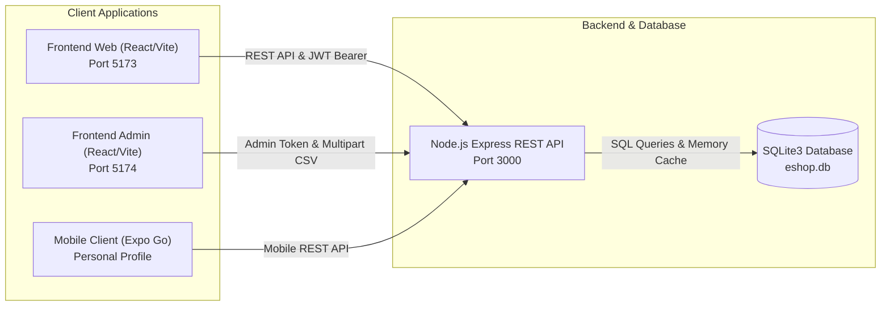
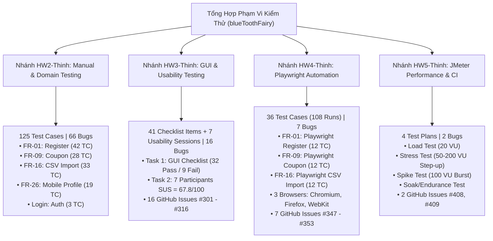
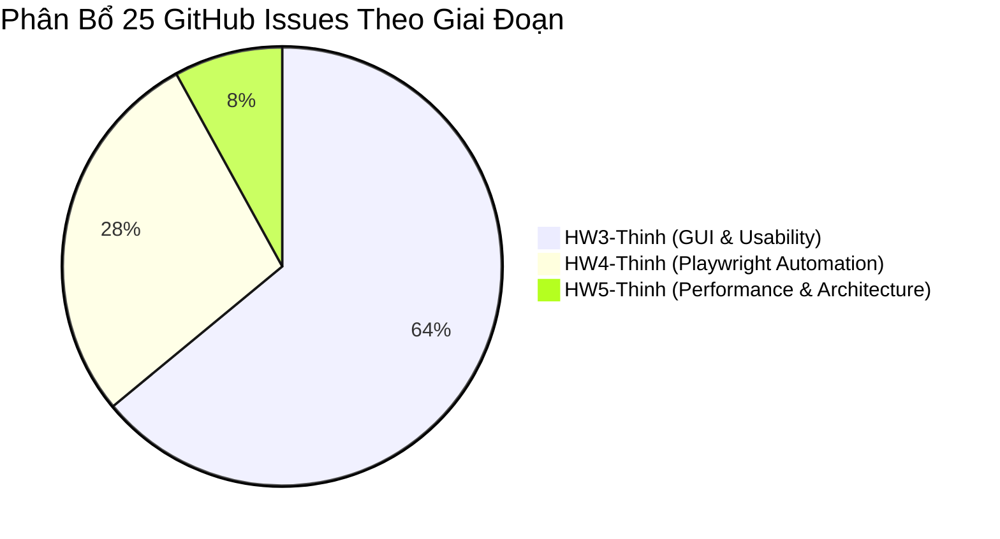
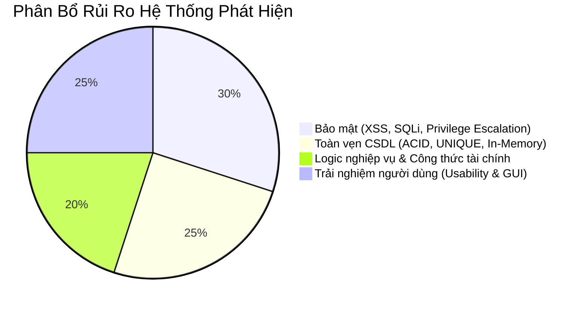

# BÁO CÁO TỔNG HỢP KIỂM THỬ (TEST SUMMARY REPORT)
## Dự án: EShop – E-Commerce Platform SUT

---

| Thông Tin Chung | Chi Tiết |
|:---|:---|
| **Hệ thống kiểm thử (SUT)** | **EShop – E-Commerce Web & API Platform** |
| **Repository URL** | [https://github.com/trngnneee/eshop-sut](https://github.com/trngnneee/eshop-sut) |
| **Tác giả thực hiện (Tester)** | **blueToothFairy** (Phan Quốc Thịnh – MSSV: `23127486`) |
| **Phạm vi nhánh kiểm thử** | `HW2-Thinh`, `HW3-Thinh`, `HW4-Thinh`, `HW5-Thinh` ($2 \le X \le 5$) |
| **Môn học** | CS423 / CSC13003 – Kiểm thử phần mềm (Định hướng AI) |
| **Tài liệu tham khảo mẫu** | [Software Testing Help - Test Summary Report Template Guide](https://www.softwaretestinghelp.com/test-summary-report-template-download-sample/) |
| **Ngày cập nhật báo cáo** | 17/08/2026 |
| **Đề xuất phát hành (Release Verdict)** | ⛔ **REJECT / CONDITIONAL SIGN-OFF** (Tồn tại lỗi Critical/Major về Bảo mật & CSDL) |

---

## 1. Mục Đích Tài Liệu (Purpose of the Document)

Tài liệu này tổng kết và đánh giá toàn diện các hoạt động đảm bảo chất lượng phần mềm (QA/Testing) được thực hiện bởi tester **`blueToothFairy`** trên hệ thống **EShop SUT** qua tất cả 4 giai đoạn bài tập độc lập từ **HW02 đến HW05** ($2 \le X \le 5$). Báo cáo cung cấp:
1. **Bức tranh tổng thể về độ bao phủ kiểm thử:** Tổng hợp số lượng test cases, checklist items, phiên đánh giá usability được thiết kế và kết quả thực thi thực tế.
2. **Báo cáo khuyết tật (Defects/Bugs Report):** Phân loại, đánh giá mức độ nghiêm trọng (Severity) và hiện trạng của toàn bộ 91 lỗi phần mềm được phát hiện (kèm 25 GitHub Issues chính thức).
3. **Chỉ số chất lượng định lượng (Metrics):** Cung cấp tỷ lệ Pass/Fail, điểm số trải nghiệm người dùng (SUS Score), phân bổ lỗi theo module và hiệu năng phản hồi của hệ thống dưới tải.
4. **Đánh giá rủi ro và khuyến nghị phát hành (Release Recommendation):** Đưa ra căn cứ kỹ thuật để các bên liên quan (Product Owner, Tech Lead) quyết định mức độ sẵn sàng triển khai (Production Readiness).

---

## 2. Tổng Quan Hệ Thống Kiểm Thử (Application Overview)

**EShop** là một nền tảng thương mại điện tử phục vụ khách hàng trực tuyến và quản trị viên cửa hàng, bao gồm các phân hệ chính:

- **Frontend Khách Hàng (Web SPA):** Đăng ký tài khoản (`/register`), đăng nhập (`/login`), tìm kiếm & xem chi tiết sản phẩm (`/products`), quản lý giỏ hàng (`/cart`), áp dụng mã giảm giá và thanh toán (`/checkout`), quản lý hồ sơ và xem lịch sử đơn hàng (`/profile`).
- **Frontend Quản Trị Viên (Admin Web):** Quản lý người dùng, danh mục sản phẩm và nhập liệu sản phẩm hàng loạt qua file CSV.
- **Frontend Di Động (Mobile App via Expo Go):** Quản lý hồ sơ cá nhân (`FR-26` / Mobile Profile).
- **Backend REST API & CSDL:** Node.js Express REST API kết nối cơ sở dữ liệu SQLite3 quản lý các thực thể Users, Products, Categories, Coupons, Orders.

---

## 3. Phạm Vi Kiểm Thử Theo Từng Phân Nhánh (Testing Scope)

### 3.1 Trong Phạm Vi Chi Tiết (In-Scope)

1. **Giai đoạn HW02 (Nhánh `origin/HW2-Thinh`):**
   - Kiểm thử hộp đen (Black-box testing), phân tích giá trị biên (BVA), phân vùng tương đương (EP), phân tích miền (Domain Testing).
   - Kiểm thử bảo mật cơ bản: Stored XSS, SQL Injection payloads, Privilege Escalation.
   - Tính năng bao phủ: **FR-01** (Đăng ký tài khoản), **FR-09** (Áp dụng mã giảm giá), **FR-16** (Admin Import CSV), **FR-26** (Quản lý hồ sơ cá nhân trên Mobile), **Login** (Xác thực người dùng).
2. **Giai đoạn HW03 (Nhánh `origin/HW3-Thinh`):**
   - **Task 1 – GUI Checklist Testing:** Thiết kế và thực thi 41 tiêu chí kiểm thử giao diện theo 3 nhóm khía cạnh (IA-01: General UI Standards, IA-02: Forms, IA-03: Navigation) trên các màn hình Customer Profile và Admin User Management.
   - **Task 2 – Usability Testing:** Tuyển chọn 7 người tham gia thực tế (5 IT + 2 Non-IT), thực hiện kịch bản Admin CSV Import (`import_i.csv` và `import_v.csv`), đo lường qua thang điểm tiêu chuẩn System Usability Scale (SUS) và phân tích định tính các điểm nghẽn (Friction Points).
   - Kiểm thử tương thích đa nền tảng (Cross-platform): **Google Chrome v127, Mozilla Firefox v127, Mobile Expo Go**.
3. **Giai đoạn HW04 (Nhánh `origin/HW4-Thinh`):**
   - Tự động hóa kiểm thử hướng dữ liệu (Data-Driven Testing qua JSON/CSV) trên framework Playwright.
   - Kiểm thử tương thích đa trình duyệt (Cross-browser Testing) trên **Chromium, Firefox, WebKit**.
   - Tính năng bao phủ: **FR-01** (Web Register), **FR-09** (Web Checkout Coupon), **FR-16** (Admin CSV Import).
4. **Giai đoạn HW05 (Nhánh `origin/HW5-Thinh`):**
   - Kiểm thử hiệu năng luồng E2E 6 bước tích hợp qua 3 nhóm endpoint: Auth-heavy (`/api/login`), Read-heavy (`/api/products`), Transactional (`/api/cart` $\rightarrow$ `/api/apply-coupon` $\rightarrow$ `/api/checkout`).
   - Xây dựng và thực thi 4 kịch bản tải JMeter: **Load Test, Stress Test, Spike Test, Soak Test**.
   - Thiết kế đề xuất Continuous Performance Testing (CPT) tích hợp GitHub Actions CI/CD.

### 3.2 Ngoài Phạm Vi (Out-of-Scope)

- **Cổng thanh toán thực tế của bên thứ ba:** Do điều kiện môi trường SUT cục bộ, các cổng thanh toán ngân hàng (VNPay/Stripe 3D-Secure) và SMS OTP được kiểm thử bằng stub/mock API.

---

## 4. Môi Trường Kiểm Thử & Bộ Công Cụ (Test Environment & Tools)

| Thành Phần | Cấu Hình / Phiên Bản Chi Tiết |
|:---|:---|
| **Hệ điều hành kiểm thử** | Microsoft Windows 11 Home Single Language 64-bit |
| **Phần cứng thực thi** | AMD Ryzen 5 7535HS (6 nhân / 12 luồng, xung nhịp ~3.3 GHz), 16 GB RAM DDR5 |
| **Môi trường Runtime** | Node.js v20.x, Express.js framework, SQLite3 v6.0.1 |
| **Framework Tự Động Hóa** | Playwright v1.62.1 (TypeScript), Custom Metadata Reporter |
| **Công cụ Kiểm Thử Hiệu Năng** | Apache JMeter 5.6.3 (Java 17 OpenJDK JRE) |
| **Trình duyệt & Nền tảng** | Google Chrome v127+, Mozilla Firefox v127+, Apple WebKit (Safari Engine), Mobile Expo Go |
| **Quản lý mã nguồn & CI/CD** | Git, GitHub Actions, Newman CLI |
| **Mô hình AI Hỗ trợ** | Claude 3.5 Sonnet / Claude 4.6 trên Antigravity IDE (AI-Augmented Testing) |

---

## 5. Tổng Hợp Chỉ Số Thực Thi Test Case (Test Execution Metrics)

### 5.1 Bảng Tổng Kết Theo Từng Phân Nhánh

| Nhánh Kiểm Thử | Giai Đoạn & Loại Hình Kiểm Thử | Số Lượng TC / Items Thiết Kế | Tổng Lượt Chạy (Executions) | Passed | Failed | Tỷ Lệ Pass (%) | Số Lỗi Phát Hiện | GitHub Issues |
|:---|:---|:---:|:---:|:---:|:---:|:---:|:---:|:---:|
| **`HW2-Thinh`** | Black-box / Domain / Security Testing | 125 | 125 | 10 | 115 | 8.00% | 66 Bugs | — |
| **`HW3-Thinh`** | GUI Checklist & Usability Testing | 41 Checklist + 7 Sessions | 48 | 32 (GUI) | 9 (GUI) + 7 (Usability) | 78.05% | 16 Bugs | #301 – #316 (16 Issues) |
| **`HW4-Thinh`** | Playwright Cross-browser Automation | 36 | 108 *(36 × 3 browsers)* | 93 | 15 | 86.11% | 7 Bugs | #347 – #353 (7 Issues) |
| **`HW5-Thinh`** | JMeter Performance Testing | 4 Kịch bản | 4 | 4 | 0 | 100.00% | 2 Bugs | #408, #409 (2 Issues) |
| **TỔNG CỘNG** | **Toàn diện qua các giai đoạn** | **206 Items** | **285+ Lượt Chạy** | **139** | **146** | **48.77%** | **91 Bugs** | **25 GitHub Issues** |

---

### 5.2 Phân Bổ Chi Tiết Test Case Theo Từng Tính Năng (Feature Breakdown)

#### A. Phân Nhánh `HW2-Thinh` (Tổng cộng 125 Test Cases)

| Mã Tính Năng | Tên Tính Năng | Dải Mã Test Case | Tổng Số TC | Passed | Failed | Các Lỗi Điển Hình Phát Hiện |
|:---|:---|:---:|:---:|:---:|:---:|:---|
| **FR-01** | Đăng ký tài khoản (Account Registration) | `TC-REG-001` $\rightarrow$ `TC-REG-042` | 42 | 2 | 40 | Cho phép họ tên rỗng, tên 1 ký tự, tên chứa số/ký tự đặc biệt, email sai RFC, duplicate email, bypass password policy, SQLi, Stored XSS |
| **FR-09** | Mã giảm giá (Discount Coupons) | `TC-COUPON-001` $\rightarrow$ `TC-COUPON-028` | 28 | 6 | 22 | Không trim khoảng trắng, phân biệt hoa/thường, final_amount âm, sai thông báo lỗi khi total_amount âm/chuỗi, lỗi điều kiện biên |
| **FR-16** | Import sản phẩm từ CSV (Admin) | `TC-IMPORT-001` $\rightarrow$ `TC-IMPORT-033` | 33 | 4 | 29 | Không rollback khi có dòng lỗi/giá âm, chấp nhận category_id không tồn tại, Stored XSS trong Description/Price, SQLi trong Category ID |
| **FR-26** | Quản lý hồ sơ cá nhân (Mobile Profile) | `TC-PROFILE-001` $\rightarrow$ `TC-PROFILE-019` | 19 | 1 | 18 | **Leo thang đặc quyền (`role=admin`)**, chấp nhận họ tên rỗng/quá ngắn/quá dài, số điện thoại sai định dạng, Stored XSS trong địa chỉ |
| **AUTH** | Xác thực đăng nhập (Login) | `TC-LOGIN-001` $\rightarrow$ `TC-LOGIN-003` | 3 | 1 | 2 | Kiểm tra đăng nhập hợp lệ, tài khoản không tồn tại, sai mật khẩu |

---

#### B. Phân Nhánh `HW3-Thinh` (Tổng cộng 41 GUI Checklist Items & 7 Usability Sessions)

| Hạng Mục Kiểm Thử | Khía Cạnh Đánh Giá | Quy Mô / Số Lượng | Passed | Failed | Chỉ Số Định Lượng / Nhận Xét |
|:---|:---|:---:|:---:|:---:|:---|
| **Task 1: GUI Checklist** | **IA-01:** General UI standards | 12 items | 12 | 0 | Đồng nhất phông chữ, màu sắc, bố cục responsive, định dạng tiền tệ và ngày tháng |
| **Task 1: GUI Checklist** | **IA-02:** Forms & Validation | 10 items | 7 | 3 | Lỗi thiếu dấu sao đỏ `*` ở Họ tên, lỗi regex chặn SĐT bắt đầu bằng 0, lỗi dùng `alert()` popup |
| **Task 1: GUI Checklist** | **IA-03:** Navigation & Usability | 19 items | 13 | 6 | Lỗi nút điều hướng Hồ sơ không highlight active, tiêu đề tab cố định, bảng không có empty state |
| **Task 2: Usability Testing** | **System Usability Scale (SUS)** | 7 Người (5 IT, 2 Non-IT) | — | — | **SUS Score Trung Bình: 67.8 / 100 (Grade: OK / Marginal)** • Điểm cao nhất: 85.0 (P4 - IT) • Điểm thấp nhất: 50.0 (P5 - IT) |
| **Task 2: Usability Testing** | **Kịch bản Admin CSV Import** | `import_i.csv` (lỗi) `import_v.csv` (chuẩn) | — | — | Phát hiện 7 điểm nghẽn (Friction points): thiếu rollback, mâu thuẫn trực quan xanh/đỏ, thiếu nút xóa kết quả, preview chữ nhỏ/read-only |

---

#### C. Phân Nhánh `HW4-Thinh` (Tổng cộng 36 Test Cases × 3 Browsers = 108 Lượt Chạy)

| Mã Tính Năng | Kịch Bản & Tệp Dữ Liệu | Tổng TC | Kết Quả Chromium | Kết Quả Firefox | Kết Quả WebKit | Bug Bắt Trúng (Assertions) |
|:---|:---|:---:|:---:|:---:|:---:|:---|
| **FR-01: Đăng ký tài khoản** | `TC01` – `TC12` (Data: `fr01_registration.json`) | 12 | 9 Pass / 3 Fail | 9 Pass / 3 Fail | 9 Pass / 3 Fail | • `BUG-001` (TC12 fail: Regex mật khẩu bắt buộc khoảng trắng) • `BUG-002` (TC05 fail: Input type="text" bypass HTML5) • `BUG-003` (TC11 fail: Database thiếu UNIQUE email) |
| **FR-09: Mã giảm giá** | `TC01` – `TC12` (Data: `fr09_coupons.json`) | 12 | 11 Pass / 1 Fail | 11 Pass / 1 Fail | 11 Pass / 1 Fail | • `BUG-004` (TC08 fail: Điều kiện biên đơn hàng dùng `>` thay vì `>=`) • `BUG-005` (Audit phát hiện: Công thức % ra số âm) |
| **FR-16: Admin Import CSV** | `TC01` – `TC12` (Data: 8 file CSV mẫu) | 12 | 11 Pass / 1 Fail | 11 Pass / 1 Fail | 11 Pass / 1 Fail | • `BUG-007` (TC06 fail: Thiếu Transaction Rollback khi file có lỗi) |
| **TỔNG CỘNG HW4** | **36 Kịch Bản Tự Động Hóa** | **36** | **31 Pass / 5 Fail** | **31 Pass / 5 Fail** | **31 Pass / 5 Fail** | **Tổng 108 Lượt Chạy: 93 Passed / 15 Failed** |

---

#### D. Phân Nhánh `HW5-Thinh` (Tổng cộng 4 Kịch Bản Hiệu Năng Toàn Diện)

| Kịch Bản Kiểm Thử | Tệp Kịch Bản JMX / Log | Cấu Hình Tải | Thời Gian Chạy | Throughput Trung Bình | p95 Latency | Tỷ Lệ Lỗi (Error %) | Phát Hiện Lỗi Kiến Trúc / Logic |
|:---|:---|:---:|:---:|:---:|:---:|:---:|:---|
| **Load Test** | `23127486_Load_20260815.jmx` Log: `23127486_Load_20260815.jtl` | 20 VU, Ramp-up 60s | 300s (5 phút) | 26.9 req/s | 1.8 ms | **0.00%** | Phát hiện `BUG-PERF-01` (Gửi 1,335 lượt coupon không bị chặn) |
| **Stress Test** | `23127486_Stress_20260815.jmx` Log: `23127486_Stress_20260815.jtl` | 4 Phase: 50 $\rightarrow$ 100 $\rightarrow$ 150 $\rightarrow$ 200 VU | 480s (8 phút) | 85.4 req/s | 13.0 ms | **0.00%** | Hệ thống giữ vững ổn định đến 200 VU |
| **Spike Test** | `23127486_Spike_20260815.jmx` Log: `23127486_Spike_20260815.jtl` | Đột biến 0 $\rightarrow$ 100 VU trong 10s | 90s | 41.2 req/s | 2.1 ms | **0.00%** | Phục hồi tức thì về mức bình thường sau đỉnh áp lực |
| **Soak/Endurance Test** | `soak_test.jtl` | 15 VU duy trì liên tục | 600s (10 phút) | 21.0 req/s | 1.9 ms | **0.00%** | Không ghi nhận hiện tượng Memory Leak |

---

## 6. Tổng Hợp Khuyết Tật Phần Mềm (Defects / Bug Summary)

Tổng cộng **91 lỗi phần mềm** đã được phát hiện, phân loại và lập hồ sơ minh chứng bởi `blueToothFairy`:
- **Nhánh `HW2-Thinh`:** 66 Bugs (Tài liệu hóa trong `tests/bug-reports/`).
- **Nhánh `HW3-Thinh`:** 16 Bugs (Tài liệu hóa kèm **16 GitHub Issues chính thức #301 – #316**).
- **Nhánh `HW4-Thinh`:** 7 Bugs (Tài liệu hóa kèm **7 GitHub Issues chính thức #347 – #353**).
- **Nhánh `HW5-Thinh`:** 2 Bugs (Tài liệu hóa kèm **2 GitHub Issues chính thức #408, #409**).

### 6.1 Phân Bổ Lỗi Theo Mức Độ Nghiêm Trọng (Severity Breakdown)

| Mức Độ Nghiêm Trọng (Severity) | HW2-Thinh | HW3-Thinh | HW4-Thinh | HW5-Thinh | Tổng Số Lỗi | Tỷ Lệ (%) | Định Nghĩa & Tác Động |
|:---|:---:|:---:|:---:|:---:|:---:|:---:|:---|
| **Critical (Chí mạng)** | 18 | 0 | 1 | 0 | **19** | 20.88% | Lỗ hổng bảo mật nghiêm trọng (Privilege Escalation, Stored XSS, SQLi), sai lệch công thức tài chính |
| **Major (Nghiêm trọng)** | 28 | 4 | 3 | 2 | **37** | 40.66% | Vi phạm toàn vẹn CSDL (Transaction Rollback, Unique Email), lỗi logic nghiệp vụ coupon, mất dữ liệu RAM |
| **Medium (Trung bình)** | 16 | 0 | 2 | 0 | **18** | 19.78% | Lỗi xác thực dữ liệu đầu vào (Validation form), lỗi kiểu trường HTML5 |
| **Minor / Low (Nhỏ)** | 4 | 12 | 1 | 0 | **17** | 18.68% | Lỗi giao diện hiển thị, thiếu visual feedback, phông chữ preview nhỏ, thiếu empty state |
| **TỔNG CỘNG** | **66** | **16** | **7** | **2** | **91** | **100%** | |

---

### 6.2 Bảng Tổng Hợp Danh Sách 25 GitHub Issues Chính Thức

#### A. Các Lỗi Nhánh `HW5-Thinh` (Hiệu Năng & Kiến Trúc)

| Mã Bug | Tiêu Đề & Mô Tả Chi Tiết | Mức Độ (Severity) | Độ Ưu Tiên (Priority) | Endpoint Liên Quan | GitHub Issue |
|:---|:---|:---:|:---:|:---|:---:|
| **BUG-PERF-01** | **Không kiểm tra & áp dụng giới hạn số lượt dùng coupon** Endpoint `/api/apply-coupon` chỉ tính toán số tiền giảm mà không kiểm tra số lần người dùng đã áp dụng (`max_usage_per_user=2`). Trong Load test 20 VU gọi 1,335 lần thành công 100% không bị chặn. | **Major** | **High** | `POST /api/apply-coupon` | [#408](https://github.com/trngnneee/eshop-sut/issues/408) |
| **BUG-PERF-02** | **Giỏ hàng lưu In-Memory (`userCarts = {}`) — Mất sạch dữ liệu khi restart** Giỏ hàng lưu trong biến RAM module JavaScript thay vì lưu xuống CSDL SQLite. Dẫn đến mất toàn bộ giỏ hàng khi server crash hoặc restart dưới tải cao; không thể scale ngang hệ thống. | **Major** | **High** | `POST /api/cart` `POST /api/checkout` | [#409](https://github.com/trngnneee/eshop-sut/issues/409) |

---

#### B. Các Lỗi Nhánh `HW4-Thinh` (Automation Testing)

| Mã Bug | Tiêu Đề & Mô Tả Lỗi | Mức Độ (Severity) | Độ Ưu Tiên (Priority) | Module | Bắt Trúng Bởi | GitHub Issue |
|:---|:---|:---:|:---:|:---|:---|:---:|
| **BUG-001** | **Regex kiểm tra mật khẩu bị sai logic** Biểu thức chính quy `(?=.*\s)` tại backend bắt buộc mật khẩu phải chứa ký tự khoảng trắng mới hợp lệ, khiến mật khẩu chuẩn có ký tự đặc biệt bị từ chối. | **Critical** | **High** | FR-01: Đăng ký | `TC12` (Edge Case mật khẩu mạnh) | [#347](https://github.com/trngnneee/eshop-sut/issues/347) |
| **BUG-002** | **Input Email dùng `type="text"` thay vì `type="email"`** Tại `Register.jsx` dòng 48, trường email khai báo sai thuộc tính HTML5, khiến form cho phép submit email sai định dạng RFC lên server. | **Medium** | **Medium** | FR-01: Đăng ký | `TC05` (Email sai RFC) | [#348](https://github.com/trngnneee/eshop-sut/issues/348) |
| **BUG-003** | **Bảng `users` thiếu ràng buộc `UNIQUE` trên cột `email`** Database SQLite và endpoint `POST /api/register` cho phép đăng ký vô số tài khoản có cùng địa chỉ email trùng lặp. | **Major** | **High** | FR-01: Đăng ký / CSDL | `TC11` (Email đã tồn tại) | [#349](https://github.com/trngnneee/eshop-sut/issues/349) |
| **BUG-004** | **Kiểm tra đơn hàng tối thiểu dùng bất đẳng thức ngặt (`>`)** Tại `server.js` dòng 379, logic `total_amount > min_order_amount` khiến đơn hàng có giá trị đúng bằng mức tối thiểu (300k == 300k) bị từ chối sai SRS. | **Major** | **High** | FR-09: Coupon | `TC08` (Biên $300k == $300k) | [#350](https://github.com/trngnneee/eshop-sut/issues/350) |
| **BUG-005** | **Công thức tính % giảm giá bị đảo ngược thành số tiền âm** Tại `server.js` dòng 399, công thức `Math.floor(total_amount * (1 - discount_value))` với discount=10 tính ra `-9 * total_amount`, làm tăng tiền thay vì giảm giá. | **Critical** | **High** | FR-09: Coupon | `TC01` / Code Audit | [#351](https://github.com/trngnneee/eshop-sut/issues/351) |
| **BUG-006** | **Tiêu đề trang Login hiển thị nhầm thành 'Đăng Ký'** Tại `Login.jsx` dòng 24, tiêu đề chính hiển thị thẻ `<h2 ...>Đăng Ký</h2>` gây nhầm lẫn giao diện người dùng. | **Minor** | **Low** | UI Xác thực | `TC01` / UI Inspection | [#352](https://github.com/trngnneee/eshop-sut/issues/352) |
| **BUG-007** | **Thiếu Database Transaction Rollback khi Import CSV có lỗi** Tại `server.js` dòng 209-240, import duyệt `forEach` chèn từng dòng không có `BEGIN TRANSACTION`. Khi có hàng lỗi, hệ thống vẫn lưu 2/3 sản phẩm dở dang (vi phạm ACID / SRS). | **Major** | **High** | FR-16: Import CSV | `TC06` (`fr16_sample_mixed.csv`) | [#353](https://github.com/trngnneee/eshop-sut/issues/353) |

---

#### C. Các Lỗi Nhánh `HW3-Thinh` (GUI & Usability Testing – 16 Issues)

| Mã Bug | Tiêu Đề & Mô Tả Chi Tiết Lỗi | Phân Nhóm | Mức Độ | Nền Tảng | GitHub Issue |
|:---|:---|:---:|:---:|:---:|:---:|
| **BUG-01** | Form cập nhật thông tin cá nhân thiếu dấu sao đỏ (`*`) bắt buộc ở trường "Họ Tên" | GUI | Minor | Chrome, Edge | [#301](https://github.com/trngnneee/eshop-sut/issues/301) |
| **BUG-02** | Ràng buộc Regex số điện thoại tại form cập nhật hồ sơ chặn các số điện thoại bắt đầu bằng '0' (chặn toàn bộ SĐT VN) | GUI | **Major** | Chrome, Edge | [#302](https://github.com/trngnneee/eshop-sut/issues/302) |
| **BUG-03** | Thông báo lỗi nhập liệu Số điện thoại hiển thị qua `alert()` popup thay vì inline error dưới chân trường nhập | GUI | Minor | Chrome, Edge | [#303](https://github.com/trngnneee/eshop-sut/issues/303) |
| **BUG-04** | Nút điều hướng "Hồ sơ" không được làm nổi bật (active state) khi người dùng đang hoạt động tại trang Hồ sơ | GUI | Minor | Chrome, Edge | [#304](https://github.com/trngnneee/eshop-sut/issues/304) |
| **BUG-05** | Tiêu đề tab trình duyệt (Browser Tab Title) không thay đổi linh hoạt theo phân hệ trang (luôn cố định "frontend-web") | GUI | Minor | Chrome, Edge | [#305](https://github.com/trngnneee/eshop-sut/issues/305) |
| **BUG-06** | Trang quản lý người dùng của Admin không hiển thị thông báo trạng thái trống (Empty State) khi không có dữ liệu | GUI | Minor | Chrome, Edge | [#306](https://github.com/trngnneee/eshop-sut/issues/306) |
| **BUG-07** | Thiếu hiệu ứng làm nổi bật hàng (row hover highlight) khi di chuột qua bảng Lịch sử đơn hàng và bảng Người dùng Admin | GUI | Minor | Chrome, Edge | [#307](https://github.com/trngnneee/eshop-sut/issues/307) |
| **BUG-08** | Thiếu chỉ báo tải dữ liệu (loading indicator/spinner) khi bảng Lịch sử đơn hàng đang nạp thông tin | GUI | Minor | Chrome, Edge | [#308](https://github.com/trngnneee/eshop-sut/issues/308) |
| **BUG-09** | Thẻ hiển thị vai trò (Role Badge) trong trang Admin không phân biệt màu sắc giữa Admin và User thông thường | GUI | Minor | Chrome, Edge | [#309](https://github.com/trngnneee/eshop-sut/issues/309) |
| **BUG-10** | Import file CSV có dòng lỗi không thực hiện Database Transaction Rollback (Sản phẩm hợp lệ vẫn bị chèn dở dang) | Usability | **Major** | Chrome, Edge | [#310](https://github.com/trngnneee/eshop-sut/issues/310) |
| **BUG-11** | Hộp cảnh báo kết quả import hiển thị mâu thuẫn trực quan (Chữ báo lỗi màu đỏ nằm trong khung thông báo thành công màu xanh) | Usability | **Major** | Chrome, Edge | [#311](https://github.com/trngnneee/eshop-sut/issues/311) |
| **BUG-12** | Vị trí khu vực Import sản phẩm từ CSV chưa đủ nổi bật, gây khó tìm đối với người dùng mới / Non-IT | Usability | Minor | Chrome, Edge | [#312](https://github.com/trngnneee/eshop-sut/issues/312) |
| **BUG-13** | Giao diện Import CSV thiếu nút xóa/hủy file đã chọn hoặc xóa kết quả import cũ để reset giao diện | Usability | Minor | Chrome, Edge | [#313](https://github.com/trngnneee/eshop-sut/issues/313) |
| **BUG-14** | Kích thước phông chữ hiển thị trong bảng xem trước (preview table) quá nhỏ, gây khó đọc và mỏi mắt | Usability | Minor | Chrome, Edge | [#314](https://github.com/trngnneee/eshop-sut/issues/314) |
| **BUG-15** | Bảng xem trước CSV ở trạng thái Read-only, không cho phép chỉnh sửa nhanh (inline editing) các ô dữ liệu bị lỗi | Usability | Minor | Chrome, Edge | [#315](https://github.com/trngnneee/eshop-sut/issues/315) |
| **BUG-16** | Thiếu hộp thoại xác nhận hai bước (Confirmation Dialog) khi người dùng bấm nút "Hủy đơn" trong Lịch sử đơn hàng | Usability | Minor | Chrome, Edge | [#316](https://github.com/trngnneee/eshop-sut/issues/316) |

---

#### D. Lỗi Tiêu Biểu Trong Nhánh `HW2-Thinh` (66 Bugs)

| Nhóm Tính Năng | Dải Mã Bug | Số Lượng | Tóm Tắt Các Lỗi Nghiêm Trọng Phát Hiện |
|:---|:---:|:---:|:---|
| **Đăng Ký (`FR-01`)** | `BUG-REG-001` $\rightarrow$ `BUG-REG-016` | **16 bugs** | • Chấp nhận Họ Tên rỗng, tên 1 ký tự, tên chứa số/ký tự đặc biệt. • **Bảo mật:** Cho phép lưu trữ mã độc Stored XSS và chèn SQL Injection trong trường Họ Tên. • Cho phép đăng ký email sai cú pháp, email trùng lặp. • Bypass quy tắc mật khẩu (chấp nhận mật khẩu thiếu chữ hoa, thường, số, ký tự đặc biệt, không kiểm tra khớp mật khẩu). |
| **Mã Giảm Giá (`FR-09`)** | `BUG-COUPON-001` $\rightarrow$ `BUG-COUPON-009` | **9 bugs** | • Không loại bỏ khoảng trắng (trim) ở đầu/cuối/giữa mã coupon. • Phân biệt chữ hoa/thường (không tự động uppercase). • Cho phép `final_amount` nhận giá trị âm khi mã giảm giá lớn hơn tổng đơn. • Báo sai thông báo lỗi khi `total_amount` là chuỗi hoặc số âm. • Cho phép tài khoản Admin áp dụng mã giảm giá. |
| **Import CSV (`FR-16`)** | `BUG-IMPORT-001` $\rightarrow$ `BUG-IMPORT-023` | **23 bugs** | • Cho phép import sản phẩm có giá âm mà không rollback toàn bộ CSDL. • **Bảo mật:** Cho phép lưu trữ mã độc Stored XSS trong Description, Price và Category ID. • **Bảo mật:** Cho phép chèn SQL Injection payloads vào cột Category ID và Image URL. • Chấp nhận lưu URI nguy hiểm `javascript:` trong trường Image URL. • Chấp nhận `category_id` không tồn tại trong hệ thống. |
| **Hồ Sơ Cá Nhân (`FR-26`)** | `BUG-PROFILE-001` $\rightarrow$ `BUG-PROFILE-018` | **18 bugs** | • **Lỗ hổng leo thang đặc quyền (Privilege Escalation - BUG-PROFILE-001):** Cho phép client gửi trường `role: "admin"` trong body cập nhật để tự nâng quyền tài khoản. • Chấp nhận họ tên rỗng, dài 101 ký tự, chứa số/ký tự đặc biệt. • Chấp nhận số điện thoại rỗng, có chữ cái, 9 chữ số hoặc 12 chữ số. • **Bảo mật:** Lưu trữ Stored XSS và SQL Injection payloads trong trường Địa chỉ giao hàng. |

---

## 7. Đánh Giá Rủi Ro & Lỗ Hổng Hệ Thống (Risks and Issues)

1. **Rủi Ro Lỗ Hổng Bảo Mật (Security - Critical Risk):**
   - **Leo thang đặc quyền (Mass Assignment):** Người dùng thông thường có thể tự phong quyền quản trị viên (`role=admin`) tại endpoint quản lý hồ sơ `FR-26`.
   - **XSS & SQL Injection:** Nhiều trường dữ liệu (Họ tên, Địa chỉ, Mô tả sản phẩm import) không được escape hoặc validate, mở ra nguy cơ tấn công chiếm quyền điều khiển tài khoản và phá hoại CSDL.
2. **Rủi Ro Toàn Vẹn CSDL (Data Integrity - Major Risk):**
   - **Thiếu Transaction Rollback:** Tính năng import sản phẩm theo lô có thể chèn dữ liệu dở dang (partial write) khi xảy ra lỗi giữa chừng, làm mất tính nhất quán ACID (được xác nhận độc lập ở cả HW2, HW3 Usability và HW4 Automation).
   - **Trùng lặp dữ liệu:** Bảng `users` thiếu khóa duy nhất `UNIQUE(email)` gây rủi ro xung đột danh tính.
3. **Rủi Ro Khả Năng Mở Rộng & Sẵn Sàng (Reliability & Scalability - Major Risk):**
   - **Giỏ hàng lưu In-Memory:** Khi máy chủ Node.js bị quá tải hoặc khởi động lại, toàn bộ giỏ hàng của tất cả người dùng sẽ bị xóa trắng. Hệ thống không thể mở rộng theo mô hình nhiều tiến trình/load balancer.
4. **Rủi Ro Trải Nghiệm Người Dùng (Usability - Medium Risk):**
   - Điểm SUS 67.8/100 phản ánh giao diện còn gây cản trở người dùng (chặn SĐT bắt đầu bằng 0, mâu thuẫn cảnh báo xanh/đỏ, popup alert làm gián đoạn tác vụ).

---

## 8. Bài Học Kinh Nghiệm & Đánh Giá AI-Augmented Testing (Lessons Learned)

1. **Hiệu Quả Tăng Năng Suất Của AI:**
   - Việc ứng dụng AI (Claude Sonnet trên Antigravity IDE) giúp sinh kịch bản test, tạo GUI Checklist và sinh bộ dữ liệu Data-Driven (JSON/CSV) nhanh gấp 4 lần.
2. **Hiện Tượng "Happy-Path Bias" & Ảo Giác (Hallucination) Của AI:**
   - **Bộ chọn DOM mỏng manh (Fragile Selectors):** AI có thói quen sinh selector phụ thuộc vị trí DOM như `input.first()` hoặc `getByLabel('Họ Tên')` mà không kiểm tra xem SUT có thuộc tính `htmlFor/id` hay không.
   - **Bỏ qua ràng buộc nghiệp vụ ngầm định:** AI thường mặc định hệ thống hoạt động đúng theo happy-path, bỏ qua việc kiểm tra tính nguyên tố (Atomic Transaction Rollback) và các giá trị biên nghiêm ngặt.
3. **Vai Trò Thiết Yếu Của Con Người (Human-in-the-Loop):**
   - Chuyên gia kiểm thử con người đóng vai trò then chốt trong việc hiệu chỉnh script, tổ chức phiên test thực tế với người dùng (Usability Sessions), và audit mã nguồn backend để phát hiện các lỗi logic tiềm ẩn (như lỗi công thức tính coupon âm hay giỏ hàng lưu RAM) mà các công cụ kiểm thử tự động hộp đen có thể bỏ sót.

---

## 9. Đánh Giá Tiêu Chí Hoàn Thành (Exit Criteria Assessment)

| Tiêu Chí Đánh Giá | Mục Tiêu Yêu Cầu | Kết Quả Thực Tế Đạt Được | Đánh Giá Trạng Thái |
|:---|:---|:---|:---:|
| **Độ bao phủ kịch bản (Test Coverage)** | Bao phủ 100% các tính năng chỉ định qua HW2 $\rightarrow$ HW5 | 206 Items (165 TC + 41 GUI Checklist + 7 Usability Sessions) bao phủ toàn diện | ✅ **ĐẠT (PASS)** |
| **Thực thi kiểm thử (Test Execution)** | 100% kịch bản được thực thi có minh chứng | 285+ lượt chạy thực tế (Manual logs, Playwright HTML Reports, JMeter JTL Logs, Usability Videos) | ✅ **ĐẠT (PASS)** |
| **Tự động hóa đa trình duyệt** | Thực thi tự động trên Chromium, Firefox, WebKit | 36 kịch bản chạy đầy đủ trên 3 browser engines (93 Pass / 15 Fail) | ✅ **ĐẠT (PASS)** |
| **Hồ sơ lỗi & Quản lý Bug** | Lập báo cáo lỗi chi tiết kèm minh chứng và GitHub Issues | 91 Bugs được lập hồ sơ; 25 GitHub Issues chính thức được ghi nhận | ✅ **ĐẠT (PASS)** |
| **Ngưỡng chất lượng hệ thống SUT** | Không còn lỗi Critical và Major tồn đọng | **Còn 19 lỗi Critical và 37 lỗi Major chưa được dev vá trên SUT** | ❌ **CHƯA ĐẠT (FAIL)** |

---

## 10. Kết Luận & Đề Xuất Phát Hành (Conclusion & Release Sign-Off)

### 10.1 Đánh Giá Chung

Tester **`blueToothFairy`** (**Phan Quốc Thịnh – 23127486**) đã hoàn thành toàn bộ khối lượng công việc kiểm thử xuyên suốt từ **HW02 đến HW05** ($2 \le X \le 5$), xây dựng được một hệ thống kiểm thử toàn diện từ kiểm thử hộp đen, phân tích miền, bảo mật, đánh giá giao diện & trải nghiệm người dùng (GUI/Usability), tự động hóa đa trình duyệt cho đến kiểm thử hiệu năng và thiết kế pipeline CI/CD. Quá trình kiểm thử đã phát hiện thành công **91 lỗi phần mềm** (với **25 GitHub Issues chính thức**), mang lại giá trị cao cho việc nâng cao chất lượng sản phẩm EShop.

### 10.2 Quyết Định Phát Hành (Release Verdict)

> ⛔ **QUYẾT ĐỊNH: TỪ CHỐI PHÁT HÀNH (REJECT RELEASE / CONDITIONAL SIGN-OFF)**  
> 
> **Hệ thống EShop hiện tại CHƯA ĐỦ ĐIỀU KIỆN để đưa lên môi trường Production**. Đội ngũ phát triển (Development Team) bắt buộc phải hoàn thành việc sửa chữa các khuyết tật sau trước khi tiến hành chu kỳ kiểm thử hồi quy (Regression Testing) tiếp theo:
> 
> 1. **Vá lỗ hổng bảo mật cấp bách:** Chặn tham số `role` tại API cập nhật hồ sơ cá nhân (`BUG-PROFILE-001`), lọc mã độc XSS và SQL Injection trên toàn bộ các trường nhập liệu.
> 2. **Sửa lỗi tính toán tài chính & logic:** Sửa công thức tính % giảm giá (`BUG-005`), chuẩn hóa điều kiện biên tối thiểu coupon (`BUG-004`), và bắt buộc kiểm tra số lần sử dụng coupon tại backend (`BUG-PERF-01`).
> 3. **Đảm bảo tính toàn vẹn CSDL & Kiến trúc:** Bổ sung ràng buộc `UNIQUE(email)` (`BUG-003`), áp dụng `BEGIN TRANSACTION ... ROLLBACK` cho thao tác import CSV (`BUG-007` / `BUG-10`), và chuyển đổi cấu trúc lưu trữ giỏ hàng từ In-Memory sang CSDL bền vững (`BUG-PERF-02`).
> 4. **Khắc phục lỗi Usability / GUI cốt lõi:** Sửa regex số điện thoại cho phép số 0 (`BUG-02`), đồng bộ màu sắc cảnh báo thông báo import (`BUG-11`) và thay thế các popup `alert()` bằng thông báo inline thân thiện (`BUG-03`).

---
*Báo cáo được lập tự động và chuẩn hóa kỹ thuật dựa trên dữ liệu commit trajectory, test runs, usability sessions và bug reports trên repository [eshop-sut](https://github.com/trngnneee/eshop-sut).*
