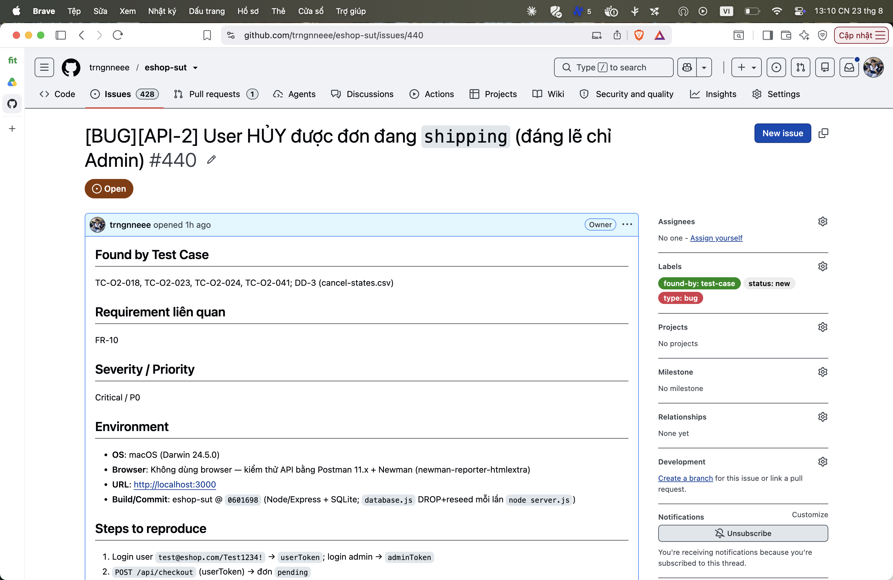

## Found by Test Case

TC-O2-018, TC-O2-023, TC-O2-024, TC-O2-041; DD-3 (cancel-states.csv)

## Requirement liên quan

FR-10

## Severity / Priority

Critical / P0

## Environment

- **OS**: macOS (Darwin 24.5.0)
- **Browser**: Không dùng browser — kiểm thử API bằng Postman 11.x + Newman (newman-reporter-htmlextra)
- **URL**: http://localhost:3000
- **Build/Commit**: eshop-sut @ `0601698` (Node/Express + SQLite; `database.js` DROP+reseed mỗi lần `node server.js`)

## Steps to reproduce

1. Login user `test@eshop.com/Test1234!` → `userToken`; login admin → `adminToken`
2. `POST /api/checkout` (userToken) → đơn `pending`
3. `PUT /api/admin/orders/:id/status {"status":"confirmed"}` rồi `{"status":"shipping"}` (adminToken)
4. `PUT /api/orders/:id/cancel` (userToken) trên đơn đang `shipping`

## Expected result

`400` + `{error}`; đơn giữ nguyên `shipping` (FR-10: user không được hủy khi đang giao).

## Actual result

`200 {"message":"Order canceled successfully"}`; đơn chuyển sang `canceled`.

**Root cause:** `server.js:328-331` — guard chỉ chặn `delivered`/`canceled`, thiếu `shipping`. Code còn comment: `// Lẽ ra phải là: if (order.status !== 'pending' && order.status !== 'confirmed')`.

**Fix gợi ý:** Đổi sang whitelist: `if (order.status !== 'pending' && order.status !== 'confirmed') return res.status(400)...`.

## Evidence

TC-O2-018: assert status 400 + hậu kiểm `status==="shipping"` — cả hai FAIL (nhận 200, đơn thành canceled).

Run tổng: **Postman Runner 905 tests → 629 pass / 276 fail**; **Newman 893 assertions / 327 failed** (các fail là bằng chứng bug, không phải lỗi test).

- `tests/api_testing/newman/report.html` (htmlextra — lọc theo TC-ID ở cột Failed)
- `tests/api_testing/newman/screenshots/postman-run-result.png`
- `tests/api_testing/newman/screenshots/newman-terminal-localhost.png` (chứng minh host `localhost:3000`)
- `tests/api_testing/newman/screenshots/newman-htmlextra-summary.png`

**GitHub Issue:** [#440](https://github.com/trngnneee/eshop-sut/issues/440)

**Screenshot Issue:**

