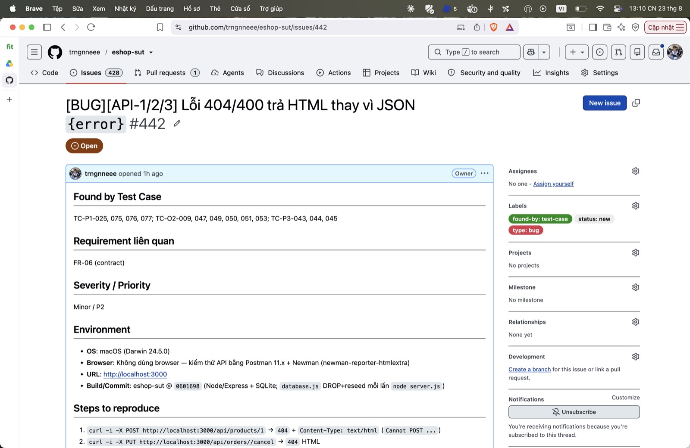

## Found by Test Case

TC-P1-025, 075, 076, 077; TC-O2-009, 047, 049, 050, 051, 053; TC-P3-043, 044, 045

## Requirement liên quan

FR-06 (contract)

## Severity / Priority

Minor / P2

## Environment

- **OS**: macOS (Darwin 24.5.0)
- **Browser**: Không dùng browser — kiểm thử API bằng Postman 11.x + Newman (newman-reporter-htmlextra)
- **URL**: http://localhost:3000
- **Build/Commit**: eshop-sut @ `0601698` (Node/Express + SQLite; `database.js` DROP+reseed mỗi lần `node server.js`)

## Steps to reproduce

1. `curl -i -X POST http://localhost:3000/api/products/1` → `404` + `Content-Type: text/html` (`Cannot POST ...`)
2. `curl -i -X PUT http://localhost:3000/api/orders//cancel` → `404` HTML
3. `curl -i -X POST .../api/products -H 'Content-Type: application/json' -d '{bad json'` → `400` HTML

## Expected result

Mọi lỗi của API là JSON `{error}` với `Content-Type: application/json` (và `405` cho method sai trên route tồn tại).

## Actual result

Trả trang HTML mặc định của Express (`text/html`) — phá contract 'API luôn trả JSON'.

**Root cause:** Không có error-handler 404/400 tập trung; body-parser lỗi ném trước khi vào route ⇒ trang HTML mặc định.

**Fix gợi ý:** Thêm middleware 404 + error-handler cuối chuỗi, luôn `res.json({error})`; trả `405 + Allow` cho method sai.

## Evidence

TC-P1-025 assert body JSON/không HTML FAIL (nhận text/html).

Run tổng: **Postman Runner 905 tests → 629 pass / 276 fail**; **Newman 893 assertions / 327 failed** (các fail là bằng chứng bug, không phải lỗi test).

- `tests/api_testing/newman/report.html` (htmlextra — lọc theo TC-ID ở cột Failed)
- `tests/api_testing/newman/screenshots/postman-run-result.jpg`
- `tests/api_testing/newman/screenshots/newman-terminal-localhost.jpg` (chứng minh host `localhost:3000`)
- `tests/api_testing/newman/screenshots/newman-htmlextra-summary.jpg`

**GitHub Issue:** [#442](https://github.com/trngnneee/eshop-sut/issues/442)

**Screenshot Issue:**

