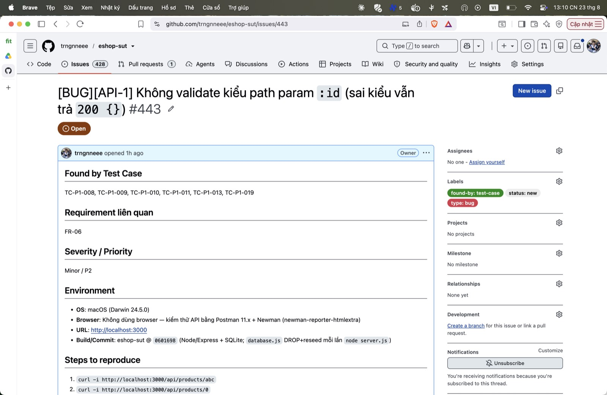

## Found by Test Case

TC-P1-008, TC-P1-009, TC-P1-010, TC-P1-011, TC-P1-013, TC-P1-019

## Requirement liên quan

FR-06

## Severity / Priority

Minor / P2

## Environment

- **OS**: macOS (Darwin 24.5.0)
- **Browser**: Không dùng browser — kiểm thử API bằng Postman 11.x + Newman (newman-reporter-htmlextra)
- **URL**: http://localhost:3000
- **Build/Commit**: eshop-sut @ `0601698` (Node/Express + SQLite; `database.js` DROP+reseed mỗi lần `node server.js`)

## Steps to reproduce

1. `curl -i http://localhost:3000/api/products/abc`
2. `curl -i http://localhost:3000/api/products/0`
3. `curl -i http://localhost:3000/api/products/-1`
4. `curl -i http://localhost:3000/api/products/1.5`

## Expected result

`400 Bad Request` + `{error}` khi id không phải integer ≥ 1.

## Actual result

`200 OK` + `{}` — không có tầng validate param.

**Root cause:** Route không validate `req.params.id`; SQLite so chuỗi với cột `id INTEGER` không khớp ⇒ trả 200 {}.

**Fix gợi ý:** Validate `id` là integer ≥ 1 (regex `^[1-9]\d*$`) ⇒ 400 nếu sai; kết hợp fix not-found.

## Evidence

TC-P1-013 (`/products/abc`) assert 400 FAIL (nhận 200).

Run tổng: **Postman Runner 905 tests → 629 pass / 276 fail**; **Newman 893 assertions / 327 failed** (các fail là bằng chứng bug, không phải lỗi test).

- `tests/api_testing/newman/report.html` (htmlextra — lọc theo TC-ID ở cột Failed)
- `tests/api_testing/newman/screenshots/postman-run-result.jpg`
- `tests/api_testing/newman/screenshots/newman-terminal-localhost.jpg` (chứng minh host `localhost:3000`)
- `tests/api_testing/newman/screenshots/newman-htmlextra-summary.jpg`

**GitHub Issue:** [#443](https://github.com/trngnneee/eshop-sut/issues/443)

**Screenshot Issue:**

