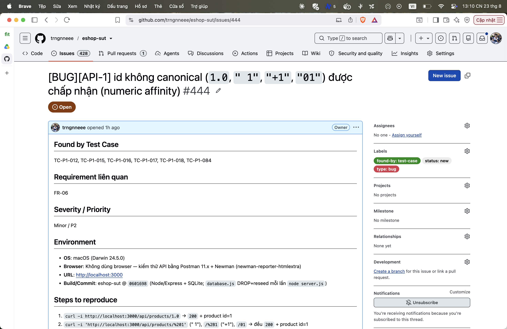

## Found by Test Case

TC-P1-012, TC-P1-015, TC-P1-016, TC-P1-017, TC-P1-018, TC-P1-084

## Requirement liên quan

FR-06

## Severity / Priority

Minor / P2

## Environment

- **OS**: macOS (Darwin 24.5.0)
- **Browser**: Không dùng browser — kiểm thử API bằng Postman 11.x + Newman (newman-reporter-htmlextra)
- **URL**: http://localhost:3000
- **Build/Commit**: eshop-sut @ `0601698` (Node/Express + SQLite; `database.js` DROP+reseed mỗi lần `node server.js`)

## Steps to reproduce

1. `curl -i http://localhost:3000/api/products/1.0` → `200` + product id=1
2. `curl -i 'http://localhost:3000/api/products/%201'` (" 1"), `/%2B1` ("+1"), `/01` → đều `200` + product id=1

## Expected result

`400` theo quyết định contract DEC-01 (strict): các dạng chuỗi số không canonical bị từ chối.

## Actual result

`200` + product id=1 — SQLite numeric affinity tự strip khoảng trắng, bỏ dấu `+`, bỏ zero đứng đầu, ép `1.0`→`1`.

**Root cause:** Route không validate param + tầng DB tự ép kiểu (rò rỉ affinity lên tầng API).

**Fix gợi ý:** Validate `:id` là dạng canonical của integer trước query (regex `^[1-9]\d*$`).

## Evidence

TC-P1-012/084 assert 400 FAIL (nhận 200 + id=1).

Run tổng: **Postman Runner 905 tests → 629 pass / 276 fail**; **Newman 893 assertions / 327 failed** (các fail là bằng chứng bug, không phải lỗi test).

- `tests/api_testing/newman/report.html` (htmlextra — lọc theo TC-ID ở cột Failed)
- `tests/api_testing/newman/screenshots/postman-run-result.png`
- `tests/api_testing/newman/screenshots/newman-terminal-localhost.png` (chứng minh host `localhost:3000`)
- `tests/api_testing/newman/screenshots/newman-htmlextra-summary.png`

**GitHub Issue:** [#444](https://github.com/trngnneee/eshop-sut/issues/444)

**Screenshot Issue:**

