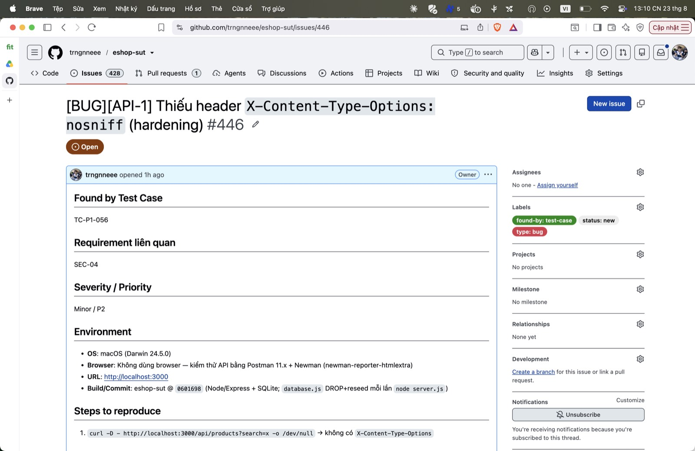

## Found by Test Case

TC-P1-056

## Requirement liên quan

SEC-04

## Severity / Priority

Minor / P2

## Environment

- **OS**: macOS (Darwin 24.5.0)
- **Browser**: Không dùng browser — kiểm thử API bằng Postman 11.x + Newman (newman-reporter-htmlextra)
- **URL**: http://localhost:3000
- **Build/Commit**: eshop-sut @ `0601698` (Node/Express + SQLite; `database.js` DROP+reseed mỗi lần `node server.js`)

## Steps to reproduce

1. `curl -D - http://localhost:3000/api/products?search=x -o /dev/null` → không có `X-Content-Type-Options`

## Expected result

Response có `X-Content-Type-Options: nosniff` để chặn browser đoán MIME.

## Actual result

Thiếu header — kết hợp với các vector XSS (name/description lưu raw) làm tăng rủi ro ở tầng render.

**Root cause:** App không set security headers (không dùng `helmet`).

**Fix gợi ý:** Dùng `helmet()` hoặc set thủ công `X-Content-Type-Options`, `Content-Security-Policy`.

## Evidence

TC-P1-056 assert có header nosniff FAIL (thiếu). Khuyến nghị hardening.

Run tổng: **Postman Runner 905 tests → 629 pass / 276 fail**; **Newman 893 assertions / 327 failed** (các fail là bằng chứng bug, không phải lỗi test).

- `tests/api_testing/newman/report.html` (htmlextra — lọc theo TC-ID ở cột Failed)
- `tests/api_testing/newman/screenshots/postman-run-result.jpg`
- `tests/api_testing/newman/screenshots/newman-terminal-localhost.jpg` (chứng minh host `localhost:3000`)
- `tests/api_testing/newman/screenshots/newman-htmlextra-summary.jpg`

**GitHub Issue:** [#446](https://github.com/trngnneee/eshop-sut/issues/446)

**Screenshot Issue:**

