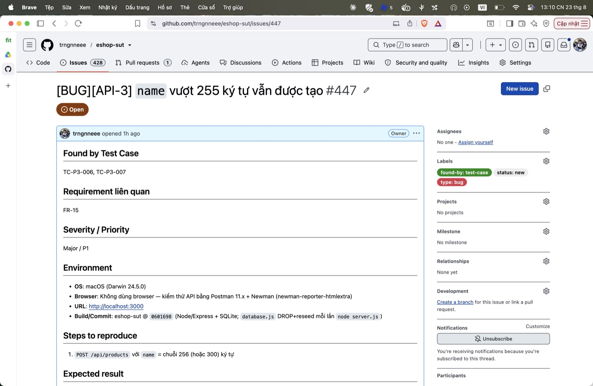

## Found by Test Case

TC-P3-006, TC-P3-007

## Requirement liên quan

FR-15

## Severity / Priority

Major / P1

## Environment

- **OS**: macOS (Darwin 24.5.0)
- **Browser**: Không dùng browser — kiểm thử API bằng Postman 11.x + Newman (newman-reporter-htmlextra)
- **URL**: http://localhost:3000
- **Build/Commit**: eshop-sut @ `0601698` (Node/Express + SQLite; `database.js` DROP+reseed mỗi lần `node server.js`)

## Steps to reproduce

1. `POST /api/products` với `name` = chuỗi 256 (hoặc 300) ký tự

## Expected result

`400` — FR-15 giới hạn `name` tối đa 255 ký tự.

## Actual result

`200` created — không kiểm độ dài.

**Root cause:** `server.js:167-177` — không kiểm `name.length`; cột `name TEXT` không đặt trần.

**Fix gợi ý:** Validate `name.length <= 255` ⇒ 400 nếu vượt.

## Evidence

TC-P3-006/007 assert 400 FAIL (nhận 200).

Run tổng: **Postman Runner 905 tests → 629 pass / 276 fail**; **Newman 893 assertions / 327 failed** (các fail là bằng chứng bug, không phải lỗi test).

- `tests/api_testing/newman/report.html` (htmlextra — lọc theo TC-ID ở cột Failed)
- `tests/api_testing/newman/screenshots/postman-run-result.jpg`
- `tests/api_testing/newman/screenshots/newman-terminal-localhost.jpg` (chứng minh host `localhost:3000`)
- `tests/api_testing/newman/screenshots/newman-htmlextra-summary.jpg`

**GitHub Issue:** [#447](https://github.com/trngnneee/eshop-sut/issues/447)

**Screenshot Issue:**

