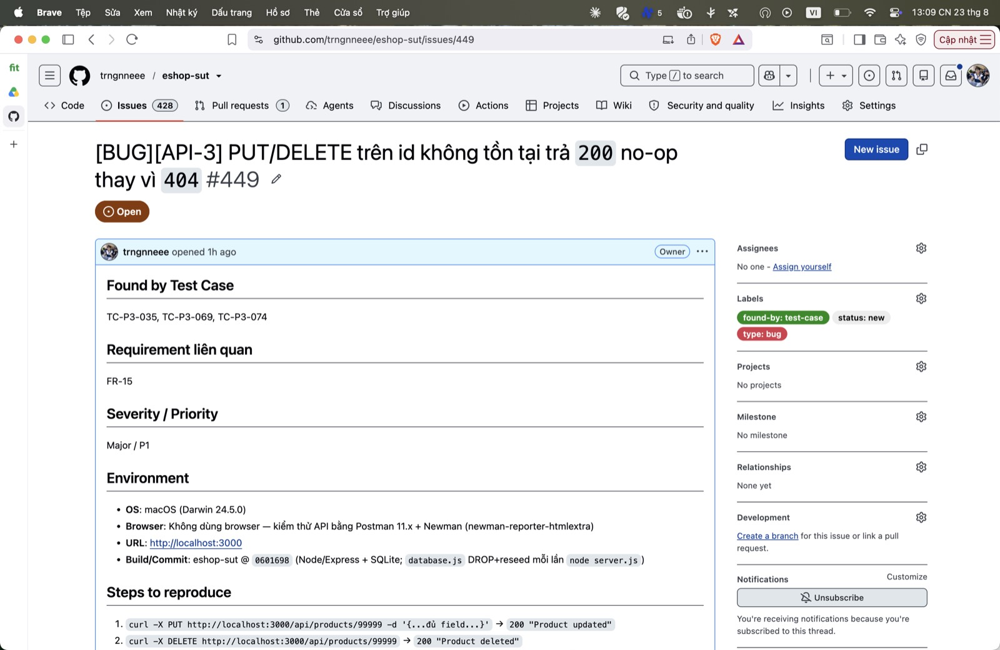

## Found by Test Case

TC-P3-035, TC-P3-069, TC-P3-074

## Requirement liên quan

FR-15

## Severity / Priority

Major / P1

## Environment

- **OS**: macOS (Darwin 24.5.0)
- **Browser**: Không dùng browser — kiểm thử API bằng Postman 11.x + Newman (newman-reporter-htmlextra)
- **URL**: http://localhost:3000
- **Build/Commit**: eshop-sut @ `0601698` (Node/Express + SQLite; `database.js` DROP+reseed mỗi lần `node server.js`)

## Steps to reproduce

1. `curl -X PUT http://localhost:3000/api/products/99999 -d '{...đủ field...}'` → `200 "Product updated"`
2. `curl -X DELETE http://localhost:3000/api/products/99999` → `200 "Product deleted"`

## Expected result

`404 Not Found` khi id không tồn tại.

## Actual result

`200` + message thành công (no-op im lặng).

**Root cause:** `server.js:179-189` (PUT) và `:191-195` (DELETE) không kiểm `this.changes === 0`.

**Fix gợi ý:** Sau `db.run`, nếu `this.changes === 0` ⇒ `res.status(404).json({error:'Product not found'})`.

## Evidence

TC-P3-035 assert 404 FAIL (nhận 200). TC-P3-074 (DELETE 99999) FAIL.

Run tổng: **Postman Runner 905 tests → 629 pass / 276 fail**; **Newman 893 assertions / 327 failed** (các fail là bằng chứng bug, không phải lỗi test).

- `tests/api_testing/newman/report.html` (htmlextra — lọc theo TC-ID ở cột Failed)
- `tests/api_testing/newman/screenshots/postman-run-result.jpg`
- `tests/api_testing/newman/screenshots/newman-terminal-localhost.jpg` (chứng minh host `localhost:3000`)
- `tests/api_testing/newman/screenshots/newman-htmlextra-summary.jpg`

**GitHub Issue:** [#449](https://github.com/trngnneee/eshop-sut/issues/449)

**Screenshot Issue:**

