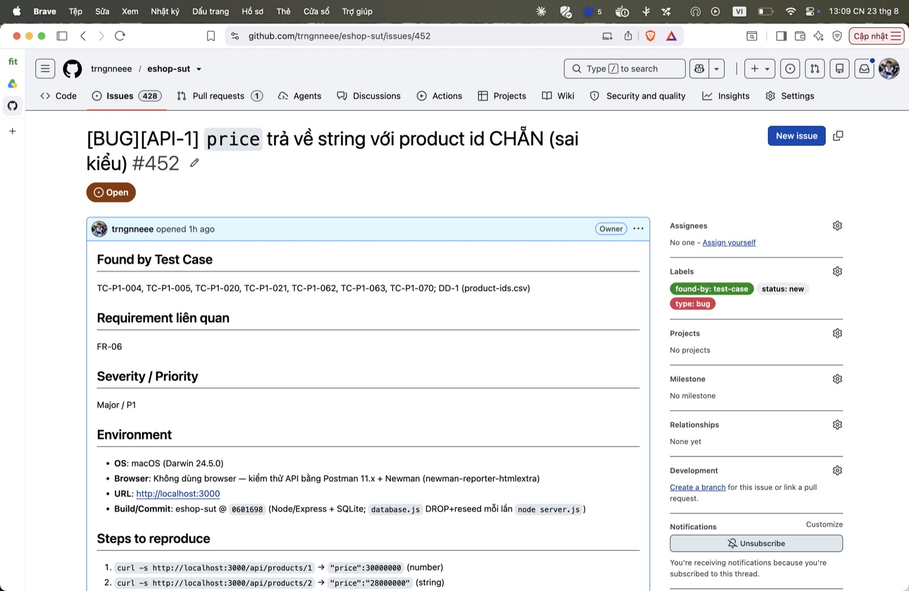

## Found by Test Case

TC-P1-004, TC-P1-005, TC-P1-020, TC-P1-021, TC-P1-062, TC-P1-063, TC-P1-070; DD-1 (product-ids.csv)

## Requirement liên quan

FR-06

## Severity / Priority

Major / P1

## Environment

- **OS**: macOS (Darwin 24.5.0)
- **Browser**: Không dùng browser — kiểm thử API bằng Postman 11.x + Newman (newman-reporter-htmlextra)
- **URL**: http://localhost:3000
- **Build/Commit**: eshop-sut @ `0601698` (Node/Express + SQLite; `database.js` DROP+reseed mỗi lần `node server.js`)

## Steps to reproduce

1. `curl -s http://localhost:3000/api/products/1` → `"price":30000000` (number)
2. `curl -s http://localhost:3000/api/products/2` → `"price":"28000000"` (string)
3. So kiểu `price` giữa id lẻ và id chẵn; hoặc chạy DD-1 với `product-ids.csv` (id 1..5)

## Expected result

`price` LUÔN là number với mọi id (cột DB khai báo `price INTEGER`). Detail và list phải cùng kiểu.

## Actual result

id CHẴN (2,4): `price` trả về là string (`"28000000"`). id lẻ (1,3,5): number. Endpoint list `GET /api/products` lại trả number cho cùng product ⇒ lệch giữa 2 endpoint.

**Root cause:** `server.js:161-162` — `if (row.id % 2 === 0) row.price = row.price.toString();` ép price sang string cho id chẵn.

**Fix gợi ý:** Bỏ nhánh `id % 2` — trả `row` nguyên bản, giữ `price` là number.

## Evidence

Postman: tab Test Results của TC-P1-004 (`typeof price === "number"` FAIL) và TC-P1-021 (cross-endpoint FAIL).

Run tổng: **Postman Runner 905 tests → 629 pass / 276 fail**; **Newman 893 assertions / 327 failed** (các fail là bằng chứng bug, không phải lỗi test).

- `tests/api_testing/newman/report.html` (htmlextra — lọc theo TC-ID ở cột Failed)
- `tests/api_testing/newman/screenshots/postman-run-result.jpg`
- `tests/api_testing/newman/screenshots/newman-terminal-localhost.jpg` (chứng minh host `localhost:3000`)
- `tests/api_testing/newman/screenshots/newman-htmlextra-summary.jpg`

**GitHub Issue:** [#452](https://github.com/trngnneee/eshop-sut/issues/452)

**Screenshot Issue:**

