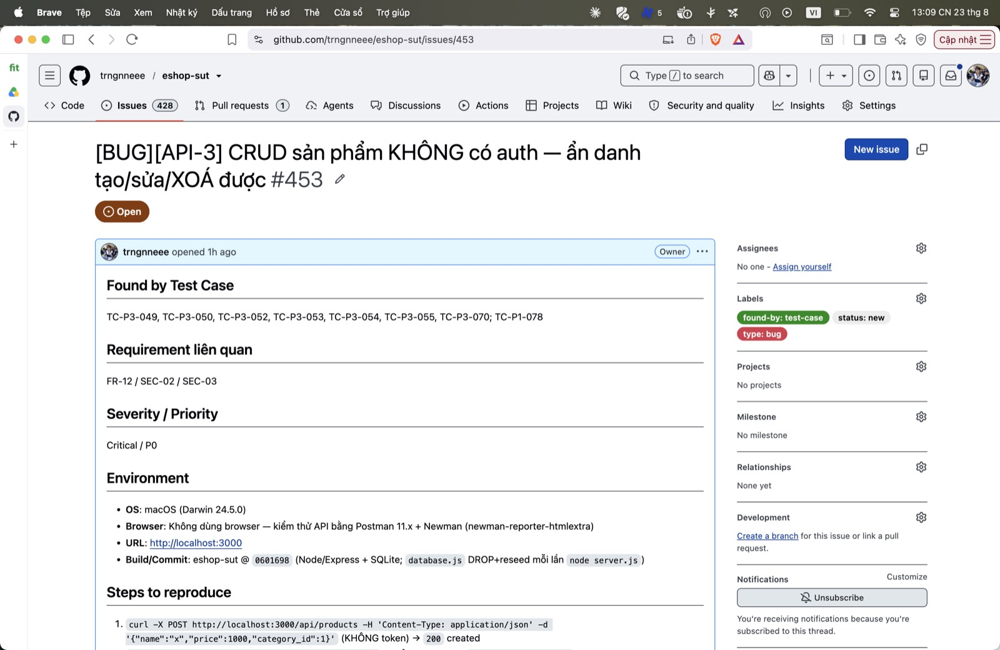

## Found by Test Case

TC-P3-049, TC-P3-050, TC-P3-052, TC-P3-053, TC-P3-054, TC-P3-055, TC-P3-070; TC-P1-078

## Requirement liên quan

FR-12 / SEC-02 / SEC-03

## Severity / Priority

Critical / P0

## Environment

- **OS**: macOS (Darwin 24.5.0)
- **Browser**: Không dùng browser — kiểm thử API bằng Postman 11.x + Newman (newman-reporter-htmlextra)
- **URL**: http://localhost:3000
- **Build/Commit**: eshop-sut @ `0601698` (Node/Express + SQLite; `database.js` DROP+reseed mỗi lần `node server.js`)

## Steps to reproduce

1. `curl -X POST http://localhost:3000/api/products -H 'Content-Type: application/json' -d '{"name":"x","price":1000,"category_id":1}'` (KHÔNG token) → `200` created
2. `curl -X DELETE http://localhost:3000/api/products/5` (KHÔNG token) → `200 "Product deleted"`; GET → không còn
3. Đối chứng: `curl -X POST http://localhost:3000/api/admin/import-products` (không token) → `401` (route này CÓ auth)

## Expected result

`401` khi thiếu token, `403` khi `role != admin` (FR-12: CRUD dành cho Admin).

## Actual result

`200` — ẩn danh tạo/sửa/xoá toàn bộ catalog sản phẩm.

**Root cause:** `server.js:167` (POST), `:179` (PUT), `:191` (DELETE) thiếu `authenticateToken` và không kiểm `role` (so với `:199` import-products có gắn — TC-P3-056 PASS).

**Fix gợi ý:** Gắn `authenticateToken` + middleware `requireAdmin` (kiểm `req.user.role==='admin'`) cho cả 3 route.

## Evidence

TC-P3-054 (DELETE không token → assert 401) FAIL (nhận 200, xoá thật). TC-P3-056 PASS (đối chứng).

Run tổng: **Postman Runner 905 tests → 629 pass / 276 fail**; **Newman 893 assertions / 327 failed** (các fail là bằng chứng bug, không phải lỗi test).

- `tests/api_testing/newman/report.html` (htmlextra — lọc theo TC-ID ở cột Failed)
- `tests/api_testing/newman/screenshots/postman-run-result.jpg`
- `tests/api_testing/newman/screenshots/newman-terminal-localhost.jpg` (chứng minh host `localhost:3000`)
- `tests/api_testing/newman/screenshots/newman-htmlextra-summary.jpg`

**GitHub Issue:** [#453](https://github.com/trngnneee/eshop-sut/issues/453)

**Screenshot Issue:**

