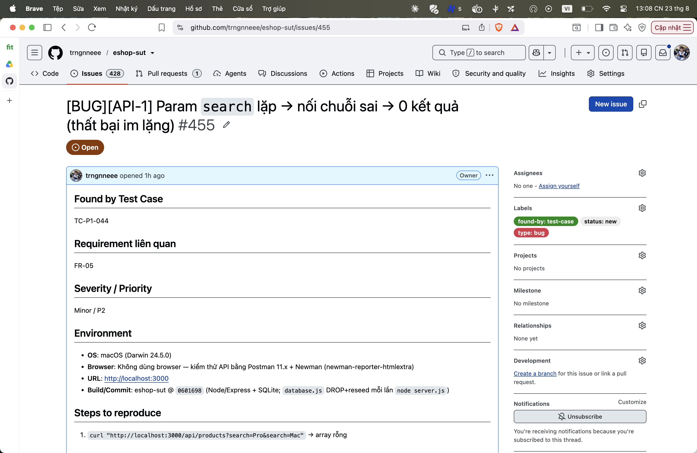

## Found by Test Case

TC-P1-044

## Requirement liên quan

FR-05

## Severity / Priority

Minor / P2

## Environment

- **OS**: macOS (Darwin 24.5.0)
- **Browser**: Không dùng browser — kiểm thử API bằng Postman 11.x + Newman (newman-reporter-htmlextra)
- **URL**: http://localhost:3000
- **Build/Commit**: eshop-sut @ `0601698` (Node/Express + SQLite; `database.js` DROP+reseed mỗi lần `node server.js`)

## Steps to reproduce

1. `curl "http://localhost:3000/api/products?search=Pro&search=Mac"` → array rỗng

## Expected result

`400 Invalid search parameter`, HOẶC dùng giá trị đầu và trả 3 kết quả của `Pro`.

## Actual result

`200` + array rỗng — Express parse `search` thành `['Pro','Mac']`, nối thành `LIKE '%Pro,Mac%'`.

**Root cause:** `server.js:144` không kiểm `typeof req.query.search === 'string'`.

**Fix gợi ý:** Kiểm kiểu param; nếu là array ⇒ 400 hoặc lấy phần tử đầu.

## Evidence

TC-P1-044 assert length 0 — case cố ý ghi nhận hành vi sai (thất bại im lặng).

Run tổng: **Postman Runner 905 tests → 629 pass / 276 fail**; **Newman 893 assertions / 327 failed** (các fail là bằng chứng bug, không phải lỗi test).

- `tests/api_testing/newman/report.html` (htmlextra — lọc theo TC-ID ở cột Failed)
- `tests/api_testing/newman/screenshots/postman-run-result.png`
- `tests/api_testing/newman/screenshots/newman-terminal-localhost.png` (chứng minh host `localhost:3000`)
- `tests/api_testing/newman/screenshots/newman-htmlextra-summary.png`

**GitHub Issue:** [#455](https://github.com/trngnneee/eshop-sut/issues/455)

**Screenshot Issue:**

