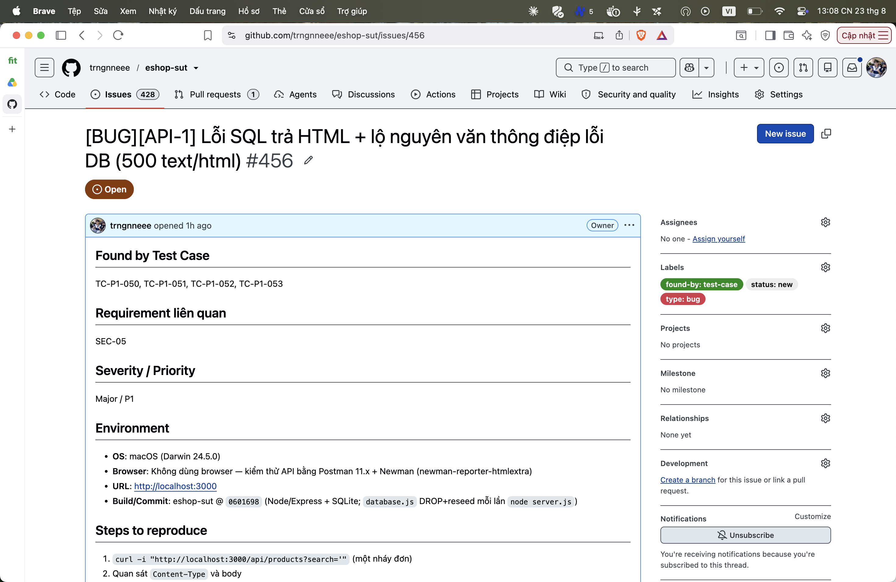

## Found by Test Case

TC-P1-050, TC-P1-051, TC-P1-052, TC-P1-053

## Requirement liên quan

SEC-05

## Severity / Priority

Major / P1

## Environment

- **OS**: macOS (Darwin 24.5.0)
- **Browser**: Không dùng browser — kiểm thử API bằng Postman 11.x + Newman (newman-reporter-htmlextra)
- **URL**: http://localhost:3000
- **Build/Commit**: eshop-sut @ `0601698` (Node/Express + SQLite; `database.js` DROP+reseed mỗi lần `node server.js`)

## Steps to reproduce

1. `curl -i "http://localhost:3000/api/products?search='"` (một nháy đơn)
2. Quan sát `Content-Type` và body

## Expected result

Nếu 5xx: body là JSON `{error}` với thông điệp chung chung, KHÔNG lộ engine/cấu trúc query.

## Actual result

`500` + `Content-Type: text/html` + `<h1>Database Error</h1>
SQLITE_ERROR: unrecognized token: "'"
`.

**Root cause:** `server.js:146-149` — `res.status(500).send('<h1>Database Error</h1>
' + err.message + '
')`.

**Fix gợi ý:** Trả JSON chung chung `res.status(500).json({error:'Internal server error'})`; log chi tiết server-side; parameterized query.

## Evidence

TC-P1-050 assert Content-Type application/json + không chứa `<h1>`/`SQLITE` FAIL.

Run tổng: **Postman Runner 905 tests → 629 pass / 276 fail**; **Newman 893 assertions / 327 failed** (các fail là bằng chứng bug, không phải lỗi test).

- `tests/api_testing/newman/report.html` (htmlextra — lọc theo TC-ID ở cột Failed)
- `tests/api_testing/newman/screenshots/postman-run-result.png`
- `tests/api_testing/newman/screenshots/newman-terminal-localhost.png` (chứng minh host `localhost:3000`)
- `tests/api_testing/newman/screenshots/newman-htmlextra-summary.png`

**GitHub Issue:** [#456](https://github.com/trngnneee/eshop-sut/issues/456)

**Screenshot Issue:**

