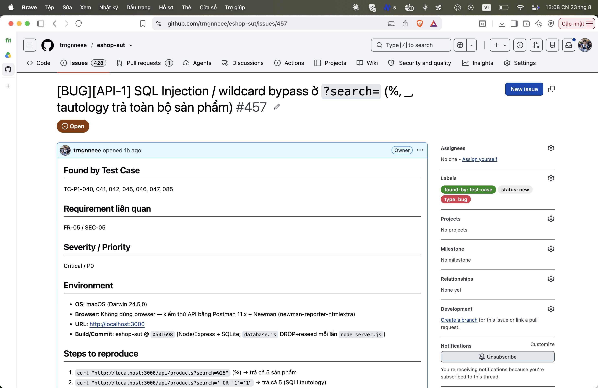

## Found by Test Case

TC-P1-040, 041, 042, 045, 046, 047, 085

## Requirement liên quan

FR-05 / SEC-05

## Severity / Priority

Critical / P0

## Environment

- **OS**: macOS (Darwin 24.5.0)
- **Browser**: Không dùng browser — kiểm thử API bằng Postman 11.x + Newman (newman-reporter-htmlextra)
- **URL**: http://localhost:3000
- **Build/Commit**: eshop-sut @ `0601698` (Node/Express + SQLite; `database.js` DROP+reseed mỗi lần `node server.js`)

## Steps to reproduce

1. `curl "http://localhost:3000/api/products?search=%25"` (%) → trả cả 5 sản phẩm
2. `curl "http://localhost:3000/api/products?search=' OR '1'='1"` → trả cả 5 (SQLi tautology)
3. `curl "http://localhost:3000/api/products?search='; DROP TABLE products;--"` → 5 (DROP không chạy vì db.all 1 statement)

## Expected result

Coi `%`/`_` và mọi ký tự người dùng nhập là literal ⇒ 0 kết quả; dùng parameterized query.

## Actual result

Trả TOÀN BỘ sản phẩm — bộ lọc bị bypass; endpoint có lỗ hổng SQL Injection thật.

**Root cause:** `server.js:144` — `` `SELECT * FROM products WHERE name LIKE '%${searchQuery}%'` `` nối chuỗi thẳng.

**Fix gợi ý:** Dùng parameterized query `WHERE name LIKE ? ESCAPE '\'` + escape `%`/`_` trong từ khóa.

## Evidence

TC-P1-040 (`%`) assert length 0 FAIL (nhận 5). TC-P1-045 (tautology) FAIL.

Run tổng: **Postman Runner 905 tests → 629 pass / 276 fail**; **Newman 893 assertions / 327 failed** (các fail là bằng chứng bug, không phải lỗi test).

- `tests/api_testing/newman/report.html` (htmlextra — lọc theo TC-ID ở cột Failed)
- `tests/api_testing/newman/screenshots/postman-run-result.png`
- `tests/api_testing/newman/screenshots/newman-terminal-localhost.png` (chứng minh host `localhost:3000`)
- `tests/api_testing/newman/screenshots/newman-htmlextra-summary.png`

**GitHub Issue:** [#457](https://github.com/trngnneee/eshop-sut/issues/457)

**Screenshot Issue:**

