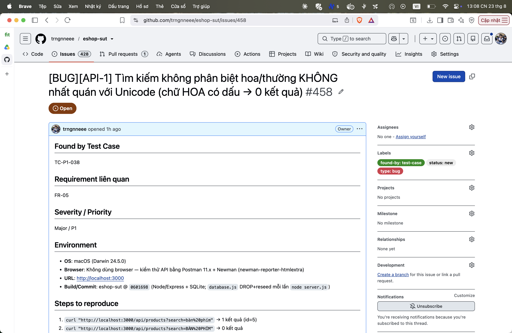

## Found by Test Case

TC-P1-038

## Requirement liên quan

FR-05

## Severity / Priority

Major / P1

## Environment

- **OS**: macOS (Darwin 24.5.0)
- **Browser**: Không dùng browser — kiểm thử API bằng Postman 11.x + Newman (newman-reporter-htmlextra)
- **URL**: http://localhost:3000
- **Build/Commit**: eshop-sut @ `0601698` (Node/Express + SQLite; `database.js` DROP+reseed mỗi lần `node server.js`)

## Steps to reproduce

1. `curl "http://localhost:3000/api/products?search=bàn%20phím"` → 1 kết quả (id=5)
2. `curl "http://localhost:3000/api/products?search=BÀN%20PHÍM"` → 0 kết quả

## Expected result

Không phân biệt hoa/thường nhất quán cho cả ASCII và Unicode ⇒ `BÀN PHÍM` phải ra 1 kết quả (id=5).

## Actual result

Chữ thường có dấu ra 1 kết quả; chữ HOA có dấu ra 0 — không nhất quán, lỗi với người dùng VN.

**Root cause:** `LIKE` của SQLite chỉ case-fold ASCII, không fold Unicode (cần ICU extension).

**Fix gợi ý:** Dùng collation Unicode/ICU, hoặc normalize + lower phía ứng dụng trước khi so khớp.

## Evidence

TC-P1-038 assert array length 1 + id=5 FAIL (nhận 0).

Run tổng: **Postman Runner 905 tests → 629 pass / 276 fail**; **Newman 893 assertions / 327 failed** (các fail là bằng chứng bug, không phải lỗi test).

- `tests/api_testing/newman/report.html` (htmlextra — lọc theo TC-ID ở cột Failed)
- `tests/api_testing/newman/screenshots/postman-run-result.png`
- `tests/api_testing/newman/screenshots/newman-terminal-localhost.png` (chứng minh host `localhost:3000`)
- `tests/api_testing/newman/screenshots/newman-htmlextra-summary.png`

**GitHub Issue:** [#458](https://github.com/trngnneee/eshop-sut/issues/458)

**Screenshot Issue:**

