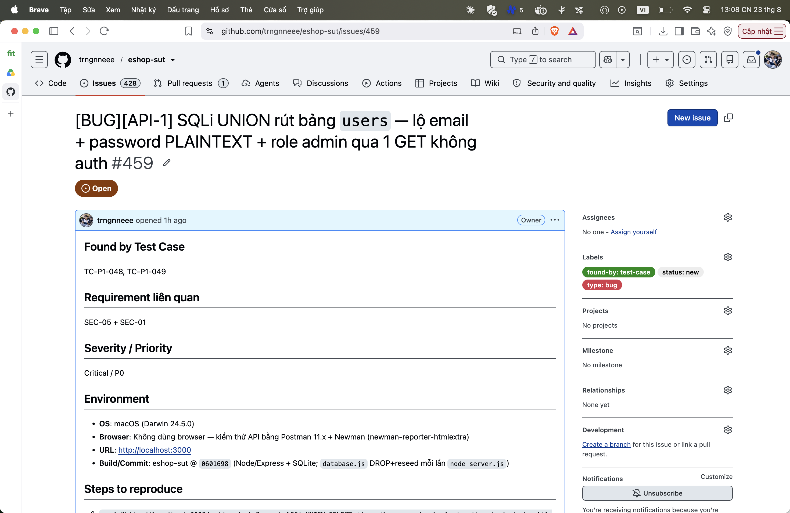

## Found by Test Case

TC-P1-048, TC-P1-049

## Requirement liên quan

SEC-05 + SEC-01

## Severity / Priority

Critical / P0

## Environment

- **OS**: macOS (Darwin 24.5.0)
- **Browser**: Không dùng browser — kiểm thử API bằng Postman 11.x + Newman (newman-reporter-htmlextra)
- **URL**: http://localhost:3000
- **Build/Commit**: eshop-sut @ `0601698` (Node/Express + SQLite; `database.js` DROP+reseed mỗi lần `node server.js`)

## Steps to reproduce

1. `curl "http://localhost:3000/api/products?search=%25' UNION SELECT id,email,password,role,login_attempts,locked_until FROM users--"`
2. Body: phần tử đầu = `{"id":1,"name":"admin@eshop.com","price":"Admin123!","description":"admin",...}`

## Expected result

Array rỗng; KHÔNG lộ bất kỳ dữ liệu nào của bảng `users`.

## Actual result

Trả 7 phần tử; lộ email + mật khẩu plaintext + role của admin ⇒ chiếm tài khoản admin bằng 1 request GET.

**Root cause:** Cùng gốc lỗi nối chuỗi ở `server.js:144` + mật khẩu lưu plaintext (`database.js:87-88`).

**Fix gợi ý:** Parameterized query (chặn UNION); hash mật khẩu (bcrypt).

## Evidence

TC-P1-048 assert body không chứa `@eshop.com`/`Admin123!` FAIL (lộ credential).

Run tổng: **Postman Runner 905 tests → 629 pass / 276 fail**; **Newman 893 assertions / 327 failed** (các fail là bằng chứng bug, không phải lỗi test).

- `tests/api_testing/newman/report.html` (htmlextra — lọc theo TC-ID ở cột Failed)
- `tests/api_testing/newman/screenshots/postman-run-result.png`
- `tests/api_testing/newman/screenshots/newman-terminal-localhost.png` (chứng minh host `localhost:3000`)
- `tests/api_testing/newman/screenshots/newman-htmlextra-summary.png`

**GitHub Issue:** [#459](https://github.com/trngnneee/eshop-sut/issues/459)

**Screenshot Issue:**

