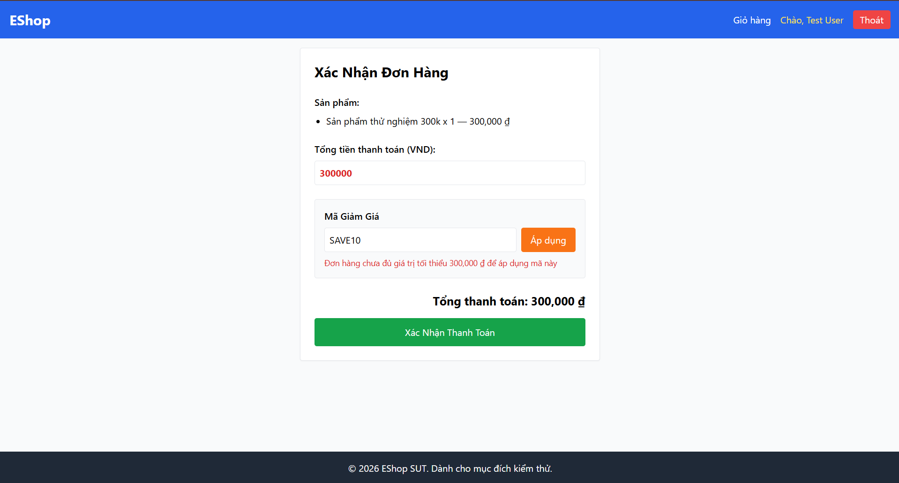

Title: [BUG][Coupon] Lỗi so sánh nghiêm ngặt tại ngưỡng đơn hàng tối thiểu (min_order_amount)

## Found by Test Case
TC-COUPON-001, TC-COUPON-004

## Requirement liên quan
FR-09: Discount coupons (Điều kiện C3)

## Severity / Priority
Major / P1

## Environment
Chrome, Windows, Backend Node.js API, SQLite Database

## Steps to reproduce
1. Thêm vào giỏ `Sản phẩm thử nghiệm 300k`.
2. Nhập mã "SAVE10".
3. Nhấn "Áp dụng".

## Expected result
Hệ thống áp dụng thành công mã giảm giá và trả về HTTP 200.

## Actual result
Hệ thống từ chối áp dụng mã giảm giá, trả về HTTP 400 và báo lỗi: `"Đơn hàng chưa đủ giá trị tối thiểu 300,000 ₫ để áp dụng mã này"`.

## Evidence

---
*Nhãn (Labels) cần gắn:* `type: bug`, `module: coupon`, `severity: major`, `priority: P1`, `status: new`, `found-by: test-case`
