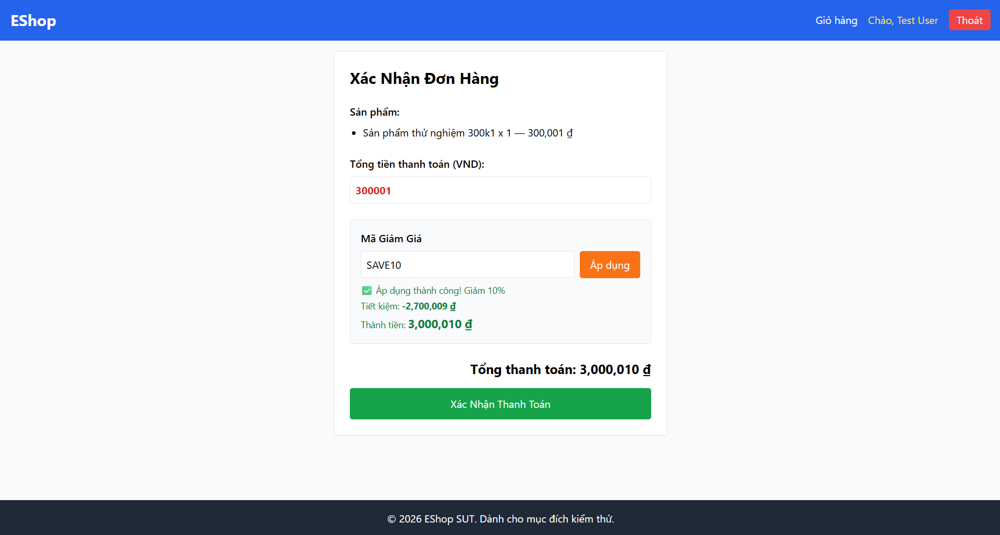

Title: [BUG][Coupon] Sai công thức tính giá trị giảm giá theo tỷ lệ phần trăm (percent)

## Found by Test Case
TC-COUPON-001, TC-COUPON-003

## Requirement liên quan
FR-09: Discount coupons (Công thức tính giảm giá phần trăm)

## Severity / Priority
Critical / P0

## Environment
Chrome, Windows, Backend Node.js API, SQLite Database

## Steps to reproduce
1. Thêm vào giỏ `Sản phẩm thử nghiệm 301k`.
2. Nhập mã "SAVE10".
3. Nhấn "Áp dụng".

## Expected result
- Số tiền giảm giá (`discount_amount`) phải là `30,000 ₫` (10% của 300,001 ₫).
- Số tiền thanh toán cuối cùng (`final_amount`) phải là `270,001 ₫`.

## Actual result
- Số tiền giảm giá tính ra âm: `discount_amount = -2,700,009 ₫`.
- Số tiền thanh toán cuối cùng tăng vọt: `final_amount = 3,000,010 ₫`.

## Evidence

---
*Nhãn (Labels) cần gắn:* `type: bug`, `module: coupon`, `severity: critical`, `priority: P0`, `status: new`, `found-by: test-case`
