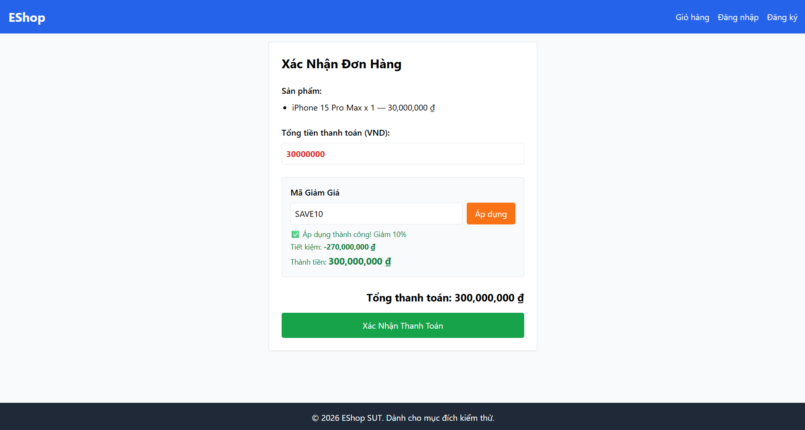

Title: [BUG][Coupon] Thiếu middleware xác thực (Authorization) cho API áp dụng mã giảm giá

## Found by Test Case
TC-COUPON-008

## Requirement liên quan
FR-09: Discount coupons (Điều kiện C4 - Đã đăng nhập)

## Severity / Priority
Major / P1

## Environment
Chrome, Windows, Backend Node.js API

## Steps to reproduce
1. Nhập mã "SAVE10".
2. Nhấn "Áp dụng".

## Expected result
- Trả về mã HTTP 401 Unauthorized do người dùng chưa đăng nhập.

## Actual result
- Hệ thống trả về HTTP 200 OK và áp dụng thành công mã giảm giá.

## Evidence

---
*Nhãn (Labels) cần gắn:* `type: bug`, `module: coupon`, `severity: major`, `priority: P1`, `status: new`, `found-by: test-case`
