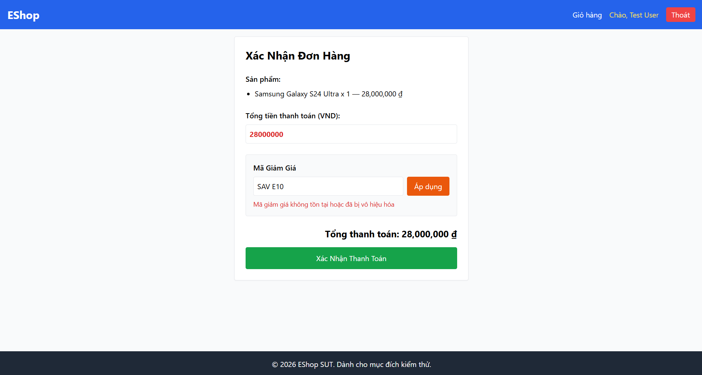

Title: [BUG][Coupon] Không tự động loại bỏ khoảng trắng (trim) ở đầu, cuối và giữa của mã coupon

## Found by Test Case
TC-COUPON-020, TC-COUPON-021, TC-COUPON-022

## Requirement liên quan
FR-09: Discount coupons

## Severity / Priority
Minor / P3

## Environment
Chrome, Windows, Backend Node.js API, SQLite Database

## Steps to reproduce
1. Đăng nhập tài khoản user.
2. Gửi request áp dụng mã giảm giá có khoảng trắng thừa như " SAVE10", "SAVE10 " hoặc "SAV E10".

## Expected result
Hệ thống Hệ thống tự động loại bỏ khoảng trắng dư thừa ở đầu, cuối và giữa của chuỗi mã giảm giá, sau đó áp dụng mã giảm giá thành công và trả về HTTP 200.

## Actual result
Hệ thống từ chối áp dụng và trả về HTTP 404 với thông báo lỗi: "Mã giảm giá không tồn tại hoặc đã bị vô hiệu hóa".

## Evidence

---
*Nhãn (Labels) cần gắn:* `type: bug`, `module: coupon`, `severity: minor`, `priority: P3`, `status: new`, `found-by: test-case`
