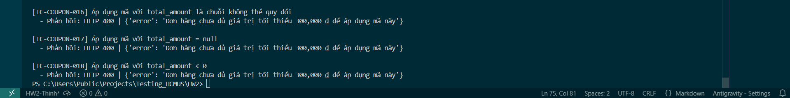

Title: [BUG][Coupon] Thiếu validate kiểu dữ liệu và khoảng giá trị cho total_amount

## Found by Test Case
TC-COUPON-017, TC-COUPON-018, TC-COUPON-019

## Requirement liên quan
FR-09: Discount coupons (Điều kiện C3)

## Severity / Priority
Minor / P3

## Environment
Backend Node.js API, SQLite Database

## Steps to reproduce
1. Đăng nhập hệ thống (có JWT token).
2. Gửi yêu cầu POST áp dụng mã giảm giá `SAVE10` với các giá trị không hợp lệ cho `total_amount`:
   - `"total_amount": "invalid_number"` (chuỗi chữ)
   - `"total_amount": null` (hoặc không truyền)
   - `"total_amount": -50000` (số âm)
   ```json
   {
     "code": "SAVE10",
     "total_amount": -50000,
     "user_id": 1
   }
   ```

## Expected result
Hệ thống từ chối áp dụng, trả về mã HTTP 400 và hiển thị thông báo lỗi phản ánh đúng nguyên nhân đầu vào không hợp lệ (ví dụ: "Tổng giá trị đơn hàng không hợp lệ").

## Actual result
Hệ thống trả về mã HTTP 400 nhưng thông báo lỗi là: `"Đơn hàng chưa đủ giá trị tối thiểu 300,000 ₫ để áp dụng mã này"`.

## Evidence


---
*Nhãn (Labels) cần gắn:* `type: bug`, `module: coupon`, `severity: minor`, `priority: P3`, `status: new`, `found-by: test-case`
