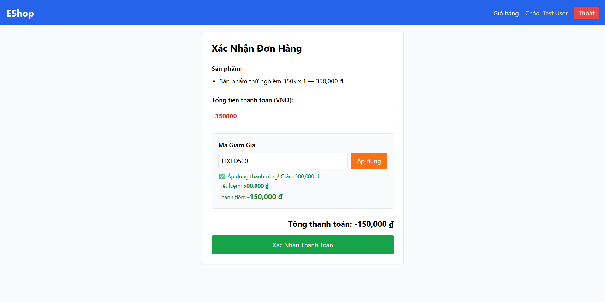

Title: [BUG][Coupon] Cho phép số tiền thanh toán final_amount nhận giá trị âm khi giá trị giảm của mã fixed lớn hơn tổng đơn hàng

## Found by Test Case
TC-COUPON-024

## Requirement liên quan
FR-09: Discount coupons

## Severity / Priority
Critical / P1

## Environment
Chrome, Windows, Backend Node.js API, SQLite Database

## Steps to reproduce
1. Đăng nhập tài khoản user.
2. Lên đơn hàng trị giá 350,000 VND.
3. Áp dụng mã fixed discount 500,000 VND (FIXED500) (mã có min_order_amount nhỏ hơn 350k).

## Expected result
Hệ thống Hệ thống áp dụng mã giảm giá thành công. Giá trị giảm giá (discount_amount) tối đa bằng tổng đơn hàng (30,000 VND) và số tiền thanh toán cuối cùng (final_amount) tối thiểu phải bằng 0 VND.

## Actual result
Hệ thống áp dụng thành công nhưng tính toán sai: trả về discount_amount = 50000 và final_amount = -20000 (cho phép số tiền âm).

## Evidence

---
*Nhãn (Labels) cần gắn:* `type: bug`, `module: coupon`, `severity: critical`, `priority: P1`, `status: new`, `found-by: test-case`
