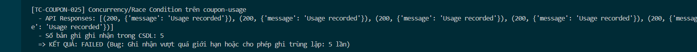

Title: [BUG][Coupon] Thiếu validate giới hạn sử dụng tối đa của coupon khi gọi API /api/coupon-usage và rủi ro Concurrency/Race Condition

## Found by Test Case
TC-COUPON-025

## Requirement liên quan
FR-09: Discount coupons

## Severity / Priority
High / P2

## Environment
Chrome, Windows, Backend Node.js API, SQLite Database

## Steps to reproduce
1. Đăng nhập tài khoản người dùng và lấy JWT Token.
2. Gửi đồng thời 5 request POST đến endpoint `/api/coupon-usage` để ghi nhận sử dụng mã `SAVE10` (mã có max_uses_per_user = 1) dưới dạng API request sau:
   ```http
   POST /api/coupon-usage HTTP/1.1
   Host: localhost:3000
   Content-Type: application/json
   Authorization: Bearer <token>

   {
     "coupon_id": 1
   }
   ```

## Expected result
Hệ thống Hệ thống thực hiện kiểm tra giới hạn sử dụng trong CSDL. Chỉ cho phép tối đa 1 lượt sử dụng của người dùng được lưu trữ trong CSDL, các request khác bị từ chối.

## Actual result
Hệ thống hoàn toàn không kiểm tra giới hạn sử dụng trên API /api/coupon-usage, cho phép ghi nhận thành công cả 5 lượt sử dụng trong CSDL.

## Evidence


---
*Nhãn (Labels) cần gắn:* `type: bug`, `module: coupon`, `severity: high`, `priority: P2`, `status: new`, `found-by: test-case`
