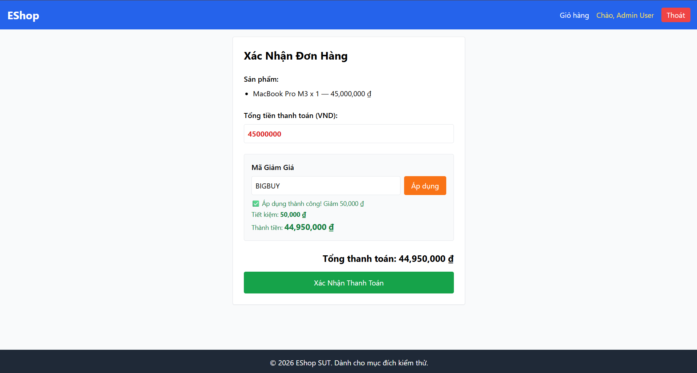

Title: [BUG][Coupon] Cho phép tài khoản Admin áp dụng mã giảm giá và mua hàng

## Found by Test Case
TC-COUPON-026

## Requirement liên quan
FR-09: Discount coupons

## Severity / Priority
Medium / P2

## Environment
Chrome, Windows, Backend Node.js API, SQLite Database

## Steps to reproduce
1. Đăng nhập tài khoản Admin.
2. Gửi request áp dụng mã giảm giá SAVE10 với đơn hàng trị giá 350,000 VND.

## Expected result
Hệ thống Hệ thống từ chối áp dụng mã giảm giá cho tài khoản Admin (trả về HTTP 403 Forbidden hoặc HTTP 400).

## Actual result
Hệ thống áp dụng mã giảm giá thành công cho Admin và trả về HTTP 200.

## Evidence

---
*Nhãn (Labels) cần gắn:* `type: bug`, `module: coupon`, `severity: medium`, `priority: P2`, `status: new`, `found-by: test-case`
