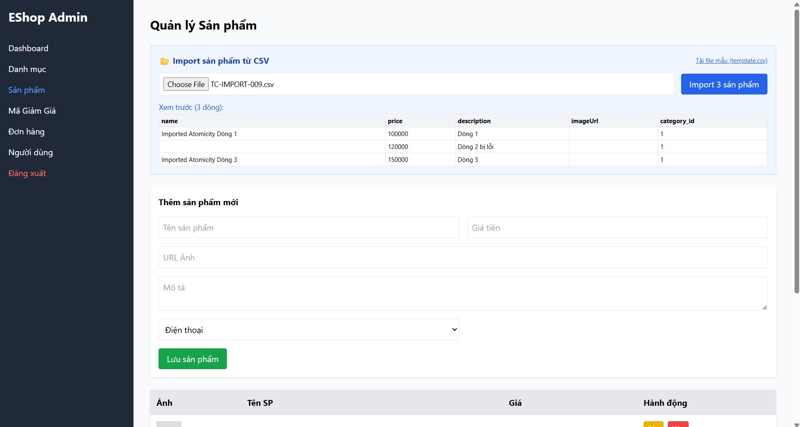
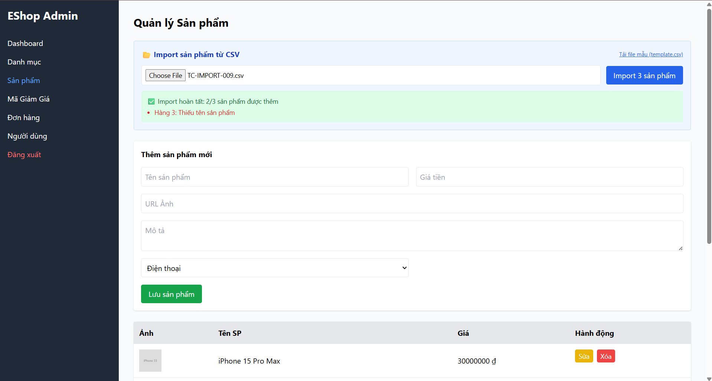

Title: [BUG][Import] Không đảm bảo tính giao dịch nguyên tử (Atomicity / Rollback)

## Found by Test Case
TC-IMPORT-009

## Requirement liên quan
FR-16: Import Sản phẩm từ CSV (Nếu có lỗi ở bất kỳ dòng nào, toàn bộ import phải được rollback)

## Severity / Priority
Critical / P0

## Environment
Backend Node.js API, SQLite Database

## Steps to reproduce
1. Admin đăng nhập và lấy JWT token.
2. Gửi API POST đến `/api/admin/import-products` với payload gồm 3 sản phẩm, trong đó dòng 2 có name rỗng:
   ```json
   {
     "products": [
       {"name": "SP Hợp Lệ 1", "price": 100000},
       {"name": "", "price": 120000},
       {"name": "SP Hợp Lệ 3", "price": 150000}
     ]
   }
   ```

## Expected result
- Hệ thống từ chối đăng ký và trả về HTTP 400.
- Giao dịch được rollback toàn bộ, không sản phẩm nào được lưu vào CSDL SQLite.

## Actual result
- Hệ thống trả về HTTP 200 OK.
- Hai sản phẩm "SP Hợp Lệ 1" và "SP Hợp Lệ 3" vẫn được insert thành công vào CSDL, chỉ bỏ qua dòng 2 bị lỗi. Ràng buộc all-or-nothing bị vi phạm.

## Evidence


---
*Nhãn (Labels) cần gắn:* `type: bug`, `module: admin`, `severity: critical`, `priority: P0`, `status: new`, `found-by: test-case`
