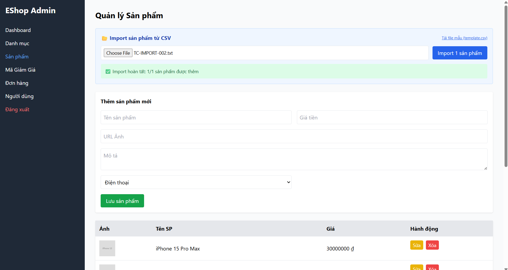

Title: [BUG][Import][Frontend] Giao diện Admin cho phép tải lên file có đuôi khác .csv

## Found by Test Case
TC-IMPORT-002

## Requirement liên quan
FR-16: Import Sản phẩm từ CSV (Yêu cầu đuôi file phải là .csv)

## Severity / Priority
Medium / P2

## Environment
Frontend Admin Web Dashboard (Chrome / Firefox)

## Steps to reproduce
1. Admin đăng nhập vào trang Dashboard.
2. Truy cập tab "Sản phẩm" -> phần "Import sản phẩm từ CSV".
3. Chọn và tải lên một file có phần mở rộng khác `.csv` (Ví dụ: `products.txt` hoặc `products.xlsx`).

## Expected result
- Hệ thống chặn tệp ngay tại giao diện và hiển thị thông báo lỗi định dạng tệp không hợp lệ.

## Actual result
- Giao diện Admin chấp nhận tệp tải lên và thực hiện đọc/parse nội dung tệp thô bằng FileReader.

## Evidence


## Cause analysis (Nguyên nhân)
Tại `frontend-admin/src/App.jsx` dòng 356:
Thẻ `<input type="file" />` thiếu thuộc tính `accept=".csv"` và hàm `onChange` không kiểm tra đuôi mở rộng `file.name` trước khi đọc tệp.

## Cách sửa đề xuất
Thêm thuộc tính `accept=".csv"` cho input file và kiểm tra tên tệp trước khi đọc:
```javascript
if (!file.name.endsWith('.csv')) {
  alert('Chỉ chấp nhận file .csv');
  return;
}
```

---
*Nhãn (Labels) cần gắn:* `type: bug`, `module: admin`, `severity: medium`, `priority: P2`, `status: new`, `found-by: test-case`
