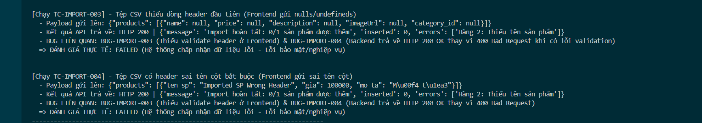

Title: [BUG][Import][Frontend] Thiếu validate dòng Header định dạng CSV ở Frontend

## Found by Test Case
TC-IMPORT-003, TC-IMPORT-004

## Requirement liên quan
FR-16: Import Sản phẩm từ CSV (Dòng đầu tiên là header: name,price,description,imageUrl,category_id)

## Severity / Priority
Medium / P2

## Environment
Frontend Admin Web Dashboard

## Steps to reproduce
1. Admin tải lên file CSV có header sai định dạng (Ví dụ: `tensp,gia,mota` hoặc không có header).
2. Nhấn nút "Import".

## Expected result
- Hệ thống cảnh báo dòng header không hợp lệ và từ chối gửi yêu cầu lên Backend.

## Actual result
- Hệ thống vẫn tiến hành parse và gửi mảng JSON chứa các giá trị `undefined` lên API Backend.

## Evidence

---
*Nhãn (Labels) cần gắn:* `type: bug`, `module: admin`, `severity: medium`, `priority: P2`, `status: new`, `found-by: test-case`
