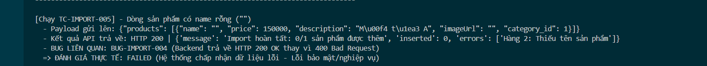

Title: [BUG][Import] Backend trả về HTTP 200 OK khi có lỗi xác thực dữ liệu (Empty Name)

## Found by Test Case
TC-IMPORT-005

## Requirement liên quan
FR-16: Import Sản phẩm từ CSV (Name không được rỗng)

## Severity / Priority
Major / P1

## Environment
Backend Node.js API

## Steps to reproduce
1. Gửi API POST đến `/api/admin/import-products` chứa sản phẩm có `name` rỗng `""`.

## Expected result
- Hệ thống từ chối yêu cầu, trả về HTTP 400 Bad Request cùng mô tả lỗi rõ ràng.

## Actual result
- Hệ thống trả về HTTP 200 OK cùng thông tin lỗi được nén trong mảng `errors` của body phản hồi.

## Evidence

---
*Nhãn (Labels) cần gắn:* `type: bug`, `module: admin`, `severity: major`, `priority: P1`, `status: new`, `found-by: test-case`
