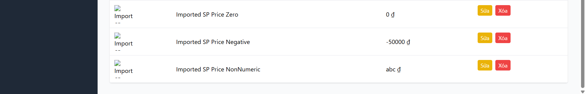

Title: [BUG][Import] Thiếu validation trường giá (price) cho phép số âm và giá trị không hợp lệ

## Found by Test Case
TC-IMPORT-006, TC-IMPORT-007, TC-IMPORT-008

## Requirement liên quan
FR-16: Import Sản phẩm từ CSV (price phải là số dương)

## Severity / Priority
Critical / P0

## Environment
Backend Node.js API, SQLite Database

## Steps to reproduce
1. Gửi API POST đến `/api/admin/import-products` chứa sản phẩm có `price` là số âm (`-50000`), số `0`, hoặc chuỗi không phải số (`"abc"`).

## Expected result
- Hệ thống từ chối import, trả về HTTP 400 Bad Request.

## Actual result
- Hệ thống chấp nhận đăng ký thành công, lưu trực tiếp các giá trị không hợp lệ này vào CSDL SQLite.

## Evidence

---
*Nhãn (Labels) cần gắn:* `type: bug`, `module: admin`, `severity: critical`, `priority: P0`, `status: new`, `found-by: test-case`
