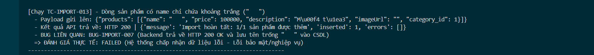

Title: [BUG][Import][Backend] Chấp nhận tên sản phẩm chỉ chứa khoảng trắng ("   ")

## Found by Test Case
[TC-IMPORT-013](../test-cases/import/TC-IMPORT-013.md)

## Requirement liên quan
FR-16: Import Sản phẩm từ CSV (Tên sản phẩm không được rỗng)

## Severity / Priority
Major / P1

## Environment
Backend API & CSDL SQLite

## Steps to reproduce
1. Admin đăng nhập hệ thống và lấy JWT token.
2. Gửi API POST đến `/api/admin/import-products` với sản phẩm có tên chỉ chứa khoảng trắng:
   ```json
   {
     "products": [
       {"name": "   ", "price": 100000, "description": "Mô tả", "imageUrl": "", "category_id": 1}
     ]
   }
   ```

## Expected result
- Hệ thống từ chối import, trả về HTTP 400 Bad Request và báo lỗi tên sản phẩm không được để trống.

## Actual result
- Hệ thống trả về HTTP 200 OK và chèn sản phẩm có tên chỉ chứa khoảng trắng vào CSDL SQLite.

## Evidence

---
*Nhãn (Labels) cần gắn:* `type: bug, module: backend, severity: major, priority: P1, status: new, found-by: test-case`
