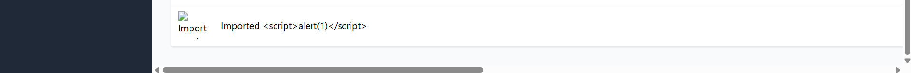

Title: [BUG][Import][Backend] Lỗ hổng Stored XSS do lưu trữ mã độc HTML/XSS trong trường tên sản phẩm

## Found by Test Case
[TC-IMPORT-016](../test-cases/import/TC-IMPORT-016.md)

## Requirement liên quan
FR-16: Import Sản phẩm từ CSV (Đảm bảo an toàn dữ liệu)

## Severity / Priority
Critical / P1

## Environment
Backend API & CSDL SQLite

## Steps to reproduce
1. Admin đăng nhập hệ thống và lấy JWT token.
2. Gửi API POST đến `/api/admin/import-products` chứa thẻ HTML/script XSS độc hại:
   ```json
   {
     "products": [
       {"name": "Imported <script>alert(1)</script>", "price": 100000, "description": "Mô tả", "imageUrl": "", "category_id": 1}
     ]
   }
   ```

## Expected result
- Hệ thống từ chối import (HTTP 400) hoặc thực hiện mã hóa an toàn các ký tự đặc biệt (HTML Entity encode) trước khi ghi CSDL.

## Actual result
- Hệ thống trả về HTTP 200 OK và lưu nguyên văn thẻ `<script>alert(1)</script>` vào CSDL SQLite. Lỗ hổng Stored XSS sẽ kích hoạt khi Admin panel hiển thị danh sách sản phẩm này.

## Evidence

---
*Nhãn (Labels) cần gắn:* `type: bug, module: backend, severity: critical, priority: P1, status: new, found-by: test-case`
