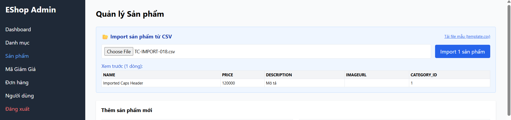
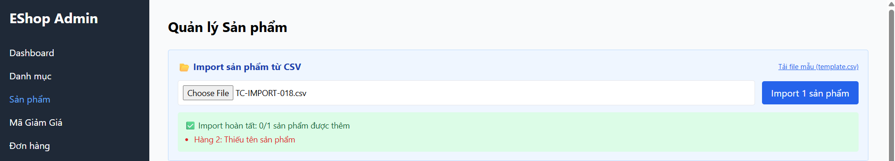

Title: [BUG][Import][Frontend] Không tự động chuẩn hóa hoặc từ chối khi header CSV viết hoa

## Found by Test Case
[TC-IMPORT-018](../test-cases/import/TC-IMPORT-018.md)

## Requirement liên quan
FR-16: Import Sản phẩm từ CSV (Dòng đầu tiên là header)

## Severity / Priority
Medium / P2

## Environment
Frontend Admin Web Dashboard

## Steps to reproduce
1. Tải lên tệp CSV có header viết hoa: `NAME,PRICE,DESCRIPTION,IMAGEURL,CATEGORY_ID`.
2. Nhấn nút Import.

## Expected result
- Hệ thống tự động chuẩn hóa các cột về chữ thường để map dữ liệu chính xác hoặc báo lỗi cấu trúc tệp không hợp lệ (HTTP 400).

## Actual result
- Hệ thống trả về HTTP 200 OK nhưng thực chất báo lỗi warning 'Hàng 2: Thiếu tên sản phẩm' do Frontend không map được các trường viết hoa, khiến mảng gửi lên Backend bị trống trường name.

## Evidence

---
*Nhãn (Labels) cần gắn:* `type: bug, module: frontend, severity: medium, priority: P2, status: new, found-by: test-case`
