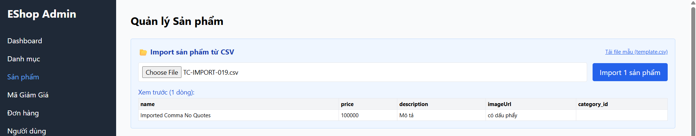
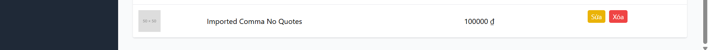

Title: [BUG][Import][Frontend] Lệch cấu trúc cột và category_id bị rỗng do vi phạm chuẩn RFC 4180 khi trường chứa dấu phẩy không bọc nháy kép

## Found by Test Case
[TC-IMPORT-019](../test-cases/import/TC-IMPORT-019.md)

## Requirement liên quan
FR-16: Import Sản phẩm từ CSV (Hỗ trợ trường chứa dấu phẩy)

## Severity / Priority
Major / P2

## Environment
Frontend Admin Web Dashboard

## Steps to reproduce
1. Tải lên file CSV chứa mô tả sản phẩm có dấu phẩy nhưng không được bọc trong dấu nháy kép:
   `name,price,description,imageUrl,category_id`
   `SP1,100,Mô tả, có dấu phẩy,,1`
2. Nhấn nút Import.

## Expected result
- Hệ thống phát hiện dòng dữ liệu lệch số lượng cột (6 cột thay vì 5 cột chuẩn) và từ chối toàn bộ file, trả về HTTP 400 Bad Request.

## Actual result
- Hệ thống trả về HTTP 200 OK và chèn sản phẩm thành công, nhưng do tách cột sai nên category_id bị chuyển thành NaN (do parse từ chuỗi URL) và lưu vào database không đúng định dạng.

## Evidence

---
*Nhãn (Labels) cần gắn:* `type: bug, module: frontend, severity: major, priority: P2, status: new, found-by: test-case`
