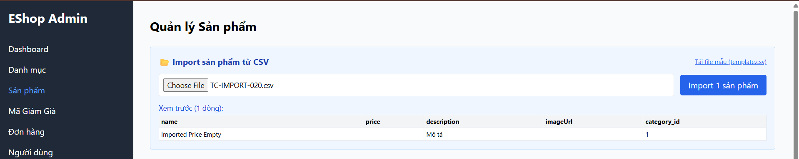

Title: [BUG][Import][Backend] Cho phép import sản phẩm thiếu trường price (để trống)

## Found by Test Case
[TC-IMPORT-020](../test-cases/import/TC-IMPORT-020.md)

## Requirement liên quan
FR-16: Import Sản phẩm từ CSV (price phải là số dương)

## Severity / Priority
Major / P1

## Environment
Backend API & CSDL SQLite

## Steps to reproduce
1. Admin đăng nhập hệ thống và lấy JWT token.
2. Gửi API POST đến `/api/admin/import-products` thiếu trường price:
   ```json
   {
     "products": [
       {"name": "Imported Price Empty", "description": "Mô tả", "imageUrl": "", "category_id": 1}
     ]
   }
   ```

## Expected result
- Hệ thống từ chối import, trả về HTTP 400 Bad Request và báo lỗi thiếu trường giá sản phẩm.

## Actual result
- Hệ thống trả về HTTP 200 OK và lưu sản phẩm thành công với cột price nhận giá trị rỗng/NULL.

## Evidence


---
*Nhãn (Labels) cần gắn:* `type: bug, module: backend, severity: major, priority: P1, status: new, found-by: test-case`
