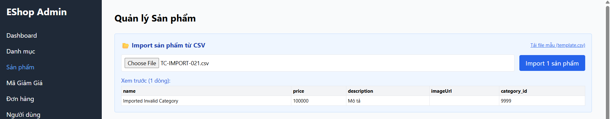
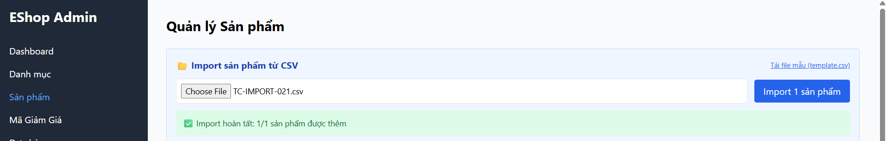

Title: [BUG][Import][Backend] Chấp nhận category_id không tồn tại trong hệ thống

## Found by Test Case
[TC-IMPORT-021](../test-cases/import/TC-IMPORT-021.md)

## Requirement liên quan
FR-16: Import Sản phẩm từ CSV (category_id hợp lệ)

## Severity / Priority
Major / P2

## Environment
Backend API & CSDL SQLite

## Steps to reproduce
1. Admin đăng nhập hệ thống và lấy JWT token.
2. Gửi API POST đến `/api/admin/import-products` với category_id không tồn tại:
   ```json
   {
     "products": [
       {"name": "Imported Invalid Category", "price": 100000, "description": "Mô tả", "imageUrl": "", "category_id": 9999}
     ]
   }
   ```

## Expected result
- Hệ thống từ chối import, trả về HTTP 400 Bad Request và báo lỗi category_id không tồn tại trong hệ thống.

## Actual result
- Hệ thống trả về HTTP 200 OK và chèn thành công sản phẩm có danh mục rác 9999 vào database.

## Evidence


---
*Nhãn (Labels) cần gắn:* `type: bug, module: backend, severity: major, priority: P2, status: new, found-by: test-case`
