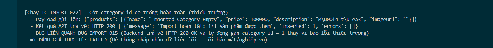

Title: [BUG][Import][Backend] Cho phép category_id để trống hoàn toàn

## Found by Test Case
[TC-IMPORT-022](../test-cases/import/TC-IMPORT-022.md)

## Requirement liên quan
FR-16: Import Sản phẩm từ CSV (category_id bắt buộc)

## Severity / Priority
Medium / P2

## Environment
Backend API & CSDL SQLite

## Steps to reproduce
1. Admin đăng nhập hệ thống và lấy JWT token.
2. Gửi API POST đến `/api/admin/import-products` thiếu trường category_id:
   ```json
   {
     "products": [
       {"name": "Imported Category Empty", "price": 100000, "description": "Mô tả", "imageUrl": ""}
     ]
   }
   ```

## Expected result
- Hệ thống từ chối import, trả về HTTP 400 Bad Request.

## Actual result
- Hệ thống trả về HTTP 200 OK và tự động gán category_id mặc định bằng 1.

## Evidence

---
*Nhãn (Labels) cần gắn:* `type: bug, module: backend, severity: medium, priority: P2, status: new, found-by: test-case`
