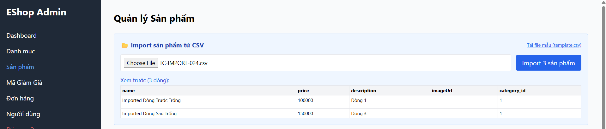
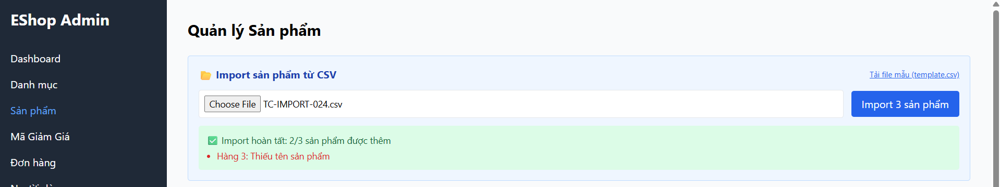

Title: [BUG][Import][Backend] Không từ chối và rollback toàn bộ khi có dòng trống ở giữa tệp CSV

## Found by Test Case
[TC-IMPORT-024](../test-cases/import/TC-IMPORT-024.md)

## Requirement liên quan
FR-16: Import Sản phẩm từ CSV (Tính nguyên tử - Atomicity)

## Severity / Priority
Major / P2

## Environment
Backend API & CSDL SQLite

## Steps to reproduce
1. Admin đăng nhập hệ thống và lấy JWT token.
2. Gửi API POST đến `/api/admin/import-products` chứa đối tượng rỗng `{}` ở giữa mảng:
   ```json
   {
     "products": [
       {"name": "Imported Dòng Trước Trống", "price": 100000},
       {},
       {"name": "Imported Dòng Sau Trống", "price": 150000}
     ]
   }
   ```

## Expected result
- Hệ thống từ chối toàn bộ và thực hiện rollback CSDL (không lưu sản phẩm nào), trả về HTTP 400 Bad Request.

## Actual result
- Hệ thống trả về HTTP 200 OK, chèn thành công 2 sản phẩm dòng 1 và 3, bỏ qua đối tượng trống với cảnh báo.

## Evidence


---
*Nhãn (Labels) cần gắn:* `type: bug, module: backend, severity: major, priority: P2, status: new, found-by: test-case`
