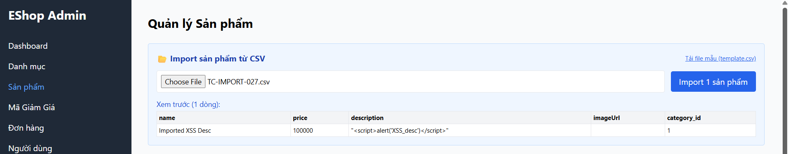
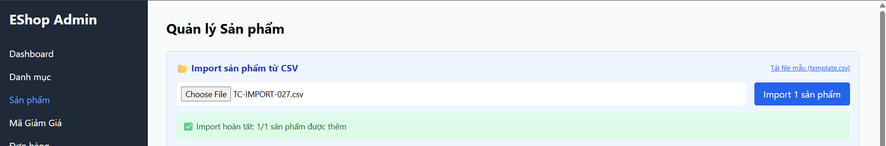

Title: [BUG][Import][Backend] Cho phép lưu trữ mã độc XSS nguyên bản vào database trong trường description

## Found by Test Case
[TC-IMPORT-027](../test-cases/import/TC-IMPORT-027.md)

## Requirement liên quan
FR-16: Import Sản phẩm từ CSV (Làm sạch dữ liệu - Sanitization)

## Severity / Priority
Major / P2

## Environment
Backend API & CSDL SQLite

## Steps to reproduce
1. Admin đăng nhập hệ thống và lấy JWT token.
2. Gửi API POST đến `/api/admin/import-products` chứa:
   ```json
   {
     "products": [
       {"name": "Imported XSS Desc", "price": 100000, "description": "<script>alert('XSS_desc')</script>", "imageUrl": "", "category_id": 1}
     ]
   }
   ```

## Expected result
- Hệ thống từ chối import, trả về HTTP 400 Bad Request (hoặc mã hóa an toàn các thực thể HTML của trường description trước khi lưu).

## Actual result
- Hệ thống trả về HTTP 200 OK và lưu trực tiếp `<script>alert('XSS_desc')</script>` vào cột `description` trong cơ sở dữ liệu.

## Evidence


---
*Nhãn (Labels) cần gắn:* `type: bug, module: backend, severity: major, priority: P2, status: new, found-by: test-case`
