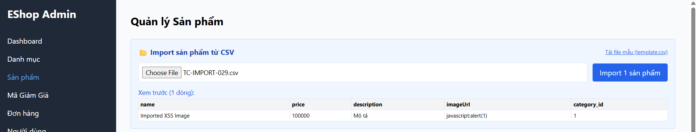
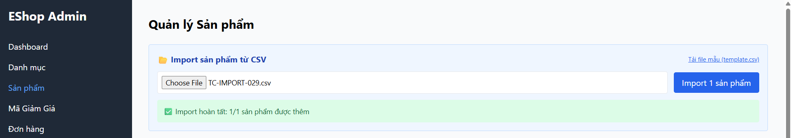

Title: [BUG][Import][Backend] Lưu trữ URI nguy hiểm javascript: trong trường imageUrl

## Found by Test Case
[TC-IMPORT-029](../test-cases/import/TC-IMPORT-029.md)

## Requirement liên quan
FR-16: Import Sản phẩm từ CSV (Làm sạch dữ liệu - Sanitization)

## Severity / Priority
Major / P2

## Environment
Backend API & CSDL SQLite

## Steps to reproduce
1. Admin đăng nhập hệ thống và lấy JWT token.
2. Gửi API POST đến `/api/admin/import-products` chứa:
   ```json
   {
     "products": [
       {"name": "Imported XSS Image", "price": 100000, "description": "Mô tả", "imageUrl": "javascript:alert(1)", "category_id": 1}
     ]
   }
   ```

## Expected result
- Hệ thống từ chối import vì `imageUrl` chứa URL lược đồ nguy hiểm (`javascript:`, `data:`, v.v.) hoặc thẻ script, trả về HTTP 400.

## Actual result
- Hệ thống trả về HTTP 200 OK và lưu trữ `javascript:alert(1)` vào cột `imageUrl` trong CSDL.

## Evidence


---
*Nhãn (Labels) cần gắn:* `type: bug, module: backend, severity: major, priority: P2, status: new, found-by: test-case`
