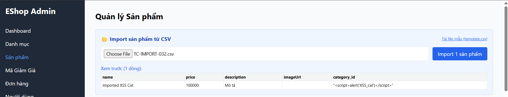
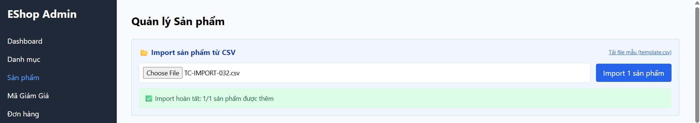

Title: [BUG][Import][Backend] Lưu trữ mã độc XSS nguyên bản vào database trong cột category_id

## Found by Test Case
[TC-IMPORT-032](../test-cases/import/TC-IMPORT-032.md)

## Requirement liên quan
FR-16: Import Sản phẩm từ CSV (Kiểm tra kiểu dữ liệu và Khóa ngoại)

## Severity / Priority
Major / P2

## Environment
Backend API & CSDL SQLite

## Steps to reproduce
1. Admin đăng nhập hệ thống và lấy JWT token.
2. Gửi API POST đến `/api/admin/import-products` chứa:
   ```json
   {
     "products": [
       {"name": "Imported XSS Cat", "price": 100000, "description": "Mô tả", "imageUrl": "", "category_id": "<script>alert('XSS_cat')</script>"}
     ]
   }
   ```

## Expected result
- Hệ thống từ chối import vì `category_id` không phải là số nguyên dương hợp lệ và không tồn tại, trả về HTTP 400.

## Actual result
- Hệ thống trả về HTTP 200 OK và lưu trữ mã độc `<script>alert('XSS_cat')</script>` vào cột `category_id` trong CSDL.

## Evidence


---
*Nhãn (Labels) cần gắn:* `type: bug, module: backend, severity: major, priority: P2, status: new, found-by: test-case`
