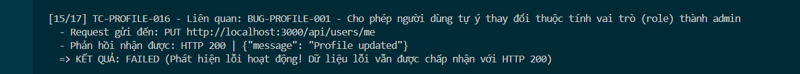

Title: [BUG][Profile] Cho phép người dùng tự ý thay đổi thuộc tính vai trò (role) thành admin qua API cập nhật hồ sơ

## Found by Test Case
TC-PROFILE-016

## Requirement liên quan
FR-26: Quản lý hồ sơ cá nhân

## Severity / Priority
Critical / P1

## Environment
Chrome, Windows, Backend Node.js API, SQLite Database

## Steps to reproduce
1. Đăng nhập tài khoản người dùng bình thường (user) và lấy JWT Token.
2. Gửi request PUT đến endpoint `/api/users/me` mang theo thuộc tính `role: "admin"`:
   ```http
   PUT /api/users/me HTTP/1.1
   Host: localhost:3000
   Content-Type: application/json
   Authorization: Bearer <token>

   {
     "name": "Nguyen Van A",
     "shipping_address": "Address Original",
     "phone": "0987654321",
     "role": "admin"
   }
   ```

## Expected result
Hệ thống Hệ thống từ chối cập nhật thuộc tính `role` của người dùng và trả về HTTP 400 hoặc bỏ qua thuộc tính này trong câu truy vấn cập nhật, giữ nguyên role là `'user'`.

## Actual result
Hệ thống chấp nhận cập nhật thành công, trả về HTTP 200 OK và thay đổi giá trị trường `role` của tài khoản này thành `'admin'` trong database SQLite (leo thang đặc quyền).

## Evidence


---
*Nhãn (Labels) cần gắn:* `type: bug`, `module: profile`, `severity: critical`, `priority: P1`, `status: new`, `found-by: test-case`
