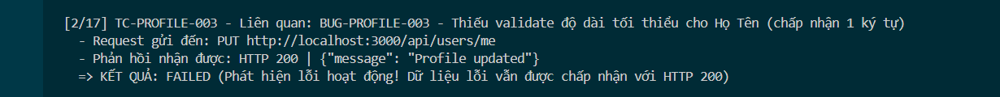

Title: [BUG][Profile] Thiếu validate độ dài tối thiểu cho trường Họ Tên (name) (chấp nhận 1 ký tự)

## Found by Test Case
TC-PROFILE-003

## Requirement liên quan
FR-26: Quản lý hồ sơ cá nhân (kế thừa ràng buộc FR-01)

## Severity / Priority
Low / P3

## Environment
Chrome, Windows, Backend Node.js API, SQLite Database

## Steps to reproduce
1. Đăng nhập tài khoản người dùng và lấy JWT Token.
2. Gửi request PUT đến endpoint `/api/users/me` với trường `name: "A"`:
   ```http
   PUT /api/users/me HTTP/1.1
   Host: localhost:3000
   Content-Type: application/json
   Authorization: Bearer <token>

   {
     "name": "A",
     "shipping_address": "Address Original",
     "phone": "0987654321"
   }
   ```

## Expected result
Hệ thống Hệ thống từ chối cập nhật, trả về HTTP 400 Bad Request và báo lỗi Họ Tên phải dài từ 2 ký tự trở lên.

## Actual result
Hệ thống chấp nhận cập nhật, trả về HTTP 200 OK và cập nhật Họ Tên chỉ chứa 1 chữ cái `'A'` trong database.

## Evidence


---
*Nhãn (Labels) cần gắn:* `type: bug`, `module: profile`, `severity: low`, `priority: P3`, `status: new`, `found-by: test-case`
