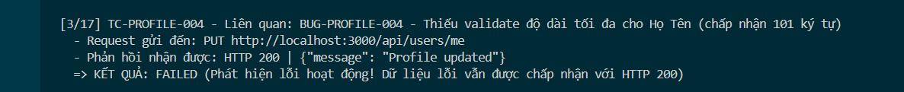

Title: [BUG][Profile] Thiếu validate độ dài tối đa cho trường Họ Tên (name) (chấp nhận 101 ký tự)

## Found by Test Case
TC-PROFILE-004

## Requirement liên quan
FR-26: Quản lý hồ sơ cá nhân (kế thừa ràng buộc FR-01)

## Severity / Priority
Low / P3

## Environment
Chrome, Windows, Backend Node.js API, SQLite Database

## Steps to reproduce
1. Đăng nhập tài khoản người dùng và lấy JWT Token.
2. Gửi request PUT đến endpoint `/api/users/me` với trường `name` dài 101 ký tự:
   ```http
   PUT /api/users/me HTTP/1.1
   Host: localhost:3000
   Content-Type: application/json
   Authorization: Bearer <token>

   {
     "name": "AAAAAAAAAAAAAAAAAAAAAAAAAAAAAAAAAAAAAAAAAAAAAAAAAAAAAAAAAAAAAAAAAAAAAAAAAAAAAAAAAAAAAAAAAAAAAAAAAAAAA",
     "shipping_address": "Address Original",
     "phone": "0987654321"
   }
   ```

## Expected result
Hệ thống Hệ thống từ chối cập nhật, trả về HTTP 400 Bad Request và báo lỗi Họ Tên vượt quá độ dài tối đa cho phép (100 ký tự).

## Actual result
Hệ thống chấp nhận cập nhật, trả về HTTP 200 OK và lưu chuỗi Họ Tên dài 101 ký tự vào database.

## Evidence


---
*Nhãn (Labels) cần gắn:* `type: bug`, `module: profile`, `severity: low`, `priority: P3`, `status: new`, `found-by: test-case`
